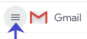

# 如何清空 Gmail 中的垃圾

> 原文：<https://www.javatpoint.com/how-to-empty-trash-in-gmail>

我们可以在电脑和移动设备上轻松清空 Gmail 中的垃圾文件夹。

### 什么是垃圾？

每当我们删除不同类别的电子邮件时，如促销、主要、已发送、社交等。，电子邮件会自动转移到我们 Gmail 帐户的废纸篓文件夹中。

这意味着任何删除的电子邮件不会同时被永久删除。

已删除的电子邮件将在“废纸篓”文件夹中保留 30 天。它还为我们提供了从废纸篓文件夹中恢复已删除电子邮件的优势。

30 天后，“废纸篓”文件夹中的电子邮件将被永久删除，并且无法恢复。

我们可以从废纸篓文件夹中随机删除电子邮件。但是，删除的电子邮件仅在 30 天后自动从废纸篓中删除。

让我们讨论倒垃圾的步骤。

### 清空电脑上的垃圾

清空计算机上 Gmail 中废纸篓文件夹的步骤如下:

1.打开 Gmail 帐户，使用 Gmail ID 和密码登录。
我们可以直接使用网址:[https://mail.google.com/](https://mail.google.com/)。

2.点击主页左上角的**主菜单**图标(三条横线)，如下图:

3.向下滚动，点击**更多- >垃圾**选项，如下图:

4.将显示过去 30 天内删除的所有电子邮件。点击顶部的小方块，如下图所示:

5.它将显示为:

6.一页上有 50 封电子邮件。要永久删除或清空废纸篓，请单击“**选择废纸篓中的所有 xxxx 个对话”选项**。

哪里，

xxxx 是废纸篓文件夹中的电子邮件数量。每个账户的号码都不一样。

在这里，垃圾桶里有 20，787 封电子邮件。我们将点击“选择垃圾桶中的所有 20，787 个对话”选项，如下所示:

7.“废纸篓”文件夹中的所有对话现在都已选定，如下所示:

8.点击**【永久删除】**按钮清空垃圾桶，如下图:

#### 注意:永久删除按钮仅出现在废纸篓文件夹中。它用于从 Gmail 帐户中永久删除电子邮件或电子邮件列表。点击“永久删除”按钮后，电子邮件将无法恢复。

9.将出现确认删除任务的对话框，如下所示:

10.点击**‘确定’**按钮确认，如上图。

11.等几秒钟。**垃圾桶现在是空的**。

它将显示为:

运筹学

1.我们一打开垃圾桶文件夹，就可以点击**“立即清空垃圾桶”**选项。

如下所示:

2.点击**‘确定’**按钮确认。

垃圾桶现在是空的。

### 通过手机应用清空垃圾桶

下面列出了通过 Gmail 应用程序清空 Gmail 中废纸篓文件夹的步骤:

1.打开 Gmail 应用程序。

2.点击屏幕左上角的**菜单**图标(有三条水平线)，如下图所示:

3.向下滚动，点击**垃圾桶**选项，如下图:

4.将显示过去 30 天内删除的所有电子邮件。如下所示:

5.一打开垃圾桶文件夹，点击**“立即清空垃圾桶”**选项。

它出现在屏幕顶部，如下所示:

6.将出现一个确认对话框，如下所示:

这里，垃圾桶文件夹中有 58 封电子邮件。它将显示“废纸篓”文件夹中存在的所有对话或电子邮件，因帐户而异。

7.点击**【清空】**按钮确认，如上图。

8.**垃圾桶现在是空的**。

它将如下图所示:

* * *