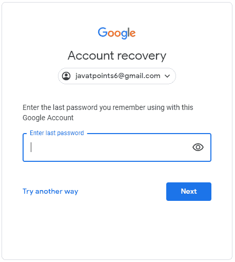
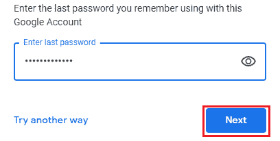
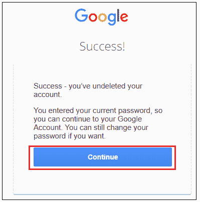
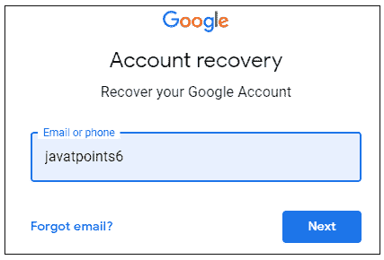
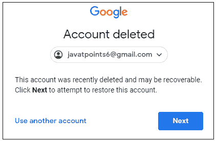
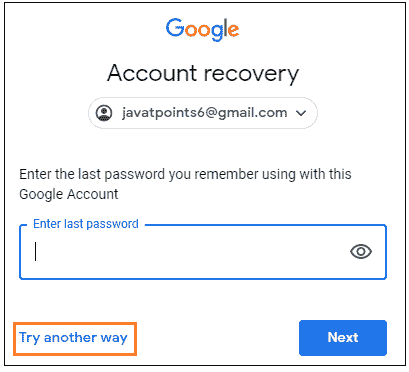
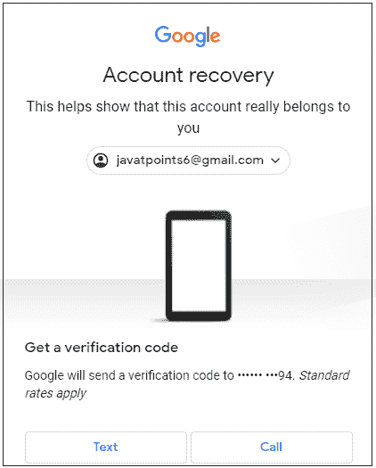
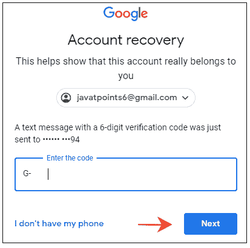
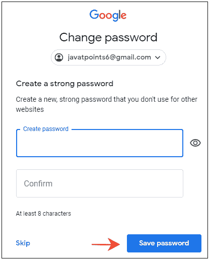
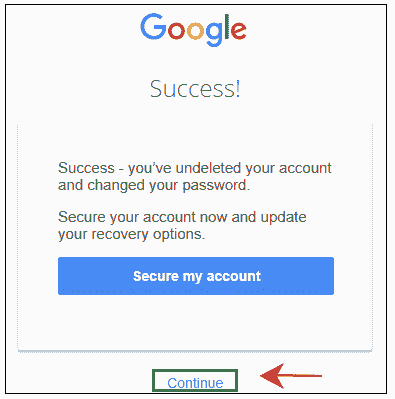

# 如何恢复 Gmail 帐户

> 原文：<https://www.javatpoint.com/how-to-recover-gmail-account>

我们可以恢复已删除的 Gmail 帐户。即使我们忘记了用户名(Gmail ID)或密码，也可以恢复，并且我们不会得到验证码。

在这里，我们将恢复用户名为- [【电子邮件保护】](/cdn-cgi/l/email-protection)的 Gmail 帐户

上述帐户已被删除。在这里，我们将讨论恢复它的步骤。

#### 注意:以上指定的用户名仅用于解释目的。请不要将其视为专业账户。

如果出现以下情况，我们可以恢复帐户:

*   我们知道用户名。
*   我们有注册手机号码的电话来获取验证码。
    或
*   我们知道用户名。
*   我们知道与该帐户关联的最后一个密码。

否则，我们无法收回我们的账户。

让我们从步骤开始。

恢复 Gmail 帐户的步骤如下:

1.转到电脑上谷歌的恢复页面。

我们可以直接使用网址:[https://accounts.google.com/signin/recovery.](https://accounts.google.com/signin/recovery)T2】

2.将出现一个询问电子邮件或电话的窗口。如下所示:


3.指定与我们要恢复的 Gmail 帐户相关联的**用户名**或**电话号码**。

在这里，我们将指定用户名-javapoints 6

#### 注意:对于任何 Gmail ID，@gmail.com 是谷歌的默认域名。登录谷歌时，我们只能使用用户名登录。

```

For example,
Consider the below Gmail ID- javatpoints6@gmail.com
Here, javatpoints6 is the username.
We can also log in by only specifying the username, i.e., javatpoints6.
It will have no impact if we specify the domain (@gmail.com) or not.

```

新页面将显示为:


4.点击**‘下一步’**按钮，如上图。

5.将出现一个新页面。如下所示:


6.点击**‘下一步’**按钮进行账户恢复，如上图。

7.将出现一个新页面。我们需要指定与该账户关联的**最后一个密码**。如下所示:



8.指定密码后，点击**‘下一步’**按钮，如下图:



9.现在，我们已经成功恢复了我们的帐户。将出现一个新页面。如下所示:



10.点击“继续”按钮继续，如上所示。

11.我们现在登录到我们恢复的帐户。我们现在可以轻松访问我们的帐户。

### 如果我们不记得我们的密码

当我们忘记密码时，恢复帐户的步骤如下:

1.转到电脑上谷歌的恢复页面。

我们可以直接使用网址:https://accounts.google.com/signin/recovery.

2.将出现一个新页面。如下所示:


3.指定与我们要恢复的 Gmail 帐户相关联的**用户名**或**电话号码**。

在这里，我们将指定用户名-javapoints 6

新页面将显示为:



4.点击**‘下一步’**按钮，如上图。

5.将出现一个新页面。如下所示:



6.点击**‘下一步’**按钮进行账户恢复，如上图。

7.将出现一个新页面。如下所示:



8.由于我们不记得与此帐户相关联的最后一个密码，请单击**“尝试另一种方式”**选项，如上所示。

将出现一个新页面。我们需要指定发送到注册手机号码的验证码。如下所示:



9.我们可以相应地点击**【文本】**或**【呼叫】**按钮。

让我们点击文本按钮。

10.将出现一个新页面。我们现在需要在框中指定 **6 位验证码**，如下图:



11.点击**‘下一步’**按钮，如上图。

12.将出现指定新密码的新页面，如下所示:



13.指定密码后点击**【保存密码】**按钮，如上图。

14.点击新页面上的**继续**按钮，如下图:



15.我们现在登录到我们恢复的帐户。我们现在可以轻松访问我们的帐户。

如果我们没有手机，我们需要点击**“我没有手机”**选项。我们现在需要指定可以用来联系我们的电子邮件地址。谷歌团队将审查该帐户，并可能稍后与您联系。

* * *