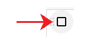
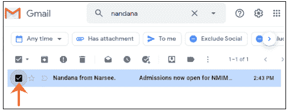
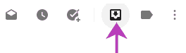
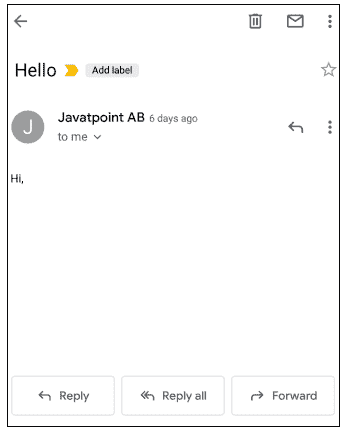
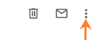
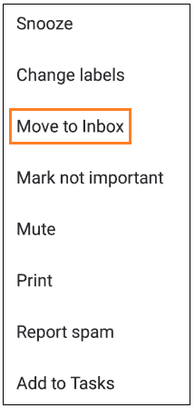

# 如何在 Gmail 中取消归档

> 原文：<https://www.javatpoint.com/how-to-unarchive-in-gmail>

我们可以在电脑和移动设备上轻松地在 Gmail 中取消存档邮件。

**未归档是什么意思？**

这意味着从存档邮件列表中恢复邮件。

我们可以轻松地将存档电子邮件恢复到收件箱或任何其他文件夹中。

存档的电子邮件也称为静音电子邮件。我们取消存档电子邮件以取消屏蔽此类电子邮件。

如果我们不想删除电子邮件，通常会将其标记为存档。同样，我们取消归档一封电子邮件，以将该电子邮件恢复到我们的收件箱中。

让我们讨论取消归档电子邮件的步骤:

### 在计算机上取消归档电子邮件

在计算机上的 Gmail 中取消归档电子邮件的步骤如下:

1.打开 Gmail 帐户，使用 Gmail ID 和密码登录。我们可以直接使用网址:[https://mail.google.com/](https://mail.google.com/)打开 Gmail。

2.我们首先需要找到存档电子邮件。我们可以通过两种方式找到这封邮件:

*   在搜索框中输入收件人的**姓名**或**电子邮件**地址。
*   在搜索栏上输入**“标签:全部”**->按**进入**。

4.它现在将显示为:

在这里，我们将取消存档上面显示的电子邮件。

5.点击顶部的**“移至收件箱”**图标，如下图所示:

6.所选电子邮件现已取消存档，并被传输到我们 Gmail 帐户的收件箱。

7.我们现在可以在收件箱中查看未归档的电子邮件。

### 通过 Gmail 应用程序取消归档电子邮件

下面列出了通过 Gmail 应用程序在 Gmail 中取消归档电子邮件的步骤:

1.打开 Gmail 应用程序。

2.我们首先需要找到存档电子邮件。我们可以通过两种方式找到这封邮件:

*   在搜索栏上输入**‘标签:全部’**，点击键盘上的搜索图标。
*   在搜索栏上输入收件人的**姓名**或**电子邮件地址**，然后点击键盘上的搜索图标。

3.打开电子邮件，如下所示:

在这里，我们将取消归档名为 **Javatpoint AB** 的电子邮件。

4.点击右上角的三个点，如下所示:

5.将出现一个下拉框，如下所示:

6.点击**“移至收件箱”**选项，如上图。

7.所选电子邮件现已取消存档，并被传输到我们 Gmail 帐户的收件箱。

8.我们现在可以在收件箱中查看未归档的电子邮件。

* * *