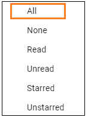
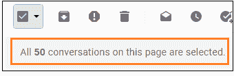
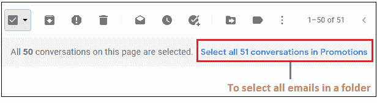

# 如何在 Gmail 中全选

> 原文：<https://www.javatpoint.com/how-to-select-all-in-gmail>

我们可以在电脑上选择 Gmail 中的所有电子邮件。

Gmail 应用程序上没有“全选”选项。

**全选是什么意思？**

这意味着我们希望在收件箱的单个页面上选择所有对话或电子邮件。

**全选选择了多少封邮件？**

50.

单个页面上的 50 个对话由全选选项选择。我们可以执行不同的操作，如删除、垃圾邮件、存档等。在选定的电子邮件上。

要取消选择任何电子邮件，我们需要点击该电子邮件后面的小方块。

让我们从步骤开始。

在计算机上的 Gmail 中选择全部的步骤如下:

1.打开 Gmail 帐户，使用 Gmail ID 和密码登录。

我们可以直接使用网址:[https://mail.google.com/](https://mail.google.com/)。

2.在我们帐户的主页上，从收件箱中选择任何文件夹。

在这里，我们将选择**‘促销’**文件夹。

3.转到右上角的主选择按钮，如下所示:

4.点击小方块前面的小箭头，如下图:

5.将出现一个下拉框。点击**‘全部’**选项，如下图:

6.将选择单个页面上的所有对话。顶部会出现一条消息，指定已选择所有对话，如下所示:

要选择文件夹中的所有电子邮件，请点击标有**蓝色**的消息，如下图所示:

这里，“促销”文件夹仅包含 51 个对话。

7.同样，我们可以从收件箱的任何文件夹中选择出现在单个页面上的**‘All’**对话。

**我们可以自己选择邮件吗？**

是的。

我们可以根据自己的选择轻松选择单封或多封电子邮件。我们只需要点击任何邮件后面的小方块就可以选择。

在移动应用的情况下，我们需要选择电子邮件后面的图标来选择它们。

只需点击一下，我们就可以根据自己的选择选择任意数量的电子邮件。

* * *