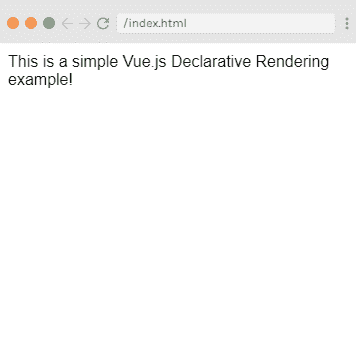

# 声明性渲染

> 原文：<https://www.javatpoint.com/vue-js-declarative-rendering>

在 Vue.js 中，核心中有一个系统，使我们能够使用简单、直接的模板语法以声明方式将数据呈现给 DOM。

### 语法:

**HTML:**

```

<div id="app">
  {{ message }}
</div>

```

**JS:**

```

var app = new Vue({
  el: '#app',
  data: {
    message: 'This is a simple Vue.js Declarative Rendering example!'
  }
})

```

正如我们所知，Vue.js 方便了我们用称为指令的 [HTML 属性](https://www.javatpoint.com/html-attributes)来扩展 [HTML](https://www.javatpoint.com/html-tutorial) ，指令用于向 HTML 应用程序提供功能。

Vue.js 中有两种类型的指令:内置指令和用户定义指令。Vue.js 使用双括号{{ }}作为数据的占位符， [Vue.js](https://www.javatpoint.com/vue-js) 指令是使用 **v-** 前缀的 HTML 属性。

让我们看一个使用文本插值的简单声明性渲染示例。

### 例 1:

**Index.html 文件:**

```

<html>
    <head>
        <link rel="stylesheet" href="index.css">
        <script src="https://cdn.jsdelivr.net/npm/vue/dist/vue.js"></script>
    </head>
    <body>        
        <div id="app">
            {{ message }}
        </div>        
        <script src="index.js"></script>
    </body>
</html>

```

**Index.js 文件:**

```

var app = new Vue({ 
    el: '#app',
    data: {
          message: 'This is a simple Vue.js Declarative Rendering example!'
    }
});

```

**输出:**

这是一个简单的 Vue.js 声明性渲染示例！



上面的例子类似于呈现一个字符串模板，就像我们在第一个 Vue.js 例子中所做的那样。现在，数据和 DOM 是链接的，一切都是被动的。你可以在浏览器的 [JavaScript](https://www.javatpoint.com/javascript-tutorial) 控制台上查看。将 app.message 设置为不同的值，您将看到上面呈现的示例相应地更新。

现在，我们不再需要直接与 HTML 交互。Vue 应用程序将自己附加到单个 DOM 元素上，并完全控制它。在上面的示例案例中，它是#app。现在，HTML 只是入口点，其他一切都发生在新创建的 Vue 实例中。

让我们看一个部署元素属性绑定的例子。

### 例 2:

**Index.html 文件:**

```

<html>
    <head>
        <link rel="stylesheet" href="index.css">
        <script src="https://cdn.jsdelivr.net/npm/vue/dist/vue.js"></script>
    </head>
    <body>       
        <div id="app-2">
  <span v-bind:title="message">
    Hover mouse over me for a few seconds
    and see a dynamically bound title which I have set!
  </span>
</div>        
<script src="index.js"></script>
    </body>
</html>

```

**Index.js 文件:**

```

var app2 = new Vue({
  el: '#app-2',
  data: {
    message: 'You loaded this page on ' + new Date().toLocaleString()
  }
})

```

**输出:**

将鼠标悬停在我身上几秒钟，看到我设置的动态绑定标题！


在上面的例子中，您看到的一个新的 v-bind 属性被称为指令。指令与前缀 v-一起使用，表示它们是 Vue 提供的唯一属性，它们用于对呈现的 DOM 应用特殊的反应行为。

* * *