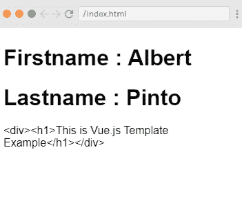
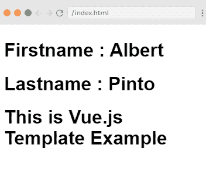
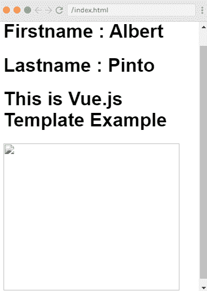
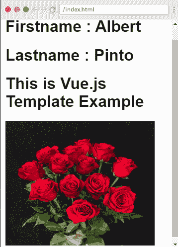

# Vue.js template-检视. js 范本

> 哎哎哎:1230【https://www . javatppoint . com/view-js-template】

在前面的 Vue.js Instance 一章中，我们已经学习了如何在屏幕上获得文本内容形式的输出。在本章中，我们将学习如何在屏幕上获得 HTML 模板形式的输出。Vue.js 使用一种基于 HTML 的模板语法，方便 Vue.js 开发人员以声明方式将呈现的 DOM 绑定到底层 Vue 实例的数据。所有 [Vue.js](https://www.javatpoint.com/vue-js) 模板都是有效的 HTML，可以被符合规范的浏览器和 [HTML](https://www.javatpoint.com/html-tutorial) 解析器解析。

如果选择简单的插值方法，即用双花括号在网页浏览器上显示 HTML 内容，会显示错误的结果。

让我们举一个简单的例子，看看输出，以便很好地理解这个概念。

**Index.html 文件:**

```

<html>
   <head>
      <title>Vue.js Template</title>
      <link rel="stylesheet" href="index.css">
        <script src="https://cdn.jsdelivr.net/npm/vue/dist/vue.js"></script>
    </head>
    <body>    
      <div id = "app">
         <h1>Firstname : {{firstname}}</h1>
         <h1>Lastname : {{lastname}}</h1>
         <div>{{htmlcontent}}</div>
      </div>
      <script src="index.js"></script>
   </body>
</html>

```

**Index.js 文件:**

```

var vm = new Vue({
   el: '#app',
   data: {
      firstname : "Albert",
      lastname : "Pinto",
      htmlcontent : "<div><h1>This is Vue.js Template Example</h1></div>"
   }
})

```

让我们用一个简单的 [CSS](https://www.javatpoint.com/css-tutorial) 文件，让输出更有吸引力。

**Index.css 文件:**

```

html, body {
    margin: 5px;
    padding: 0;
}

```

程序执行后，您将看到以下输出:

**输出:**

```
Firstname : Albert
Lastname : Pinto
<div><h1>This is Vue.js Template Example</h1></div>

```



在上面的例子中，您可以看到 html 内容并没有像您想要的那样显示在浏览器上。html 内容以您在变量 html content 中指定的相同方式显示。这不是你想要的。我们希望在[浏览器](https://www.javatpoint.com/browsers)上以适当的 HTML 内容显示。

为了解决这个问题，我们将不得不使用 **v-html** 指令。当我们将 v-html 指令分配给 html 元素时，Vue.js 知道它必须将其作为 html 内容输出。

现在，在。html 文件，并查看以下示例中的区别。

**语法:**

```

<div v-html = "htmlcontent"></div> 

```

### 示例 2:

**Index.html 文件:**

```

<html>
   <head>
      <title>Vue.js Template</title>
      <link rel="stylesheet" href="index.css">
        <script src="https://cdn.jsdelivr.net/npm/vue/dist/vue.js"></script>
    </head>
    <body>    
      <div id = "app">
         <h1>Firstname : {{firstname}}</h1>
         <h1>Lastname : {{lastname}}</h1>
         <div v-html = "htmlcontent"></div>
      </div>
      <script src="index.js"></script>
   </body>
</html>

```

**Index.js 文件:**

```

var vm = new Vue({
   el: '#app',
   data: {
      firstname : "Albert",
      lastname : "Pinto",
      htmlcontent : "<div><h1>This is Vue.js Template Example</h1></div>"
   }
})

```

程序执行后，您将看到以下输出:

**输出:**

```
Firstname : Albert
Lastname : Pinto
This is Vue.js Template Example 

```



在上面的例子中，您可以看到在使用 v-html 指令后，您可以成功地将 html 模板添加到 DOM 中。现在，让我们看看如何向现有的 HTML 元素添加属性。

### 向 HTML 元素添加属性

假设，我们在 HTML 文件中有一个图像标签，我们想要分配 **src** ，它是 Vue.js 的一部分，请看下面的例子:

**Index.html 文件:**

```

<html>
   <head>
      <title>Vue.js Template</title>
      <link rel="stylesheet" href="index.css">
        <script src="https://cdn.jsdelivr.net/npm/vue/dist/vue.js"></script>
    </head>
    <body>    
      <div id = "app">
         <h1>Firstname : {{firstname}}</h1>
         <h1>Lastname : {{lastname}}</h1>
         <div v-html = "htmlcontent"></div>
          
      </div>
      <script src="index.js"></script>
   </body>
</html>

```

**Index.js 文件:**

```

var vm = new Vue({
   el: '#app',
   data: {
      firstname : "Albert",
      lastname : "Pinto",
      htmlcontent : "<div><h1>This is Vue.js Template Example</h1></div>",
      imgsrc : "https://www.fiordalisa.ch/wp-content/uploads/2017/12/IMG_4610.jpg"
   }
})

```

程序执行后，您将看到以下输出:

**输出:**



在上例中，您可以看到图像已损坏。因此，我们必须使用 **v-bind 指令**将任何属性分配给 [HMTL 标签](https://www.javatpoint.com/html-tags)。

让我们用 v-bind 指令将 **src** 添加到图像中。请参见以下示例:

### 示例 3:

**Index.html:**

```

<html>
   <head>
      <title>Vue.js Template</title>
      <link rel="stylesheet" href="index.css">
        <script src="https://cdn.jsdelivr.net/npm/vue/dist/vue.js"></script>
    </head>
    <body>    
      <div id = "app">
         <h1>Firstname : {{firstname}}</h1>
         <h1>Lastname : {{lastname}}</h1>
         <div v-html = "htmlcontent"></div>
          
      </div>
      <script src="index.js"></script>
   </body>
</html>

```

**Index.js:**

```

var vm = new Vue({
   el: '#app',
   data: {
      firstname : "Albert",
      lastname : "Pinto",
      htmlcontent : "<div><h1>This is Vue.js Template Example</h1></div>",
      imgsrc : "https://www.fiordalisa.ch/wp-content/uploads/2017/12/IMG_4610.jpg"
   }
})

```

程序执行后，您将看到以下输出:

**输出:**



您可以看到，在将 v-bind 指令添加到 img src 之后，图像被完全加载。

* * *