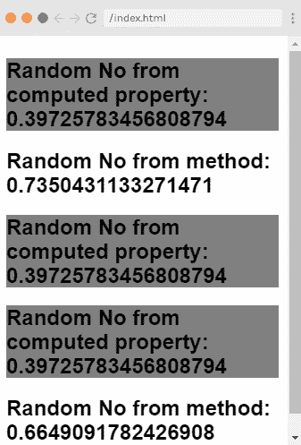
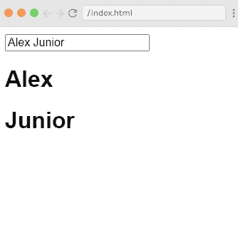

# 计算属性

> 原文：<https://www.javatpoint.com/vue-js-computed-properties>

在 Vue.js 中，当我们必须处理复杂的逻辑和操作时，会使用计算属性。计算属性就像方法一样，只是有些不同。

在前面的例子中，我们已经成功地使用了模板内表达式。它们非常方便，但是模板内表达式主要用于简单的操作。如果你不得不在你的模板中加入一个沉重而复杂的逻辑，它可能会变得臃肿和难以维护。

**例如:**

```

<div id="example">
  {{ message.split('').reverse().join('') }}
</div>

```

在这里，您可以看到模板不像以前那样简单和声明性。它看起来更复杂，你必须看它一秒钟才能意识到它以相反的方式显示信息。当您不得不重复使用模板中的反向消息时，这个问题可能会变得更糟。

让我们举一些简单的例子来使计算属性概念清晰易懂。这还可以让您决定何时使用方法以及何时使用计算属性。

请参阅以下示例来理解计算属性的概念:

Example1

**Index.html 文件:**

```

<html>
   <head>
      <title>Vue.js Computed Property</title>
      <link rel="stylesheet" href="index.css">
        <script src="https://cdn.jsdelivr.net/npm/vue/dist/vue.js"></script>
    </head>
    <body>
     <div id="com_props">
  This is the Original message:<h2> {{ message }}</h2>
  This is the Computed reversed message: <h2> {{ reversedMessage }}</h2>
</div>
      <script src="index.js"></script>
   </body>
</html>

```

**Index.js 文件:**

```

var vm = new Vue({
  el: '#com_props',
  data: {
    message: 'Hello JavaTpoint'
  },
  computed: {
    // a computed getter
    reversedMessage: function () {
      // `this` points to the vm instance
      return this.message.split('').reverse().join('')
    }
  }
})

```

让我们使用一个简单的 CSS 文件来使输出更加吸引人。

**Index.css 文件:**

```

html, body {
    margin: 5px;
    padding: 0;
}

```

程序执行后，您将看到以下输出:

**输出:**


### 示例说明

在上面的例子中，我们已经声明了一个计算属性 **reversedMessage** 。这里提供的函数用作属性 reversedMessage 的 getter 函数。**反向消息**的价值始终取决于**消息**属性的价值。

```

data: {
    message: 'Hello JavaTpoint'
  },
  computed: {
    // a computed getter
    reversedMessage: function () {

```

### 例 2

我们再举一个例子。在本例中，您可以在表单结构中输入数据，并查看计算机属性的结果。请参见以下示例:

**Index.html 文件:**

```

<html>
   <head>
      <title>Vue.js Computed Property</title>
      <link rel="stylesheet" href="index.css">
        <script src="https://cdn.jsdelivr.net/npm/vue/dist/vue.js"></script>
    </head>
    <body>
     <div id = "com_props">
         FirstName : <input type = "text" v-model = "firstname" /> <br/><br/>
         LastName : <input type = "text" v-model = "lastname"/> <br/><br/>
         <h2>My name is {{firstname}} {{lastname}}</h2>
         <h2>Retrieve name by using computed property : {{getfullname}}</h2>
      </div>
      <script src="index.js"></script>
   </body>
</html>

```

**Index.js 文件:**

```

var vm = new Vue({
   el: '#com_props',
   data: {
      firstname :"",
      lastname :"",
      birthyear : ""
   },
   computed :{
      getfullname : function(){
         return this.firstname +" "+ this.lastname;
      }
   }
})

```

让我们使用一个简单的 CSS 文件来使输出更加吸引人。

**Index.css 文件:**

```

html, body {
    margin: 5px;
    padding: 0;
}

```

程序执行后，您将看到以下输出:

**输出:**


### 示例说明

在上面的例子中，我们创建了两个名为**名字**和**姓氏**的文本框。这些文本框使用属性**名**和**姓**绑定。

现在，我们已经调用了计算方法 getfullname，它返回输入的名字和姓氏。

```

computed :{
   getfullname : function(){
      return this.firstname +" "+ this.lastname;
   }
}

```

当我们在文本框中输入时，函数在属性的名字或姓氏改变后返回相同的值。因此，在 computed 的帮助下，我们不需要做任何特定的事情，比如记住调用一个函数。对于计算属性，当内部使用的属性(即名字和姓氏)发生变化时，它会被自己调用。

### 方法和计算属性之间的区别

在上面的例子中，我们已经了解了计算属性。现在，让我们了解一下方法和计算属性之间的区别。我们知道两者都是对象，内部定义了函数，函数返回一个值。

在计算属性的情况下，我们称之为属性，而在方法的情况下，我们称之为函数。让我们看一个例子来理解方法和计算属性之间的区别。

**Index.html 文件:**

```

<html>
   <head>
      <title>Vue.js Computed Property</title>
      <link rel="stylesheet" href="index.css">
        <script src="https://cdn.jsdelivr.net/npm/vue/dist/vue.js"></script>
    </head>
    <body>
     <div id = "com_props">
         <h2 style = "background-color:gray;">Random No from computed property: {{getrandomno}}</h2>
         <h2>Random No from method: {{getrandomno1()}}</h2>
         <h2  style = "background-color:gray;">Random No from computed property: {{getrandomno}}</h2>
         <h2  style = "background-color:gray;">Random No from computed property: {{getrandomno}}</h2>
         <h2>Random No from method: {{getrandomno1()}}</h2>
      </div>
      <script src="index.js"></script>
   </body>
</html>

```

**Index.js 文件:**

```

var vm = new Vue({
            el: '#com_props',
            data: {
               name : "helloworld"
            },
            methods: {
               getrandomno1 : function() {
                  return Math.random();
               }
            },
            computed :{
               getrandomno : function(){
                  return Math.random();
               }
            }
         })

```

让我们用一个简单的 [CSS](https://www.javatpoint.com/css-tutorial) 文件，让输出更有吸引力。

**Index.css 文件:**

```

html, body {
    margin: 5px;
    padding: 0;
}

```

程序执行后，您将看到以下输出:

**输出:**



### 示例说明

在上面的例子中，我们已经创建了一个名为 **getrandomno1** 的方法和一个名为 **getrandomno** 的计算属性。在这个例子中，我们使用 **Math.random()** 以随机数的形式返回结果。我们已经多次调用方法和计算属性来查看差异。

在这里，您可以看到从 computed 属性返回的随机数每次都保持不变，不管它被调用了多少次。这意味着每次调用它；最后一个值将更新为所有值。另一方面，对于一个方法来说，它是一个函数，所以每次调用它都会返回不同的值。

### 获取/设置计算属性

让我们看看如何在 [Vue.js](https://www.javatpoint.com/vue-js) 计算属性中使用 get/set 函数。请参见以下示例:

**Index.html 文件:**

```

<html>
   <head>
      <title>Vue.js Computed Property</title>
      <link rel="stylesheet" href="index.css">
        <script src="https://cdn.jsdelivr.net/npm/vue/dist/vue.js"></script>
    </head>
    <body>
    <div id = "com_props">
         <input type = "text" v-model = "fullname" />
         <h1>{{firstName}}</h1>
         <h1>{{lastName}}</h1>
      </div>
      <script src="index.js"></script>
   </body>
</html>

```

**Index.js 文件:**

```

var vm = new Vue({
            el: '#com_props',
            data: {
               firstName : "Alex",
               lastName : "Junior"
            },
            methods: {
            },
            computed :{
               fullname : {
                  get : function() {
                     return this.firstName+" "+this.lastName;
                  }
               }
            }
         })

```

程序执行后，您将看到以下输出:

**输出:**



在上面的例子中，我们定义了一个绑定到全名的计算属性输入框。它返回一个名为 get 的函数，并给出全名作为输出，即名字和姓氏。

```

<h1>{{firstName}}</h1>
<h1>{{lastName}}</h1>

```

现在，您可以看到，如果更改文本框中的名称，结果不会反映在输出中。见下图。

**输出:**


为了解决这个问题，我们必须在全称计算属性中添加 **setter 函数**。

在全名计算属性中添加以下 set 函数:

```

computed :{
   fullname : {
      get : function() {
         return this.firstName+" "+this.lastName;
      },
      set : function(name) {
         var fname = name.split(" ");
         this.firstName = fname[0];
         this.lastName = fname[1]
      }
   }
}

```

请参见以下示例:

**Index.html 文件:**

```

<html>
   <head>
      <title>Vue.js Computed Property</title>
      <link rel="stylesheet" href="index.css">
        <script src="https://cdn.jsdelivr.net/npm/vue/dist/vue.js"></script>
    </head>
    <body>
    <div id = "com_props">
         <input type = "text" v-model = "fullname" />
         <h1>{{firstName}}</h1>
         <h1>{{lastName}}</h1>
      </div>
      <script src="index.js"></script>
   </body>
</html>

```

**Index.js 文件:**

```

var vm = new Vue({
            el: '#com_props',
            data: {
               firstName : "Alex",
               lastName : "Junior"
            },
            methods: {
            },
            computed :{
               fullname : {
                  get : function() {
                     return this.firstName+" "+this.lastName;
                  },
                  set : function(name) {
                     var fname = name.split(" ");
                     this.firstName = fname[0];
                     this.lastName = fname[1]
                  }
               }
            }
         });

```

程序执行后，您将看到以下输出:

**输出:**


现在，如果您在运行代码后编辑文本框，更新后的名称将显示在[浏览器](https://www.javatpoint.com/browsers)中。名字和姓氏在这里更新是因为**设置功能**。get 函数返回名字和姓氏，而 set 函数会在您编辑文本框中的任何内容时更新它。

编辑后查看输出。

**输出:**


* * *