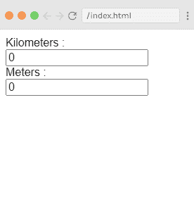
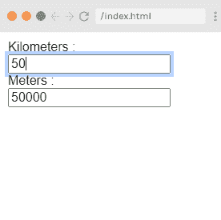
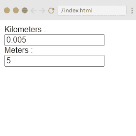

# Vue.js 观察属性

> 原文：<https://www.javatpoint.com/vue-js-watch-property>

Vue.js Watcher 或 watch 属性允许开发人员监听组件数据，并在他们更改特定属性时运行。watcher 或 watch 属性是一个独特的 Vue.js 特性，它允许您关注组件状态的一个属性，并在该属性值改变时运行一个函数。

让我们举一个例子来看看和了解 VueJS 中的 Watch 属性。请参见以下示例来理解观察器或观察属性的概念。

**Index.html 文件:**

```

<html>
   <head>
      <title>Vue.js Watch Property</title>
      <link rel="stylesheet" href="index.css">
        <script src="https://cdn.jsdelivr.net/npm/vue/dist/vue.js"></script>
    </head>
    <body>
    <div id = "wat_pro">
         Kilometers : <input type = "text" v-model = "kilometers"><br/>
         Meters : <input type = "text" v-model = "meters">
      </div>
      <script src="index.js"></script>
   </body>
</html>

```

**Index.js 文件:**

```

var vm = new Vue({
            el: '#wat_pro',
            data: {
               kilometers : 0,
               meters:0
            },
            methods: {
            },
            computed :{
            },
            watch : {
               kilometers:function(val) {
                  this.kilometers = val;
                  this.meters = val * 1000;
               },
               meters : function (val) {
                  this.kilometers = val/ 1000;
                  this.meters = val;
               }
            }
         })

```

让我们用一个简单的 [CSS](https://www.javatpoint.com/css-tutorial) 文件，让输出更有吸引力。

**Index.css 文件:**

```

html, body {
    margin: 5px;
    padding: 0;
}

```

程序执行后，您将看到以下输出:

**输出:**



您可以看到输出的文本框中有 0 条目。如果您在公里文本框中输入一些值，您可以在米文本框中看到变化，反之亦然。让我们在“公里”文本框中输入 50，然后查看结果。

**输出:**



现在，在米文本框中输入一些值，并查看公里文本框中的变化。让我们在仪表文本框中输入 5，并在输出中查看结果。

**输出:**



### 示例说明

在上面的例子中，我们创建了两个文本框，一个有公里，另一个有米。我们已经在数据属性中将公里和米这两个文本框初始化为 0。在这里，我们创建了一个手表对象，创建了两个功能公里和米。在这两个函数中，都完成了从公里到米和从米到公里的转换。

当您在任一文本框中输入值时，无论哪一个被更改，Watch 属性都会负责更新这两个文本框。您不必分配任何事件或等待它发生变化，也不必做额外的验证工作。watch 属性负责使用在各自函数中完成的计算来更新文本框。

### 计算与观察属性

如果将 Vue.js 计算属性与 [Vue.js](https://www.javatpoint.com/vue-js) watch 属性进行比较，则 Vue.js watch 属性提供了一种更通用的方法来观察数据变化并对其做出反应。

如果您有一些数据需要根据其他数据进行更改，那么使用 watch 属性既简单又直接，尤其是如果您来自 AngularJS 背景。但是，使用计算属性比命令式观察回调更好。

让我们举一个例子，看看并将其与 watch 属性和 computed 属性进行比较。

**Index.html 文件:**

```

<html>
   <head>
      <title>Vue.js Watch Property</title>
      <link rel="stylesheet" href="index.css">
        <script src="https://cdn.jsdelivr.net/npm/vue/dist/vue.js"></script>
    </head>
    <body>
    <div id="eg_1">{{ fullName }}</div>
      <script src="index.js"></script>
   </body>
</html>

```

**Index.js 文件:**

```

var vm = new Vue({
  el: '#eg_1',
  data: {
    firstName: 'Alex',
    lastName: 'Panda',
    fullName: 'Alex Panda'
  },
  watch: {
    firstName: function (val) {
      this.fullName = val + ' ' + this.lastName
    },
    lastName: function (val) {
      this.fullName = this.firstName + ' ' + val
    }
  }
})

```

**输出:**


您可以看到上面的代码是命令性的和重复的。现在，让我们将其与一个计算属性示例进行比较:

**Index.html 文件:**

```

<html>
   <head>
      <title>Vue.js Computed Property</title>
      <link rel="stylesheet" href="index.css">
        <script src="https://cdn.jsdelivr.net/npm/vue/dist/vue.js"></script>
    </head>
    <body>
    <div id="eg_2">{{ fullName }}</div>
      <script src="index.js"></script>
   </body>
</html>

```

**Index.js 文件:**

```

var vm = new Vue({
  el: '#eg_2',
  data: {
    firstName: 'Alex',
    lastName: 'Panda'
  },
  computed: {
    fullName: function () {
      return this.firstName + ' ' + this.lastName
    }
  }
})

```

**输出:**


你可以看到两个例子给出的结果是一样的，但是第二个“计算机属性”的例子更好更简洁。

* * *