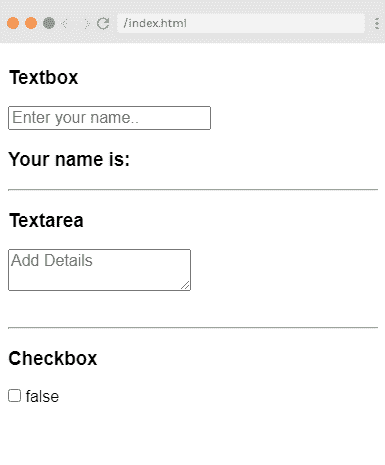
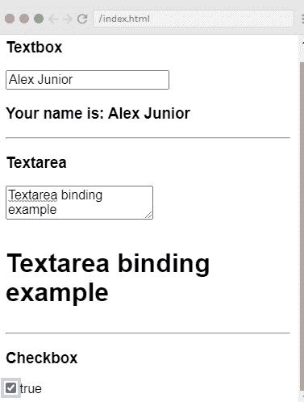
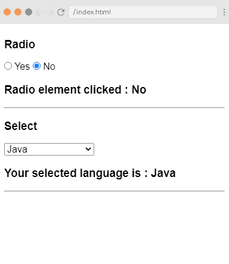
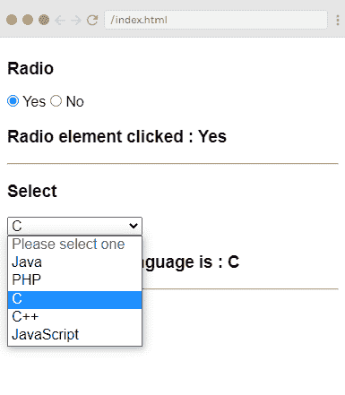
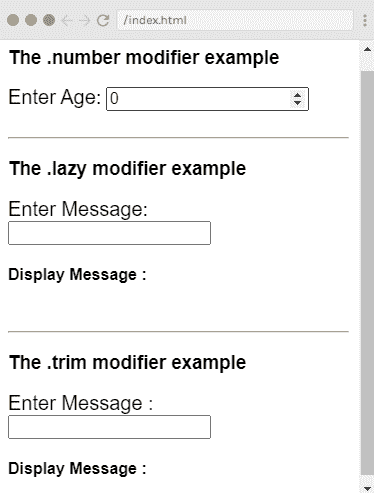
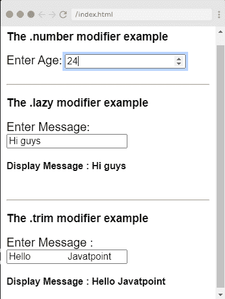

# 表单输入绑定

> 原文：<https://www.javatpoint.com/vue-js-form-input-bindings>

Vue.js 提供了一个 **v-model** 指令，可用于在表单输入、文本、textarea 和 select 字段上创建双向数据绑定。

v-model 指令根据输入类型自动选择更新元素的正确方式。它通过绑定输入文本元素和绑定到赋值变量的值来提供双向数据绑定。v-model 指令在内部使用不同的属性，并为不同类型的输入元素发出不同的事件。通常，我们在表单输入绑定中使用三种类型的绑定:

*   **Textarea Binding:** 在这个绑定中，我们使用文本和 Textarea 来绑定 value 属性和输入事件。
*   **单选并选择绑定:**在这个绑定中，我们使用复选框和单选按钮来绑定选中的属性和变更事件。
*   **修饰语绑定:**我们也可以使用类似的修饰语。懒惰，懒惰。修剪，修剪。号码等。在表单输入绑定示例中。

### 文本区域绑定

让我们举一个简单的例子来演示 textarea 绑定:

**Index.html 文件:**

```

<html>
   <head>
      <title>Vue.js Data Binding</title>
      <link rel="stylesheet" href="index.css">
        <script src="https://cdn.jsdelivr.net/npm/vue/dist/vue.js"></script>
    </head>
    <body>
      <div id = "databinding">
         <h3>Textbox</h3>
         <input  v-model = "name" placeholder = "Enter your name.." />
         <h3>Your name is: {{name}}</h3>
         <hr/>
         <h3>Textarea</h3>
         <textarea v-model = "textmessage" placeholder = "Add Details"></textarea>
         <h1><p>{{textmessage}}</p></h1>
         <hr/>
         <h3>Checkbox</h3>
         <input type = "checkbox" id = "checkbox" v-model = "checked"> {{checked}}
      </div>
      <script src="index.js"></script>
   </body>
</html>

```

**Index.js 文件:**

```

var vm = new Vue({
            el: '#databinding',
            data: {
               name:'',
               textmessage:'',
               checked : false
            }
         })

```

**Index.css 文件:**

```

html, body {
    margin: 5px;
    padding: 0;
}

```

程序执行后，您将看到以下输出:

**输出:**



您可以看到文本框和 textarea 现在是空的。该复选框也未选中，并显示错误值。现在，在 textbox 和 textarea 中键入一些值，v-model 被赋予值名，该名称显示在{{name}}中，它显示在 textbox 中键入的任何内容。同样，将显示写入 textarea 的值。



### 单选和选择绑定

让我们举一个简单的例子来演示单选和选择绑定:

**Index.html 文件:**

```

<html>
   <head>
      <title>Vue.js Data Binding</title>
      <link rel="stylesheet" href="index.css">
        <script src="https://cdn.jsdelivr.net/npm/vue/dist/vue.js"></script>
    </head>
    <body>
      <div id = "databinding">
         <h3>Radio</h3>
         <input type = "radio" id = "yes" value = "Yes" v-model = "picked"> Yes
         <input type = "radio" id = "no" value = "No" v-model = "picked"> No
         <h3>Radio element clicked: {{picked}} </h3>
         <hr/>
         <h3>Select</h3>
         <select v-model = "languages">
            <option disabled value = "">Please select one</option>
            <option>Java</option>
            <option>PHP</option>
            <option>C</option>
            <option>C++</option>
            <option>JavaScript</option>
         </select>
         <h3>Your selected language is: {{ languages }}</h3>
         <hr/>
      </div>
      <script src="index.js"></script>
   </body>
</html>

```

**Index.js 文件:**

```

var vm = new Vue({
            el: '#databinding',
            data: {
               picked : 'No',
               languages : "Java"
            }
         })

```

程序执行后，您将看到以下输出:

**输出:**



可以看到默认选择的单选元素是 No，选择的语言是 [Java](https://www.javatpoint.com/java-tutorial) 。现在，您可以根据需要更改该值。请参见以下输出:



### 修饰符绑定

让我们看一个例子来演示这三个修改器**。修剪，修剪。号、**和**。懒**共。

**。数字修饰符:**当您希望用户输入自动转换为数字时使用。它只允许你输入数字。除了数字，它不接受任何其他输入。

```

<input v-model.number = "age" type = "number">

```

**。lazy Modifier:** 用于显示文本框中存在的内容，只在完全输入且用户离开文本框后显示。默认情况下，v-model 会在每个输入事件后同步输入和数据。

```

<input v-model.lazy = "msg">

```

**。修剪修改器:**该修改器用于自动修剪用户输入的空白。它会删除开头和结尾输入的任何空格。

```

<input v-model.trim = "message">

```

**Index.html**

```

<html>
   <head>
      <title>Vue.js Data Binding</title>
      <link rel="stylesheet" href="index.css">
        <script src="https://cdn.jsdelivr.net/npm/vue/dist/vue.js"></script>
    </head>
    <body>
      <div id = "databinding">
          <h3> The .number modifier example</h3>
          <span style = "font-size:20px;">Enter Age:</span> <input v-model.number = "age" type = "number">
          <br/>
          <br/>
          <hr/>
          <h3> The .lazy modifier example</h3>
         <span style = "font-size:20px;">Enter Message:</span> <input v-model.lazy = "msg">
         <h4>Display Message : {{msg}}</h4>
         <br/>
         <hr/>
         <h3> The .trim modifier example</h3>
         <span style = "font-size:20px;">Enter Message : </span><input v-model.trim = "message">
         <h4>Display Message : {{message}}</h4>
      </div>
      <script src="index.js"></script>
   </body>
</html>

```

**Index.js**

```

var vm = new Vue({
            el: '#databinding',
            data: {
               age : 0,
               msg: '',
               message : ''
            }
         })

```

程序执行后，您将看到以下输出:

**输出:**



你可以看到每个修改器都是空的。现在，您可以输入任何值来查看结果，如下所示。



* * *