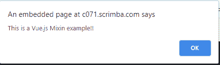

# Vue.js mixins

> 哎哎哎:# t0]https://www . javatppoint . com/view-js-mixins

在 Vue.js 中，mixin 是一组已定义的逻辑，以 Vue.js 指定的预定义方式存储。我们可以一次又一次地使用这些 mixin 来为我们的 Vue.js 实例和组件添加功能。因此，我们可以说 mixins 用于为 Vue 组件分发可重用的功能。它们提供了一种灵活而直接的方法来处理 Vue.js 组件，并在它们之间共享可重用的代码。

mixin 对象可以包含任何组件选项。当组件使用 mixin 时，mixin 中的所有选项都“混合”到组件自己的选项中，并成为组件选项不可分割的一部分。

### 为什么 Mixins 很重要？

**以下是一些使 Vue.js mixins 成为必需的特性的列表:**

*   js mixins 确保您不需要重复自己。您可以有效地为 Vue.js 组件分发可重用的功能，并一次又一次地使用它们。
*   js mixins 为灵活性提供了一个很好的选择。mixin 对象包含 Vue 组件选项，这意味着它是 Vue.js 的 mixin 和组件选项的混合。
*   js mixins 提供了一个很好的安全特性。如果你写得好，它们不会影响定义范围之外的变更。
*   js mixins 是一个优秀的代码重用平台。

### Vue.js mixins 应该解决的问题

使用 [Vue.js](https://www.javatpoint.com/vue-js) 的主要原因是为了解决程序中的重用问题。假设您有两个组件，它们包含一个方法，该方法在两个组件中执行完全相同的操作或相同的功能，与下面的代码相同:

**组件 1:**

```

<template>
  <div>
    <button v-on:click="clicked('you just clicked on button  1')">
      Button 1
    </button>
  </div>
</template>;
export default {
  name: "Test",
  methods: {
    clicked(value) {
      alert(value);
    }
  }
};

```

**组件 2:**

```

<template>
  <div>
    <button v-on:click="clicked('you just clicked on button  2')">
      Button 2
    </button>
  </div>
</template>;
export default {
  name: "Modal",
  methods: {
    clicked(value) {
      alert(value);
    }
  }
};

```

使用这两个组件后，您的 App.vue 文件应导入这两个组件，并声明如下:

```

<template>
  <div id="app">
    
    <Test />
    <modal />
  </div>
</template>;
<script>
import Test from "./components/Test.vue";
import Modal from "./components/Modal.vue";
export default {
  name: "app",
  components: {
    Test,
    Modal
  }
};
</script>

```

在这里，您可以看到我们在两个组件中都重复了 click 方法代码块。这不是处理内存资源的理想而有效的方式；这就是为什么引入了 Vue.js Mixin。

Vue.js 引入了 mixins 作为这个问题的优秀解决方案。通过使用 mixins，您可以封装一段代码或功能，然后导入它，以便在各种组件中需要时使用。

### Vue.js mixin 语法

Vue.js mixin 语法看起来像下面的代码:

```

// define a mixin object
var myMixin = {
  created: function() {
    this.hello();
  },
  methods: {
    hello: function() {
      console.log("hello from mixin!");
    }
  }
};
// define a component that uses this mixin
var Component = Vue.extend({
  mixins: [myMixin]
});
var component = new Component(); // => "hello from mixin!"

```

让我们举一个简单的例子来很好地理解 Vue.js Mixin 的概念。

**Index.html 文件:**

```

<html>
   <head>
      <title>Vue.js </title>
      <link rel="stylesheet" href="index.css">
        <script src="https://cdn.jsdelivr.net/npm/vue/dist/vue.js"></script>
<script src="https://unpkg.com/vue/dist/vue.js"></script>
    </head>
    <body>
      <div id = "mixin_1"></div>
      <script type = "text/javascript">
         var vm = new Vue({
            el: '#mixin_1',
            data: {
            },
            methods : {
            },
         });
         var myMixin = {
            created: function () {
               this.startmixin()
            },
            methods: {
               startmixin: function () {
                  alert("This is a Vue.js Mixin example!!");
               }
            }
         };
      </script>
      <script src="index.js"></script>
   </body>
</html>

```

**Index.js 文件:**

```

var Component = Vue.extend({
            mixins: [myMixin]
         })
         var component = new Component()

```

让我们使用一个简单的 CSS 文件来使输出更加吸引人。

**Index.css 文件:**

```

html, body {
    margin: 5px;
    padding: 0;
}

```

程序执行后，您将看到以下输出:

**输出:**



* * *