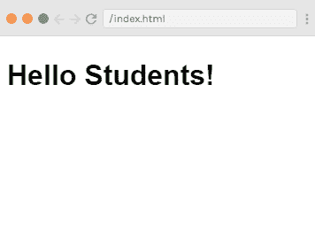
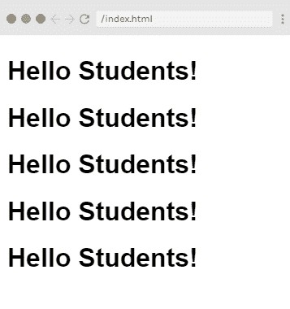
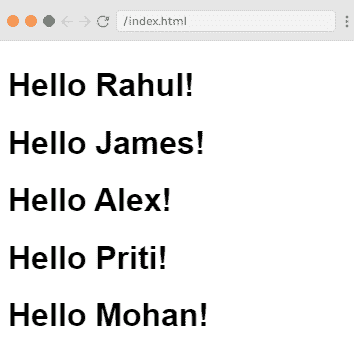
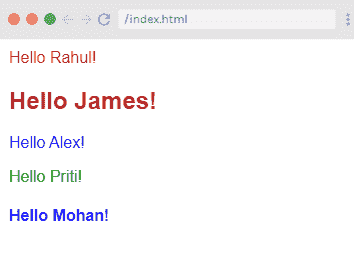
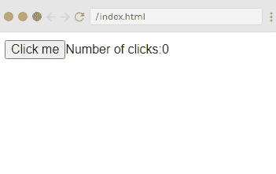
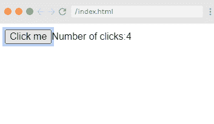

# Vue.js 渲染函数

> 原文：<https://www.javatpoint.com/vue-js-render-functions>

Vue.js 建议我们使用模板来构建 HTML。在这里，我们可以使用 render 函数作为模板的更接近编译器的替代。

Vue.js 呈现函数也与 Vue.js 组件一起使用。大多数时候，render 函数是由 Vue.js 编译器创建的。当您在组件上指定一个模板时，该模板的内容由 Vue.js 编译器处理，该编译器将返回一个呈现函数。render 函数本质上返回一个虚拟的 DOM 节点，它将由 Vue.js 在您的浏览器 DOM 中呈现。

### 什么是虚拟文档对象模型或“DOM”？

虚拟 DOM 允许 [Vue.js](https://www.javatpoint.com/vue-js) 在更新浏览器之前在其内存中渲染您的组件。这使得一切都变得更快，因为它只需要与浏览器进行一些交互。当 Vue.js 更新浏览器 DOM 时，它会将更新后的虚拟 DOM 与前一个进行比较，并用修改后的部分更新真实的 DOM。这就是它增强性能的方式。

让我们举一个简单组件的例子，看看当我们在这个例子中使用 render 函数时会产生什么效果。

**Index.html 文件:**

```

<html>  
   <head>  
      <title>Vue.js Component</title>  
      <link rel="stylesheet" href="index.css">  
        <script src="https://cdn.jsdelivr.net/npm/vue/dist/vue.js"></script>  
    </head>  
    <body>  
      <div id = "component_test">  
         <testcomponent></testcomponent>  
      </div>  
      <script src="index.js"></script>  
   </body>  
</html>  

```

**Index.js 文件:**

```

Vue.component('testcomponent',{  
   template : '<h1>Hello Students!</h1>'  
});  
var vm = new Vue({  
   el: '#component_test'  
})

```

让我们使用一个简单的 CSS 文件来使输出更加吸引人。

**Index.css 文件:**

```

html, body {
    margin: 5px;
    padding: 0;
}

```

程序执行后，您将看到以下输出:

**输出:**



在这里，您可以看到组件将上面的结果显示为 Hello Students。现在，如果您重复使用该组件，您将看到结果会一次又一次地打印出来。例如，

```

<div id = "component_test">
   <testcomponent></testcomponent>
   <testcomponent></testcomponent>
   <testcomponent></testcomponent>
   <testcomponent></testcomponent>
   <testcomponent></testcomponent>
</div> 

```

**输出:**


假设，你不希望同样的文字被一次又一次地打印出来，那么你会怎么做呢？让我们进行一些更改，并在组件中键入一些内容，如下所示:

**Index.html 文件:**

```

<html>  
   <head>  
      <title>Vue.js Component</title>  
      <link rel="stylesheet" href="index.css">  
        <script src="https://cdn.jsdelivr.net/npm/vue/dist/vue.js"></script>  
    </head>  
    <body>  
      <div id = "component_test">  
   <testcomponent>Hello Rahul!</testcomponent>
   <testcomponent>Hello James!</testcomponent>
   <testcomponent>Hello Alex!</testcomponent>
   <testcomponent>Hello Priti!</testcomponent>
   <testcomponent>Hello Mohan!</testcomponent>
      </div>  
      <script src="index.js"></script>  
   </body>  
</html>  

```

Index.js 文件将与上面相同。

程序执行后，您将看到以下输出:

**输出:**



您可以看到输出与前面的输出保持一致。它不会像我们希望的那样改变文本。

### 插槽的使用

现在，我们将使用组件提供的插槽来获得期望的结果。

**语法:**

```

template : '<h1><slot></slot></h1>',

```

请参见以下示例:

**Index.html 文件:**

```

<html>  
   <head>  
      <title>Vue.js Component</title>  
      <link rel="stylesheet" href="index.css">  
        <script src="https://cdn.jsdelivr.net/npm/vue/dist/vue.js"></script>  
    </head>  
    <body>  
      <div id = "component_test">  
   <testcomponent>Hello Rahul!</testcomponent>
   <testcomponent>Hello James!</testcomponent>
   <testcomponent>Hello Alex!</testcomponent>
   <testcomponent>Hello Priti!</testcomponent>
   <testcomponent>Hello Mohan!</testcomponent>
      </div>  
      <script src="index.js"></script>  
   </body>  
</html>  

```

**Index.js 文件:**

```

Vue.component('testcomponent',{  
    template : '<h1><slot></slot></h1>',  
});  
var vm = new Vue({  
   el: '#component_test'  
})

```

程序执行后，您将看到以下输出:

**输出:**



### 如何使用渲染函数？

假设，您必须在输出中更改结果的颜色和大小例如，我们在前面的示例中使用了 h1 标签，并且我们想要将相同组件的 [HTML 标签](https://www.javatpoint.com/html-tutorial)更改为 [p 标签](https://www.javatpoint.com/html-paragraph)或 [div 标签](https://www.javatpoint.com/html-div-tag)或任何其他标签。通过使用渲染函数，我们可以灵活地进行更改。Render 函数有助于使组件成为动态的，并通过保持组件的公共性和使用相同的组件传递参数来使用组件所需的方式。

让我们看一个例子来演示渲染函数的使用:

**Index.html 文件:**

```

<html>  
   <head>  
      <title>Vue.js Component</title>  
      <link rel="stylesheet" href="index.css">  
        <script src="https://cdn.jsdelivr.net/npm/vue/dist/vue.js"></script>  
    </head>  
    <body>  
      <div id = "component_test">  
   <testcomponent :elementtype = "'div,red,25,div1'">Hello Rahul!</testcomponent>
   <testcomponent :elementtype = "'h2,brown,25,div1'">Hello James!</testcomponent>
   <testcomponent :elementtype = "'p,blue,25,ptag'">Hello Alex!</testcomponent>
   <testcomponent :elementtype = "'div,green,25,divtag'">Hello Priti!</testcomponent>
   <testcomponent :elementtype = "'h4,blue,25,ptag'">Hello Mohan!</testcomponent>
      </div>  
      <script src="index.js"></script>  
   </body>  
</html>  

```

**Index.js 文件:**

```

Vue.component('testcomponent',{  
    render :function(createElement){
               var a = this.elementtype.split(",");
               return createElement(a[0],{
                  attrs:{
                     id:a[3],
                     style:"color:"+a[1]+";font-size:"+a[2]+";"
                  }
               },
               this.$slots.default
               )
            },
            props:{
               elementtype:{
                  attributes:String,
                  required:true
               }
            }
         });
         var vm = new Vue({
            el: '#component_test'
         })

```

程序执行后，您将看到以下输出:

**输出:**



### 示例说明

在上例中，您可以看到我们已经更改了组件，并使用 Index.js 文件中的以下代码添加了带有**道具属性**的**渲染函数**:

```

Vue.component('testcomponent',{  
    render :function(createElement){
               var a = this.elementtype.split(",");
               return createElement(a[0],{
                  attrs:{
                     id:a[3],
                     style:"color:"+a[1]+";font-size:"+a[2]+";"
                  }
               },
               this.$slots.default
               )
            },
            props:{
               elementtype:{
                  attributes:String,
                  required:true
               }
            }
         });

```

在这里，props 属性看起来像下面的代码:

```

props:{
               elementtype:{
                  attributes:String,
                  required:true
               }
            }
         });

```

当我们使用带有渲染函数的组件时，它们没有模板标签或属性。相反，它们定义了一个名为 render 的函数，该函数接收以下结构中的 createElement:

**语法:**

```

(renderElement: String | Component, definition: Object, children: String | Array) argument 

```

您可以在示例中看到如下内容:

```

render :function(createElement){
               var a = this.elementtype.split(",");
               return createElement(a[0],{
                  attrs:{
                     id:a[3],
                     style:"color:"+a[1]+";font-size:"+a[2]+";"
                  }

```

我们还定义了一个名为 **elementtype** 的属性，它采用类型字符串的属性字段。在另一个必填字段中，我们提到该字段是必填的。

请参见渲染函数代码，其中我们使用了 elementtype 属性，如下所示:

```

render :function(createElement){
               var a = this.elementtype.split(",");
               return createElement(a[0],{
                  attrs:{
                     id:a[3],
                     style:"color:"+a[1]+";font-size:"+a[2]+";"
                  }
               },
               this.$slots.default
               )
            },

```

呈现函数获取 createElement 作为参数，并返回相同的。CreateElement 创建 DOM 元素的方式与它在 [JavaScript](https://www.javatpoint.com/javascript-tutorial) 中创建的方式相同。我们还使用 attrs 字段中的值在逗号上拆分了 elementtype。

CreateElement 将第一个参数作为要创建的 elementtag。它按如下方式传递给组件:

```

<testcomponent :elementtype = "'div,red,25,div1'">Hello Rahul!</testcomponent> 

```

组件接受道具字段作为上面的代码。它以符号开始:然后指定道具的名称。在指定道具的名称之后，我们必须传递元素标签、颜色、字体大小和元素的 id。

在渲染函数中，您可以看到第一个元素是 createElement 字段中的 elementtag，它被赋予 createElemet，如下所示:

```

return createElement(a[0],{
                  attrs:{
                     id:a[3],
                     style:"color:"+a[1]+";font-size:"+a[2]+";"
                  }
               },
               this.$slots.default
               )
            },

```

在上面的代码中，**a【0】**是 html 元素标签。接下来的参数是元素标签的属性。它们在**属性**字段中定义如下:

```

attrs:{
                     id:a[3],
                     style:"color:"+a[1]+";font-size:"+a[2]+";"
                  }
               },

```

这里，我们为元素标签定义了两个属性:id 标签和[样式标签](https://www.javatpoint.com/html-style)。

*   在 id 标签中，我们传递了一个[3]，这是我们在逗号上拆分后得到的值。
*   在样式标签中，我们分别传递了一个[1]和一个[2]来定义颜色和字体大小。

我们在组件中给出的消息指定如下:

```

<testcomponent :elementtype = "'div,red,25,div1'">Hello Rahul!</testcomponent>

```

slots 字段用于定义我们要在 createElement 中打印的文本，使用以下代码:

```

this.$slots.default

```

在程序执行后当你看到输出时，你会看到所有的输出条目都是以特定的方式显示的。这是因为我们以特定的方式定义了组件结构的元素。

```

<div id = "component_test">  
   <testcomponent :elementtype = "'div,red,25,div1'">Hello Rahul!</testcomponent>
   <testcomponent :elementtype = "'h2,brown,25,div1'">Hello James!</testcomponent>
   <testcomponent :elementtype = "'p,blue,25,ptag'">Hello Alex!</testcomponent>
   <testcomponent :elementtype = "'div,green,25,divtag'">Hello Priti!</testcomponent>
   <testcomponent :elementtype = "'h4,blue,25,ptag'">Hello Mohan!</testcomponent>
      </div>

```

### Vue.js 呈现函数中的事件绑定

让我们看一个例子来演示 Vue.js 呈现函数中的事件绑定。请参见以下示例:

**例**

**Index.html 文件:**

```

<html>  
   <head>  
      <title>Vue.js Event binding in render function</title>  
      <link rel="stylesheet" href="index.css">  
        <script src="https://cdn.jsdelivr.net/npm/vue/dist/vue.js"></script>  
    </head>  
    <body>  
      <div id="render_1"></div>
      <script src="index.js"></script>  
   </body>  
</html>

```

**Index.js 文件:**

```

new Vue({
  el: '#render_1',
  data() {
    return {
      clickCount: 0,
    }
  },
  methods: {
    onClick() {
      this.clickCount += 1;
    }
  },
  render(createElement) {
    const button = createElement('button', {
      on: {
        click: this.onClick
      }
    }, 'Click me');
    const counter = createElement('span', [
      'Number of clicks:',
      this.clickCount
    ]);
    return createElement('div', [
      button, counter
    ])
  }
});

```

程序执行后，您将看到以下输出:

**输出:**



当您点击“点击我”按钮时，您将看到点击次数显示为您点击该按钮的次数。查看输出:



在上面的例子中，按钮被点击了四次。

* * *