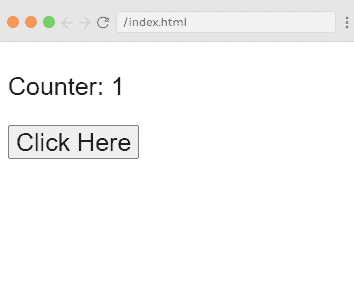
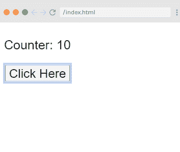
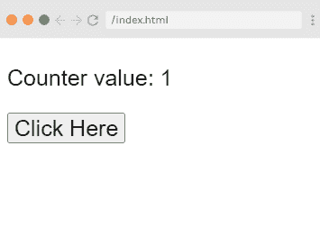
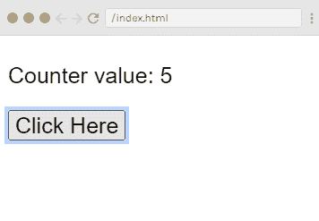

# 反应性系统

> 原文：<https://www.javatpoint.com/vue-js-reactivity-system>

反应性系统是 Vue.js 最鲜明的特征之一，在 Vue.js 中，模型是普通的 JavaScript 对象。当我们必须修改模型时，视图会更新。这使得状态管理变得简单和直观，但是理解它如何工作以避免一些常见的即将到来的问题也是至关重要的。在这里，我们将看到如何通过使用反应性系统来处理这些问题。

### 它是如何工作的？

如果您将一个普通的 [JavaScript](https://www.javatpoint.com/javascript-tutorial) 对象作为其数据选项传递给一个 [Vue.js](https://www.javatpoint.com/vue-js-instance) 实例，您将会看到 Vue.js 通过其所有属性进行传递，并使用**object . definepreproperty**将其转换为 getter/setter。

这是一个不可摆振且仅适用于 ES5 的特性。因为这个特性，Vue 不支持 IE8 及以下版本。

用户看不到 getter 和 setter，但是在引擎盖下，它们使 [Vue.js](https://www.javatpoint.com/vue-js) 能够在您必须更改或访问属性时执行依赖项跟踪和更改通知。您可以在浏览器的控制台上看到 getter/setter 属性的更改。如果你想看，你必须安装 **vue-devtools** 以获得更友好的检查界面。

每个组件实例都有一个对应的观察器实例。这用于将组件渲染期间“接触”的属性记录为依赖项。之后，当依赖项的设置器被触发时，它通知观察者，观察者依次重新呈现组件。


### 反应界面

Vue.js 为我们提供了一个为动态添加的属性增加反应性的选项。假设，我们已经创建了 Vue.js 实例，并且想要添加 watch 属性。请参见以下示例:

**示例:**

**Index.html 文件:**

```

<html>  
   <head>  
      <title>Vue.js Reactive Interface</title>  
      <link rel="stylesheet" href="index.css">  
        <script src="https://cdn.jsdelivr.net/npm/vue/dist/vue.js"></script>  
    </head>  
    <body>  
      <div id = "reactivity_1">
         <p style = "font-size:25px;">Counter: {{ counter }}</p>
         <button @click = "counter++" style = "font-size:25px;">Click Here</button>
      </div> 
      <script src="index.js"></script>  
   </body>  
</html> 

```

**Index.js 文件:**

```

var vm = new Vue({
            el: '#reactivity_1',
            data: {
               counter: 1
            }
         });
         vm.$watch('counter', function(nval, oval) {
            alert('Counter is incremented :' + oval + ' to ' + nval + '!');
         });
         setTimeout(
            function(){
               vm.counter = 10;
            },1000
         )

```

让我们使用一个简单的 CSS 文件来使输出更加吸引人。

**Index.css 文件:**

```

html, body {
    margin: 5px;
    padding: 0;
}

```

程序执行后，您将看到以下输出:

**输出:**




当您点击“点击此处”按钮时，计数器将递增。您将看到一个弹出输出或警报消息，显示计数器属性的更改值。

点击“点击此处”按钮后，请查看以下输出。




### 示例说明

在上面的例子中，我们定义了一个属性计数器，它在数据对象中被设置为 1。当您点击“点击此处”按钮时，计数器将递增。

在创建了 [Vue.js 实例](https://www.javatpoint.com/vue-js-instance)之后，我们必须给它添加 watch 属性。使用以下代码添加它:

```

vm.$watch('counter', function(nval, oval) {
   alert('Counter is incremented :' + oval + ' to ' + nval + '!');
}); 

```

我们已经使用$watch 属性在 Vue 实例之外添加了 watch。我们还添加了一个警报，用于显示计数器属性的值变化。还添加了一个名为 setTimeout 的计时器功能，将计数器值设置为 10。

```

setTimeout(
   function(){
      vm.counter = 10;
   },1000
);

```

每当您单击按钮时，计数器将被更改，并且来自 watch 方法的警报将被触发。

### 在运行时添加属性。

总是声明属性是最好的方法，这需要在 Vue.js 实例中提前反应，因为 Vue.js 不能检测属性的添加和删除。

如果你想在运行时添加属性，你必须使用 **Vue global、Vue.set、**和 **Vue.delete** 方法。

### 视图. set

这用于设置对象的属性。这用于克服 Vue.js 无法检测属性添加的限制。

**语法**

```

Vue.set( target, key, value )

```

在这里，

**目标:**可以是一个对象，也可以是一个数组。

**键:**可以是字符串，也可以是数字。

**值:**可以是任意类型。

让我们举一个简单的例子来理解 Vue.set 的概念。

**示例:**

**Index.html 文件:**

```

<html>  
   <head>  
      <title>Vue.js Reactive Interface</title>  
      <link rel="stylesheet" href="index.css">  
        <script src="https://cdn.jsdelivr.net/npm/vue/dist/vue.js"></script>  
    </head>  
    <body>  
      <div id = "reactivity_1">
         <p style = "font-size:25px;">Counter value: {{ products.id }}</p>
         <button @click = "products.id++" style = "font-size:25px;">Click Here</button>
      </div>
      <script src="index.js"></script>  
   </body>  
</html>  

```

**Index.js 文件:**

```

var myproduct = {"id":1, name:"shirt", "price":"1000.00"};
         var vm = new Vue({
            el: '#reactivity_1',
            data: {
               counter: 1,
               products: myproduct
            }
         });
         vm.products.qty = "1";
         console.log(vm);
         vm.$watch('counter', function(nval, oval) {
            alert('Counter is incremented :' + oval + ' to ' + nval + '!');
         }) 

```

程序执行后，您将看到以下输出:

**输出:**



在这里，您会看到每次点击“点击这里”按钮时，计数器的值都会增加。请参见以下输出。在这里，我们已经点击了 5 次按钮。



### 示例说明

在上面的例子中，我们在开始时使用以下代码创建了一个名为 **myproduct** 的变量:

```

var myproduct = {"id":1, name:"shirt", "price":"1000.00"};

```

它被赋予 Vue.js 实例中的数据对象，如下所示:

```

var vm = new Vue({
            el: '#reactivity_1',
            data: {
               counter: 1,
               products: myproduct
            }
         });

```

假设，在创建 Vue.js 实例之后，您必须向 **myproduct** 数组中再添加一个属性。您可以通过使用以下代码来实现这一点:

```

vm.products.qty = "1"; 

```

如果你看到控制台上的输出，你会发现在产品列表中，数量会被添加。基本上增加反应性的 get/set 方法适用于 id、名称和价格，不适用于数量。

所以，你可以看到反应性不能仅仅通过增加 vue 物体来实现。在 Vue.js 中，您必须在开始时创建它的所有属性。如果您想以后再做，我们可以使用 Vue.set。请参见稍后添加所有属性的另一个示例。

**示例:**

**Index.html 文件:**

```

<html>  
   <head>  
      <title>Vue.js Reactive Interface</title>  
      <link rel="stylesheet" href="index.css">  
        <script src="https://cdn.jsdelivr.net/npm/vue/dist/vue.js"></script>  
    </head>  
    <body>  
      <div id = "reactivity_1">
         <p style = "font-size:25px;">Counter value: {{ products.id }}</p>
         <button @click = "products.id++" style = "font-size:25px;">Click Here</button>
      </div>
      <script src="index.js"></script>  
   </body>  
</html> 

```

**Index.js 文件:**

```

var myproduct = {"id":1, name:"shirt", "price":"1000.00"};
         var vm = new Vue({
            el: '#reactivity_1',
            data: {
               counter: 1,
               products: myproduct
            }
         });
         Vue.set(myproduct, 'qty', 1);
         console.log(vm);
         vm.$watch('counter', function(nval, oval) {
            alert('Counter is incremented :' + oval + ' to ' + nval + '!');
         })

```

在上面的例子中，我们使用 Vue.set 将数量添加到数组中，代码如下:

```

Vue.set(myproduct, 'qty', 1); 

```

如果您在控制台上运行这个示例，您将看到数量的 get/set 是使用 Vue.set 方法添加的。

### 视图，删除

Vue.delete 函数用于动态删除属性。这也用于克服 Vue.js 无法检测属性删除的限制。

**语法:**

```

Vue.delete( target, key )

```

在这里，

**目标:**用于指定一个对象或数组。

**键:**用于指定字符串或数字。

让我们看一个例子来演示如何使用 Vue.delete 函数在 Vue.js 中动态删除任何属性。

**例**

**Index.html 文件:**

```

<html>  
   <head>  
      <title>Vue.js Reactive Interface</title>  
      <link rel="stylesheet" href="index.css">  
        <script src="https://cdn.jsdelivr.net/npm/vue/dist/vue.js"></script>  
    </head>  
    <body>  
      <div id = "reactivity_1">
         <p style = "font-size:25px;">Counter value: {{ products.id }}</p>
         <button @click = "products.id++" style = "font-size:25px;">Click Here</button>
      </div>
      <script src="index.js"></script>  
   </body>  
</html>  

```

**Index.js 文件:**

```

var myproduct = {"id":1, name:"shirt", "price":"1000.00"};
         var vm = new Vue({
            el: '#reactivity_1',
            data: {
               counter: 1,
               products: myproduct
            }
         });
          Vue.delete(myproduct, 'price');
         console.log(vm);
         vm.$watch('counter', function(nval, oval) {
            alert('Counter is incremented :' + oval + ' to ' + nval + '!');
         })  

```

在上面的示例中，我们使用了 Vue.delete 函数，通过使用以下代码从数组中删除价格:

```

Vue.delete(myproduct, 'price');

```

当您在控制台上看到上述示例的输出时，您会看到在删除价格时，控制台上只显示 id 和名称。我们还会注意到 get/set 方法被删除了。

* * *