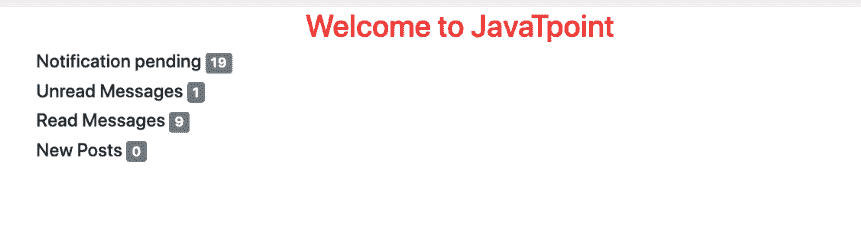
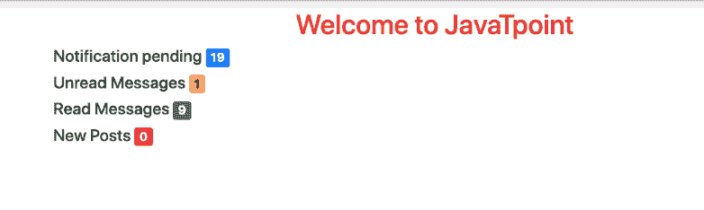
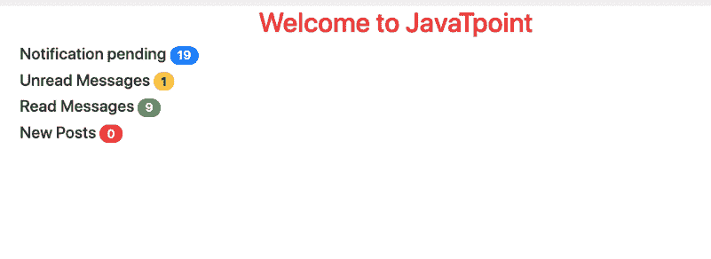
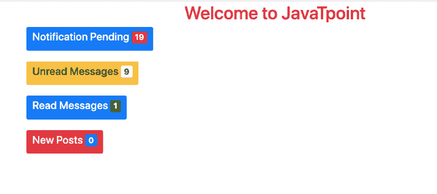

# Bootstrap4 -徽章

> 原文：<https://www.javatpoint.com/bootstrap-4-badges>

Bootstrap 4 中的徽章可用于提供有关内容的附加信息。例如，与链接的一些通知相关联的网站。当登录到一个特定的网站时，会看到通知号码，该网站通过单击它来告知要查看的新闻或通知的号码。

徽章有点类似于标签；主要的区别是角更圆。徽章主要用于突出显示或更加强调网页列表中的新项目或未读项目。

用户可以在他们的网站中实现徽章，以增强网站的整体外观。

在 [Bootstrap 4](bootstrap-4) 中，有 4 种类型的徽章可以实现:

1.  基本徽章
2.  上下文徽章
3.  药丸徽章
4.  元素内部的徽章

### 基本徽章:

在基本徽章中，用户必须使用**。徽章**类为了创建矩形徽章。基本徽章有基本布局。

**在[引导](https://www.javatpoint.com/bootstrap-tutorial) 4 中的基本徽章示例如下:**

```

<!DOCTYPE html> 
<html lang="en"> 
<head> 
<title>Bootstrap Badges</title> 
<meta charset="utf-8"> 
<meta name="viewport" content="width=device-width, initial-scale=1"> 
<link rel="stylesheet" href= 
"https://maxcdn.bootstrapcdn.com/bootstrap/4.3.1/css/bootstrap.min.css"> 	
<script src= 
"https://ajax.googleapis.com/ajax/libs/jquery/3.3.1/jquery.min.js"> 
</script> 
<script src= 
"https://cdnjs.cloudflare.com/ajax/libs/popper.js/1.14.7/umd/popper.min.js"> 
</script> 
<script src= 
"https://maxcdn.bootstrapcdn.com/bootstrap/4.3.1/js/bootstrap.min.js"> 
</script> 
</head> 
<body> 
<h1 style="color:red;text-align:center;"> 
Welcome to JavaTpoint
</h1> 
<div class="container"> 
<h4>Notification pending
<span class="badge badge-secondary">19</span> 
</h4> 	
<h4>Unread Messages
<span class="badge badge-secondary">1</span> 
</h4> 	
<h4>Read Messages 
<span class="badge badge-secondary">9</span> 
</h4> 
<h4>New Posts
<span class="badge badge-secondary">0</span> 
</h4> 
</div> 
</body> 
</html>

```

[Test it Now](https://www.javatpoint.com/oprweb/test.jsp?filename=bootstrap-4-badges1)

**基本徽章的输出将是:**



### 上下文徽章:

上下文类可用于更改徽章的颜色。徽章可以作为链接或按钮的一部分，以提供一个计数器。主要看他们怎么用；徽章一定会让用户感到困惑。为此，使用不同颜色的变体，以便用户不会混淆。

**Bootstrap4 中上下文标记的示例如下:**

```

<!DOCTYPE html> 
<html lang="en"> 
<head> 
<title>Bootstrap Badges</title> 	
<meta charset="utf-8"> 
<meta name="viewport" content="width=device-width, initial-scale=1"> 
<link rel="stylesheet" href= 
"https://maxcdn.bootstrapcdn.com/bootstrap/4.3.1/css/bootstrap.min.css"> 	
<script src= 
"https://ajax.googleapis.com/ajax/libs/jquery/3.3.1/jquery.min.js"> 
</script> 
<script src= 
"https://cdnjs.cloudflare.com/ajax/libs/popper.js/1.14.7/umd/popper.min.js"> 
</script> 
<script src= 
"https://maxcdn.bootstrapcdn.com/bootstrap/4.3.1/js/bootstrap.min.js"> 
</script> 
</head> 
<body> 
<h1 style="color:red;text-align:center;"> 
Welcome to JavaTpoint
</h1> 		
<div class="container"> 
<h4>Notification pending
<span class="badge badge-primary">19</span> 
</h4> 		
<h4>Unread Messages
<span class="badge badge-warning">1</span> 
</h4> 		
<h4>Read Messages 
<span class="badge badge-success">9</span> 
</h4> 
<h4>New Posts 
<span class="badge badge-danger">0</span> 
</h4> 
</div> 
</body> 
</html>

```

[Test it Now](https://www.javatpoint.com/oprweb/test.jsp?filename=bootstrap-4-badges2)

**上下文徽章的输出将是:**



### 药丸徽章:

药丸徽章可用于创建具有更多圆角的徽章。那个。徽章-药丸类可以用来使徽章的角更圆，这意味着徽章将包含更大的边框半径，还将包含额外的边框填充。

**Bootstrap4 中药丸徽章的示例如下:**

```

<!DOCTYPE html> 
<html lang="en"> 
<head> 
<title>Bootstrap Badges</title> 
<meta charset="utf-8"> 
<meta name="viewport" content="width=device-width, initial-scale=1"> 
<link rel="stylesheet" href= 
"https://maxcdn.bootstrapcdn.com/bootstrap/4.3.1/css/bootstrap.min.css"> 	
<script src= 
"https://ajax.googleapis.com/ajax/libs/jquery/3.3.1/jquery.min.js"> 
</script> 	
<script src= 
"https://cdnjs.cloudflare.com/ajax/libs/popper.js/1.14.7/umd/popper.min.js"> 
</script> 	
<script src= 
"https://maxcdn.bootstrapcdn.com/bootstrap/4.3.1/js/bootstrap.min.js"> 
</script> 
</head> 
<body> 
<h1 style="color:red;text-align:center;"> 
Welcome to JavaTpoint
</h1> 		
<div class="container"> 
<h4>Notification pending 
<span class="badge badge-primary badge-pill">19</span> 
</h4> 
<h4>Unread Messages
<span class="badge badge-warning badge-pill">1</span> 
</h4> 
<h4>Read Messages 
<span class="badge badge-success badge-pill">9</span> 
</h4> 
<h4>New Posts 
<span class="badge badge-danger badge-pill">0</span> 
</h4> 
</div> 
</body> 
</html>

```

[Test it Now](https://www.javatpoint.com/oprweb/test.jsp?filename=bootstrap-4-badges3)

**药丸徽章的输出将是:**



### 元素内部的徽章:

在 Bootstrap 4 中，徽章也可以以位于元素内部的方式创建。为此，用户必须将徽章嵌套在 [<按钮>](https://www.javatpoint.com/html-button-tag) 元素中。

**位于引导程序 4 中元素内部的徽章示例如下:**

```

<!DOCTYPE html> 
<html lang="en"> 
<head> 
<title>Bootstrap Badges</title> 
<meta charset="utf-8"> 
<meta name="viewport" content="width=device-width, initial-scale=1"> 
<link rel="stylesheet" href= 
"https://maxcdn.bootstrapcdn.com/bootstrap/4.3.1/css/bootstrap.min.css"> 	
<script src= 
"https://ajax.googleapis.com/ajax/libs/jquery/3.3.1/jquery.min.js"> 
</script> 	
<script src= 
"https://cdnjs.cloudflare.com/ajax/libs/popper.js/1.14.7/umd/popper.min.js"> 
</script> 
<script src= 
"https://maxcdn.bootstrapcdn.com/bootstrap/4.3.1/js/bootstrap.min.js"> 
</script> 
</head> 
<body> 
<h1 style="color:red;text-align:center;"> 
Welcome to JavaTpoint
</h1> 	
<div class="container"> 
<button type="button" class="btn btn-primary"> 
<h4>Notification Pending
<span class="badge badge-primary badge-danger">19</span> 
</h4> 
</button><br><br> 		
<button type="button" class="btn btn-warning"> 
<h4>Unread Messages
<span class="badge badge-light">9</span> 
</h4> 
</button><br><br> 		
<button type="button" class="btn btn-primary"> 
<h4>Read Messages 
<span class="badge badge-success">1</span> 
</h4> 
</button><br><br> 	
<button type="button" class="btn btn-danger"> 
<h4>New Posts
<span class="badge badge-primary">0</span> 
</h4> 
</button> 
</div> 
</body> 
</html>

```

[Test it Now](https://www.javatpoint.com/oprweb/test.jsp?filename=bootstrap-4-badges4)

**元素内部徽章的输出为:**



* * *