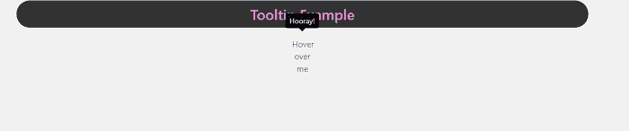
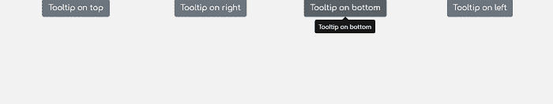
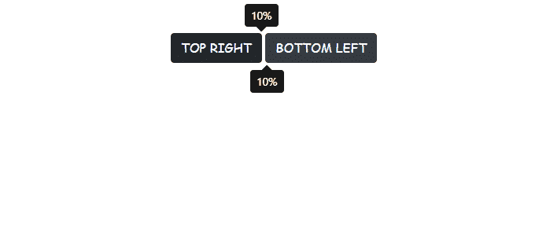

# Bootstrap4 工具提示

> 原文：<https://www.javatpoint.com/bootstrap-4-tooltip>

在本文中，我们将借助 Bootstrap4 工具提示创建一个工具提示。在本文的开头，我们将学习 Bootstrap 和 Bootstrap 4 的一些基础知识。之后，我们将借助 Bootstrap4 工具提示的各种示例来理解这个概念。

### Bootstrap4 是什么意思？

Bootstrap 用于在 [HTML](https://www.javatpoint.com/html-tutorial) 文档中添加设计，类似于级联样式表。Bootstrap 的最新版本是[T3【Bootstrap 4T5】。它可以免费下载和使用。](https://www.javatpoint.com/bootstrap-4)

**下面的链接用于将 Bootstrap 4 添加到模板中。**

<link rel="stylesheet" href="https://maxcdn.bootstrapcdn.com/bootstrap/4.0.0/css/bootstrap.min.css" integrity="sha384-Gn5384xqQ1aoWXA+058RXPxPg6fy4IWvTNh0E263XmFcJlSAwiGgFAW/dAiS6JXm" crossorigin="anonymous">

### Bootstrap4 工具提示是什么意思？

Bootstrap 4 工具提示也称为信息提示或屏幕提示。一个[图形用户界面(GUI)](https://www.javatpoint.com/gui-full-form) 元素与光标或鼠标指针结合使用，以显示关于一个项目的信息，而无需点击它。

**我们来看一下 Bootstrap4 工具提示的各种例子。**

### 例 1:

```

<! DOCTYPE html>
<html lang="en">
<head>
  <title> Bootstrap4 tooltip Example </title>
  <meta charset="utf-8">
  <meta name="viewport" content="width=device-width, initial-scale=1">
  <link rel="stylesheet" href="https://maxcdn.bootstrapcdn.com/bootstrap/4.5.2/css/bootstrap.min.css">
</head>
<style>
body {
  background: #F1F1F1;
  text-align: center;
}
a {
  color: #222;
  border-radius: 100%;
  display: inline-block;
  text-decoration: none;
  position: relative;
  width: 40px;
  margin: 0 2px;
  padding-top: 12px;
  -webkit-transition: all .5s;
  -moz-transition: all .5s;
  transition: all .5s;
}
a:hover {
text-decoration: none;
}
body h1 {
  font-family: 'Lobster', cursive;
  margin: 150px 20px 40px;
  font-size: 50px;
  letter-spacing: 0.5px;
  color: #999999;
  text-align: center;
}
h3 {
    background: #333;
    color: #E086D3;
    padding: 10px 20px;
    border-radius: 56px;
  }
  </style>
<body>
<div class="container">
  <h3>Tooltip Example</h3>
  <a href="#" data-toggle="tooltip" title="Hooray!"> Hover over me </a>
</div>
<script src="https://ajax.googleapis.com/ajax/libs/jquery/3.5.1/jquery.min.js"> </script>
  <script src="https://cdnjs.cloudflare.com/ajax/libs/popper.js/1.16.0/umd/popper.min.js"> </script>
  <script src="https://maxcdn.bootstrapcdn.com/bootstrap/4.5.2/js/bootstrap.min.js"> </script>
<script type = "text/javascript">
$(document).ready(function(){
  $('[data-toggle="tooltip"]').tooltip();   
});
</script>
</body>
</html>

```

[Test it Now](https://www.javatpoint.com/oprweb/test.jsp?filename=bootstrap-4-tooltip1)

**说明:**

在上面的例子中，我们在 Bootstrap4 工具提示的帮助下创建了一个工具提示。当用户将鼠标悬停在文本上时，会显示工具提示。

**输出:**

以下是该示例的输出:



### 例 2:

```

<! DOCTYPE html>
<html lang="en">
<head>
  <title> Bootstrap4 tooltip Example </title>
  <meta charset="utf-8">
  <meta name="viewport" content="width=device-width, initial-scale=1">
 <link rel="stylesheet" href="https://maxcdn.bootstrapcdn.com/bootstrap/4.5.2/css/bootstrap.min.css">
  <script src="https://ajax.googleapis.com/ajax/libs/jquery/3.5.1/jquery.min.js"> </script>
  <script src="https://cdnjs.cloudflare.com/ajax/libs/popper.js/1.16.0/umd/popper.min.js"> </script>
  <script src="https://maxcdn.bootstrapcdn.com/bootstrap/4.5.2/js/bootstrap.min.js"> </script>
</head>
<style>
@import url('https://fonts.googleapis.com/css?family=Arapey|Cantarell|Comfortaa|Khand|Russo+One|Ubuntu');
body h1 {
  font-family: 'Lobster', cursive;
  margin: 150px 20px 40px;
  font-size: 50px;
  letter-spacing: 0.5px;
  color: #999999;
  text-align: center;
}
body {
  background: #F1F1F1;
  box-sizing: border-box;
  color: #444;
  font-family: 'Comfortaa', cursive;
  text-align: center;
  font: 16px;
}
</style>
<body>
<div class="container">
<div class="row">	
<div class="col-xl-3">
<button type="button" class="btn btn-secondary" data-toggle="tooltip" data-placement="top" title="Tooltip on top">
Tooltip on top
</button>
</div>
<div class="col-xl-3">
<button type="button" class="btn btn-secondary" data-toggle="tooltip" data-placement="right" title="Tooltip on right">
Tooltip on right
</button>
</div>
<div class="col-xl-3">
<button type="button" class="btn btn-secondary" data-toggle="tooltip" data-placement="bottom" title="Tooltip on bottom">
 Tooltip on bottom
</button>
</div>
<div class="col-xl-3">
<button type="button" class="btn btn-secondary" data-toggle="tooltip" data-placement="left" title="Tooltip on left">
 Tooltip on left </button>
</div>
</div>
</div>
<script type = "text/javascript">
$(function () {
  $('[data-toggle="tooltip"]').tooltip();
});
</script>
</body>
</html>

```

[Test it Now](https://www.javatpoint.com/oprweb/test.jsp?filename=bootstrap-4-tooltip2)

**说明:**

在上面的例子中，我们在 Bootstrap4 工具提示的帮助下创建了一个工具提示。当用户悬停在特定文本上时，工具提示会根据方向显示。

**输出:**

以下是该示例的输出:



### 例 3:

```

<! DOCTYPE html>
<html lang="en">
<head>
  <title> Bootstrap4 tooltip Example </title>
  <meta charset="utf-8">
  <meta name="viewport" content="width=device-width, initial-scale=1">
  <link rel="stylesheet" href="https://maxcdn.bootstrapcdn.com/bootstrap/4.5.2/css/bootstrap.min.css">
  <script src="https://ajax.googleapis.com/ajax/libs/jquery/3.5.1/jquery.min.js"> </script>
  <script src="https://cdnjs.cloudflare.com/ajax/libs/popper.js/1.16.0/umd/popper.min.js"> </script>
  <script src="https://maxcdn.bootstrapcdn.com/bootstrap/4.5.2/js/bootstrap.min.js"> </script>
</head>
<body>
<div class="container mt-5">
  <div class="col-xs-12 text-center">
    <button class="btn btn-dark" data-toggle="tooltip" title="10%" data-offset="50%, 3"> TOP RIGHT </button>
   <button class="btn btn-dark" data-toggle="tooltip" title="10%" data-offset="-48%, 3" data-placement="bottom"> BOTTOM LEFT </button>
  </div>
</div>
<style>
.tooltip > .arrow {
  left: 50% !important;
  transform: translateX(-50%);
}
@import url('https://fonts.googleapis.com/css?family=Arapey|Cantarell|Comfortaa|Khand|Russo+One|Ubuntu');
body {
/*   background: #EEE; */
    background: url("https://s16.postimg.org/4d17gd0vp/smbg.png");
  margin: 0;
  padding: 0;
  box-sizing: border-box;
  color: #444;
  font-family: 'Comfortaa', cursive;
  text-align: center;
  font: 16px;
}
h1 {
  margin-bottom: 7%;
}
h3 {
    background: #333;
    color: #E086D3;
    padding: 10px 20px;
    border-radius: 56px;
    width: 8em;
    margin: 20% auto 1% auto;
  }
</style>
<script type = "text/javascript">
$(document).ready(function() {
  $("[data-toggle=tooltip]").tooltip('show');
});
</script>
</body>
</html>

```

[Test it Now](https://www.javatpoint.com/oprweb/test.jsp?filename=bootstrap-4-tooltip3)

**说明:**

在上面的例子中，我们已经借助 Bootstrap4 工具提示创建了一个工具提示。

**输出:**

以下是该示例的输出:



### 例 4:

```

<html>
<head>
    <meta charset="UTF-8">
    <title> Tooltip Hover Effect </title>
    <link rel="stylesheet" href="https://maxcdn.bootstrapcdn.com/font-awesome/4.5.0/css/font-awesome.min.css">
</head>
<style>
a {
  background: #D2D7D3;
  color: #222;
  border-radius: 100%;
  display: inline-block;
  text-decoration: none;
  position: relative;
  width: 40px;
  height: 28px;
  margin: 0 2px;
  padding-top: 12px;
  -webkit-transition: all .5s;
  -moz-transition: all .5s;
  transition: all .5s;
}
body {
  background: #e6e6e6;
  font-family: "Helvetica", "Arial";
  padding-top: 100px;
  text-align: center;
}
a.icon:before {
  font-family: "FontAwesome", sans-serif;
  color: #fff;
  font-size: 20px;
}
a.facebook:before {
  content: '\f09a';
}
a.twitter:before {
  content: '\f099';
}
a.github:before {
  content: '\f113';
}
a.dribble:before {
  content: '\f17d';
}
a.pinterest:before {
  content: '\f0d2';
}
a span {
  background: #fff;
  color: #222;
  font-size: 14px;
  font-weight: bold;
  position:  absolute;
  bottom: 0;
  left: -25px;
  right: -25px;
  padding: 5px 7px;
  visibility: hidden;
  opacity: 0;
  -webkit-transition: all .4s;
  -moz-transition: all .4s;
  transition: all .4s;
}
a span:before {
  content: '';
/*   width: 0;
  height: 0; */
  border-left: 5px solid transparent;
  border-right: 5px solid transparent;
  border-top: 5px solid #fff;
  position: absolute;
  bottom: -5px;
  left: 40px;
}
a:hover span {
  bottom: 50px;
  visibility: visible;
  opacity: 1;
}
a.facebook:hover {
  background-color: #4183d7; 
  color: #bfbfbf;
}
a.facebook span {
  color: #4183d7;
}
a.twitter:hover {
  background-color: #19b5fe;
  color: #fff;
}
a.twitter span {
  color: #19b5fe;
}
a.github:hover {
  background-color: #000;
  color: #fff;
}
a.github span {
  color: #000;
}
a.dribble:hover {
  background-color: #f62459;
  color: #fff;
}
a.dribble span {
  color: #f62459;
}
a.pinterest:hover {
  background-color: #f22613;
  color: #fff;
}
h3 {
    background: #333;
    color: #E086D3;
    padding: 10px 20px;
    border-radius: 56px;
  }
a.pinterest span {
  color: #f22613;
}
</style>
<body>
  <h3> Tooltip Example </h3>   
 <div>
        <a href="http://www.facebook.com" class="icon facebook"> <span> Facebook </span> </a>
        <a href="http://www.twitter.com" class="icon twitter"> <span> Twitter </span> </a>
        <a href="http://www.github.com" class="icon github"> <span> Github </span> </a>
        <a href="http://www.dribble.com" class="icon dribble"> <span> Dribble </span> </a>
      <a href="http://pinterest.com" class="icon pinterest"> <span> Pinterest </span> </a>
    </div>
</body>
</html>

```

[Test it Now](https://www.javatpoint.com/oprweb/test.jsp?filename=bootstrap-4-tooltip4)

**说明:**

在上面的例子中，我们在 Bootstrap4 工具提示的帮助下创建了一个工具提示。

**输出:**

以下是该示例的输出:


* * *