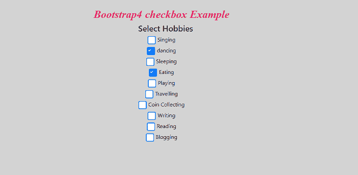
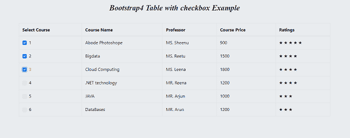

# Bootstrap4 复选框

> 原文：<https://www.javatpoint.com/bootstrap-4-checkboxes>

在本文中，我们将了解如何在 Bootstrap 4 中添加复选框元素。

### Bootstrap4 复选框是什么意思？

**在[引导](https://www.javatpoint.com/bootstrap-tutorial)**中，复选框用于显示小方块框，为用户提供几个可以切换“选中”和“取消选中”的选项。您也可以通过传递属性“checked”来为用户设置默认选项。它也被称为多选选项，因为它用于当用户被问及一个可以有多个正确答案的问题时，例如**爱好、阅读偏好**等。

**我们举几个 Bootstrap 4 复选框的例子。**

### 例 1:

```

<! DOCTYPE html>  
<html lang="en">  
<head>  
  <title> Bootstrap4 checkbox  Example </title>  
  <meta charset="utf-8">  
  <meta name="viewport" content="width=device-width, initial-scale=1">  
  <link rel="stylesheet" href="https://cdnjs.cloudflare.com/ajax/libs/twitter-bootstrap/4.1.2/css/bootstrap.min.css"> 
<link rel="stylesheet" href="https://use.fontawesome.com/releases/v5.3.1/css/all.css"> 
</head>  
<style>
.custom-control-label::before {
  top: 0.1rem;
  left: -1.5rem;
  width: 1.5rem;
  height: 1.5rem;
  background-color: #fff;
  border: 2px solid #007bff;
}
h2 {
 font-style: italic;
font-family: "Playfair Display","Bookman",serif;
  color: #ea1966; 
letter-spacing: -0.005em; 
word-spacing: 1px;
font-size: 2em;
font-weight: bold;
  }
.custom-radio {
  .custom-control-input:checked ~ .custom-control-label::before {
    background-color: #fff;
    border: 2px solid #007bff;
  }
  .custom-control-label:hover.custom-control-label::before {
    box-shadow: 0px 2px 5px rgba(0, 117, 201, 0.6);
  }
  .custom-control-label::after {
    top: .4rem;
    left: -1.25rem;
    width: 1rem;
    height: 1rem;
  }
      .custom-control-input:checked ~ .custom-control-label::after {
    background-image: none;
    background-color: #007bff;
    border-radius: 50%;
    border: 2px solid white;
  }
    .custom-control-input:disabled~.custom-control-label::before {
    background-color: #e9ecef;
    border: 2px solid #dee2e6;
  }

  .custom-control-input:disabled:checked~.custom-control-label::before {
    background-color: #e9ecef;
  }
    label {
  color: #ea1966;
  font-weight: bold;
  }
  .custom-control-input:disabled:checked~.custom-control-label::after {
    background-color: #9ca0b1;
    background-image: none;
    border-radius: 50%;
        border: 2px solid #e9ecef;
  }
  }
.custom-control-label {
  margin-bottom: .5rem;
  padding-left: 5px;
}
body
  {
  margin-top: 20px;
  text-align: center;
  padding: 20px 20px 20px 20px;
  background-color: lightgrey;
  color: red;
  }
.custom-checkbox {
  .custom-control-input:checked ~ .custom-control-label::before {
    background-color: #fff;
    border: 2px solid #007bff;
  }
  .custom-control-label:hover.custom-control-label::before {
    box-shadow: 0px 2px 5px rgba(0, 117, 201, 0.6);
  }
  .custom-control-label::after {
  top: -.1rem;
  left: -1.75rem;
  width: 2rem;
  height: 2rem;
  }
  .custom-control-input:disabled~.custom-control-label::before {
    background-color: #e9ecef;
    border: 2px solid #dee2e6;
  }
  h4 {
 font-style: italic;
font-family: "Playfair Display","Bookman",serif;
 color: green; 
letter-spacing: -0.005em; 
word-spacing: 1px;
font-size: 1.8em;
font-weight: bold;
  }
  .custom-control-input:disabled:checked~.custom-control-label::before {
    background-color: #e9ecef;
  }
    }
   </style>
<body>  
<h2> Boostrap4 checkbox Example </h2>
<div class="container">
  <div class="row">
    <div class="col-12">
      <div class="custom-control custom-checkbox">
        <input type="checkbox" id="customCheckbox" name="customCheck" class="custom-control-input">
		<h4> Select Hobbies </h4>
        <label class="custom-control-label" for="customCheckbox"> Singing </label>
      </div>
      <div class="custom-control custom-checkbox">
        <input type="checkbox" id="customCheckbox2" name="customCheck" class="custom-control-input" >
        <label class="custom-control-label" for="customCheckbox2"> dancing </label>
      </div>
	  <div class="custom-control custom-checkbox">
        <input type="checkbox" id="customCheckbox2" name="customCheck" class="custom-control-input" >
        <label class="custom-control-label" for="customCheckbox2"> Sleeping </label>
      </div>
	  <div class="custom-control custom-checkbox">
        <input type="checkbox" id="customCheckbox2" name="customCheck" class="custom-control-input" checked>
        <label class="custom-control-label" for="customCheckbox2"> Eating </label>
      </div>
      <div class="custom-control custom-checkbox">
        <input type="checkbox" id="customCheckbox3" name="customCheck" class="custom-control-input">
        <label class="custom-control-label" for="customCheckbox3"> Playing </label>
      </div>
	  <div class="custom-control custom-checkbox">
        <input type="checkbox" id="customCheckbox3" name="customCheck" class="custom-control-input">
        <label class="custom-control-label" for="customCheckbox3"> Travelling </label>
      </div>
	  <div class="custom-control custom-checkbox">
        <input type="checkbox" id="customCheckbox3" name="customCheck" class="custom-control-input">
        <label class="custom-control-label" for="customCheckbox3"> Coin Collecting </label>
      </div>
	   <div class="custom-control custom-checkbox">
        <input type="checkbox" id="customCheckbox3" name="customCheck" class="custom-control-input">
        <label class="custom-control-label" for="customCheckbox3"> Writing </label>
      </div>
	   <div class="custom-control custom-checkbox">
        <input type="checkbox" id="customCheckbox3" name="customCheck" class="custom-control-input">
        <label class="custom-control-label" for="customCheckbox3"> Reading </label>
      </div>
	   <div class="custom-control custom-checkbox">
        <input type="checkbox" id="customCheckbox3" name="customCheck" class="custom-control-input">
        <label class="custom-control-label" for="customCheckbox3"> Blogging </label>
      </div>
    </div>
  </div>
</div>
</body>
</html>

```

**说明:**

在上面的例子中，我们创建了一个 Bootstrap 4 复选框元素。在这种情况下，用户从给定的选项中选择爱好。选定的元素以小刻度显示。爱好的默认值已经被选中的设置值复选框选中。

```

<input type="checkbox" id="customCheckbox2" name="customCheck" class="custom-control-input" checked>

```

**输出:**

以下是该示例的输出:



### 例 2:

```

<! DOCTYPE html>  
<html lang="en">  
<head>  
  <title> Bootstrap4 Table with checkbox  Example </title>  
  <meta charset="utf-8">  
  <meta name="viewport" content="width=device-width, initial-scale=1">  
  <link rel="stylesheet" href="https://cdnjs.cloudflare.com/ajax/libs/twitter-bootstrap/4.1.2/css/bootstrap.min.css"> 
<link rel="stylesheet" href="https://use.fontawesome.com/releases/v5.3.1/css/all.css"> 
</head>  
<style>
.container {
  padding: 2rem 0rem;
}
body
  {
margin-top: 20px;
text-align: center;
  padding: 20px 20px 20px 20px;
  background-color: #e9ecef;
  color: black;
  }
  h2 {
 font-style: italic;
font-family: "Playfair Display","Bookman",serif;
  color: black; 
letter-spacing: -0.005em; 
word-spacing: 1px;
font-size: 1.75em;
font-weight: bold;
  }
h4 {
  margin: 2rem 0rem 1rem;
}
.table-image {
  td, th {
    vertical-align: middle;
  }
}
td:hover {
  color: #FB667A;;
  font-weight: bold; 
  transition-delay: 0s;
    transition-duration: 0.4s;
    transition-property: all;
  transition-timing-function: line;
}
.table {
  width: 100%;
  thead {
    th {
      padding: 10px 10px;
      background: #00adee;
      font-size: 25px;
      text-transform: uppercase;
      vertical-align: top;
      color: black;
      font-weight: normal;
      text-align: left;
    }
  }
  tbody {
    tr {
      td {
        padding: 10px;
        background: #f2f2f2;
        font-size: 14px;
      }
    }
  }
}
  </style>
<body>  
<h2> Bootstrap4 Table with checkbox Example </h2>
<div class="container">
  <div class="row">
    <div class="col-12">
      <table class="table table-bordered">
        <thead>
          <tr>
            <th scope="col"> Select Course </th>
            <th scope="col"> Course Name </th>
            <th scope="col"> Professor </th>
            <th scope="col"> Course Price </th>
            <th scope="col"> Ratings </th>
          </tr>
        </thead>
        <tbody>
          <tr>
            <td>
              <div class="custom-control custom-checkbox">
                  <input type="checkbox" class="custom-control-input" id="customCheck1" checked>
                  <label class="custom-control-label" for="customCheck1"> 1 </label>
              </div>
            </td>
            <td> Abode Photoshop </td>
            <td> MS. Sheena </td>
            <td> 900 </td>
            <td> ★ ★ ★ ★ ★ </td>
          </tr>
          <tr>
            <td>
              <div class="custom-control custom-checkbox">
                  <input type="checkbox" class="custom-control-input" id="customCheck2">
                  <label class="custom-control-label" for="customCheck2"> 2 </label>
              </div>
            </td>
            <td> Bigdata </td>
            <td> MS. Reetu </td>
            <td> 1500 </td>
            <td> ★ ★ ★ ★ </td>
          </tr>
          <tr>
            <td>
              <div class="custom-control custom-checkbox">
                  <input type="checkbox" class="custom-control-input" id="customCheck3">
                  <label class="custom-control-label" for="customCheck3"> 3 </label>
              </div>
            </td>
            <td> Cloud Computing </td>
            <td> MS. Leena </td>
            <td> 1800 </td>
            <td> ★ ★ ★ ★ </td>
          </tr>
          <tr>
            <td>
              <div class="custom-control custom-checkbox">
                  <input type="checkbox" class="custom-control-input" id="customCheck3">
                  <label class="custom-control-label" for="customCheck3"> 4 </label>
              </div>
            </td>
            <td>.NET technology </td>
            <td> MR. Reena </td>
            <td> 1200 </td>
            <td> ★ ★ ★ ★ </td>
          </tr>
          <tr>
            <td>
              <div class="custom-control custom-checkbox">
                  <input type="checkbox" class="custom-control-input" id="customCheck3">
                  <label class="custom-control-label" for="customCheck3"> 5 </label>
              </div>
            </td>
            <td> JAVA </td>
            <td> MR. Arjun </td>
            <td> 1000 </td>
            <td> ★ ★ ★ </td>
          </tr>
          <tr>
            <td>
              <div class="custom-control custom-checkbox">
                  <input type="checkbox" class="custom-control-input" id="customCheck3">
                  <label class="custom-control-label" for="customCheck3"> 6 </label>
              </div>
            </td>
            <td> DataBases </td>
            <td> MR. Arun </td>
            <td> 1200 </td>
            <td> ★ ★ ★ </td>
          </tr>
        </tbody>
      </table>
    </div>
  </div>
</div>
</body>
</html>

```

**说明:**

在上面的例子中，我们创建了一个带有复选框元素的 Bootstrap 4 表。在这种情况下，用户从给定选项中选择一门课程。选定的元素以小刻度显示。

**输出:**

以下是该示例的输出:



* * *