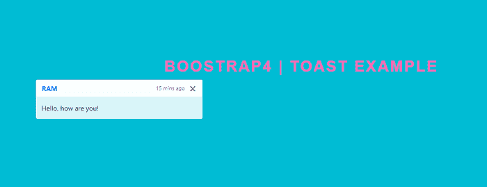
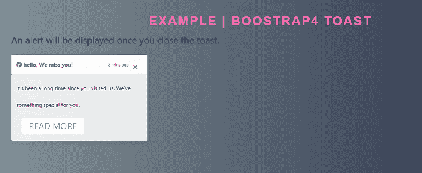

# Bootstrap4 吐司

> 原文：<https://www.javatpoint.com/bootstrap-4-toast>

在本文中，我们将了解 bootstrap 4 toast 示例。

### Bootstrap4 吐司是什么意思？

Bootstrap 4 中的 toast 元素类似于一个警告框。这是一个轻量级通知，旨在模仿移动和桌面操作系统已经普及的推送通知。Bootstrap 4 toast 是在 flexbox 的帮助下创建的，因此它们很容易对齐和定位。

**我们来举一下 Bootstrap4 吐司的各种例子。**

### 例 1:

```

<! DOCTYPE html>
<html lang="en">
<head>
  <title> Bootstrap4 Toast Example </title>
  <meta charset="utf-8">
  <meta name="viewport" content="width=device-width, initial-scale=1">
  <link rel="stylesheet" href="https://maxcdn.bootstrapcdn.com/bootstrap/4.5.2/css/bootstrap.min.css">
  <script src="https://ajax.googleapis.com/ajax/libs/jquery/3.5.1/jquery.min.js"> </script>
  <script src="https://cdnjs.cloudflare.com/ajax/libs/popper.js/1.16.0/umd/popper.min.js"> </script>
  <script src="https://maxcdn.bootstrapcdn.com/bootstrap/4.5.2/js/bootstrap.min.js"> </script>
</head>
<style>
body {
  background: #00BCD4;
  padding-top: 100px;
  .container {
    background: #fff;
    padding: 50px 100px;
    max-width: 700px;
    text-align: center;
    @media(max-width: 699px) {
      width: 90%;
      padding: 30px 10px;
    }
    p {
      font-size: 18px;
    }
    .button {
      text-align: center;
    }
  }
}
h3 {
  font-family: sans-serif;
  display: block;
  font-size: 2rem;
  font-weight: bold;
  text-align: center;
  letter-spacing: 3px;
  color: hotpink;
  text-transform: uppercase;
  margin-top: 20px;
}
button:hover {  
  color: #1A33FF;  
}
</style>
<body>
<div class="container">
  <h3> Boostrap4 | Toast Example </h3>
  <div class="toast" data-autohide="false">
    <div class="toast-header">
      <strong class="mr-auto text-primary"> RAM </strong>
      <small class="text-muted"> 15 mins ago </small>
      <button type="button" class="ml-2 mb-1 close" data-dismiss="toast">  </button>
    </div>
    <div class="toast-body">
      Hello, how are you!
    </div>
  </div>
</div>
<script>
$(document).ready(function() {
  $('.toast').toast('show');
});
</script>
</body>
</html>

```

**说明:**

在上面的示例中，我们创建了一个 Bootstrap 4 toast 示例。在本例中，我们使用了 data-autohide="false "来默认显示吐司。

**输出:**

以下是该示例的输出:



### 例 2:

```

<! DOCTYPE html>
<html lang="en">
<head>
<meta charset="utf-8">
<meta name="viewport" content="width=device-width, initial-scale=1">
<title> Placement of Bootstrap 4 Toasts </title>
<link rel="stylesheet" href="https://cdn.jsdelivr.net/npm/bootstrap@4.6.0/dist/css/bootstrap.min.css">
<link rel="stylesheet" href="https://maxcdn.bootstrapcdn.com/font-awesome/4.7.0/css/font-awesome.min.css">
<script src="https://code.jquery.com/jquery-3.5.1.min.js"> </script>
<script src="https://cdn.jsdelivr.net/npm/bootstrap@4.6.0/dist/js/bootstrap.bundle.min.js"> </script>
<style>
	.bs-example {
   	margin: 20px;
	}
body {
  background: #00BCD4;
  padding-top: 100px;
  .container {
    background: #fff;
    padding: 50px 100px;
    max-width: 700px;
    text-align: center;
    @media(max-width: 699px) {
      width: 90%;
      padding: 30px 10px;
    }
    p {
      font-size: 18px;
    }
    .button {
      text-align: center;
    }
  }
}
h3 {
  font-family: sans-serif;
  display: block;
  font-size: 2rem;
  font-weight: bold;
  text-align: center;
  letter-spacing: 3px;
  color: hotpink;
  text-transform: uppercase;
  margin-top: 20px;
}
button:hover {  
  color: #1A33FF;  
}
</style>
</head>
<body>
<h3> Example of Bootstrap 4 Toasts with Placement </h3>
    <div class="bs-example">
        <div style="position: relative; min-height: 300px;">
                       <div style="position: absolute; top: 0; right: 0; min-width: 300px;">
                <div class="toast fade show">
                    <div class="toast-header">
                        <strong class="mr-auto"> <i class="fa fa-globe"> </i> RAM! </strong>
                        <small class="text-muted"> just now </small>
                        <button type="button" class="ml-2 mb-1 close" data-dismiss="toast">  </button>
                    </div>
                    <div class="toast-body">
                        Hello, how are you!
                    </div>
                </div>
                <div class="toast fade show">
                    <div class="toast-header">
                        <strong class="mr-auto"> <i class="fa fa-globe"> </i> RANJU </strong>
                        <small class="text-muted"> 25 minutes ago </small>
                        <button type="button" class="ml-2 mb-1 close" data-dismiss="toast">  </button>
                    </div>
                    <div class="toast-body">
                        Fine
                    </div>
                </div>
            </div>    
        </div>
    </div>
</body>
</html> 

```

**说明:**

在上面的示例中，我们创建了一个 Bootstrap 4 toast 示例。在这种情况下，我们将 bootstrap 4 吐司放在左、右位置。

**输出:**

以下是该示例的输出:


### 例 3:

```

<! DOCTYPE html>
<html lang="en">
<head>
<meta charset="utf-8">
<meta name="viewport" content="width=device-width, initial-scale=1">
<title> Bootstrap 4 Toast Example </title>
<link rel="stylesheet" href="https://cdn.jsdelivr.net/npm/bootstrap@4.6.0/dist/css/bootstrap.min.css">
<link rel="stylesheet" href="https://maxcdn.bootstrapcdn.com/font-awesome/4.7.0/css/font-awesome.min.css">
<script src="https://code.jquery.com/jquery-3.5.1.min.js"> </script>
<script src="https://cdn.jsdelivr.net/npm/bootstrap@4.6.0/dist/js/bootstrap.bundle.min.js"> </script>
<style>
    .bs-example {
    	margin: 20px;
        position: relative;
    }
body {
  background: #00BCD4;
  padding-top: 100px;
  .container {
    background: #fff;
    padding: 50px 100px;
    max-width: 700px;
    text-align: center;
    @media(max-width: 699px) {
      width: 90%;
      padding: 30px 10px;
    }
    p {
      font-size: 18px;
    }
    .button {
      text-align: center;
    }
  }
}
h3 {
  font-family: sans-serif;
  display: block;
  font-size: 2rem;
  font-weight: bold;
  text-align: center;
  letter-spacing: 3px;
  color: hotpink;
  text-transform: uppercase;
  margin-top: 20px;
}
button:hover {  
  color: #1A33FF;  
}
a:hover {
  background-color: crimson;
  color: white;
  text-decoration: none;
}
a {
  background: #fff;
    border: 1px solid @color-default;
    border-radius: 3px;
    color: @color-default;
    display: inline-block;
    font-size: 1.4rem;
    line-height: 1;
    margin: 0.8rem 0 0.4rem 0.8rem;
    padding: 0.6rem 1.2rem;
    text-decoration: none;
    text-transform: uppercase;
	}
button {
  background: #fff;
  border: 0;
  border-radius: 4px;
  display: block;
  cursor: pointer;
  margin: 10px;
  padding: 5px 10px;
}
a {
    display: inline-block;
    font-size: 1.4rem;
    line-height: 1;
    margin: 0.8rem 0 0.4rem 0.8rem;
    padding: 0.6rem 1.2rem;
    text-decoration: none;
	}
</style>
<script>
    $(document).ready(function() {
        $(".show-toast").click(function() {
            $("#myToast").toast('show');
        });
    });
</script>
</head>
<body>
<h3> Boostrap4 toast example </h3>
<div class="bs-example" style="position:relative;">
	<button type="button" class="btn btn-primary show-toast"> Show Toast </button>
    <div class="toast" id="myToast" style="position: absolute; top: 0; right: 0;">
        <div class="toast-header">
            <strong class="mr-auto"> <i class="fa fa-grav"> </i> Hello, We miss you! </strong>
            <small> 16 mins ago </small>
            <button type="button" class="ml-2 mb-1 close" data-dismiss="toast">
                <span aria-hidden="true">  </span>
            </button>
        </div>
        <div class="toast-body">
            <div> It's been a long time since you visited us. We've something special for you. <a href="#"> Read More </a> </div>
        </div>
    </div>
</div>
</body>
</html>

```

**说明:**

在上面的示例中，我们创建了一个 Bootstrap 4 toast 示例。在这种情况下，默认情况下，如果您没有将自动隐藏设置为 false，祝酒会自动隐藏。

**输出:**

以下是该示例的输出:


### 例 4:

```

<! DOCTYPE html>
<html lang="en">
<head>
<meta charset="utf-8">
<meta name="viewport" content="width=device-width, initial-scale=1">
<title> Bootstrap 4 Toast Events Example </title>
<link rel="stylesheet" href="https://cdn.jsdelivr.net/npm/bootstrap@4.6.0/dist/css/bootstrap.min.css">
<link rel="stylesheet" href="https://maxcdn.bootstrapcdn.com/font-awesome/4.7.0/css/font-awesome.min.css">
<script src="https://code.jquery.com/jquery-3.5.1.min.js"> </script>
<script src="https://cdn.jsdelivr.net/npm/bootstrap@4.6.0/dist/js/bootstrap.bundle.min.js"> </script>
<style>
    .bs-example {
        margin: 20px;
        position: relative;
    }
h3 {
  font-family: sans-serif;
  display: block;
  font-size: 2rem;
  font-weight: bold;
  text-align: center;
  letter-spacing: 3px;
  color: hotpink;
  text-transform: uppercase;
  margin-top: 20px;
}
button:hover {  
  color: #1A33FF;  
}
body {
    background: #283048; 
    background: -webkit-linear-gradient(to left, #283048 , #859398); 
    background: linear-gradient(to left, #283048 , #859398); 
    font-size: 15px;
    font-size: 1.5rem;
    line-height: 180%;
    padding: 1.5rem;
}
@keyframes fadeInExpand {
    0% {
        opacity: 0;
    }
    35% {
        opacity: 1;
        transform: scale(1.25);
    }
    100% {
        opacity: 1;
        transform: scale(1);
    }
}
a:hover {
  background-color: crimson;
  color: white;
  text-decoration:none;
}
button {
  background: #fff;
  border: 0;
  border-radius: 4px;
  display: block;
  cursor: pointer;
  margin: 10px;
  padding: 5px 10px;
}
a {
  background: #fff;
    border: 1px solid @color-default;
    border-radius: 3px;
    color: @color-default;
    display: inline-block;
    font-size: 1.4rem;
    line-height: 1;
    margin: 0.8rem 0 0.4rem 0.8rem;
    padding: 0.6rem 1.2rem;
    text-decoration: none;
    text-transform: uppercase;
	}
</style>
<script>
$(document).ready(function() {
	$(".toast").toast();
    $("#myToast").on('hidden.bs.toast', function() {
        alert("Toast component has been completely closed.");
    });
});
</script>
</head>
<body>
<div class="bs-example">
	<h3> Example | Boostrap4 Toast </h3>
	<p> An alert will be displayed once you close the toast. </p>
    <div class="toast fade show" id="myToast" data-autohide="false">
        <div class="toast-header">
            <strong class="mr-auto"> <i class="fa fa-grav"> </i> hello, We miss you! </strong>
            <small> 2 mins ago </small>
            <button type="button" class="ml-2 mb-1 close" data-dismiss="toast">
                <span aria-hidden="true">  </span>
            </button>
        </div>
        <div class="toast-body">
            <div> It's been a long time since you visited us. We've something special for you. <a href="#"> Read More </a> </div>
        </div>
    </div>
</div>
</body>
</html>

```

**说明:**

在上面的示例中，我们创建了一个 Bootstrap 4 toast 示例。点击关闭按钮后，它会显示一个警告框。

**输出:**

以下是该示例的输出:



* * *