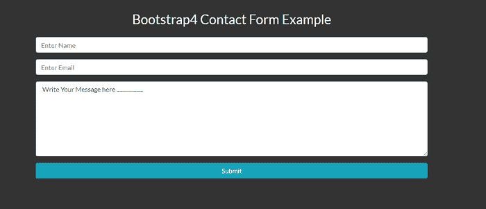
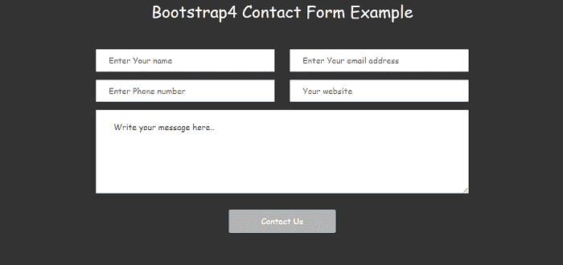
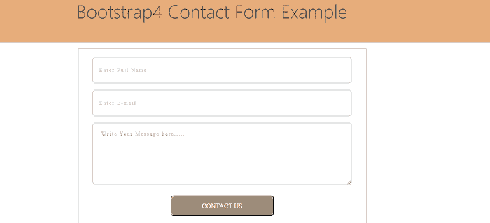

# Bootstrap4 联系人表单

> 原文：<https://www.javatpoint.com/bootstrap-4-contact-form>

在本文中，我们将借助各种示例创建一个 Bootstrap 4 Contact 表单。在进入高级之前，我们首先了解 PHP 和 Contact 表单的基础知识。

### Bootstrap 4 联系表是什么意思？

在 Bootstrap 4 中，联系表是每个网站中非常重要的交互工具，也是联系网站访问者的工具。它响应迅速，适用于所有设备，如移动设备、平板电脑和其他设备。此表单包括许多选项，如电子邮件、电话号码等。

**我们举 Bootstrap 4 接触形式的各种例子。**

### 例 1:

```

<html lang = "en">
   <head>
      <meta charset = "utf-8">
	  <title> Bootstrap4 Contact Form Example </title>
      <meta name = "viewport" content = "width = device-width, initial-scale = 1, shrink-to-fit = no">	 
  <link rel = "stylesheet" href="https://stackpath.bootstrapcdn.com/font-awesome/4.7.0/css/font-awesome.min.css"> 
<link rel="stylesheet" href="https://stackpath.bootstrapcdn.com/bootstrap/4.3.1/css/bootstrap.min.css" integrity="sha384-ggOyR0iXCbMQv3Xipma34MD+dH/1fQ784/j6cY/iJTQUOhcWr7x9JvoRxT2MZw1T" crossorigin="anonymous">
<style>
@import url(https://fonts.googleapis.com/css?family=Lato:400,700,900,300);
@import url(http://weloveiconfonts.com/api/?family=fontawesome);

body { 
	height: 100%; width: 100%; 
	background-color: #333; 
	color: whitesmoke; 
	font-size: 16px; 
	font-family: 'Lato';
} 
</style>
<body>
  <section class="resume-section p-4 p-lg-5 text-center" id="contact">
        <div class="my-auto">
          <h2 class="mb-4"> Bootstrap4 Contact Form Example </h2>
          <form
            class="contact-form d-flex flex-column align-items-center"
            action="#"
            method="POST">
            <div class="form-group w-75">
              <input type="name" class="form-control"
                placeholder="Enter Name"
                name="name"
                required  />
            </div>
            <div class="form-group w-75">
              <input
                type="email"
                class="form-control"
                placeholder="Enter Email"
                name="name"
                required
              />
            </div>

            <div class="form-group w-75">
              <textarea  class="form-control"
                type="text" placeholder="Message" rows="7" name="name" required > Write Your Message here ...................</textarea>
            </div>
            <button type="submit" class="btn btn-submit btn-info w-75"> Submit </button>
          </form>
        </div>
      </section>
  <script
      defer
      src="https://use.fontawesome.com/releases/v5.7.2/js/all.js"
      integrity="sha384-0pzryjIRos8mFBWMzSSZApWtPl/5++eIfzYmTgBBmXYdhvxPc+XcFEk+zJwDgWbP"
      crossorigin="anonymous"> </script>
</body>
</html>

```

**说明:**

在上面的例子中，我们在 bootstrap 4 的帮助下创建了一个简单的联系人表单。

**输出:**

以下是该示例的输出:



### 例 2:

```

<html lang = "en">
   <head>
      <meta charset = "utf-8">
	  <title> Bootstrap4 Contact Form Example </title>
      <meta name = "viewport" content = "width = device-width, initial-scale = 1, shrink-to-fit = no">	 
  <link rel = "stylesheet" href="https://stackpath.bootstrapcdn.com/font-awesome/4.7.0/css/font-awesome.min.css"> 
<link rel="stylesheet" href="https://stackpath.bootstrapcdn.com/bootstrap/4.3.1/css/bootstrap.min.css" integrity="sha384-ggOyR0iXCbMQv3Xipma34MD+dH/1fQ784/j6cY/iJTQUOhcWr7x9JvoRxT2MZw1T" crossorigin="anonymous">
<style>
@import url(https://fonts.googleapis.com/css?family=Lato:400,700,900,300);
@import url(http://weloveiconfonts.com/api/?family=fontawesome);
body { 
	height: 100%; width: 100%; 
	background-color: #333; 
	color: whitesmoke; 
	font-size: 16px; 
	font-family: 'Poiret One', cursive;
} 
.form-control {
  border-radius: 0px;
  padding: 1.3rem 1.5rem;
    color: #495057;
    background-color: #ffffff;
    border-color: #f8f9fa;
}
.form-control:focus {
    color: #495057;
    background-color: #ffffff;
    border:1px solid #b5b6b3;
    outline: 0;
    box-shadow: none;
}
.btn  {
  background: #b5b6b3;
  border: #b5b6b3;
  padding: 0.7rem 4rem;
}
.btn:hover {
  background: #b5b6b3;
  border: #b5b6b3;
  outline: 0;
}
btn:focus {
  background: #b5b6b3;
  border: #b5b6b3;
  outline: 0;
}
.btn:active {
  background: #b5b6b3;
  border: #b5b6b3;
  outline: 0;
}
.btn-primary:not(:disabled):not(.disabled).active {
  background: #b5b6b3;
  border: #b5b6b3;
  outline: 0;
}
.btn-primary:not(:disabled):not(.disabled):active {
  background: #b5b6b3;
  border: #b5b6b3;
  outline: 0;
}
.show > .btn-primary.dropdown-toggle {
  background: #b5b6b3;
  border: #b5b6b3;
  outline: 0;
}
</style>
<body>
<section class="contact-from pt-4">
<div class="container">
                <div class="row">
                    <div class="col-md-6 mx-auto text-center">
                        <h2> Bootstrap4 Contact Form Example </h2>
                        <div class="divider bg-primary mx-auto"> </div>

                    </div>
                </div>
                <div class="row mt-5">
                    <div class="col-md-8 mx-auto">
                        <form _lpchecked="1">
                            <div class="row">
                                <div class="col-md-6">
                                    <div class="form-group">
                                        <input type="text" class="form-control" placeholder="Enter Your name">
                                    </div>
                                </div>
                                <div class="col-md-6">
                                    <div class="form-group">
                                        <input type="email" class="form-control" placeholder="Enter Your email address">
                                    </div>
                                </div>
                                <div class="col-md-6">
                                    <div class="form-group">
                                        <input type="tel" class="form-control" placeholder="Enter Phone number">
                                    </div>
                                </div>
                                <div class="col-md-6">
                                    <div class="form-group">
                                        <input type="url" class="form-control" placeholder="Your website">
                                    </div>
                                </div>
                                <div class="col-12">
                                    <div class="form-group">
                                <textarea rows="5" class="form-control" placeholder="What are you looking for?">  Write your message here.. </textarea>
                                    </div>
                                </div>
                            </div>
                            <div class="text-center mt-3">
                                <button class="btn btn-primary"> Contact Us </button>
                            </div>
                        </form>
                    </div>
                </div>
            </div>
  </div>
</body>
</html>

```

**说明:**

在上面的例子中，我们在 bootstrap 4 的帮助下创建了一个简单的联系人表单。

**输出:**

以下是该示例的输出:



### 例 3:

```

<html lang = "en">
   <head>
      <meta charset = "utf-8">
	  <title> Bootstrap4 Contact Form Example </title>
      <meta name = "viewport" content = "width = device-width, initial-scale = 1, shrink-to-fit = no">	 
  <link rel = "stylesheet" href="https://stackpath.bootstrapcdn.com/font-awesome/4.7.0/css/font-awesome.min.css"> 
<link rel="stylesheet" href="https://stackpath.bootstrapcdn.com/bootstrap/4.3.1/css/bootstrap.min.css" integrity="sha384-ggOyR0iXCbMQv3Xipma34MD+dH/1fQ784/j6cY/iJTQUOhcWr7x9JvoRxT2MZw1T" crossorigin="anonymous">
<style>
input {
  outline: none;
  border: none;
}
textarea {
outline: none;
border: none; 
font-family: Helvetica Neue, "Montserrat", sans-serif;
}
textarea:focus {
  border-color: transparent !important;
}
input:focus {
  border-color: transparent !important;
}
input::-webkit-input-placeholder { color: #bdbdd3; }
input:-moz-placeholder { color: #bdbdd3; }
input::-moz-placeholder { color: #bdbdd3; }
input:-ms-input-placeholder { color: #bdbdd3; }
textarea::-webkit-input-placeholder { color: #bdbdd3; }
textarea:-moz-placeholder { color: #bdbdd3; }
textarea::-moz-placeholder { color: #bdbdd3; }
textarea:-ms-input-placeholder { color: #bdbdd3; }
.container-contact {
  width: 100%;  
  min-height: 70vh;
  display: -webkit-box;
  display: -webkit-flex;
  display: -moz-box;
  display: -ms-flexbox;
  display: flex;
  flex-wrap: wrap;
  justify-content: center;
  align-items: center;
  padding: 15px;
  position: relative;
  background-color: transparent;
}
.wrap-contact {
  width: 700px;
  background: transparent;
  border: 1px solid #b3b3b3;
  padding: 20px 0px 20px 0px;
}
.wrap-contact-image {
  width: 600px;
  background: transparent;
  padding: 40px 0px 20px 0px;
}
.contact-form {
  width: 100%;
}
.error {
  padding: 5px 9px;
  border: 1px solid red;
  color: red;
  border-radius: 3px;
}
.success {
  padding: 5px 9px;
  border: 1px solid green;
  color: green;
  border-radius: 3px;
}
.wrap-input {
  width: 90%;
  background-color: #fff;
  border: 1px solid #b3b3b3;
  border-radius: 7px;
  margin-left: auto;
  margin-right: auto;
  margin-bottom: 16px;
  position: relative;
  z-index: 1;
}
.input {
  position: relative;
  display: block;
  width: 100%;
  background: #fff;
  border-radius: 31px;
  color: #8f8fa1;
  line-height: 1.2;
  font-family: "Montserrat";
  font-size: 12px;
  font-weight: 400;
  letter-spacing: 0.2em;
  height: 42px;
  padding-left: 10px;
  padding-right: 10px;
  text-transform: none;
}
input.input {
  height: 62px;
  padding: 0 15px 0 15px;
}
textarea.input {
  min-height: 149px;
  padding: 19px 15px 0 15px;
}
.focus-input {
  display: block;
  position: absolute;
  z-index: -1;
  width: 100%;
  height: 100%;
  top: 0;
  left: 50%;
  -webkit-transform: translateX(-50%);
  -moz-transform: translateX(-50%);
  -ms-transform: translateX(-50%);
  -o-transform: translateX(-50%);
  transform: translateX(-50%);
  border-radius: 31px;
  background-color: #fff;
  pointer-events: none;
  -webkit-transition: all 0.4s;
  -o-transition: all 0.4s;
  -moz-transition: all 0.4s;
  transition: all 0.4s;
}
.input:focus + .focus-input100 {
  width: calc(100% + 20px);
}
.container-contact-form-btn {
  display: -webkit-box;
  display: -webkit-flex;
  display: -moz-box;
  display: -ms-flexbox;
  display: flex;
  flex-wrap: wrap;
  justify-content: center;
  padding-top: 10px;
}
.contact-form-btn {
  display: -webkit-box;
  display: -webkit-flex;
  display: -moz-box;
  display: -ms-flexbox;
  display: flex;
  justify-content: center;
  align-items: center;
  padding: 0 20px;
  min-width: 250px;
  height: 50px;
  background-color: transparent;
  border-radius:7px;
  cursor: pointer;
  font-family: "Montserrat";
  font-size: 16px;
  color: #fff;
  line-height: 1.2;
  text-transform: uppercase;
  -webkit-transition: all 0.4s;
  -o-transition: all 0.4s;
  -moz-transition: all 0.4s;
  transition: all 0.4s;
  position: relative;
  z-index: 1;
}
.contact-form-btn::before {
  content: "";
  display: block;
  position: absolute;
  z-index: -1;
  width: 100%;
  height: 100%;
  top: 0;
  left: 50%;
  -webkit-transform: translateX(-50%);
  -moz-transform: translateX(-50%);
  -ms-transform: translateX(-50%);
  -o-transform: translateX(-50%);
  transform: translateX(-50%);
  border-radius: 7px;
  background-color: #9e8c7b;
  pointer-events: none;
  -webkit-transition: all 0.4s;
  -o-transition: all 0.4s;
  -moz-transition: all 0.4s;
  transition: all 0.4s;
}
.contact-form-btn:hover:before {
  background-color: #e6ad7b;
}
.validate-input {
  position: relative;
}
.left-align {
    text-align: left;
}
.right-align {
    text-align: right;
}
.listing-hero {
    background: #e6ad7b;
    padding: 101px 0 30px;
}
.hero-heading {
    margin: 0 auto;
    width: 100%;
    max-width: 709px;
}
section#post-28 {
    padding-top: 155px;
}
.hero-large {
    display: inline-block;
    font-weight: 200;
    font-size: 46px;
    line-height: 56px;
    position: relative;
    top: -19px;
    color: #454545;
}
.hero-text {
    display: inline-block;
    width: 59%;
    vertical-align: top;
    border-left: 1px solid #8E8E8E;
    padding: 0 33px;
    font-size: 15px;
    line-height: 23px;
    color: #454545;
    vertical-align: top;
}
.hero-text .btn.no-border {
    margin-top: 15px;
    margin-bottom: 6.5px;
    background-image: url(../images/Path3.png);
    background-repeat: no-repeat;
    background-size: 25px;
    display: block;
    background-position: right center;
    max-width: 99px;
}
</style>
<body>
<section>
  <div class="listing-hero">
    <div class="hero-heading">
        <div class="hero-large"> Bootstrap4 Contact Form Example </div>       
      </div>
  </div>
<div class="container-contact">
    <div class="wrap-contact">
      <form name="contact" class="contact-form validate-form" method="post" action= "#">
        <div class="wrap-input validate-input" data-validate="Please enter your name">
          <input class="input" type="text" name="name" placeholder="Enter Full Name">
        </div>
        <div class="wrap-input validate-input" data-validate = "Please enter your email">
          <input class="input" type="text" name="email" placeholder="Enter E-mail">
        </div>
        <div class="wrap-input validate-input" data-validate = "Please enter your message">
          <textarea class="input" type="text" name="message" placeholder="Your Message"> Write Your Message here..... </textarea>
        </div>
        <div class="container-contact-form-btn">
          <button type="submit" class="contact-form-btn">
            <span> Contact Us </span>
          </button>
        </div>
      </form>
    </div>
  </div>
</div>
</div>
</section>
</body>
</html> 

```

**说明:**

在上面的例子中，我们在 bootstrap 4 的帮助下创建了一个简单的联系人表单。

**输出:**

以下是该示例的输出:



* * *