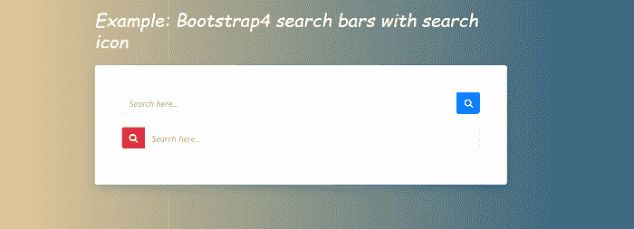
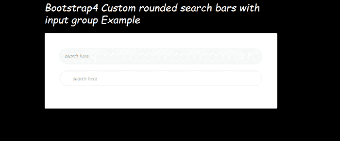
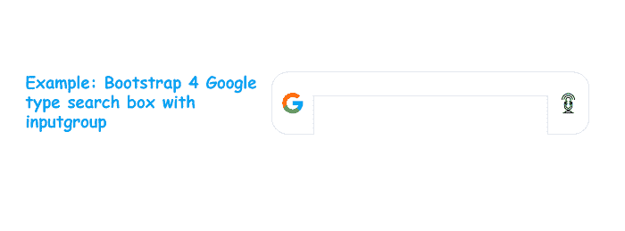

# Bootstrap 4 搜索框

> 原文：<https://www.javatpoint.com/bootstrap-4-search-box>

在本文中，我们将通过各种示例详细了解 Bootstrap 4 搜索框。

### 搜索框是什么意思？

在 bootstrap 4 中，搜索框通常是文本内容或搜索图标，具有接受要在搜索框中搜索的用户输入的专用功能。除了移动应用程序和桌面应用程序之外，它还用于许多网络应用程序、网站。

**我们来看搜索框的各种例子。**

### 例 1:

```

<html lang = "en">
   <head>
      <meta charset = "utf-8">
      <meta name = "viewport" content = "width = device-width, initial-scale = 1, shrink-to-fit = no">
	  <link rel="stylesheet" href="https://stackpath.bootstrapcdn.com/bootstrap/4.4.1/css/bootstrap.min.css" integrity="sha384-Vkoo8x4CGsO3+Hhxv8T/Q5PaXtkKtu6ug5TOeNV6gBiFeWPGFN9MuhOf23Q9Ifjh" crossorigin="anonymous">   	 
  <link rel = "stylesheet" href = "https://cdnjs.cloudflare.com/ajax/libs/font-awesome/4.7.0/css/font-awesome.min.css"> 
<style>
.main {
    width: 50%;
    margin: 50px auto;
}
.has-search .form-control {
    padding-left: 2.375rem;
}
.has-search .form-control-feedback {
    position: absolute;
    z-index: 2;
    display: block;
    width: 2.375rem;
    height: 2.375rem;
    line-height: 2.375rem;
    text-align: center;
    pointer-events: none;
    color: #aaa;
}
.form-control-underlined {
  border-width: 0;
  border-bottom-width: 1px;
  border-radius: 0;
  padding-left: 0;
}
body {
  background: #ffd89b;
  background: -webkit-linear-gradient(to right, #ffd89b, #19547b);
  background: linear-gradient(to right, #ffd89b, #19547b);
}
.form-control:focus {
  box-shadow: none;
}
h2 {
font-family: 'Indie Flower', cursive;
font-size: 32px;
  color: white;
  font-weight: bold;
  margin-top: 20px;
}
.form-control::placeholder {
  font-size: 0.95rem;
  color: #aaa;
  font-style: italic;
}
</style>
<body>
<div class="container">
  <div class="row mb-5">
    <div class="col-lg-8 mx-auto">
      <h2 class="font-weight-light mb-4 font-italic"> Example: Bootstrap4 search bars with search icon </h2>
      <div class="bg-white p-5 rounded shadow">
        <form action="">
          <div class="input-group mb-4">
            <input type="search" placeholder="Search here..." aria-describedby="button-addon5" class="form-control">
            <div class="input-group-append">
              <button id="button-addon5" type="submit" class="btn btn-primary"> <i class="fa fa-search"> </i> </button>
            </div>
          </div>
          <div class="input-group">
            <div class="input-group-prepend">
              <button id="button-addon8" type="submit" class="btn btn-danger"> <i class="fa fa-search"> </i> </button>
            </div>
            <input type="search" placeholder="Search here..." aria-describedby="button-addon8" class="form-control">
          </div>
        </form>
      </div>
    </div>
  </div>   
</div>
</body>
</html>

```

**说明:**

在上面的例子中，我们创建了一个带有搜索图标的 bootstrap 4 搜索栏。

**输出:**

以下是该示例的输出:



### 例 2:

```

<html lang = "en">
   <head>
      <meta charset = "utf-8">
      <meta name = "viewport" content = "width = device-width, initial-scale = 1, shrink-to-fit = no">
	  <link rel="stylesheet" href="https://stackpath.bootstrapcdn.com/bootstrap/4.4.1/css/bootstrap.min.css" integrity="sha384-Vkoo8x4CGsO3+Hhxv8T/Q5PaXtkKtu6ug5TOeNV6gBiFeWPGFN9MuhOf23Q9Ifjh" crossorigin="anonymous">   	 
 <link rel="stylesheet" href="https://use.fontawesome.com/releases/v5.1.0/css/all.css" integrity="sha384-lKuwvrZot6UHsBSfcMvOkWwlCMgc0TaWr+30HWe3a4ltaBwTZhyTEggF5tJv8tbt" crossorigin="anonymous">
<div class="container">
<style>
body {
background:#ddd;
}
.form-control-borderless {
    border: none;
}
.form-control-borderless:focus {
    border: none;
    outline: none;
    box-shadow: none;
}
.form-control-borderless:hover {
    border: none;
    outline: none;
    box-shadow: none;
}
.form-control-borderless:active {
    border: none;
    outline: none;
    box-shadow: none;
}
h5 {
	font-family: 'Indie Flower', cursive;
	font-size: 32px;
  color: gray;
  font-weight: bold;
  text-align: center;
}
</style>
<body>
<div class="container">
    <br/>
	 <h5 class="font-weight-light mb-4 font-italic"> Example Bootstrap4 search bar </h5>
	<div class="row justify-content-center">
                        <div class="col-12 col-md-10 col-lg-8">
                            <form class="card card-sm">
                                <div class="card-body row no-gutters align-items-center">
                                    <div class="col-auto">
                                        <i class="fas fa-search h4 text-body"> </i>
                                    </div>
                                         <div class="col">
                                        <input class="form-control form-control-lg form-control-borderless" type="search" placeholder="Search topics or keywords here...?>
                                    </div>
                                               <div class="col-auto">
                                        <button class="btn btn-lg btn-success" type="submit"> Search </button>
                                    </div>

                                </div>
                            </form>
                        </div>
                          </div>
</div>
</body>
</html>

```

**说明:**

在上面的例子中，我们已经创建了一个 bootstrap 4 搜索栏。

**输出:**

以下是该示例的输出:


### 例 3:

```

<html lang = "en">
   <head>
      <meta charset = "utf-8">
      <meta name = "viewport" content = "width = device-width, initial-scale = 1, shrink-to-fit = no">
	  <link rel="stylesheet" href="https://stackpath.bootstrapcdn.com/bootstrap/4.4.1/css/bootstrap.min.css" integrity="sha384-Vkoo8x4CGsO3+Hhxv8T/Q5PaXtkKtu6ug5TOeNV6gBiFeWPGFN9MuhOf23Q9Ifjh" crossorigin="anonymous">   	 
  <link rel = "stylesheet? href="https://cdnjs.cloudflare.com/ajax/libs/font-awesome/4.7.0/css/font-awesome.min.css"> 
<style>
.form-control:focus {
  box-shadow: none;
}
.form-control-underlined {
  border-width: 0;
  border-bottom-width: 1px;
  border-radius: 0;
  padding-left: 0;
}
body {
  background: black;
  min-height: 100vh;
  margin: 10px;
}
.form-control::placeholder {
  font-size: 0.95rem;
  color: #aaa;
  font-style: italic;
}
h5 {
font-family: 'Indie Flower', cursive;
font-size: 32px;
  color: #03A9F4;
  font-weight: bold;
}
</style>
<body>
<div class="container">
  <div class="row mb-5">
    <div class="col-lg-8 mx-auto">
      <h5 class="font-weight-light mb-4 font-italic text-white"> Bootstrap4 Custom rounded search bars with input group Example </h5>
      <div class="bg-white p-5 rounded shadow">
        <form action="">
          <div class="p-1 bg-light rounded rounded-pill shadow-sm mb-4">
            <div class="input-group">
              <input type="search" placeholder="search here" class="form-control border-0 bg-light">
              <div class="input-group-append">
                <button id="button-addon1" type="submit" class="btn btn-link text-primary"> <i class="fa fa-search"> </i> </button>
              </div>
            </div>
          </div>
          <div class="input-group mb-4 border rounded-pill p-1">
            <div class="input-group-prepend border-0">
              <button id="button-addon4" type="button" class="btn btn-link text-info"> <i class="fa fa-search"> </i> </button>
            </div>
            <input type="search" placeholder="search here?? class="form-control bg-none border-0">
          </div>
        </form>
      </div>
    </div>
  </div>   
</div>
</body>
</html>

```

**说明:**

在上面的例子中，我们创建了一个带有输入组的 bootstrap 4 自定义圆形搜索栏。

**输出:**

以下是该示例的输出:



### 例 4:

```

<html lang = "en">
   <head>
      <meta charset = "utf-8">
      <meta name = "viewport" content = "width = device-width, initial-scale = 1, shrink-to-fit = no">
	  <link rel="stylesheet" href="https://stackpath.bootstrapcdn.com/bootstrap/4.4.1/css/bootstrap.min.css" integrity="sha384-Vkoo8x4CGsO3+Hhxv8T/Q5PaXtkKtu6ug5TOeNV6gBiFeWPGFN9MuhOf23Q9Ifjh" crossorigin="anonymous">   	 
  <link rel = "stylesheet? href="https://cdnjs.cloudflare.com/ajax/libs/font-awesome/4.7.0/css/font-awesome.min.css"> 
<style>
.body {
    background-color: #FAFAFA
}
.container {
    margin-top: 200px
}
.m {
    border-top-right-radius: 32px !important;
    border-bottom-right-radius: 32px !important;
    background-color: #fff
}
.g {
    border-top-left-radius: 32px !important;
    border-bottom-left-radius: 32px !important;
    background-color: #fff
}
.input-group-prepend {
    margin-right: -2px !important
}
.input-group-append {
    margin-left: -2px !important
}
h2 {
	font-family: 'Indie Flower', cursive;
	font-size: 32px;
  color: #03A9F4;
  font-weight: bold;
}
.form-control:focus {
    color: #495057;
    background-color: #fff;
    border-color: #ced4da;
    outline: 0;
    box-shadow: 0 0 0 0 !important
}
.form-control {
    border-right: 0 !important;
    border-left: 0 !important
}
</style>
<body>
<div class="container d-flex justify-content-center">
<h2> Example: Bootstrap 4 Google type search box with inputgroup </h2>
    <div class="input-group col-sm-7 input-group-lg">
        <div class="input-group-prepend"> <span class="input-group-text g">  </span> </div> <input type="text" class="form-control">
        <div class="input-group-append"> <span class="input-group-text m">  </span> </div>
    </div>
</div>
</body>
</html>

```

**说明:**

在上面的例子中，我们创建了一个带有输入组的 bootstrap 4 谷歌类型搜索框。

**输出:**

以下是该示例的输出:



### 例 5:

```

<html lang = "en">
   <head>
      <meta charset = "utf-8">
      <meta name = "viewport" content = "width = device-width, initial-scale = 1, shrink-to-fit = no">
	  <link rel="stylesheet" href="https://stackpath.bootstrapcdn.com/bootstrap/4.4.1/css/bootstrap.min.css" integrity="sha384-Vkoo8x4CGsO3+Hhxv8T/Q5PaXtkKtu6ug5TOeNV6gBiFeWPGFN9MuhOf23Q9Ifjh" crossorigin="anonymous">   	 
  <link rel = "stylesheet? href="https://cdnjs.cloudflare.com/ajax/libs/font-awesome/4.7.0/css/font-awesome.min.css"> 
<style>
.form-control:focus {
  box-shadow: none;
}
.form-control-underlined {
  border-width: 0;
  border-bottom-width: 1px;
  border-radius: 0;
  padding-left: 0;
}
body {
  background: #ffd89b;
  background: -webkit-linear-gradient(to right, #ffd89b, #19547b);
  background: linear-gradient(to right, #ffd89b, #19547b);
  min-height: 100vh;
  margin:20px;
}
h5 {
font-family: 'Indie Flower', cursive;
font-size: 32px;
  color: #03A9F4;
  font-weight: bold;
}
.form-control::placeholder {
  font-size: 0.95rem;
  color: #aaa;
  font-style: italic;
}
button {
  margin: 20px;
}
.custom-btn {
  width: 130px;
  height: 40px;
  color: #fff;
  border-radius: 5px;
  padding: 10px 25px;
  font-family: 'Lato', sans-serif;
  font-weight: 500;
  background: transparent;
  cursor: pointer;
  transition: all 0.3s ease;
  position: relative;
  display: inline-block;
   box-shadow:inset 2px 2px 2px 0px rgba(255,255,255,.5),
   7px 7px 20px 0px rgba(0,0,0,.1),
   4px 4px 5px 0px rgba(0,0,0,.1);
  outline: none;
}
.btn-1 {
  background: rgb(6,14,131);
  background: linear-gradient(0deg, rgba(6,14,131,1) 0%, rgba(12,25,180,1) 100%);
  border: none;
}
.btn-1:hover {
   background: rgb(0,3,255);
background: linear-gradient(0deg, rgba(0,3,255,1) 0%, rgba(2,126,251,1) 100%);
}
</style>
<body>
<div class="container">
  <div class="row mb-5">
    <div class="col-lg-8 mx-auto">
      <h5 class="font-weight-light mb-4 font-italic text-white"> Example: Bootstrap4 Underlined search bars with buttons </h5>
      <div class="bg-white p-5 rounded shadow">
        <form>
          <div class="row mb-4">
            <div class="form-group col-md-9">
              <input id="exampleFormControlInput5" type="email" placeholder="search here.." class="form-control form-control-underlined">
            </div>
            <div class="form-group col-md-3">
              <button type="submit? class="custom-btn btn-1"> Search </button>
            </div>
          </div>
          <div class="row">
            <div class="form-group col-md-3">
              <button type="submit" class="custom-btn btn-1"> Search </button>
            </div>
            <div class="form-group col-md-9">
              <input id="exampleFormControlInput6" type="email" placeholder="search here.." class="form-control form-control-underlined">
            </div>
          </div>
        </form>
      </div>
    </div>
  </div>   
</div>
</body>
</html>

```

**说明:**

在上面的例子中，我们创建了一个带下划线的带有按钮的 bootstrap 4 搜索栏。

**输出:**

以下是该示例的输出:


* * *