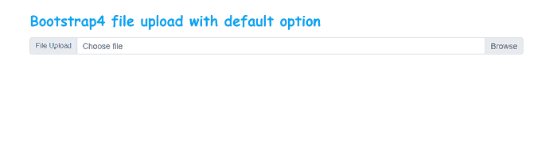
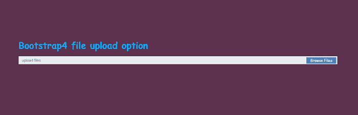
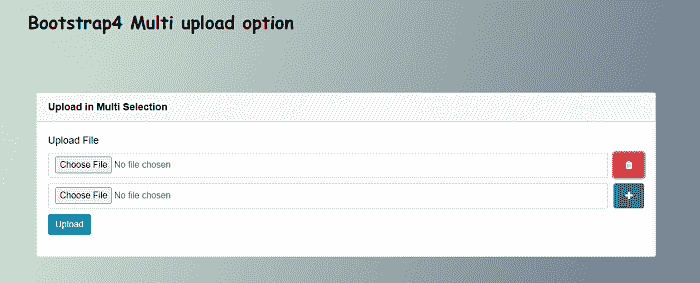
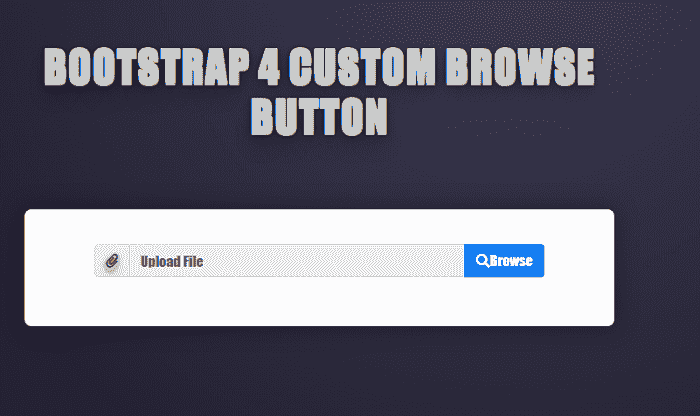

# Bootstrap4 文件上传

> 原文：<https://www.javatpoint.com/bootstrap-4-file-upload>

在本文中，我们将借助各种示例了解 Bootstrap 4 文件上传选项。

### Bootstrap 4 文件上传是什么意思？

在 Bootstrap 4 中，文件输入是一个字段，用户可以在其中上传一个或多个文件，如照片、文档、csv、媒体文件等。从本地存储。

**让我们举一些 Bootstrap 4 文件上传选项的例子。**

### 例 1:

```

<! DOCTYPE html>
<html lang="en">
<head>
  <title> Bootstrap 4 File upload Example </title>
  <meta charset="utf-8">
  <meta name="viewport" content="width=device-width, initial-scale=1">
  <link rel="stylesheet" href="https://maxcdn.bootstrapcdn.com/bootstrap/4.1.3/css/bootstrap.min.css">
  <script src="https://ajax.googleapis.com/ajax/libs/jquery/3.3.1/jquery.min.js"> </script>
  <script src="https://maxcdn.bootstrapcdn.com/bootstrap/4.1.3/js/bootstrap.min.js"> </script>
   <link href="https://maxcdn.bootstrapcdn.com/font-awesome/4.7.0/css/font-awesome.min.css" rel="stylesheet">
</head>
<style>
.input-file {
  position: relative;
  display: block;
  font-weight: 400;
}

.input-file .button {
  position: absolute;
  top: 4px;
  right: 4px;
  float: none;
  height: 22px;
  margin: 0;
  padding: 0 14px;
  font-size: 13px;
  line-height: 22px;
  background-color: #3276B1;
  opacity: .8;
  transition: opacity .2s;
  -o-transition: opacity .2s;
  -ms-transition: opacity .2s;
  -moz-transition: opacity .2s;
  -webkit-transition: opacity .2s;
  outline: 0;
  border: 0;
  text-decoration: none;
  color: #fff;
  cursor: pointer;
}
body {
  margin: 0;
  padding: 0;
  background-color: var(--clr-light);
  color: var(--clr-black);
  font-family: 'Poppins', sans-serif;
  font-size: 1.125rem;
  justify-content: center;
  align-items: center;
}
h1 {
font-family: 'Indie Flower', cursive;
font-size: 32px;
  color: #03A9F4;
  font-weight: bold;
  margin-bottom: 20px;
}
.input-file .button input {
  position: absolute;
  top: 0;
  right: 0;
  padding: 0;
  font-size: 30px;
  cursor: pointer;
  opacity: 0;
}
.input input {
    display: block;
    box-sizing: border-box;
    -moz-box-sizing: border-box;
    width: 100%;
    height: 28px;
    padding: 8px 10px;
    outline: 0;
    border-width: 1px;
    border-style: solid;
    border-radius: 0;
    background: #fff;
    font: 13px/16px 'Open Sans', Helvetica,Arial, sans-serif;
    color: #404040;
    appearance: normal;
    -moz-appearance: none;
    -webkit-appearance: none;
} 
</style>
<body>
<div class="container">
  <br>
  <h1> Bootstrap4 file upload with default option </h1>
<div class="input-group">
  <div class="input-group-prepend">
    <span class="input-group-text" id="inputGroupFileAddon01"> File Upload </span>
  </div>
  <div class="custom-file">
    <input type="file" class="custom-file-input" id="inputGroupFile01"
      aria-describedby="inputGroupFileAddon01">
    <label class="custom-file-label" for="inputGroupFile01"> Choose file </label>
  </div>
</div>
<br>				
</div>
</body>
</html>

```

**说明:**

在上面的例子中，我们在 bootstrap 4 的帮助下创建了一个默认的文件上传选项。

**输出:**

以下是该示例的输出:



### 例 2:

```

<! DOCTYPE html>
<html lang="en">
<head>
  <title> Bootstrap 4 File upload Example </title>
  <meta charset="utf-8">
  <meta name="viewport" content="width=device-width, initial-scale=1">
  <link rel="stylesheet" href="https://maxcdn.bootstrapcdn.com/bootstrap/4.1.3/css/bootstrap.min.css">
  <script src="https://ajax.googleapis.com/ajax/libs/jquery/3.3.1/jquery.min.js"> </script>
  <script src="https://maxcdn.bootstrapcdn.com/bootstrap/4.1.3/js/bootstrap.min.js"> </script>
   <link href="https://maxcdn.bootstrapcdn.com/font-awesome/4.7.0/css/font-awesome.min.css" rel="stylesheet">
</head>
<style>
.input-file {
  position: relative;
  display: block;
  font-weight: 400;
}

.input-file .button {
  position: absolute;
  top: 4px;
  right: 4px;
  float: none;
  height: 22px;
  margin: 0;
  padding: 0 14px;
  font-size: 13px;
  line-height: 22px;
  background-color: #3276B1;
  opacity: .8;
  transition: opacity .2s;
  -o-transition: opacity .2s;
  -ms-transition: opacity .2s;
  -moz-transition: opacity .2s;
  -webkit-transition: opacity .2s;
  outline: 0;
  border: 0;
  text-decoration: none;
  color: #fff;
  cursor: pointer;
}
body {
  padding: 4em;
  font-family: 'Reenie Beanie', cursive;
  background: #5c324e;
  width: 100vw;
  min-height: 100vh;
  display: flex;
  flex-direction: column;
  align-items: center;
  justify-content: center;
  scroll-behavior: smooth;
}
h1 {
font-family: 'Indie Flower', cursive;
font-size: 32px;
  color: #03A9F4;
  font-weight: bold;
  margin-bottom: 20px;
}
.input-file .button input {
  position: absolute;
  top: 0;
  right: 0;
  padding: 0;
  font-size: 30px;
  cursor: pointer;
  opacity: 0;
}
.input input {
    display: block;
    box-sizing: border-box;
    -moz-box-sizing: border-box;
    width: 100%;
    height: 28px;
    padding: 8px 10px;
    outline: 0;
    border-width: 1px;
    border-style: solid;
    border-radius: 0;
    background: #fff;
    font: 13px/16px 'Open Sans', Helvetica,Arial, sans-serif;
    color: #404040;
    appearance: normal;
    -moz-appearance: none;
    -webkit-appearance: none;
} 
</style>
<body>
<div class="container">
  <br>
  <h1> Bootstrap4 file upload option </h1>
<label for="file" class="input input-file">
           <div class="button">
                        <input type="file" class="form-control form-control-sm" name="file" onchange="this.parentNode.nextSibling.value = this.value"> Browse Files </div>
                      <input type="text" class="form-control form-control-sm" placeholder="upload files" readonly="">
                    </label>			
</div>
</body>
</html>

```

**说明:**

在上面的例子中，我们在 bootstrap 4 的帮助下创建了一个文件上传选项。

**输出:**

以下是该示例的输出:



### 例 3:

```

<! DOCTYPE html>
<html lang="en">
<head>
  <title> Bootstrap 4 File upload Example </title>
  <meta charset="utf-8">
  <meta name="viewport" content="width=device-width, initial-scale=1">
  <link rel="stylesheet" href="https://maxcdn.bootstrapcdn.com/bootstrap/4.1.3/css/bootstrap.min.css">
  <script src="https://ajax.googleapis.com/ajax/libs/jquery/3.3.1/jquery.min.js"> </script>
  <script src="https://maxcdn.bootstrapcdn.com/bootstrap/4.1.3/js/bootstrap.min.js"> </script>
   <link href="https://maxcdn.bootstrapcdn.com/font-awesome/4.7.0/css/font-awesome.min.css" rel="stylesheet">
</head>
<style>
.card {
  margin-top: 100px;
}
.btn-upload {
    padding: 10px 20px;
    margin-left: 10px;
}
.btn-success:not(:disabled):not(.disabled).active, .btn-success:not(:disabled):not(.disabled):active, .show>.btn-success.dropdown-toggle {
    color: #fff;
    background-color: #0062cc;
    border-color: #1c7430;
}
h1 {
font-family: 'Indie Flower', cursive;
font-size: 32px;
  color: black;
  font-weight: bold;
}
body {
  margin: 0;
  padding: 0;
  color: var(--clr-black);
  font-family: 'Poppins', sans-serif;
  font-size: 1.125rem;
  min-height: 100vh;
  display: flex;
  justify-content: center;
  align-items: center;
  background-image: linear-gradient(45deg, rgba(194, 233, 221, 0.5) 1%, rgba(104, 119, 132, 0.5) 100%), linear-gradient(-45deg, #494d71 0%, rgba(217, 230, 185, 0.5) 80%);
}
.upload-input-group {
    margin-bottom: 10px;
}
.input-group>.custom-select:not(:last-child) {
  height: 45px;
}
.input-group>.form-control:not(:last-child) {
  height: 45px;
}
</style>
<body>
<div class="container">
    <div class="row">
<h1> Bootstrap4 Multi upload option </h1>
        <div class="col-lg-12">
            <div class="card">
                <div class="card-header">
                    <div class="float-left"> <strong> Upload in Multi Selection </strong> </div>
                </div>
                <div class="card-body card-block">
                    <form action="" method="post" enctype="multipart/form-data" class="form-horizontal">
                        <div class="row form-group">
                            <div class="col-12 col-md-12">
                                <div class="control-group" id="fields">
                                    <label class="control-label" for="field1">
                                        Upload File
                                    </label>
                                    <div class="controls">
                                        <div class="entry input-group upload-input-group">
                                            <input class="form-control" name="fields[]" type="file">
                                            <button class="btn btn-upload btn-success btn-add" type="button">
                                                <i class="fa fa-plus"> </i>
                                            </button>
                                        </div>
                                    </div>
                                    <button class="btn btn-primary"> Upload </button>
                                </div>
                            </div>
                        </div>
                    </form>
                </div>
            </div>
      </div>
  </div>
</div>
<script>
        $(function () {
            $(document).on('click', '.btn-add', function (e) {
                e.preventDefault();
                var controlForm = $('.controls:first'),
                    currentEntry = $(this).parents('.entry:first'),
                    newEntry = $(currentEntry.clone()).appendTo(controlForm);
                newEntry.find('input').val('');
                controlForm.find('.entry:not(:last) .btn-add')
                    .removeClass('btn-add').addClass('btn-remove')
                    .removeClass('btn-success').addClass('btn-danger')
                    .html('<span class="fa fa-trash"> </span>');
            }).on('click', '.btn-remove', function (e) {
                $(this).parents('.entry:first').remove();
                e.preventDefault();
                return false;
            });
        });
</script>
</body>
</html>

```

**说明:**

在上面的例子中，我们在 bootstrap 4 的帮助下创建了一个多文件上传选项。

**输出:**

以下是该示例的输出:



### 例 4:

```

<! DOCTYPE html>
<html lang="en">
<head>
  <title> Bootstrap 4 File upload Example </title>
  <meta charset="utf-8">
  <meta name="viewport" content="width=device-width, initial-scale=1">
  <link rel="stylesheet" href="https://maxcdn.bootstrapcdn.com/bootstrap/4.1.3/css/bootstrap.min.css">
  <script src="https://ajax.googleapis.com/ajax/libs/jquery/3.3.1/jquery.min.js"> </script>
    <script src="https://maxcdn.bootstrapcdn.com/bootstrap/4.1.3/js/bootstrap.min.js"> </script>
<link rel="stylesheet" href="https://use.fontawesome.com/releases/v5.1.0/css/all.css" integrity="sha384-lKuwvrZot6UHsBSfcMvOkWwlCMgc0TaWr+30HWe3a4ltaBwTZhyTEggF5tJv8tbt" crossorigin="anonymous">
</head>
<style>
.file {
  visibility: hidden;
  position: absolute;
}
body {
  text-shadow: 0px 1px 0px rgb(204, 204, 204), 0px 2px 0px rgb(201, 201, 201), 0px 3px 0px rgb(187, 187, 187), 0px 4px 0px rgb(185, 185, 185), 0px 5px 0px rgb(170, 170, 170), 0px 6px 1px rgba(0, 0, 0, 0.1), 0px 0px 5px rgba(0, 0, 0, 0.1), 0px 1px 3px rgba(0, 0, 0, 0.3), 0px 3px 5px rgba(0, 0, 0, 0.2), 0px 5px 10px rgba(0, 0, 0, 0.25), 0px 20px 20px rgba(0, 0, 0, 0.15);
 color: #FFFFFF;
 font-family: 'League Gothic',Impact,sans-serif;
 letter-spacing: 0.02em;
 text-transform: uppercase;
 text-align: center;
 font-size: 2em;
 text-align: center;
 height: 300px; 
 line-height: 285px;
 margin: 120px;
 width: 50%;
 background: #282537;
 background-image: -webkit-radial-gradient(top, circle cover, #3c3b52 0%, #252233 80%);
 background-image: -moz-radial-gradient(top, circle cover, #3c3b52 0%, #252233 80%);
 background-image: -o-radial-gradient(top, circle cover, #3c3b52 0%, #252233 80%);
 background-image: radial-gradient(top, circle cover, #3c3b52 0%, #252233 80%);
}
.container {
  background-color: #fff;
  padding: 40px 80px;
  border-radius: 8px;
  box-shadow: 0px 0px 24.08px 3.92px rgba(0, 0, 0, 0.25);
}
h1 {
  color: #fff;
  font-size: 3rem;
  font-weight: 900;
  margin: 0 0 5rem 0;
  background: -webkit-linear-gradient(#fff, #999);
  -webkit-background-clip: text;
  -webkit-text-fill-color: transparent;
  text-align: center;
}
.btn.btn-primary {
  background-color: #007bff;
  border-color: #007bff;
  outline: none;
  color: #fff;
}
</style>
<body>
<h1> Bootstrap 4 Custom Browse Button </h1>
<div class="container">
  <div class="form-group">
    <input type="file" name="img[]" class="file">
    <div class="input-group mb-3">
      <div class="input-group-prepend">
        <span class="input-group-text" id="basic-addon1"> <i class="fas fa-paperclip"> </i> </span>
      </div>
      <input type="text" class="form-control" disabled placeholder="Upload File" aria-label="Upload File" aria-describedby="basic-addon1">
      <div class="input-group-append">
        <button class="browse input-group-text btn btn-primary" id="basic-addon2"> <i class="fas fa-search"> </i> Browse </button>
      </div>
    </div>
  </div>
</div>
<script>
$(document).on("click", ".browse", function() {
  var file = $(this)
    .parent()
    .parent()
    .parent()
    .find(".file");
  file.trigger("click");
});
$(document).on("change", ".file", function() {
  $(this)
    .parent()
    .find(".form-control")
    .val(
      $(this)
        .val()
        .replace(/C:\\path\\/i, "")
    );
});
</script>
</body>
</html>

```

**说明:**

在上面的例子中，我们在 bootstrap 4 的帮助下创建了一个自定义文件上传选项。

**输出:**

以下是该示例的输出:



* * *