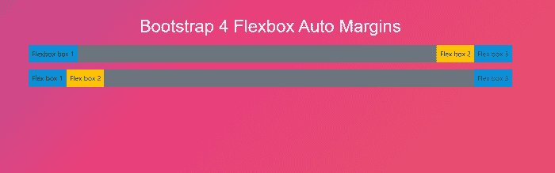
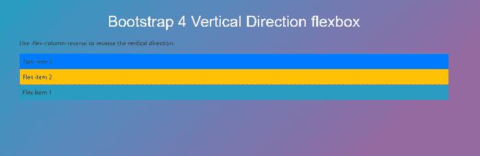
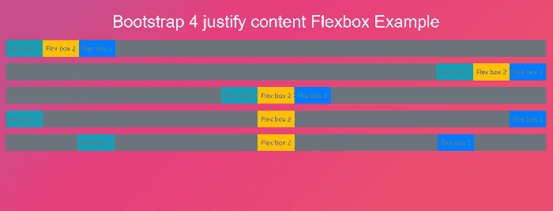
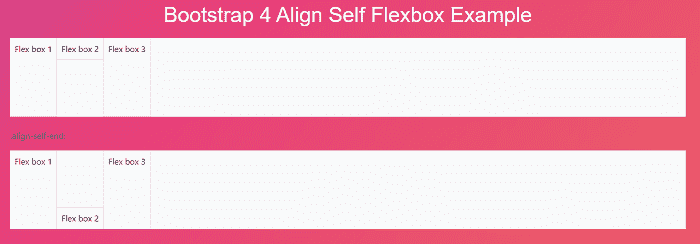

# 引导条 4 Flexbox

> 原文：<https://www.javatpoint.com/bootstrap-4-flexbox>

在本文中，我们将详细了解 bootstrap 4 flexbox 的工作原理。

### Bootstrap 4 Flexbox 是什么意思？

在 [Bootstrap 4](https://www.javatpoint.com/bootstrap-4) 中，柔性盒用于控制 Bootstrap 4 组件的布局和对齐规格。此框使得设计灵活的响应布局结构变得更加容易，而无需使用浮动或定位属性。

**我们来看下 Bootstrap 4 FlexBox 的例子。**

### 例 1:

```

<! DOCTYPE html>
<html lang="en">
<head>
  <title> Bootstrap 4 Flex Box Example </title>
  <meta charset="utf-8">
  <meta name="viewport" content="width=device-width, initial-scale=1">
  <link rel="stylesheet" href="https://maxcdn.bootstrapcdn.com/bootstrap/4.5.2/css/bootstrap.min.css">
  <script src="https://ajax.googleapis.com/ajax/libs/jquery/3.5.1/jquery.min.js"> </script>
  <script src="https://cdnjs.cloudflare.com/ajax/libs/popper.js/1.16.0/umd/popper.min.js"> </script>
  <script src="https://maxcdn.bootstrapcdn.com/bootstrap/4.5.2/js/bootstrap.min.js"> </script>
</head>
<style>
h2 {
  position: relative;
  padding: 10;
  margin: 10;
  font-family: "Raleway", sans-serif;
  font-weight: 300;
  font-size: 40px;
  color: white;
  text-align: center;
  -webkit-transition: all 0.4s ease 0s;
  -o-transition: all 0.4s ease 0s;
  transition: all 0.4s ease 0s;
}
body {
	background-size: 400% 400%;
           margin: 2rem;
background: linear-gradient(-45deg, #ee7752, #e73c7e, #23a6d5, #23d5ab);
	animation: gradient 15s ease infinite;
	height: 100vh;
}
@keyframes gradient {
	0% {
		background-position: 0% 50%;
	}
	50% {
		background-position: 100% 50%;
	}
	100% {
		background-position: 0% 50%;
	}
}
</style>
<body> 
<div class="container mt-3">
  <h2> Bootstrap 4 Flexbox Auto Margins </h2>
  <div class="d-flex mb-3 bg-secondary">
    <div class="p-2 mr-auto bg-info"> Flexbox box 1</div>
    <div class="p-2 bg-warning"> Flex box 2 </div>
    <div class="p-2 bg-primary"> Flex box 3 </div>
  </div>
  <div class="d-flex mb-3 bg-secondary">
    <div class="p-2  bg-info"> Flex box 1 </div>
    <div class="p-2 bg-warning"> Flex box 2 </div>
    <div class="p-2 ml-auto bg-primary"> Flex box 3 </div>
  </div>
</div>
</body>
</html>

```

**说明:**

在上面的例子中，我们在 bootstrap 4 的帮助下创建了一个自动边距弹性框。

**输出:**

以下是该示例的输出:



### 例 2:

```

<! DOCTYPE html>
<html lang="en">
<head>
  <title> Bootstrap 4 vertical Flex Box Example </title>
  <meta charset="utf-8">
  <meta name="viewport" content="width=device-width, initial-scale=1">
  <link rel="stylesheet" href="https://maxcdn.bootstrapcdn.com/bootstrap/4.5.2/css/bootstrap.min.css">
  <script src="https://ajax.googleapis.com/ajax/libs/jquery/3.5.1/jquery.min.js"> </script>
  <script src="https://cdnjs.cloudflare.com/ajax/libs/popper.js/1.16.0/umd/popper.min.js"> </script>
  <script src="https://maxcdn.bootstrapcdn.com/bootstrap/4.5.2/js/bootstrap.min.js"> </script>
</head>
<style>
h2 {
  position: relative;
  padding: 10;
  margin: 10;
  font-family: "Raleway", sans-serif;
  font-weight: 300;
  font-size: 40px;
  color: white;
  text-align: center;
  -webkit-transition: all 0.4s ease 0s;
  -o-transition: all 0.4s ease 0s;
  transition: all 0.4s ease 0s;
}
body {
	background-size: 400% 400%;
           margin: 2rem;
background: linear-gradient(-45deg, #ee7752, #e73c7e, #23a6d5, #23d5ab);
	animation: gradient 15s ease infinite;
	height: 100vh;
}
@keyframes gradient {
	0% {
		background-position: 0% 50%;
	}
	50% {
		background-position: 100% 50%;
	}
	100% {
		background-position: 0% 50%;
	}
}
</style>
<body> 
<div class="container mt-3">
  <h2> Bootstrap 4 Vertical Direction flexbox </h2>
  <p> Use .flex-column-reverse to reverse the vertical direction: </p>
  <div class="d-flex flex-column-reverse">
    <div class="p-2 bg-info"> Flex item 1 </div>
    <div class="p-2 bg-warning"> Flex item 2 </div>
    <div class="p-2 bg-primary"> Flex item 3 </div>
  </div>
</div>
</body>
</html>

```

**说明:**

在上面的例子中，我们在 bootstrap 4 的帮助下创建了一个垂直方向的 flexbox。

**输出:**

以下是该示例的输出:



### 例 3:

```

<! DOCTYPE html>  
<html lang="en">  
<head>  
  <title> Bootstrap 4 justify content Flexbox Example </title>  
  <meta charset="utf-8">  
  <meta name="viewport" content="width=device-width, initial-scale=1">  
  <link rel="stylesheet" href="https://maxcdn.bootstrapcdn.com/bootstrap/4.1.3/css/bootstrap.min.css">  
  <script src="https://ajax.googleapis.com/ajax/libs/jquery/3.3.1/jquery.min.js"> </script>  
  <script src="https://cdnjs.cloudflare.com/ajax/libs/popper.js/1.14.3/umd/popper.min.js"> </script>  
  <script src="https://maxcdn.bootstrapcdn.com/bootstrap/4.1.3/js/bootstrap.min.js"> </script>
<style>
h1 {
  position: relative;
  padding: 10;
  margin: 10;
  font-family: "Raleway", sans-serif;
  font-weight: 300;
  font-size: 40px;
  color: white;
  text-align: center;
  -webkit-transition: all 0.4s ease 0s;
  -o-transition: all 0.4s ease 0s;
  transition: all 0.4s ease 0s;
}
body {
	background-size: 400% 400%;
           margin: 2rem;
background: linear-gradient(-45deg, #ee7752, #e73c7e, #23a6d5, #23d5ab);
	animation: gradient 15s ease infinite;
	height: 100vh;
}
@keyframes gradient {
	0% {
		background-position: 0% 50%;
	}
	50% {
		background-position: 100% 50%;
	}
	100% {
		background-position: 0% 50%;
	}
}
</style>
<body>
<h1> Bootstrap 4 justify content Flexbox Example </h1>
<div class="d-flex justify-content-start bg-secondary mb-3">
    <div class="p-2 bg-info"> Flex box 1 </div>
    <div class="p-2 bg-warning"> Flex box 2 </div>
    <div class="p-2 bg-primary"> Flex box 3 </div>
  </div>
  <div class="d-flex justify-content-end bg-secondary mb-3">
    <div class="p-2 bg-info"> Flex box 1 </div>
    <div class="p-2 bg-warning"> Flex box 2 </div>
    <div class="p-2 bg-primary"> Flex box 3 </div>
  </div>
  <div class="d-flex justify-content-center bg-secondary mb-3">
    <div class="p-2 bg-info"> Flex box 1 </div>
    <div class="p-2 bg-warning"> Flex box 2 </div>
    <div class="p-2 bg-primary"> Flex box 3 </div>
  </div>
  <div class="d-flex justify-content-between bg-secondary mb-3">
    <div class="p-2 bg-info"> Flex box 1 </div>
    <div class="p-2 bg-warning"> Flex box 2 </div>
    <div class="p-2 bg-primary"> Flex box 3 </div>
  </div>
  <div class="d-flex justify-content-around bg-secondary mb-3">
    <div class="p-2 bg-info"> Flex box 1 </div>
    <div class="p-2 bg-warning"> Flex box 2 </div>
    <div class="p-2 bg-primary"> Flex box 3 </div>
  </div>
</div>
</body>
</html>

```

**说明:**

在上面的例子中，我们在 bootstrap 4 的帮助下创建了一个调整内容的弹性框。

**输出:**

以下是该示例的输出:



### 例 4:

```

<! DOCTYPE html>  
<html lang="en">  
<head>  
  <title> Bootstrap 4 Align Self Flexbox Example  </title>  
  <meta charset="utf-8">  
  <meta name="viewport" content="width=device-width, initial-scale=1">  
   <link rel="stylesheet" href="https://maxcdn.bootstrapcdn.com/bootstrap/4.5.2/css/bootstrap.min.css">
  <script src="https://ajax.googleapis.com/ajax/libs/jquery/3.5.1/jquery.min.js"></script>
  <script src="https://cdnjs.cloudflare.com/ajax/libs/popper.js/1.16.0/umd/popper.min.js"></script>
  <script src="https://maxcdn.bootstrapcdn.com/bootstrap/4.5.2/js/bootstrap.min.js"></script>
<style>
h1 {
  position: relative;
  padding: 10;
  margin: 10;
  font-family: "Raleway", sans-serif;
  font-weight: 300;
  font-size: 40px;
  color: white;
  text-align: center;
  -webkit-transition: all 0.4s ease 0s;
  -o-transition: all 0.4s ease 0s;
  transition: all 0.4s ease 0s;
}
body {
	background-size: 400% 400%;
           margin: 2rem;
background: linear-gradient(-45deg, #ee7752, #e73c7e, #23a6d5, #23d5ab);
	animation: gradient 15s ease infinite;
	height: 100vh;
}
@keyframes gradient {
	0% {
		background-position: 0% 50%;
	}
	50% {
		background-position: 100% 50%;
	}
	100% {
		background-position: 0% 50%;
	}
}
</style>
<body>
<h1> Bootstrap 4 Align Self Flexbox Example </h1>
<div class="d-flex bg-light" style="height: 150px">
    <div class="p-2 border"> Flex box 1 </div>
    <div class="p-2 border align-self-start"> Flex box 2 </div>
    <div class="p-2 border"> Flex box 3 </div>
  </div>
  <br>
  <p>.align-self-end:</p>
  <div class="d-flex bg-light" style="height:150px">
    <div class="p-2 border"> Flex box 1 </div>
    <div class="p-2 border align-self-end"> Flex box 2 </div>
    <div class="p-2 border"> Flex box 3 </div>
  </div>
  <br>
  <p>.align-self-center:</p>
  <div class="d-flex bg-light" style="height:150px">
    <div class="p-2 border"> Flex box 1 </div>
    <div class="p-2 border align-self-center"> Flex box 2 </div>
    <div class="p-2 border"> Flex box 3 </div>
  </div>
  <br>
  <p>.align-self-baseline:</p>
  <div class="d-flex bg-light" style="height:150px">
    <div class="p-2 border"> Flex box 1 </div>
    <div class="p-2 border align-self-baseline"> Flex box 2 </div>
    <div class="p-2 border"> Flex box 3 </div>
  </div>
  <br>
  <p>.align-self-stretch (default):</p>
  <div class="d-flex bg-light" style="height:150px">
    <div class="p-2 border"> Flex box 1 </div>
    <div class="p-2 border align-self-stretch"> Flex box 2 </div>
    <div class="p-2 border"> Flex box 3 </div>
  </div>
  <br>
</div>
</body>
</html>

```

**说明:**

在上面的例子中，我们在 bootstrap 4 的帮助下创建了一个 align 自伸缩箱。

**输出:**

以下是该示例的输出:



* * *