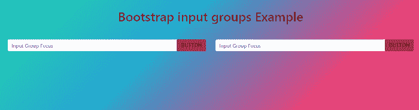
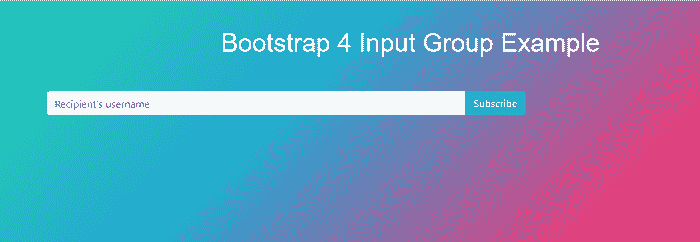
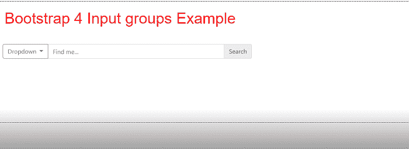
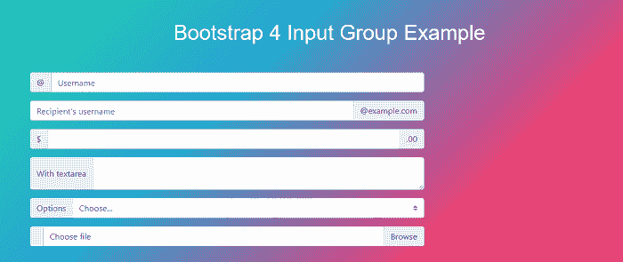

# Bootstrap4 输入组

> 原文：<https://www.javatpoint.com/bootstrap-4-input-groups>

在本文中，我们将借助一些示例来了解 Bootstrap 4 输入组。

### Bootstrap 4 输入组是什么意思？

在 Bootstrap4 中。input-group 类是一个容器，通过在输入字段的前面或后面添加文本框、下拉列表或按钮来增强输入。

**我们举 Bootstrap 4 输入组的各种例子。**

### 例 1:

```

<! DOCTYPE html>
<html lang="en">
<head>
  <title> Bootstrap 4 Input groups Example </title>
  <meta charset="utf-8">
  <meta name="viewport" content="width=device-width, initial-scale=1">
  <link rel="stylesheet" href="https://maxcdn.bootstrapcdn.com/bootstrap/4.5.2/css/bootstrap.min.css">
  <script src="https://ajax.googleapis.com/ajax/libs/jquery/3.5.1/jquery.min.js"> </script>
  <script src="https://cdnjs.cloudflare.com/ajax/libs/popper.js/1.16.0/umd/popper.min.js"> </script>
  <script src="https://maxcdn.bootstrapcdn.com/bootstrap/4.5.2/js/bootstrap.min.js"> </script>
</head>
<style>
@import "compass/css3";
h2 {
  position: relative;
  padding: 10;
  margin: 10;
  font-family: "Raleway", sans-serif;
  font-weight: 300;
  font-size: 40px;
  color: white;
  text-align: center;
  -webkit-transition: all 0.4s ease 0s;
  -o-transition: all 0.4s ease 0s;
  transition: all 0.4s ease 0s;
}
button {
padding: 15px 100px;
  font-family: sans-serif;
  text-transform: uppercase;
  text-align: center;
  position: relative;
  text-decoration: none;
  color: Red;
}
body {
	background-size: 400% 400%;
           margin: 2rem;
background: linear-gradient(-45deg, #ee7752, #e73c7e, #23a6d5, #23d5ab);
	animation: gradient 15s ease infinite;
	height: 100vh;
}
@keyframes gradient {
	0% {
		background-position: 0% 50%;
	}
	50% {
		background-position: 100% 50%;
	}
	100% {
		background-position: 0% 50%;
	}
}
.input-group {
  .btn,
  .form-control {
	@include single-transition(none);
  }
  &.default-input-group {
    .form-control {
      border-right: 0;
      & + .input-group-btn .btn { border-left: 0; }
      &:focus  {
        @include box-shadow(none);
        & + .input-group-btn .btn { 
			outline: 0; 
			border-color: #66afe9; 
			background-color: #bd2130;
		}
      }
    }
  }   
  &.prev-input-group {
width: 100%;
	.form-control  { 
		float: right; 
		width: 87%; 
		border-top-left-radius: 0; 
		border-bottom-left-radius: 0; 
		border-top-right-radius: 4px;
		border-bottom-right-radius: 4px; 
		border-left: 0;
		& + span .btn { 
		border-top-left-radius: 4px; 
		border-width: 1px 0 1px 1px; 
        border-bottom-left-radius: 4px; 
    }
      &:focus  {
        @include box-shadow(none);
        & + .input-group-btn .btn { 
			outline: 0; 
			border-color: #66afe9; 
		}
      }
	}
	.input-group-btn { 
		float: left; 
		width: 13%; 
		 .btn { 
			margin: 0;  
			width: 100%; 
			border-left: 1px solid #ccc; 
			border-top-right-radius: 0; 
			border-bottom-right-radius: 0;
		} 
	}
  } 
    .input-group-btn {
      .btn {
        &:hover {
          border-color: #ccc;
          background-color: inherit;
        }
      }
    }
}
.btn {
background-color: #bd2130;
}
</style>
<body>
<div class="text-center">
  <h1>
    Bootstrap input groups Example
  </h1>
</div>
<hr />
<hr />
<div class="row">
  <div class="col-lg-6">
    <div class="input-group default-input-group ">
      <input type="text" class="form-control" placeholder="Input Group Focus">
      <span class="input-group-btn">
        <button class="btn btn-default" type="button"> Button </button>
      </span>
    </div>
  </div> 
  <div class="col-lg-6">
    <div class="input-group prev-input-group">
      <input type="text" class="form-control" placeholder="Input Group Focus">
      <span class="input-group-btn">
        <button class="btn btn-default" type="button"> Button </button>
      </span>
    </div>
  </div>
</div>
</body>
</html>

```

**说明:**

在上面的示例中，我们创建了一个 Bootstrap 4 输入组的示例。

**输出:**

以下是该示例的输出:



### 例 2:

```

<! DOCTYPE html>
<html lang="en">
<head>
  <title> Bootstrap 4 Input groups Example </title>
  <meta charset="utf-8">
  <meta name="viewport" content="width=device-width, initial-scale=1">
  <link rel="stylesheet" href="https://maxcdn.bootstrapcdn.com/bootstrap/4.5.2/css/bootstrap.min.css">
  <script src="https://ajax.googleapis.com/ajax/libs/jquery/3.5.1/jquery.min.js"> </script>
  <script src="https://cdnjs.cloudflare.com/ajax/libs/popper.js/1.16.0/umd/popper.min.js"> </script>
  <script src="https://maxcdn.bootstrapcdn.com/bootstrap/4.5.2/js/bootstrap.min.js"> </script>
</head>
<style>
.container {
  padding: 2rem 0rem;
}
h4 {
  margin: 2rem 0rem 1rem;
}
h2 {
  position: relative;
  padding: 10;
  margin: 10;
  font-family: "Raleway", sans-serif;
  font-weight: 300;
  font-size: 40px;
  color: white;
  text-align: center;
  -webkit-transition: all 0.4s ease 0s;
  -o-transition: all 0.4s ease 0s;
  transition: all 0.4s ease 0s;
}
body {
	background-size: 400% 400%;
           margin: 2rem;
background: linear-gradient(-45deg, #ee7752, #e73c7e, #23a6d5, #23d5ab);
	animation: gradient 15s ease infinite;
	height: 100vh;
}
@keyframes gradient {
	0% {
		background-position: 0% 50%;
	}
	50% {
		background-position: 100% 50%;
	}
	100% {
		background-position: 0% 50%;
	}
}
</style>
<body>
<h2> Bootstrap 4 Input Group Example </h2>
<div class="container">
  <div class="row">
    <div class="col-8">
        <div class="input-group mb-3">
          <input type="text" class="form-control" placeholder="Recipient's username" aria-label="Recipient's username" aria-describedby="button-addon2">
          <div class="input-group-append">
            <button class="btn btn-info" type="button" id="button-addon2"> Subscribe </button>
          </div>
        </div>
    </div>
  </div>
</div>
</body>
</html>

```

**说明:**

在上面的示例中，我们创建了一个 Bootstrap 4 输入组的示例。

**输出:**

以下是该示例的输出:



### 例 3:

```

<! DOCTYPE html>
<html lang="en">
<head>
  <title> Bootstrap 4 Input groups Example </title>
  <meta charset="utf-8">
  <meta name="viewport" content="width=device-width, initial-scale=1">
  <link rel="stylesheet" href="https://maxcdn.bootstrapcdn.com/bootstrap/4.5.2/css/bootstrap.min.css">
  <script src="https://ajax.googleapis.com/ajax/libs/jquery/3.5.1/jquery.min.js"> </script>
  <script src="https://cdnjs.cloudflare.com/ajax/libs/popper.js/1.16.0/umd/popper.min.js"> </script>
  <script src="https://maxcdn.bootstrapcdn.com/bootstrap/4.5.2/js/bootstrap.min.js"> </script>
</head>
<style>
h2 {
  position: relative;
  padding: 10;
  margin: 10;
  font-family: "Raleway", sans-serif;
  font-weight: 300;
  font-size: 40px;
  color: red;
  -webkit-transition: all 0.4s ease 0s;
  -o-transition: all 0.4s ease 0s;
  transition: all 0.4s ease 0s;
}
body {
background: 
    linear-gradient(to bottom, transparent, black) 
      no-repeat bottom;
	background-size: 100% 50%;
  height: 20em;
  border: 1px dotted black;
  }
</style>
<body>
<h2> Bootstrap 4 Input groups Example </h2>
<div class="container-fluid pt-4">
  <div class="row">
    <div class="col-6">
      <div class="input-group mb-3">
        <div class="input-group-prepend">
          <button class="btn btn-outline-secondary dropdown-toggle" type="button" data-toggle="dropdown" aria-haspopup="true" aria-expanded="false"> Dropdown </button>
          <div class="dropdown-menu">
            <a class="dropdown-item" href="#"> Action </a>
            <a class="dropdown-item" href="#"> Another action </a>
            <a class="dropdown-item" href="#"> Something else here </a>
            <div role="separator" class="dropdown-divider"></div>
            <a class="dropdown-item" href="#"> Separated link </a>
          </div>
        </div>
        <input type="text" class="form-control" placeholder="Find me...">
        <div class="input-group-append">
    <a class="input-group-text"> Search </a>
  </div>
      </div>
    </div>
  </div>
</div>
</body>
</html>

```

**说明:**

在上面的示例中，我们创建了一个 Bootstrap 4 输入组的示例。

**输出:**

下面是这个例子的输出。



### 例 4:

```

<! DOCTYPE html>
<html lang="en">
<head>
  <title> Bootstrap 4 Input groups Example </title>
  <meta charset="utf-8">
  <meta name="viewport" content="width=device-width, initial-scale=1">
  <link rel="stylesheet" href="https://maxcdn.bootstrapcdn.com/bootstrap/4.5.2/css/bootstrap.min.css">
  <script src="https://ajax.googleapis.com/ajax/libs/jquery/3.5.1/jquery.min.js"> </script>
  <script src="https://cdnjs.cloudflare.com/ajax/libs/popper.js/1.16.0/umd/popper.min.js"> </script>
  <script src="https://maxcdn.bootstrapcdn.com/bootstrap/4.5.2/js/bootstrap.min.js"> </script>
</head>
<style>
.container {
  padding: 2rem 0rem;
}
h2 {
  position: relative;
  padding: 10;
  margin: 10;
  font-family: "Raleway", sans-serif;
  font-weight: 300;
  font-size: 40px;
  color: white;
  text-align: center;
  -webkit-transition: all 0.4s ease 0s;
  -o-transition: all 0.4s ease 0s;
  transition: all 0.4s ease 0s;
}
body {
	background-size: 400% 400%;
           margin: 2rem;
background: linear-gradient(-45deg, #ee7752, #e73c7e, #23a6d5, #23d5ab);
	animation: gradient 15s ease infinite;
	height: 100vh;
}
@keyframes gradient {
	0% {
		background-position: 0% 50%;
	}
	50% {
		background-position: 100% 50%;
	}
	100% {
		background-position: 0% 50%;
	}
}
h4 {
  margin: 2rem 0rem 1rem;
}
</style>
<body>
<h2> Bootstrap 4 Input Group Example </h2>
<div class="container">
  <div class="row">
    <div class="col-8">
        <div class="input-group mb-3">
          <div class="input-group-prepend">
            <span class="input-group-text" id="basic-addon1">@</span>
          </div>
          <input type="text" class="form-control" placeholder="Username" aria-label="Username" aria-describedby="basic-addon1">
        </div>
        <div class="input-group mb-3">
          <input type="text" class="form-control" placeholder="Recipient's username" aria-label="Recipient's username" aria-describedby="basic-addon2">
          <div class="input-group-append">
            <span class="input-group-text" id="basic-addon2"> @example.com </span>
          </div>
        </div>
        <div class="input-group mb-3">
          <div class="input-group-prepend">
            <span class="input-group-text"> $ </span>
          </div>
          <input type="text" class="form-control" aria-label="Amount (to the nearest dollar)">
          <div class="input-group-append">
            <span class="input-group-text"> .00 </span>
          </div>
        </div> 
        <div class="input-group mb-3">
          <div class="input-group-prepend">
            <span class="input-group-text"> With textarea </span>
          </div>
          <textarea class="form-control" aria-label="With textarea"> </textarea>
        </div>
        <div class="input-group mb-3">
          <div class="input-group-prepend">
            <label class="input-group-text" for="inputGroupSelect01"> Options <label>
          </div>
          <select class="custom-select" id="inputGroupSelect01">
            <option selected> Choose... </option>
            <option value="1"> One </option>
            <option value="2"> Two </option>
            <option value="3"> Three </option>
          </select>
        </div>
        <div class="input-group mb-3">
          <div class="input-group-prepend">
            <span class="input-group-text" id="inputGroupFileAddon01"> <i class="far fa-file-image"> </i> </span>
          </div>
          <div class="custom-file">
            <input type="file" class="custom-file-input" id="inputGroupFile01" aria-describedby="inputGroupFileAddon01">
            <label class="custom-file-label" for="inputGroupFile01"> Choose file </label>
          </div>
        </div>
    </div>
  </div>
</div>
</body>
</html>

```

**说明:**

在上面的示例中，我们创建了一个 Bootstrap 4 输入组的示例。

**输出:**

以下是该示例的输出:



* * *