# Bootstrap 4 中的排版

> 原文：<https://www.javatpoint.com/typography-in-bootstrap-4>

在本文中，我们将了解 Bootstrap 4 中的排版。

### Bootstrap 4 中的排版是什么意思。

在 Bootstrap 4 中，排版是对文本内容进行样式化和格式化的功能。它用于创建自定义标题、内嵌副标题、列表、段落、对齐、添加更多面向设计的字体样式等等。

**以下类和标签用于实现引导程序 4 中的排版功能:**

**1。文本静音:**该类用于给文本上色，并在文本中添加文本静音的淡入淡出效果。

**示例:**

```

<! DOCTYPE html>      
<html lang="en">      
<head>      
  <title> Bootstrap 4 typography Example </title>      
  <meta charset="utf-8">      
  <meta name="viewport" content="width=device-width, initial-scale=1">      
  <link rel="stylesheet" href="https://maxcdn.bootstrapcdn.com/bootstrap/4.1.3/css/bootstrap.min.css">      
  <script src="https://ajax.googleapis.com/ajax/libs/jquery/3.3.1/jquery.min.js"> </script>      
  <script src="https://cdnjs.cloudflare.com/ajax/libs/popper.js/1.14.3/umd/popper.min.js"> </script>      
  <script src="https://maxcdn.bootstrapcdn.com/bootstrap/4.1.3/js/bootstrap.min.js"> </script>      
   <link href="https://maxcdn.bootstrapcdn.com/font-awesome/4.7.0/css/font-awesome.min.css" rel="stylesheet">      
</head>      
<style>  
.hm-gradient {  
    background-image: linear-gradient(to top, #f3e7e9 0%, #e3eeff 99%, #e3eeff 100%);  
}  
h1:hover {  
  font-size: 3rem;  
  transition: all 1s;  
}  
h1 {  
  position: relative;  
  padding: 40;  
  margin: 40;  
  font-family: "Raleway", sans-serif;  
  font-weight: 300;  
  font-size: 40px;  
  color: #080808;  
  -webkit-transition: all 0.4s ease 0s;  
  -o-transition: all 0.4s ease 0s;  
  transition: all 0.4s ease 0s;  
  text-align: center;  
  border: 5px solid red;
}  
h2:hover {  
  font-size: 3rem;  
  transition: all 1s;  
}  
h2 {  
  position: relative;  
  padding: 40;  
  margin: 40;  
  font-family: "Raleway", sans-serif;  
  font-weight: 300;  
  font-size: 40px;  
  color: #080808;  
  -webkit-transition: all 0.4s ease 0s;  
  -o-transition: all 0.4s ease 0s;  
  transition: all 0.4s ease 0s;  
  text-align: center;  
}
</style>  
<body>
<h1> Example </h1>
	<h2> javatpoint //A Normal Text.</h2>
	<h2 class="text-muted"> javatpoint  //A Muted Text.</h2>
</body>
</html>

```

**说明:**

在上面的例子中，我们创建了一个文本静音类的例子。

**输出:**

以下是该示例的输出:


**2。显示:**这个类用于在 bootstrap 4 中创建更好的标题。

**示例:**

```

<! DOCTYPE html>      
<html lang="en">      
<head>      
  <title> Bootstrap 4 typography Example </title>      
  <meta charset="utf-8">      
  <meta name="viewport" content="width=device-width, initial-scale=1">      
  <link rel="stylesheet" href="https://maxcdn.bootstrapcdn.com/bootstrap/4.1.3/css/bootstrap.min.css">      
  <script src="https://ajax.googleapis.com/ajax/libs/jquery/3.3.1/jquery.min.js"> </script>      
  <script src="https://cdnjs.cloudflare.com/ajax/libs/popper.js/1.14.3/umd/popper.min.js"> </script>      
  <script src="https://maxcdn.bootstrapcdn.com/bootstrap/4.1.3/js/bootstrap.min.js"> </script>      
   <link href="https://maxcdn.bootstrapcdn.com/font-awesome/4.7.0/css/font-awesome.min.css" rel="stylesheet">      
</head>      
<style>  
.hm-gradient {  
    background-image: linear-gradient(to top, #f3e7e9 0%, #e3eeff 99%, #e3eeff 100%);  
}  
h1:hover {  
  font-size: 3rem;  
  transition: all 1s;  
}  
h1 {  
  position: relative;  
  padding: 40;  
  margin: 40;  
  font-family: "Raleway", sans-serif;  
  font-weight: 300;  
  font-size: 40px;  
  color: #080808;  
  -webkit-transition: all 0.4s ease 0s;  
  -o-transition: all 0.4s ease 0s;  
  transition: all 0.4s ease 0s;  
  text-align: center;  
  border: 5px solid red;
}  
h2:hover {  
  font-size: 3rem;  
  transition: all 1s;  
}  
h2 {  
  position: relative;  
  padding: 40;  
  margin: 40;  
  font-family: "Raleway", sans-serif;  
  font-weight: 300;  
  font-size: 40px;  
  color: #080808;  
  -webkit-transition: all 0.4s ease 0s;  
  -o-transition: all 0.4s ease 0s;  
  transition: all 0.4s ease 0s;  
  text-align: center;  
}
</style>  
<body>
<h1> Example </h1>
	<h2> javatpoint //A Normal Text. </h2>
	<h2 class="display-3">  javatpoint  //A display class.</h2>
</body>
</html>

```

**说明:**

在上面的例子中，我们已经创建了一个显示类。

**输出:**

以下是该示例的输出:

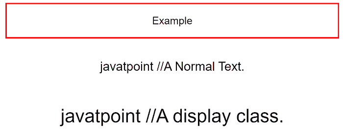

**3。导语:**用于使一个段落突出，即视觉效果更好。

**示例:**

```

<! DOCTYPE html>      
<html lang="en">      
<head>      
  <title> Bootstrap 4 typography Example </title>      
  <meta charset="utf-8">      
  <meta name="viewport" content="width=device-width, initial-scale=1">      
  <link rel="stylesheet" href="https://maxcdn.bootstrapcdn.com/bootstrap/4.1.3/css/bootstrap.min.css">      
  <script src="https://ajax.googleapis.com/ajax/libs/jquery/3.3.1/jquery.min.js"> </script>      
  <script src="https://cdnjs.cloudflare.com/ajax/libs/popper.js/1.14.3/umd/popper.min.js"> </script>      
  <script src="https://maxcdn.bootstrapcdn.com/bootstrap/4.1.3/js/bootstrap.min.js"> </script>      
   <link href="https://maxcdn.bootstrapcdn.com/font-awesome/4.7.0/css/font-awesome.min.css" rel="stylesheet">      
</head>      
<style>  
.hm-gradient {  
    background-image: linear-gradient(to top, #f3e7e9 0%, #e3eeff 99%, #e3eeff 100%);  
}  
h1:hover {  
  font-size: 3rem;  
  transition: all 1s;  
}  
h1 {  
  position: relative;  
  padding: 40;  
  margin: 40;  
  font-family: "Raleway", sans-serif;  
  font-weight: 300;  
  font-size: 40px;  
  color: #080808;  
  -webkit-transition: all 0.4s ease 0s;  
  -o-transition: all 0.4s ease 0s;  
  transition: all 0.4s ease 0s;  
  text-align: center;  
  border: 5px solid red;
}  
h2:hover {  
  font-size: 3rem;  
  transition: all 1s;  
}  
h2 {  
  position: relative;  
  padding: 40;  
  margin: 40;  
  font-family: "Raleway", sans-serif;  
  font-weight: 300;  
  font-size: 40px;  
  color: #080808;  
  -webkit-transition: all 0.4s ease 0s;  
  -o-transition: all 0.4s ease 0s;  
  transition: all 0.4s ease 0s;  
  text-align: center;  
}
</style>  
<body>
<h1> Example </h1>
	<h2> javatpoint //A Normal Text. </h2>
	<h2 class="lead">  javatpoint  //A lead class.</h2>
</body>
</html>

```

**说明:**

在上面的示例中，我们在 Bootstrap 4 中创建了一个销售线索类的示例。

**输出:**

以下是该示例的输出:

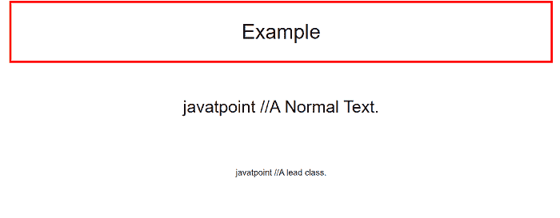

**4。标记:**此标记用于突出显示文本。

**示例:**

```

<! DOCTYPE html>      
<html lang="en">      
<head>      
  <title> Bootstrap 4 typography Example </title>      
  <meta charset="utf-8">      
  <meta name="viewport" content="width=device-width, initial-scale=1">      
  <link rel="stylesheet" href="https://maxcdn.bootstrapcdn.com/bootstrap/4.1.3/css/bootstrap.min.css">      
  <script src="https://ajax.googleapis.com/ajax/libs/jquery/3.3.1/jquery.min.js"> </script>      
  <script src="https://cdnjs.cloudflare.com/ajax/libs/popper.js/1.14.3/umd/popper.min.js"> </script>      
  <script src="https://maxcdn.bootstrapcdn.com/bootstrap/4.1.3/js/bootstrap.min.js"> </script>      
   <link href="https://maxcdn.bootstrapcdn.com/font-awesome/4.7.0/css/font-awesome.min.css" rel="stylesheet">      
</head>      
<style>  
.hm-gradient {  
    background-image: linear-gradient(to top, #f3e7e9 0%, #e3eeff 99%, #e3eeff 100%);  
}  
h1:hover {  
  font-size: 3rem;  
  transition: all 1s;  
}  
h1 {  
  position: relative;  
  padding: 40;  
  margin: 40;  
  font-family: "Raleway", sans-serif;  
  font-weight: 300;  
  font-size: 40px;  
  color: #080808;  
  -webkit-transition: all 0.4s ease 0s;  
  -o-transition: all 0.4s ease 0s;  
  transition: all 0.4s ease 0s;  
  text-align: center;  
  border: 5px solid red;
}  
mark {  
  position: relative;   
  font-family: "Raleway", sans-serif;  
  font-weight: 300;  
  font-size: 40px;  
  color: #080808;  
  -webkit-transition: all 0.4s ease 0s;  
  -o-transition: all 0.4s ease 0s;  
  transition: all 0.4s ease 0s;  
  text-align: center;  
}
</style>  
<body>
<h1> Example </h1>
	<h2> javatpoint //A Normal Text.</h2>
	<mark> javatpoint - A Highlighted class </mark>
</body>
</html>

```

**说明:**

在上面的例子中，我们已经创建了一个印刷术中标记标签的例子。

**输出:**

以下是该示例的输出:

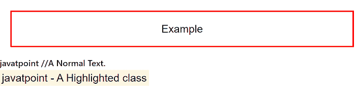

**5。小:**此标签用于创建二级副标题。

**示例:**

```

<! DOCTYPE html>      
<html lang="en">      
<head>      
  <title> Bootstrap 4 typography Example </title>      
  <meta charset="utf-8">      
  <meta name="viewport" content="width=device-width, initial-scale=1">      
  <link rel="stylesheet" href="https://maxcdn.bootstrapcdn.com/bootstrap/4.1.3/css/bootstrap.min.css">      
  <script src="https://ajax.googleapis.com/ajax/libs/jquery/3.3.1/jquery.min.js"> </script>      
  <script src="https://cdnjs.cloudflare.com/ajax/libs/popper.js/1.14.3/umd/popper.min.js"> </script>      
  <script src="https://maxcdn.bootstrapcdn.com/bootstrap/4.1.3/js/bootstrap.min.js"> </script>      
   <link href="https://maxcdn.bootstrapcdn.com/font-awesome/4.7.0/css/font-awesome.min.css" rel="stylesheet">      
</head>      
<style>  
.hm-gradient {  
    background-image: linear-gradient(to top, #f3e7e9 0%, #e3eeff 99%, #e3eeff 100%);  
}  
h1:hover {  
  font-size: 3rem;  
  transition: all 1s;  
}  
h1 {  
  position: relative;  
  padding: 40;  
  margin: 40;  
  font-family: "Raleway", sans-serif;  
  font-weight: 300;  
  font-size: 40px;  
  color: #080808;  
  -webkit-transition: all 0.4s ease 0s;  
  -o-transition: all 0.4s ease 0s;  
  transition: all 0.4s ease 0s;  
  text-align: center;  
  border: 5px solid red;
}  
small {  
  position: relative;   
  font-family: "Raleway", sans-serif;  
  font-weight: 300;  
  font-size: 40px;  
  color: #080808;  
  -webkit-transition: all 0.4s ease 0s;  
  -o-transition: all 0.4s ease 0s;  
  transition: all 0.4s ease 0s;  
  text-align: center;  
}
</style>  
<body>
<h1> Example </h1>
	<h2 class="text-success"> Javatpoint 
	<small> A CS Portal </small> 
	</h2>
</body>
</html>

```

**说明:**

在上面的例子中，我们在 bootstrap 4 中创建了一个小标签的例子。

**输出:**

下面是这个例子的输出。

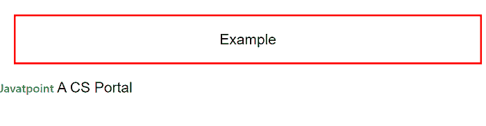

**6。初始值设定项:**它用于以略小的文本大小呈现缩写。

**示例:**

```

<! DOCTYPE html>      
<html lang="en">      
<head>      
  <title> Bootstrap 4 typography Example </title>      
  <meta charset="utf-8">      
  <meta name="viewport" content="width=device-width, initial-scale=1">      
  <link rel="stylesheet" href="https://maxcdn.bootstrapcdn.com/bootstrap/4.1.3/css/bootstrap.min.css">      
  <script src="https://ajax.googleapis.com/ajax/libs/jquery/3.3.1/jquery.min.js"> </script>      
  <script src="https://cdnjs.cloudflare.com/ajax/libs/popper.js/1.14.3/umd/popper.min.js"> </script>      
  <script src="https://maxcdn.bootstrapcdn.com/bootstrap/4.1.3/js/bootstrap.min.js"> </script>      
   <link href="https://maxcdn.bootstrapcdn.com/font-awesome/4.7.0/css/font-awesome.min.css" rel="stylesheet">      
</head>      
<style>  
.hm-gradient {  
    background-image: linear-gradient(to top, #f3e7e9 0%, #e3eeff 99%, #e3eeff 100%);  
}  
h1:hover {  
  font-size: 3rem;  
  transition: all 1s;  
}  
h1 {  
  position: relative;  
  padding: 40;  
  margin: 40;  
  font-family: "Raleway", sans-serif;  
  font-weight: 100;  
  font-size: 20px;  
  color: #080808;  
  -webkit-transition: all 0.4s ease 0s;  
  -o-transition: all 0.4s ease 0s;  
  transition: all 0.4s ease 0s;  
  border: 2px solid red;
}  
abbr {  
  position: relative;   
  font-family: "Raleway", sans-serif;  
  font-weight: 300;  
  font-size: 40px;  
  color: #080808;  
  -webkit-transition: all 0.4s ease 0s;  
  -o-transition: all 0.4s ease 0s;  
  transition: all 0.4s ease 0s;  
  text-align: center;  
}
</style>  
<body>
<h1> Example </h1>
	<abbr title="Javatpoint" class="text-success initialism"> Javatpoint </abbr> is a CS portal
</body>
</html>

```

**说明:**

在上面的例子中，我们创建了一个带有缩写标签的 initialism 类的例子。

**输出:**

以下是该示例的输出:

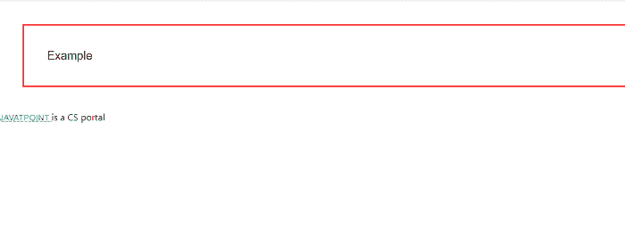

**7。blockquote:** 此标签用于引用内容。

**示例:**

```

<! DOCTYPE html>      
<html lang="en">      
<head>      
  <title> Bootstrap 4 Typography Example </title>      
  <meta charset="utf-8">      
  <meta name="viewport" content="width=device-width, initial-scale=1">      
  <link rel="stylesheet" href="https://maxcdn.bootstrapcdn.com/bootstrap/4.1.3/css/bootstrap.min.css">      
  <script src="https://ajax.googleapis.com/ajax/libs/jquery/3.3.1/jquery.min.js"> </script>      
  <script src="https://cdnjs.cloudflare.com/ajax/libs/popper.js/1.14.3/umd/popper.min.js"> </script>      
  <script src="https://maxcdn.bootstrapcdn.com/bootstrap/4.1.3/js/bootstrap.min.js"> </script>      
   <link href="https://maxcdn.bootstrapcdn.com/font-awesome/4.7.0/css/font-awesome.min.css" rel="stylesheet">      
</head>      
<style>  
.hm-gradient {  
    background-image: linear-gradient(to top, #f3e7e9 0%, #e3eeff 99%, #e3eeff 100%);  
}  
h1:hover {  
  font-size: 3rem;  
  transition: all 1s;  
}  
h1 {  
  position: relative;  
  padding: 10;  
  margin: 10;  
  font-family: "Raleway", sans-serif;  
  font-weight: 300;  
  font-size: 40px;  
  color: #080808;  
  -webkit-transition: all 0.4s ease 0s;  
  -o-transition: all 0.4s ease 0s;  
  transition: all 0.4s ease 0s;  
  text-align: center;  
    border: 5px solid red;
}  
blockquote {
  position: relative;  
  padding: 10;  
  margin: 10;  
  font-family: "Raleway", sans-serif;  
  font-weight: 300;  
  font-size: 40px;  
  color: #080808;  
  -webkit-transition: all 0.4s ease 0s;  
  -o-transition: all 0.4s ease 0s;  
  transition: all 0.4s ease 0s;  
  text-align: center;  
}
</style>  
<body>
<h1> Example </h1>
	<blockquote> JavaTpoint // Blockquote tag </blockquote>
</body>
</html>

```

**说明:**

在上面的例子中，我们创建了一个 blockquote 标签的例子。

**输出:**

以下是该示例的输出:

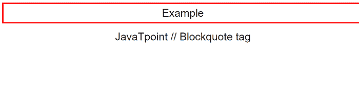

**8。blockquote-footer:** 它是用于标识报价来源的页脚详细信息。

**示例:**

```

<! DOCTYPE html>      
<html lang="en">      
<head>      
  <title> Bootstrap 4 Typography Example </title>      
  <meta charset="utf-8">      
  <meta name="viewport" content="width=device-width, initial-scale=1">      
  <link rel="stylesheet" href="https://maxcdn.bootstrapcdn.com/bootstrap/4.1.3/css/bootstrap.min.css">      
  <script src="https://ajax.googleapis.com/ajax/libs/jquery/3.3.1/jquery.min.js"> </script>      
  <script src="https://cdnjs.cloudflare.com/ajax/libs/popper.js/1.14.3/umd/popper.min.js"> </script>      
  <script src="https://maxcdn.bootstrapcdn.com/bootstrap/4.1.3/js/bootstrap.min.js"> </script>      
   <link href="https://maxcdn.bootstrapcdn.com/font-awesome/4.7.0/css/font-awesome.min.css" rel="stylesheet">      
</head>      
<style>  
.hm-gradient {  
    background-image: linear-gradient(to top, #f3e7e9 0%, #e3eeff 99%, #e3eeff 100%);  
}  
h1:hover {  
  font-size: 3rem;  
  transition: all 1s;  
}  
h1 {  
  position: relative;  
  padding: 10;  
  margin: 10;  
  font-family: "Raleway", sans-serif;  
  font-weight: 300;  
  font-size: 40px;  
  color: #080808;  
  -webkit-transition: all 0.4s ease 0s;  
  -o-transition: all 0.4s ease 0s;  
  transition: all 0.4s ease 0s;  
  text-align: center;  
    border: 5px solid red;
}  
blockquote-footer {
  position: relative;  
  padding: 10;  
  margin: 10;  
  font-family: "Raleway", sans-serif;  
  font-weight: 300;  
  font-size: 90px;  
  color: #080808;  
  -webkit-transition: all 0.4s ease 0s;  
  -o-transition: all 0.4s ease 0s;  
  transition: all 0.4s ease 0s;  
  text-align: center;  
}
</style>  
<body>
<h1> Example </h1>
	<blockquote class="blockquote-footer"> JavaTpoint a CS portal // Blockquote-footer class </blockquote>
</body>
</html>

```

**说明:**

在上面的例子中，我们创建了一个 blockquote 页脚类的例子。

**输出:**

以下是该示例的输出:

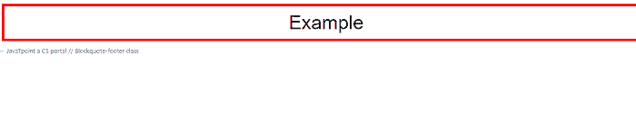

**9。文本居中:**该类用于将文本居中对齐。

**示例:**

```

<! DOCTYPE html>      
<html lang="en">      
<head>      
  <title> Bootstrap 4 typography Example </title>      
  <meta charset="utf-8">      
  <meta name="viewport" content="width=device-width, initial-scale=1">      
  <link rel="stylesheet" href="https://maxcdn.bootstrapcdn.com/bootstrap/4.1.3/css/bootstrap.min.css">      
  <script src="https://ajax.googleapis.com/ajax/libs/jquery/3.3.1/jquery.min.js"> </script>      
  <script src="https://cdnjs.cloudflare.com/ajax/libs/popper.js/1.14.3/umd/popper.min.js"> </script>      
  <script src="https://maxcdn.bootstrapcdn.com/bootstrap/4.1.3/js/bootstrap.min.js"> </script>      
   <link href="https://maxcdn.bootstrapcdn.com/font-awesome/4.7.0/css/font-awesome.min.css" rel="stylesheet">      
</head>      
<style>  
.hm-gradient {  
    background-image: linear-gradient(to top, #f3e7e9 0%, #e3eeff 99%, #e3eeff 100%);  
}  
h1:hover {  
  font-size: 3rem;  
  transition: all 1s;  
}  
h1 {  
  position: relative;  
  padding: 10;  
  margin: 10;  
  font-family: "Raleway", sans-serif;  
  font-weight: 300;  
  font-size: 40px;  
  color: #080808;  
  -webkit-transition: all 0.4s ease 0s;  
  -o-transition: all 0.4s ease 0s;  
  transition: all 0.4s ease 0s;  
  text-align: center;  
border: 5px solid red;
}  
</style>  
<body>
<h1> Example </h1>
	<h2 class="display-4 text-center"> JavaTpoint a CS portal // display-4 text-center class </h2>
</body>
</html>

```

**说明:**

在上面的例子中，我们创建了一个文本中心类的例子。

**输出:**

以下是该示例的输出:

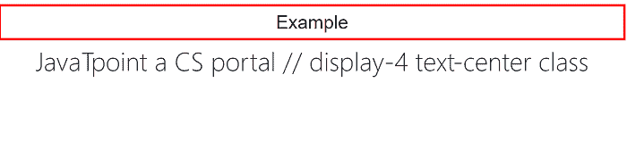

**10。text-truncate:** 此类用于通过用省略号进行截断来缩短较长的文本。

**示例:**

```

<! DOCTYPE html>      
<html lang="en">      
<head>      
  <title> Bootstrap 4 typography Example </title>      
  <meta charset="utf-8">      
  <meta name="viewport" content="width=device-width, initial-scale=1">      
  <link rel="stylesheet" href="https://maxcdn.bootstrapcdn.com/bootstrap/4.1.3/css/bootstrap.min.css">      
  <script src="https://ajax.googleapis.com/ajax/libs/jquery/3.3.1/jquery.min.js"> </script>      
  <script src="https://cdnjs.cloudflare.com/ajax/libs/popper.js/1.14.3/umd/popper.min.js"> </script>      
  <script src="https://maxcdn.bootstrapcdn.com/bootstrap/4.1.3/js/bootstrap.min.js"> </script>      
   <link href="https://maxcdn.bootstrapcdn.com/font-awesome/4.7.0/css/font-awesome.min.css" rel="stylesheet">      
</head>      
<style>  
.hm-gradient {  
    background-image: linear-gradient(to top, #f3e7e9 0%, #e3eeff 99%, #e3eeff 100%);  
}  
h1:hover {  
  font-size: 3rem;  
  transition: all 1s;  
}  
h1 {  
  position: relative;  
  padding: 40;  
  margin: 40;  
  font-family: "Raleway", sans-serif;  
  font-weight: 100;  
  font-size: 20px;  
  color: #080808;  
  -webkit-transition: all 0.4s ease 0s;  
  -o-transition: all 0.4s ease 0s;  
  transition: all 0.4s ease 0s;  
  text-align: center;  
  border: 2px solid red;
}  
h2 {  
  position: relative;   
  font-family: "Raleway", sans-serif;  
  font-weight: 300;  
  font-size: 40px;  
  color: #080808;  
  -webkit-transition: all 0.4s ease 0s;  
  -o-transition: all 0.4s ease 0s;  
  transition: all 0.4s ease 0s;  
  text-align: center;  
}
</style>  
<body>
<h1> Example </h1>
	<h2> JavaTpoint //A Normal Text.</h2>
	<h2 width="70%" class="text-truncate">
	 This is a text-truncate example </h2>
</body>
</html>

```

**说明:**

在上面的例子中，我们创建了一个文本截断类的例子。

**输出:**

以下是该示例的输出:

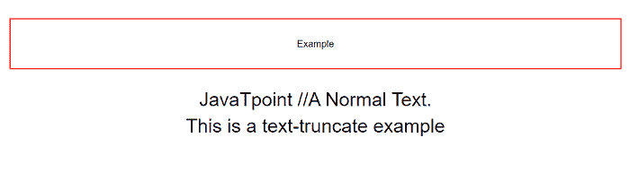

**11 时。text-大写:**这个类用于将文本转换为大写。

**示例:**

```

<! DOCTYPE html>      
<html lang="en">      
<head>      
  <title> Bootstrap 4 typography Example </title>      
  <meta charset="utf-8">      
  <meta name="viewport" content="width=device-width, initial-scale=1">      
  <link rel="stylesheet" href="https://maxcdn.bootstrapcdn.com/bootstrap/4.1.3/css/bootstrap.min.css">      
  <script src="https://ajax.googleapis.com/ajax/libs/jquery/3.3.1/jquery.min.js"> </script>      
  <script src="https://cdnjs.cloudflare.com/ajax/libs/popper.js/1.14.3/umd/popper.min.js"> </script>      
  <script src="https://maxcdn.bootstrapcdn.com/bootstrap/4.1.3/js/bootstrap.min.js"> </script>      
   <link href="https://maxcdn.bootstrapcdn.com/font-awesome/4.7.0/css/font-awesome.min.css" rel="stylesheet">      
</head>      
<style>  
.hm-gradient {  
    background-image: linear-gradient(to top, #f3e7e9 0%, #e3eeff 99%, #e3eeff 100%);  
}  
h1:hover {  
  font-size: 3rem;  
  transition: all 1s;  
}  
h1 {  
  position: relative;  
  padding: 40;  
  margin: 40;  
  font-family: "Raleway", sans-serif;  
  font-weight: 100;  
  font-size: 20px;  
  color: #080808;  
  -webkit-transition: all 0.4s ease 0s;  
  -o-transition: all 0.4s ease 0s;  
  transition: all 0.4s ease 0s; 
  border: 2px solid red;
}  
h2 {  
  position: relative;   
  font-family: "Raleway", sans-serif;  
  font-weight: 300;  
  font-size: 40px;  
  color: #080808;  
  -webkit-transition: all 0.4s ease 0s;  
  -o-transition: all 0.4s ease 0s;  
  transition: all 0.4s ease 0s;  
  text-align: center;  
}
</style>  
<body>
<h1> Example </h1>
	<h2> JavaTpoint //A Normal Text.</h2>
	<h2 class="text-uppercase"> JavaTpoint  // Text uppercase.</h2>
</body>
</html>

```

**说明:**

在上面的例子中，我们创建了一个文本的例子——大写。

**输出:**

以下是该示例的输出:

**12 时。text-小写:**这个类用于将文本转换为小写。

**示例:**

```

<! DOCTYPE html>      
<html lang="en">      
<head>      
  <title> Bootstrap 4 typography Example </title>      
  <meta charset="utf-8">      
  <meta name="viewport" content="width=device-width, initial-scale=1">      
  <link rel="stylesheet" href="https://maxcdn.bootstrapcdn.com/bootstrap/4.1.3/css/bootstrap.min.css">      
  <script src="https://ajax.googleapis.com/ajax/libs/jquery/3.3.1/jquery.min.js"> </script>      
  <script src="https://cdnjs.cloudflare.com/ajax/libs/popper.js/1.14.3/umd/popper.min.js"> </script>      
  <script src="https://maxcdn.bootstrapcdn.com/bootstrap/4.1.3/js/bootstrap.min.js"> </script>      
   <link href="https://maxcdn.bootstrapcdn.com/font-awesome/4.7.0/css/font-awesome.min.css" rel="stylesheet">      
</head>      
<style>  
.hm-gradient {  
    background-image: linear-gradient(to top, #f3e7e9 0%, #e3eeff 99%, #e3eeff 100%);  
}  
h1:hover {  
  font-size: 3rem;  
  transition: all 1s;  
}  
h1 {  
  position: relative;  
  padding: 40;  
  margin: 40;  
  font-family: "Raleway", sans-serif;  
  font-weight: 100;  
  font-size: 20px;  
  color: #080808;  
  -webkit-transition: all 0.4s ease 0s;  
  -o-transition: all 0.4s ease 0s;  
  transition: all 0.4s ease 0s;  
  border: 2px solid red;
} 
h2 {  
  position: relative;   
  font-family: "Raleway", sans-serif;  
  font-weight: 300;  
  font-size: 40px;  
  color: #080808;  
  -webkit-transition: all 0.4s ease 0s;  
  -o-transition: all 0.4s ease 0s;  
  transition: all 0.4s ease 0s;  
  text-align: center;  
}
</style>  
<body>
<h1> Example </h1>
	<h2> JavaTpoint //A Normal Text.</h2>
	<h2 class="text-lowercase"> JavaTpoint  // Text lowercase.</h2>
</body>
</html>

```

**说明:**

在上面的例子中，我们已经创建了一个文本小写类的例子。

**输出:**

以下是该示例的输出:

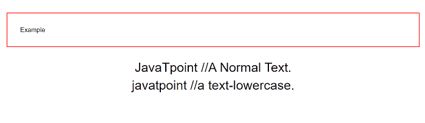

**13。text-大写:**用于将文本转换为每个单词的第一个字母大写，其他字母小写。

**示例:**

```

<! DOCTYPE html>      
<html lang="en">      
<head>      
  <title> Bootstrap 4 typography Example </title>      
  <meta charset="utf-8">      
  <meta name="viewport" content="width=device-width, initial-scale=1">      
  <link rel="stylesheet" href="https://maxcdn.bootstrapcdn.com/bootstrap/4.1.3/css/bootstrap.min.css">      
  <script src="https://ajax.googleapis.com/ajax/libs/jquery/3.3.1/jquery.min.js"> </script>      
  <script src="https://cdnjs.cloudflare.com/ajax/libs/popper.js/1.14.3/umd/popper.min.js"> </script>      
  <script src="https://maxcdn.bootstrapcdn.com/bootstrap/4.1.3/js/bootstrap.min.js"> </script>      
   <link href="https://maxcdn.bootstrapcdn.com/font-awesome/4.7.0/css/font-awesome.min.css" rel="stylesheet">      
</head>      
<style>  
.hm-gradient {  
    background-image: linear-gradient(to top, #f3e7e9 0%, #e3eeff 99%, #e3eeff 100%);  
}  
h1:hover {  
  font-size: 3rem;  
  transition: all 1s;  
}  
h1 {  
  position: relative;  
  padding: 40;  
  margin: 40;  
  font-family: "Raleway", sans-serif;  
  font-weight: 100;  
  font-size: 20px;  
  color: #080808;  
  -webkit-transition: all 0.4s ease 0s;  
  -o-transition: all 0.4s ease 0s;  
  transition: all 0.4s ease 0s;  
  text-align: center;  
  border: 2px solid red;
}  
h2 {  
  position: relative;   
  font-family: "Raleway", sans-serif;  
  font-weight: 300;  
  font-size: 40px;  
  color: #080808;  
  -webkit-transition: all 0.4s ease 0s;  
  -o-transition: all 0.4s ease 0s;  
  transition: all 0.4s ease 0s;  
  text-align: center;  
}
</style>  
<body>
<h1> Example </h1>
	<h2> JavaTpoint //A Normal Text.</h2>
	<h2 class="text-capitalize"> JavaTpoint  // Text Captalize.</h2>
</body>
</html>

```

**说明:**

在上面的例子中，我们创建了一个文本大写的例子。

**输出:**

以下是该示例的输出:

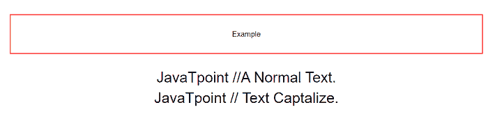

* * *