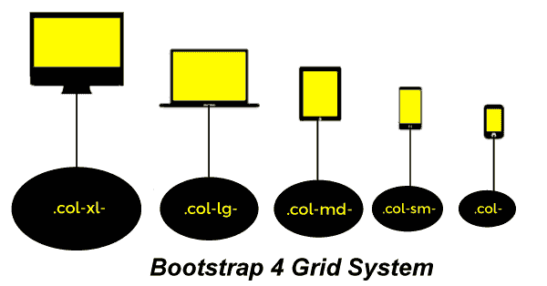
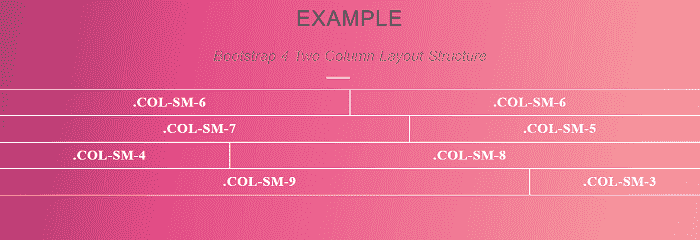
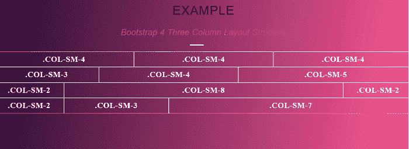

# Bootstrap4 网格系统

> 原文：<https://www.javatpoint.com/bootstrap-4-grid-system>

在本文中，我们将借助各种示例详细了解 bootstrap 4 网格系统。

### bootstrap 4 网格系统是什么意思？

在 Bootstrap 4 中，网格系统是响应的。在网格系统中，列将根据屏幕大小重新排列，即小、大、超小和超大。在大屏幕上，即桌面和笔记本电脑屏幕上，内容以三列组织可能会更好看，但在小屏幕上，即平板电脑、手机等。，如果内容项相互堆叠会更好。

### Bootstrap4 网格类



**Bootstrap 4 网格系统有五个等级:**

*   。 **col-** 该类用于屏幕宽度小于 576px，列数为 12 的超小型设备。这个类有水平行为，适用于人像手机。在这个容器中宽度是零。
*   。 **col-sm-** 此类用于屏幕宽度等于或大于 576px 的小型设备，列数为 12。这个类已经折叠开始，在水平断点之上，适用于风景手机。这个容器的宽度是 540 像素。
*   **。col-md** -该类用于屏幕宽度等于或大于 768px，列数为 12 的中型设备。这个类已经折叠开始，在水平断点之上，适合平板电脑。这个容器的宽度是 720 像素。
*   。 **col-lg-** 此类用于屏幕宽度等于或大于 992px，列数为 12 的大型设备。此类已折叠开始，位于水平断点上方，适用于笔记本电脑。这个容器的宽度是 960 像素。
*   **。col-xl-** 该类用于屏幕宽度等于或大于 1200px，列数为 12 的 xlarge 设备。此类已折叠开始，位于水平断点上方，适用于笔记本电脑和台式机。这个容器的宽度是 1140 像素。

**我们来看一下 bootstrap 4 网格系统的各个例子。**

### 例 1:

```

<! DOCTYPE html>          
<html lang="en">          
<head>          
  <title> Bootstrap 4 Image thumbnail Example </title>          
  <meta charset="utf-8">          
  <meta name="viewport" content="width=device-width, initial-scale=1">          
  <link rel="stylesheet" href="https://maxcdn.bootstrapcdn.com/bootstrap/4.0.0-alpha.6/css/bootstrap.min.css">          
  <script src="https://ajax.googleapis.com/ajax/libs/jquery/3.3.1/jquery.min.js"> </script>          
  <script src="https://cdnjs.cloudflare.com/ajax/libs/popper.js/1.14.3/umd/popper.min.js"> </script>          
  <script src="https://maxcdn.bootstrapcdn.com/bootstrap/4.1.3/js/bootstrap.min.js"> </script>          
   <link href="https://maxcdn.bootstrapcdn.com/font-awesome/4.3.0/css/font-awesome.min.css" rel="stylesheet">    
      <title> Bootstrap 4 Basic Grid Structure Example </title>
	  </head>
      <style>
         .grid_system  div[class^="col"] {
            border: 1px solid white;
            background: #e4dcdc;
            text-align: center;
            padding-top: 5px;
            padding-bottom: 5px
         }	
@import url("https://fonts.googleapis.com/css2?family=Rubik:wght@900&display=swap");
.heading h1 {
  text-align: center;
  color: #222; 
  font-size: 40px; 
  font-weight: 400;
  text-transform: uppercase;
  word-spacing: 1px; 
  letter-spacing: 2px; 
  color: black;
  margin: 20px;
  font-family: "Rubik", sans-serif;
}
.heading h1 span {
  line-height: 2em; 
  padding-bottom :15px;
  text-transform: none;
  font-size: .7em;
  margin: 20px;
  font-weight: normal;
  font-style: italic; 
  font-family: "Rubik", sans-serif;
  color: #999; 
 letter-spacing: -0.005em; 
  word-spacing: 1px;
}
.heading h1:after {
  position: absolute;
  left: 0;
  bottom: 0;
  width: 45px;
  height: 4px;
  content: "";
  right: 45px; 
  margin: auto;
  background-color: #ccc;
}
heading h1:before {
  position: absolute;
  left: 0;
  bottom: 0;
  width: 45px;
  height: 4px;
  content: "";
  right: 45px; 
  margin: auto;
  background-color: #ccc;
}
.heading h1:before { 
background-color: #d78b8b;
  left: 45px; 
  width: 90px;
}
   body {
  color: #fff;
  font-family: 'Raleway';
  font-size: 1.6rem;
  font-weight: 700;
  letter-spacing: 1px;
  height: 100vh;
  margin: 0;
  text-transform: uppercase;
}
.gradient-background {
  background: linear-gradient(100deg,#200c32,#e74d89,#febaa6);
  background-size: 180% 180%;
  animation: gradient-animation 9s ease infinite;
}
@keyframes gradient-animation {
  0% {
    background-position: 0% 50%;
  }
  50% {
    background-position: 100% 50%;
  }
  100% {
    background-position: 0% 50%;
  }
}
h1 {
  position: relative;
  padding: 0;
  margin: 0;
  font-family: "Raleway", sans-serif;
  font-weight: 300;
  font-size: 40px;
  color: #080808;
  -webkit-transition: all 0.4s ease 0s;
  -o-transition: all 0.4s ease 0s;
  transition: all 0.4s ease 0s;
}
h1 span {
  display: block;
  font-size: 0.5em;
  line-height: 1.3;
}
      </style>
   <body class="gradient-background">
	<center>
<div class = "heading">
  <h1> Example
    <span> Bootstrap 4 Basic Grid Structure
 </span>
  </h1>
</div>
      <div class = "grid_system">
         <div class = "row">
            <div class = "col-sm-1"> .col-sm-1 </div>
            <div class = "col-sm-1"> .col-sm-1 </div>
            <div class = "col-sm-1"> .col-sm-1 </div>
            <div class = "col-sm-1"> .col-sm-1 </div>
            <div class = "col-sm-1"> .col-sm-1 </div>
            <div class = "col-sm-1"> .col-sm-1 </div>
            <div class = "col-sm-1"> .col-sm-1 </div>
            <div class = "col-sm-1"> .col-sm-1 </div>
            <div class = "col-sm-1"> .col-sm-1 </div>
            <div class = "col-sm-1"> .col-sm-1 </div>
            <div class = "col-sm-1"> .col-sm-1 </div>
            <div class = "col-sm-1"> .col-sm-1 </div>
         </div>
         <div class = "row">
            <div class = "col-sm-3"> .col-sm-3 </div>
            <div class = "col-sm-3">.col-sm-3 </div>
            <div class = "col-sm-3"> .col-sm-3 </div>
            <div class = "col-sm-3"> .col-sm-3 </div>
         </div>
                  <div class = "row">
            <div class = "col-sm-4"> .col-sm-4 </div>
            <div class = "col-sm-4"> .col-sm-4 </div>
            <div class = "col-sm-4"> .col-sm-4 </div>
         </div>
         <div class = "row">
            <div class =" col-sm-3"> .col-sm-3 </div>
            <div class = "col-sm-3"> .col-sm-3 </div>
            <div class = "col-sm-6"> .col-sm-6 </div>
         </div>
             <div class = "row">
            <div class = "col-sm-5"> .col-sm-5 </div>
            <div class = "col-sm-7"> .col-sm-7 </div>
         </div>
            <div class = "row">
            <div class = "col-sm-6"> .col-sm-6 </div>
            <div class = "col-sm-6"> .col-sm-6 </div>
         </div>
                  <div class = "row">
            <div class = "col-sm-12"> .col-sm-12 </div>
         </div>
      </div>
   </body>
</html>

```

**说明:**

在上面的例子中，我们创建了一个 bootstrap 4 基本网格结构的例子。

**输出:**

下面是这个例子的输出。


### 例 2:

```

<! DOCTYPE html>          
<html lang="en">          
<head>          
  <title> Bootstrap 4 two column layout strcture Example </title>          
  <meta charset="utf-8">          
  <meta name="viewport" content="width=device-width, initial-scale=1">          
  <link rel="stylesheet" href="https://maxcdn.bootstrapcdn.com/bootstrap/4.0.0-alpha.6/css/bootstrap.min.css">          
  <script src="https://ajax.googleapis.com/ajax/libs/jquery/3.3.1/jquery.min.js"> </script>          
  <script src="https://cdnjs.cloudflare.com/ajax/libs/popper.js/1.14.3/umd/popper.min.js"> </script>          
  <script src="https://maxcdn.bootstrapcdn.com/bootstrap/4.1.3/js/bootstrap.min.js"> </script>          
   <link href="https://maxcdn.bootstrapcdn.com/font-awesome/4.3.0/css/font-awesome.min.css" rel="stylesheet">    
	  </head>
      <style>
         .grid_system  div[class^="col"] {
            border: 1px solid white;
            text-align: center;
            padding-top: 5px;
            padding-bottom: 5px
         }
@import url("https://fonts.googleapis.com/css2?family=Rubik:wght@900&display=swap");
.heading h1 {
  text-align: center;
  color: #222; 
  font-size: 40px; 
  font-weight: 400;
  text-transform: uppercase;
  word-spacing: 1px; 
  letter-spacing: 2px; 
  color: black;
  margin: 20px;
  font-family: "Rubik", sans-serif;
}
.heading h1 span {
  line-height: 2em; 
  padding-bottom :15px;
  text-transform: none;
  font-size: .7em;
  margin: 20px;
  font-weight: normal;
  font-style: italic; 
  font-family: "Rubik", sans-serif;
  color: #999; 
 letter-spacing: -0.005em; 
  word-spacing: 1px;
}
.heading h1:after {
  position: absolute;
  left: 0;
  bottom: 0;
  width: 45px;
  height: 4px;
  content: "";
  right: 45px; 
  margin: auto;
  background-color: #ccc;
}
heading h1:before {
  position: absolute;
  left: 0;
  bottom: 0;
  width: 45px;
  height: 4px;
  content: "";
  right: 45px; 
  margin: auto;
  background-color: #ccc;
}
.heading h1:before { 
background-color: #d78b8b;
  left: 45px; 
  width: 90px;
}
   body {
  color: #fff;
  font-family: 'Raleway';
  font-size: 1.6rem;
  font-weight: 700;
  letter-spacing: 1px;
  height: 100vh;
  margin: 0;
  text-transform: uppercase;
}
.gradient-background {
  background: linear-gradient(100deg,#200c32,#e74d89,#febaa6);
  background-size: 180% 180%;
  animation: gradient-animation 9s ease infinite;
}
@keyframes gradient-animation {
  0% {
    background-position: 0% 50%;
  }
  50% {
    background-position: 100% 50%;
  }
  100% {
    background-position: 0% 50%;
  }
}
h1 {
  position: relative;
  padding: 0;
  margin: 0;
  font-family: "Raleway", sans-serif;
  font-weight: 300;
  font-size: 40px;
  color: #080808;
  -webkit-transition: all 0.4s ease 0s;
  -o-transition: all 0.4s ease 0s;
  transition: all 0.4s ease 0s;
}
h1 span {
  display: block;
  font-size: 0.5em;
  line-height: 1.3;
}
      </style>
     <body class="gradient-background">
	<center>
<div class="heading">
  <h1> Example
    <span> Bootstrap 4 Two Column Layout Structure
 </span>
  </h1>
</div>
      <body>
      <div class = "grid_system">
         <div class = "row">
            <div class = "col-sm-6"> .col-sm-6 </div>
            <div class = "col-sm-6"> .col-sm-6 </div>
         </div>
                  <div class = "row">
            <div class = "col-sm-7"> .col-sm-7 </div>
            <div class = "col-sm-5"> .col-sm-5 </div>
         </div>
                  <div class = "row">
            <div class = "col-sm-4"> .col-sm-4 </div>
            <div class = "col-sm-8"> .col-sm-8 </div>
         </div>
         <div class = "row">
            <div class = "col-sm-9"> .col-sm-9 </div>
            <div class = "col-sm-3"> .col-sm-3 </div>
         </div>
      </div>
      </script>
   </body>
</html>

```

**说明:**

在上面的例子中，我们创建了一个 bootstrap 4 网格两列布局结构的例子。在这个创建两列布局结构的例子中，我们创建了一组。sm-6 和。sm-6，一组。sm-5 和。sm-7 上校，一组。sm-4 和。sm-8 上校，最后一组。sm 9 和。sm-3 上校。

**输出:**

下面是这个例子的输出。



### 例 3:

```

<! DOCTYPE html>  
<html lang = "en">
   <head>
      <meta charset = "utf-8">
      <meta name = "viewport" content = "width = device-width, initial-scale = 1, shrink-to-fit = no">
      <link rel = "stylesheet" 
         href = "https://stackpath.bootstrapcdn.com/bootstrap/4.1.3/css/bootstrap.min.css" 
         integrity = "sha384-MCw98/SFnGE8fJT3GXwEOngsV7Zt27NXFoaoApmYm81iuXoPkFOJwJ8ERdknLPMO" 
         crossorigin = "anonymous">
      <title> Bootstrap 4 Three Column Layout Structure </title>
      <script src = "https://code.jquery.com/jquery-3.3.1.slim.min.js"
         integrity = "sha384-q8i/X+965DzO0rT7abK41JStQIAqVgRVzpbzo5smXKp4YfRvH+8abtTE1Pi6jizo" 
         crossorigin = "anonymous">
      </script>
      <script src = "https://cdnjs.cloudflare.com/ajax/libs/popper.js/1.14.3/umd/popper.min.js" 
         integrity = "sha384-ZMP7rVo3mIykV+2+9J3UJ46jBk0WLaUAdn689aCwoqbBJiSnjAK/l8WvCWPIPm49" 
         crossorigin = "anonymous">
      </script>
            <script src = "https://stackpath.bootstrapcdn.com/bootstrap/4.1.3/js/bootstrap.min.js" 
         integrity = "sha384-ChfqqxuZUCnJSK3+MXmPNIyE6ZbWh2IMqE241rYiqJxyMiZ6OW/JmZQ5stwEULTy" 
         crossorigin = "anonymous">
      </script>
	  </head>
      <style>
         .grid_system  div[class^="col"] {
            border: 1px solid white;
                    text-align: center;
            padding-top: 5px;
            padding-bottom: 5px
         }
	@import url("https://fonts.googleapis.com/css2?family=Rubik:wght@900&display=swap");
.heading h1 {
  text-align: center;
  color: #222; 
  font-size: 40px; 
  font-weight: 400;
  text-transform: uppercase;
  word-spacing: 1px; 
  letter-spacing: 2px; 
  color: black;
  margin: 20px;
  font-family: "Rubik", sans-serif;
}
.heading h1 span {
  line-height: 2em; 
  padding-bottom :15px;
  text-transform: none;
  font-size: .7em;
  margin: 20px;
  font-weight: normal;
  font-style: italic; 
  font-family: "Rubik", sans-serif;
  color: #999; 
 letter-spacing: -0.005em; 
  word-spacing: 1px;
}
.heading h1:after {
  position: absolute;
  left: 0;
  bottom: 0;
  width: 45px;
  height: 4px;
  content: "";
  right: 45px; 
  margin: auto;
  background-color: #ccc;
}
heading h1:before {
  position: absolute;
  left: 0;
  bottom: 0;
  width: 45px;
  height: 4px;
  content: "";
  right: 45px; 
  margin: auto;
  background-color: #ccc;
}
.heading h1:before { 
background-color: #d78b8b;
  left: 45px; 
  width: 90px;
}
   body {
  color: #fff;
  font-family: 'Raleway';
  font-size: 1.6rem;
  font-weight: 700;
  letter-spacing: 1px;
  height: 100vh;
  margin: 0;
  text-transform: uppercase;
}
.gradient-background {
  background: linear-gradient(100deg,#200c32,#e74d89,#febaa6);
  background-size: 180% 180%;
  animation: gradient-animation 9s ease infinite;
}
@keyframes gradient-animation {
  0% {
    background-position: 0% 50%;
  }
  50% {
    background-position: 100% 50%;
  }
  100% {
    background-position: 0% 50%;
  }
}
h1 {
  position: relative;
  padding: 0;
  margin: 0;
  font-family: "Raleway", sans-serif;
  font-weight: 300;
  font-size: 40px;
  color: #080808;
  -webkit-transition: all 0.4s ease 0s;
  -o-transition: all 0.4s ease 0s;
  transition: all 0.4s ease 0s;
}
h1 span {
  display: block;
  font-size: 0.5em;
  line-height: 1.3;
}
      </style>
      <body class="gradient-background">
	<center>
<div class="heading">
  <h1> Example
    <span> Bootstrap 4 Three Column Layout Structure
 </span>
  </h1>
</div>
      <body>
      <div class = "grid_system">
         <div class = "row">
            <div class = "col-sm-4"> .col-sm-4 </div>
            <div class = "col-sm-4"> .col-sm-4 </div>
            <div class = "col-sm-4"> .col-sm-4 </div>
         </div>
                  <div class = "row">
            <div class = "col-sm-3"> .col-sm-3 </div>
            <div class = "col-sm-4"> .col-sm-4 </div>
            <div class = "col-sm-5"> .col-sm-5 </div>
         </div>
                  <div class = "row">
            <div class = "col-sm-2"> .col-sm-2 </div>
            <div class = "col-sm-8"> .col-sm-8 </div>
            <div class = "col-sm-2"> .col-sm-2 </div>
         </div>
        <div class = "row">
            <div class = "col-sm-2"> .col-sm-2 </div>
            <div class = "col-sm-3"> .col-sm-3 </div>
            <div class = "col-sm-7"> .col-sm-7 </div>
         </div>
      </div>
         </body>
</html> 

```

**说明:**

在上面的例子中，我们创建了一个 bootstrap 4 网格三列布局结构的例子。在这个创建三列布局结构的例子中，我们创建了一组。col-sm 4，。sm-4 和。col-sm 4，一组。col-sm 3，。sm-4 和。sm-5 上校，一组。col-sm 2，。sm-8 和。sm-2，最后一组。col-sm 2，。sm-3 和。sm 7 上校。

**输出:**

下面是这个例子的输出。



* * *