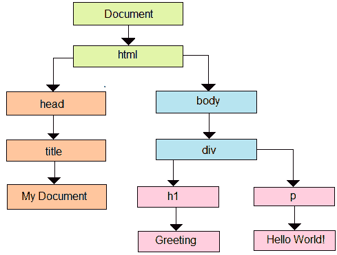

# D3.js 的概念

> 原文：<https://www.javatpoint.com/concepts-of-d3-js>

D3.js 是一个 JavaScript 库，它是以下一些基本概念的开源库:

*   DOM 的操纵数据驱动(**文档对象模型**)。
*   用形状和数据实现。
*   布局地理、网络、层次和线性数据的可视组件。
*   支持用户界面状态之间的有效转换。
*   实现流畅的用户交互。

### D3.js 的网络标准

在进行 [D3.js](d3-js) 可视化之前，我们需要了解一些网络标准。在 D3.js 中，可以使用一些基本的 web 标准，如下所示:

*   超文本标记语言
*   文档对象模型
*   层叠样式表
*   可缩放矢量图形
*   Java Script 语言

让我们一步一步地详细探索和讨论上述 web 标准。

### 1.超文本标记语言

超文本标记语言( **HTML** )可以用来组织任何网页的内容。 [HTML](https://www.javatpoint.com/html-tutorial) 与**一起存储在文本文件中。html"** 扩展名。

让我们考虑一个例子。

**示例:**

超文本标记语言的经典示例如下所示:

```

<!DOCTYPE html>
<html lang = "en">
<head>
<meta charset = "UTF-8">
<title></title>
</head>
<body>
</body>
</html>

```

### 2.文档对象模型

如果通过浏览器加载 HTML 的任何页面，它将被转换成任何层次结构。HTML 中的所有标签都随着父子层次结构一起被转换成 DOM 中的对象/元素。这种方法使我们的 HTML 逻辑结构化。当 DOM 形成时，在页面上使用(移除/修改/添加)组件将是有效的。

让我们借助一个 HTML 文档来理解和解释 DOM，如下所示:

```

<!DOCTYPE html>
<html lang = "en">
<head>
<title>My Document</title>
</head>
<body>
<div>
<h1>Greeting</h1>
<p>Hello World!</p>
</div>
</body>
</html>

```

超文本标记语言文档的文档对象模型如下所示:



### 3.层叠样式表

各种样式的 CSS 可以让任何网页变得更加时尚，其中 HTML 为任何网页提供了一个结构。CSS ( **层叠样式表**)是一种样式表语言，用于指定用 [XML](https://www.javatpoint.com/xml-tutorial) (包括 XHTML 或 SVG 等 XML 方言)或 HTML 编写的文档表示。 [CSS](https://www.javatpoint.com/css-tutorial) 指定组件必须如何在任何网页上呈现。

### 4.可缩放矢量图形

可缩放矢量图形用于在网页上呈现图像。虽然它是用来用文字制作图像的，但它不是任何直接的图像。正如其名称所定义的，它是**可伸缩向量**。它可以根据浏览器的大小自行缩放；因此，浏览器的大小调整不会改变图像。每个浏览器都可以支持 SVG，不包括 IE8 及以下版本。数据可视化用于可视化表示。使用 D3.js 将 SVG 应用于交付可视化将会很方便。

假设 [SVG](https://www.javatpoint.com/svg-tutorial) 就像画布一样，我们可以在画布上画出不同的形状。因此，首先，让我们将 SVG 标记如下:

```

<svg width = "500" height = "500"></<svg>

```

SVG 使用像素作为默认度量，因此我们不需要描述单位是什么像素。如果我们想要绘制任何矩形，我们可以使用如下代码来绘制它:

```

<svg width = "500" height = "500">
<rect x = "0" y = "0" width = "300" height = "200"></rect>
</svg>

```

我们可以使用 SVG 绘制另一个形状，如**路径、文本、椭圆、圆**和**线**。

与设计 HTML 元素类似，设计 SVG 元素的样式也非常简单。让我们把矩形的背景颜色变成你想要的任何颜色。我们需要插入一个“填充”属性，并描述像红色这样的值，如下所示:

```

<svg width = "500" height = "500">
<rect x = "0" y = "0" width = "300" height = "200" fill = "yellow"></rect>
</svg>

```

### 5.Java Script 语言

[JavaScript 语言](https://www.javatpoint.com/javascript-tutorial)是在用户浏览器内部实现的客户端的任何松散类型的脚本语言。这种语言与 HTML 元素(DOM 元素)进行交互，以创建更具交互性的网络用户界面。该语言执行 ***ECMAScript 标准*** ，该标准根据 ECMA-262 的规范添加了核心特性。它还增加了基于 ***ECMAScript 标准*** 没有描述的其他功能。JavaScript 的知识是 D3.js 的任何先决条件。

* * *