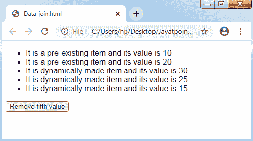

# D3.js 中的数据连接

> 原文：<https://www.javatpoint.com/data-join-in-d3-js>

D3.js 还有另一个基本概念，即数据连接。它实现了选择，并支持我们将 HTML 文档用于我们的数据集(数值的集合)。默认情况下，D3.js 在与 HTML 文档及其方法相关的数据集中的每个组件内提供**最高优先级的数据集**。此外，我们将详细学习数据连接概念。

### 什么是数据连接？

[D3.js](d3-js) 的概念支持我们基于 [HTML](https://www.javatpoint.com/html-tutorial) 的现有文档中的数据集来移除、修改和**注入**项(HTML 的项以及 SVG 的项)。默认情况下，数据集中的每个数据元素都与文档中的一个项目(图形)相关。

我们知道，任何数据集修改，相关的项目也可以很快使用。数据连接在文档的图形项和我们的数据之间建立了紧密的联系。数据连接构建了项目的操作(基于数据集)简单直接的过程。

### 它是如何工作的？

数据连接的主要目标是任何提供的数据集中现有文档的项目映射。数据连接可以根据提供的数据集进行文档的虚拟表示。它给出了用虚拟表示执行的技术。

让我们了解如下所示的一般数据:

```

[10, 20, 30, 25, 15]

```

上面的数据集包含五个项目，因此它可以与文档的五个组件进行映射。

让我们使用选择器的 selectAll()方法和数据连接的 data()方法将其映射到文档的

*   Label.

**HTML**

```

<ul id = "list">
<li><li>
<li></li>
</ul>

```

**D3 . js 的代码**

```

d3.select("#list").selectAll("li").data([10, 20, 30, 25, 15]);

```

这里有五个项目在文档中是虚拟的。虚拟的前两项是文档中的任意两个

*   Item, as shown in the figure below:

```

1\. li - 10
2\. li - 20

```

我们可以对

*   The first two items of any application selector change technology, such as text (), style () and property (), are as follows:

```

d3.select("#list").selectAll("li")
.data([10, 20, 30, 25, 15])
.text(function(d) { return d; });

```

text()方法内部的函数可以用来获取

*   The mapping data of the item. In the code above, D defines the first*   Item 10 and item 2*   20 of the projects.

其余三个项目可以与任何项目进行映射。在数据连接的 enter()方法和选择器的 append()方法的帮助下，这是可能的。enter()让我们可以访问任何剩余的数据(没有与现有项目映射)，append()让我们可以从相关数据中创建任何新项目。

让我们为剩余的数据项制作

*   Elements. Data mapping can be as follows:

```

3\. li - 30
4\. li - 25
5\. li - 15

```

制作新

*   The code of the item is as follows:

```

d3.select("#list").selectAll("li")
.data([10, 20, 30, 25, 15])
.text(function(d) { return "This is pre-existing element and the value is " + d; })
.enter()
.append("li")
 .text(function(d) 
{ return "This is dynamically created element and the value is " + d; });

```

数据连接提供了另一种称为 exit()方法的技术，用于动态处理从数据集中移除的数据元素，如下所示:

```

d3.selectAll("li")
.data([10, 20, 30, 15])
.exit()
.remove()

```

我们已经从上述数据集中移除了第 4 个<sup>元素，并借助移除()和退出()方法关联了< li >。</sup>

整个代码可以如下所示:

**示例:**

```

<!DOCTYPE html>
<html>
<head>
<script type = "text/javascript" src = "https://d3js.org/d3.v4.min.js">
</script>
<style>
body { font-family: Arial; }
</style>
</head>
<body>
<ul id = "list">
<li></li>
<li></li>
</ul>
<input type = "button" name = "remove" value = "Remove fifth value" 
onclick = "javascript:remove()" />
<script>
d3.select("#list").selectAll("li")
.data([10, 20, 30, 25, 15])
.text(function(d) 
{ return "It is a pre-existing item and its value is " + d; })
.enter()
.append("li")
.text(function(d) 
{ return "It is dynamically made item and its value is " + d; });
function remove() {
d3.selectAll("li")
.data([10, 20, 30, 15])
.exit()
.remove()
}
</script>
</body>
</html>

```

**输出:**



**移除第五项后-**


* * *