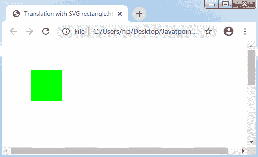
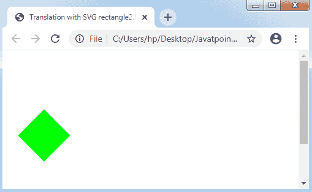
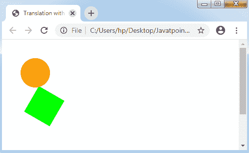
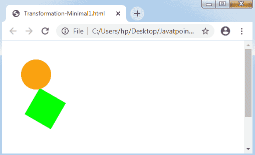
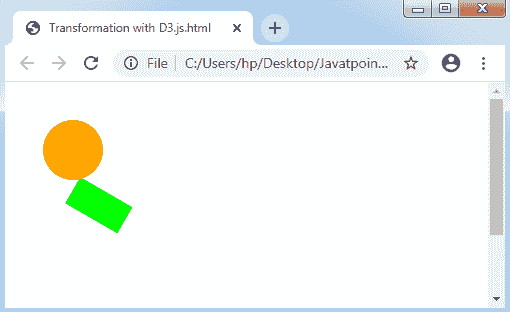

# SVG 转换

> 哎哎哎:1230【https://www . javatppoint . com/D3-js-SVG 转换】

**可缩放矢量图形(SVG)** 为变换单个项目或 SVG 项目集合的形状提供了几个选项。SVG 的转换支持**倾斜、旋转、缩放**和**平移**。

让我们理解本章中描述的 [SVG](https://www.javatpoint.com/svg-tutorial) 转换的概念。

### 介绍

可缩放矢量图形表示一个名为**变换**的新属性，它支持变换。

一些可能的值指定如下:

**翻译:**这个值包含两个基本选项。第一个选项，即 **tx** ，代表与 **x 轴**的平移。第二个选项是 **ty** ，代表与 **y 轴**的平移。比如，翻译(30 30)。

**旋转:**该值包含三个重要选项。第一个选项是**角度**，代表一个**旋转角度**。第二个和第三个选项是 **cx** 和 **cy** ，代表 **x 轴**和 **y 轴**内的旋转中心。当 cy 和 cx 未被描述时，它将成为最新坐标系原点的默认值。例如旋转(60°)。

**刻度:**刻度值有两个选项。第一个是 sx，它显示了 x 轴的任何比例因子。第二个是 sy，它说明了 y 轴的比例因子。在这个值中，sy 因子保存 sx 值，如果没有指定，它是可选的，例如 scale (10)。

**偏斜:**它持有单个期权。斜角表示 ShOx 与 x 轴的角度和 ShOy 与 y 轴的角度，例如 ShOx(20°)。

让我们考虑一些例子。

**例:1**

**用 SVG 矩形平移**

```

<!DOCTYPE html>
<html>
<head>
<script type = "text/javascript" src = "https://d3js.org/d3.v4.min.js">
</script>
</head>
<body>
<svg width = "300" height = "300">
<rect x = "20" 
 y = "20"
width = "60"
height = "60"
fill = "lime"
transform = "translate(30 30)">
</rect>
</svg>
</body>
</html>

```

**输出:**



*   两个或更多的转换也可以用一个空格作为分隔来描述任何单个的 SVG 项。当指定两个或多个值时，可以在指定的顺序内顺序使用转换。

**例:2**

```

<!DOCTYPE html>
<html>
<head>
<script type = "text/javascript" src = "https://d3js.org/d3.v4.min.js">
</script>
</head>
<body>
<svg width = "300" height = "300">
<rect x = "20" 
y = "20"
width = "60"
height = "60"
fill = "lime"
transform = "translate(60 60) rotate(45)">
</rect>
</svg>
</body>
</html>

```

**输出:**



*   该转换也可以用于对 SVG 项进行分组。它能够转换 SVG 中显示的任何复杂图形，如下所述:

**例:3**

```

<!DOCTYPE html>
<html>
<head>
<script type = "text/javascript" src = "https://d3js.org/d3.v4.min.js">
</script>
</head>
<body>
<svg width = "300" height = "300">
 <g transform= "translate(60, 60) rotate(30)">       
<rect x = "20" 
y = "20"
width = "60"
height = "60"
fill = "lime">                 
</rect>
<circle cx= "0"   
cy= "0"
r= "30"
fill= "orange"/>
</g>  
</svg>
</body>
</html>

```

**输出:**



### 最小插图

它试图使用变换来旋转和缩放图像，以生成任何 SVG 图像。

让我们通过下面的例子来理解:

**示例:**

```

<!DOCTYPE html>
<html>
<head>
<script type = "text/javascript" src = "https://d3js.org/d3.v4.min.js">
</script>
<style>
body {font-family: Arial;}
</style>
</head>
<body>
<div id= "svgcontainer"> 
<svg width = "300" height = "300">
<g transform= "translate(60, 60) rotate(30)">       
<rect x = "20" 
y = "20"
width = "60"
height = "60"
fill = "lime">                 
</rect>
<circle cx= "0"   
cy= "0"
r= "30"
fill= "orange"/>
</g>  
</svg>
</div>  
</body>
</html>

```

**输出:**



### 用 D3.js 转换

我们将在下图中学习如何使用 [D3.js](d3-js) 应用转换:

**示例:**

```

<!DOCTYPE html>
<html>
<head>
<script type = "text/javascript" src = "https://d3js.org/d3.v4.min.js">
</script>
<style>
body {font-family: Arial;}
</style>
</head>
<body>
<div id= "svgcontainer"></div>
<script language= "javascript">
var width= 300;
var height= 300;
var svg= d3.select("#svgcontainer")
.append("svg")
.attr("width", width)
.attr("height", height);
var group= svg.append("g")
.attr("transform", "translate(60, 60) rotate(30)");
var rect= group.append("rect")
.attr("x", 20)
.attr("y", 20)
.attr("width", 60)
.attr("height", 30)
.attr("fill", "lime")
var circle= group
.append("circle")
.attr("cx", 0)
.attr("cy", 0)
.attr("r", 30)
.attr("fill", "orange")
</script>
</div>
</body>
</html>

```

**输出:**



### 转换库

D3.js 提供了一个独立的库来维护转换，而无需手动创建任何转换属性。它提供了管理每种转换类型的技术。一些技术是旋转()、缩放()、平移()和变换()。我们可以在网页中添加 d3-transform，脚本如下:

```

<script src = "http://d3js.org/d3.v4.min.js"></script>
<script src = "d3-transform.js"></script>

```

* * *