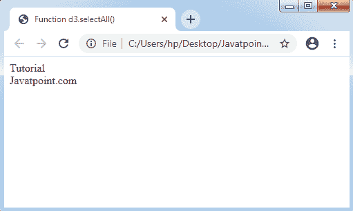
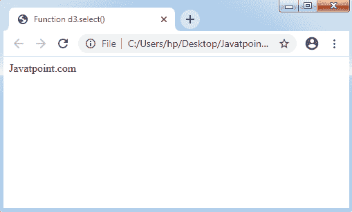

# D3.js 中的选择 API

> 原文：<https://www.javatpoint.com/selection-api-in-d3-js>

一个选择是强大的 DOM(**文档对象模型**)数据驱动转换。可应用于设置**文本内容或 [HTML](https://www.javatpoint.com/html-tutorial) 、属性、样式、属性**等。这个 D3.js 的章节将帮助你理解选择 API。

### 应用编程接口配置

我们可以使用下面的脚本来配置 [API](https://www.javatpoint.com/api-full-form) 。

```

<script src = "https://d3js.org/d3-selection.v1.min.js"></script>
<script>
</script>

```

## 原料药的选择方法

下面列出了选择应用编程接口的基本方法。

*   d3 .选择
*   d3.选择全部（选择器）
*   d3 .选择(选择器)
*   选择全部(选择器)
*   selection.merge(其他)
*   selection.filter(筛选器)
*   d3 .创建者(姓名)
*   d3 .匹配器(选择器)
*   selection.call(函数[，参数？])
*   selection .每个(函数)
*   d3.local()
*   local.get(节点)
*   local.set(节点，值)
*   local.remove(节点)

让我们详细讨论一下上述方法。

### d3 .选择

选择应用编程接口有一个 d3.selection 方法，用于选择房间组件。它也可以应用于扩展任何选择 d3js 或测试选择。

### d3.选择全部（选择器）

这个选择 API 方法可以选择与指定的字符串选择器相同的每个组件。

**语法:**

```

d3.selectAll("element")

```

让我们考虑一个例子。

**示例:**

```

<!DOCTYPE html> 
<html> 
<head> 
<title> 
Function d3.selectAll() 
</title> 
<script src = "https://d3js.org/d3.v4.min.js"></script> 
</head> 

<body> 
<div>Tutorial</div> 
<div>Javatpoint.com</div> 
<script> 
// selectAll() function 
d3.selectAll("div").text(); 
</script> 
</body> 
</html>         

```

**输出**



### d3 .选择(选择器)

它定义了与指定的字符串选择器相同的第一个组件选择的用法。

**语法:**

```

d3.select("element")

```

让我们考虑一个例子。

**示例:**

```

<!DOCTYPE html> 
<html> 
<head> 
<title> 
Function d3.select() 
</title> 
<script src = "https://d3js.org/d3.v4.min.js"></script> 
</head> 

<body>
<div> Javatpoint.com</div> 

<script> 
// Calling the select() function 
var a = d3.select("div").text(); 

// the selected element 
doucment.write(a); 
</script> 
</body> 
</html>               

```

**输出**



### 选择全部(选择器)

这是另一种选择应用编程接口的方法，说明了组件选择的用法。它可以选择与指定的字符串选择器相同的后代组件。在任何返回的选择中，组件由选择中的相关父节点收集在一起。

如果没有组件(与描述的最新组件的选择器相同)，或者选择器为空，则最新索引上的集合将为空。

**语法:**

```

var b = d3.selectAll("p").selectAll("b");

```

### selection.merge(其他)

它将返回一个与所描述的其他选择合并的唯一选择。

**语法:**

```

var rect = svg.selectAll("rect").data(data);
rect.enter().append("rect").merge(rect);

```

### selection.filter(筛选器)

它应用于选择过滤器，并将返回一个唯一的选择，该选择只包括指定过滤器为其提供真值的组件。

**语法:**

```

var even = d3.selectAll("tr").filter(":nth-child(odd)");

```

### d3 .创建者(姓名)

它可以用于指定指定的组件名称。它将给出一个函数，该函数将生成提供的名称的组件，假设它是一个父组件。

**语法:**

```

selection.append(d3.creator("p"));

```

### d3 .匹配器(选择器)

这个选择应用编程接口方法分配一个指定的选择器。它将给出一个函数，这个函数将返回真值。

```

var p = selection.filter(d3.matcher("p"));

```

### selection.call(函数[，参数？])

它只调用一次指定的函数。

**语法:**

```

function name(selection, first, last) {
   selection.attr("first-name", first).attr("last-name", last);
}

```

### selection .每个(函数)

它对所有选定的组件调用任何指定的函数，按照由最新的组(节点)、最新的索引(I)和最新的数据(d)作为最新的 DOM 组件(节点[I])传递的顺序。

其描述如下:

```

parent.each(function(p, j) {
   d3.select(this)
      .selectAll(".child")
      .text(function(d, i) { return "child " + d.name + " of " + p.name; });
});

```

### d3.local()

它允许我们描述任何本地状态，即数据无关。

```

var data = d3.local();

```

DOM 也可以观察到每个局部值。

### local.set(节点，值)

它可以在值的指定节点上设置本地的值。

```

selection.each(function(d) 
   { data.set(this, d.value); });
local.get(node)

```

### local.remove(节点)

选择 API 还有另一个重要的方法，即 **local.remove(node)** 。它可以从指定的节点中移除本地的值。当表示一个节点时，它将给出真实值。否则，它将返回假值。

* * *