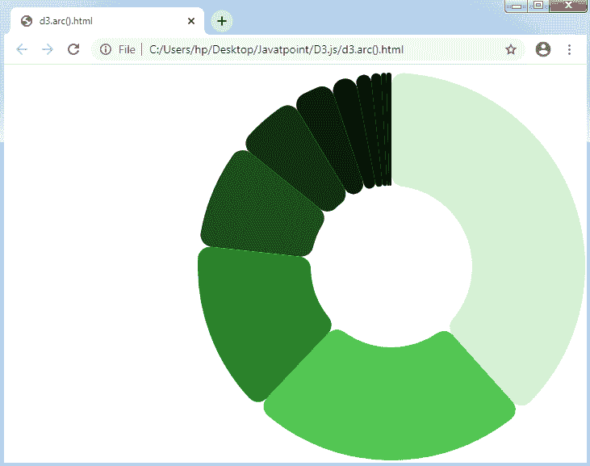

# D3.js 中的形状 API

> 原文：<https://www.javatpoint.com/shapes-api-in-d3-js>

在这里，我们将讨论如何在 D3.js 中生成不同的形状。

## 配置应用编程接口

下面提到的脚本可以配置形状 [API](https://www.javatpoint.com/api-full-form) 。

```

<script src = "https://d3js.org/d3-path.v1.min.js"></script>
<script src = "https://d3js.org/d3-shape.v1.min.js"></script>
<script>
</script>

```

## 发电机形状

在 [d3.js](d3-js) 中，我们可以使用许多不同类型的形状。

让我们了解这些形状，讨论如下:

*   **API 弓**

该电弧发生器将产生一个**环形**或一个**圆形**。我们已经在饼图的前几章中应用了这些 API 方法。

让我们详细配置 Arcs API 的各种方法。

**d3.arc():** 如果我们想设计一个电弧发生器，那么可以用这个方法。

**弧(args):** 该方法可用于产生带有给定指定参数的弧。

默认设置以及角度和对象半径描述如下:

```

<script>
 var arc = d3.arc();
 arc({
 innerRadius: 0,
outerRadius: 100,
startAngle: 0,
endAngle: Math.PI / 2
 });
</script>

```

**弧形心(args):** 用于测量弧中心线的中点[x，y]以及所描述的参数。

**圆弧.内半径(【半径】):**可用于通过任何提供的半径固定内半径，并将返回圆弧发生器。

它可以定义如下:

```

function innerRadius(d) {
return d.innerRadius;
}

```

**圆弧外半径(【半径】):**用于通过提供的半径固定一个外半径，它将返回圆弧发生器。

它可以定义如下:

```

function outerRadius(d) {
return d.outerRadius;
}

```

**arc . corner radius([radius]):**用于通过提供的半径固定一个拐角半径，它将返回电弧发生器。

它可以定义如下:

```

function cornerRadius() {
return 0;
}

```

如果角半径大于 0，圆弧的角将在给定半径圆的帮助下变圆。此拐角半径不会大于半径值=(外半径-内半径)/ 2。

**arc.startAngle([angle]):** 用于从任意给定角度设置函数的起始角度。

可以描述如下:

```

function startAngle(d) {
return d.startAngle;
}

```

**arc.endAngle([angle]):** 用于从任意给定角度设置函数的结束角度。

可以描述如下:

```

function endAngle(d) {
return d.endAngle;
}

```

**arc.padAngle([angle]):** 用于从任意给定角度设置函数的 pad 角度。

可以描述如下:

```

function padAngle() {
return d && d.padAngle;
}

```

**圆弧半径(【半径】):**用于通过提供的半径向指定的函数设置一个半径。焊盘半径将距离描述为隔离相邻弧的固定线性距离，描述为焊盘半径*焊盘角度。

**arc . context(【context】):**可以用来固定上下文，会返回电弧发生器。

*   脚 API

饼图应用编程接口用于设计任何**饼图生成器**。让我们详细讨论一下。

**d3.pie:** 它和一些默认设置一起用来构建一个生成器。

**派(数据[。Arguments]):** 用于对给定数组的值生成饼图。它将返回一个对象的数组。对象是基准弧的角度。

所有对象都具有下面讨论的一些属性:

*   数据:输入数据，输入数据数组中的相关组件。
*   值:弧的数值。
*   指数:弧的指数。
*   起始角度:弧的起始角度。
*   角度:弧的结束角度。
*   焊盘角度:弧的焊盘角度。

**饼图. value([value]):** 设置指定的函数值，生成饼图。其描述如下:

```

function value(d) {
return d;
}

```

**pie.sort([compare]):** 它对指定的函数数据进行排序并生成一个 pie。其描述如下:

```

pie.sort(function(a, b) 
{ return a.name.localeCompare(b.name); }
);

```

**pie . sort values([compare]):**它比较任何提供的函数的各种值，并生成一个 pie。

其描述如下:

```

function compare(a, b) {
return b - a;
}

```

**pie . start angle(【angle】):**可用于将 pie 的起始角度固定在所述函数上。当一个角度没有被描述，那么它将返回最新的开始角度。

它可以表示如下:

```

function startAngle() {
return 0;
}

```

**pie.endAngle([angle]):** 可应用于将 pie 的结束角度固定到所述功能。当一个角度没有被描述，那么它将返回最新的结束角度。

它可以表示如下:

```

function endAngle() {
return 2 * Math.PI;
}

```

**pie . pad angle(【angle】):**可用于将 pad 角度固定在所述函数上，并生成一个 pie。

它可以表示如下:

```

function padAngle() {
return 0;
}

```

**示例:**

使用 d3.arc 和 d3.pie 的基本示例如下:

```

<!DOCTYPE html>
<html>
<head>
<meta charset="utf-8">
<script src="https://d3js.org/d3.v4.min.js"></script>
<style>
body { margin:0;position:fixed;top:0;right:0;bottom:0;left:0; }
</style>
</head>

<body>
<svg width="960" height="500"></svg>
<script>
var arc = d3.arc()
.innerRadius(100)
.outerRadius(240)
.cornerRadius(15)

var svg = d3.select("svg"),
width = +svg.attr("width"),
height = +svg.attr("height"),
g = svg.append("g")
.attr("transform", "translate(" + width / 2 + "," + height / 2 +")")

var data = [1, 1, 2, 3, 5, 8, 13, 21, 34, 55, 89];
var arcs = d3.pie()(data);

console.log("arcs: ", arc(arcs[0]))
var background = g.selectAll("path")
.data(arcs)
.enter()
.append("path")
.style("fill", function(d,i){
return d3.color("hsl(120, 50%, " + d.value + "%)");
})
.attr("d", arc)
</script>
</body>
</html>

```

**输出**



*   **线路空气污染指数**

这些生产线应用编程接口用于生产生产线。我们已经在图表一章中应用了这些方法。

让我们更详细地了解这些方法。

**d3.line:** 应用于线路发生器的设计。

**行(数据):**它生成给定数据数组的任意一行。

**line.x([x]):** 用于固定所述函数的 x 取值器，产生一行。

可以描述如下:

```

function x(d) {
return d[0];
}

```

**line.y([y]):** 用于固定所述函数的 y 取值器，产生一行。

可以描述如下:

```

function y(d) {
return d[1];
}

```

**line.defined([defined]):** 用于为描述的函数固定一个定义的访问器。

可以描述如下:

```

function defined() {
return true;
}

```

**直线.曲线(【曲线】):**此方法用于生成直线并固定曲线。

**line . context(【context】):**应用于固定任何上下文并产生该行。当没有描述任何上下文时，它将返回 null。

**d3.lineRadial:** 它创建径向线。这种方法等同于线生成器(笛卡尔)。

**直线半径(【半径】):**它的访问器将返回半径并设计一条径向直线。它将保持与原点(0，0)的距离。

* * *