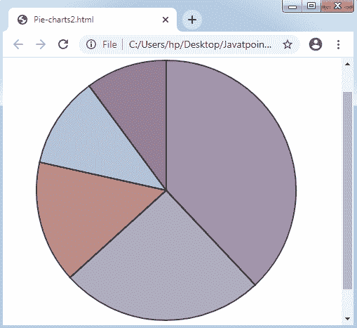

# 用 D3.js 绘制图表

> 原文：<https://www.javatpoint.com/drawing-charts-in-d3-js>

D3.js 可以用来静态设计任何 SVG 图表。它可以为设计下列图表提供支持:

*   **条形图**
*   **气泡图**
*   **圆形图**
*   **圆环图**
*   **折线图**
*   **饼图**

让我们详细地逐一考虑上面提到的图表。

## 条形图

这些图表是所有其他图表中使用最广泛的图表。条形图用于比较和显示不同的离散组或类别的频率、数量和其他度量(如平均值)。这些图表的设计形式是，不同条的长度和高度将与它们呈现的任何类别的大小成比例。

一些重要的要点如下:

*   横轴(x 轴)表示不同类型的类别；它不含刻度。
*   垂直轴(y 轴)没有任何刻度，它显示测量单位。
*   根据长度和类别的数量或类别的复杂程度，可以水平或垂直创建条形。

### 条形图的绘制

让我们借助 [SVG](https://www.javatpoint.com/svg-tutorial) 中的 D3 来设计条形图。在下面提到的例子中，我们将使用文本组件和条的 ***矩形组件*** 来显示与条相关的数据值。

请看下图的条形图:

**示例:**

**属性**

**宽度-**SVG 宽度

**缩放因子-** 缩放至像素值，即在屏幕上可见。

**barHeight-** 是单杠的静态高度。

```

<html>
<head>
<script type = "text/javascript" src = "https://d3js.org/d3.v4.min.js"></script>
<style>
svg rect 
{
fill: black;
}
svg text 
{
fill: white;
font: 12px sans-serif;
text-anchor: end;
}
</style>
</head>
<body>
<script>
var data = [11, 6, 13, 15];
var width = 300 
scaleFactor = 20, 
barHeight = 30;
var graph = d3.select("body")
.append("svg")
.attr("width", width)
.attr("height", barHeight * data.length);
var bar = graph.selectAll("g")
.data(data)
.enter()
.append("g")
.attr("transform", function(d, i) {
return "translate(0," + i * barHeight + ")";
});
bar.append("rect").attr("width", function(d) {
return d * scaleFactor;
})
.attr("height", barHeight - 1);
bar.append("text")
.attr("x", function(d) { 
return (d*scaleFactor); 
})
.attr("y", barHeight / 2)
.attr("dy", ".35em")
.text(function(d) { return d; });
</script>
</body>
</html>

```

**输出:**

上述代码的结果如下:


## 圆形图

任何圆形图都可以被定义为统计上的圆形图形，它被分类为显示数字比例的切片。

### 圆形图的绘制

让我们借助 SVG 中的 D3 制作圆图。

绘制圆形图的示例如下所示:

**示例:**在下图中-

**属性-**

**宽度-**SVG 宽度

**高度-** SVG 高度

**数据-** 数据元素的数组

**颜色-** 在圆形物品上涂抹颜色。

**其他一些属性-**

**Var g= svg.selectAll("g")-** 创建组项目以容纳一个圆。

**。数据(data)-** 将我们的数据数组绑定到任何组项。

**。输入()-** 为我们的组项目创建占位符。

**。追加(“g”)-**追加我们页面的组项目。

```

<html>
<head>
<script type = "text/javascript" src = "https://d3js.org/d3.v4.min.js">
</script>
</head>
<body>
<script>
var width = 400;
var height = 400;
var data = [11, 21, 31];
var colors = ['blue', 'yellow', 'pink'];
var svg = d3
.select("body")
.append("svg")
.attr("width", width)
.attr("height", height);
var g = svg.selectAll("g")
.data(data)
.enter()
.append("g")
.attr("transform", function(d, i) {
return "translate(0,0)";
})
g.append("circle").attr("cx", function(d, i) {
return i*75 + 50;
})
.attr("cy", function(d, i) {
return 75;
})
.attr("r", function(d) {
return d*1.5;
})
.attr("fill", function(d, i){
return colors[i];
})
g.append("text").attr("x", function(d, i) {
return i * 75 + 25;
})
.attr("y", 80)
.attr("stroke", "teal")
.attr("font-size", "10px")
.attr("font-family", "sans-serif").text(function(d) {
return d;
});
</script>
</body>
</html>

```

**输出:**

输出如下-


## 圆形分格统计图表

饼图是统计设计的圆形图形。这些被分类到一些切片中以显示数字比例。

让我们学习如何使用 D3 设计饼图。

### 饼图的绘制

首先，我们必须学习下面列出的两种基本方法:

*   **d3.arc**
*   **d3.pie**

让我们更详细地讨论以上两种方法。

**d3.arc:** 这种方法产生一个弧。我们需要固定圆弧的内半径和外半径。当内部半径包含 0 时，结果将是饼图，结果将是圆环图。

**d3.pie:** 第二种方法 d3.pie 生成饼图。d3.pie 方法保存来自数据集的数据，并确定所有饼图楔形区的开始和结束角度。

**示例:**

下面是一个显示基本饼图的示例。看一看:

```

<!DOCTYPE html>
<meta charset="utf-8">

<!-- Load d3.js -->
<script src="https://d3js.org/d3.v4.js"></script>

<!-- Build the div in which the graph will hold place -->
<div id="my_dataviz"></div>
<script>

// set the margins and dimensions of the graph
var width = 450
    height = 450
    margin = 40

// The pieplot's radius is half the height or half the width (smallest one). we will subtract a margin's bit.
var radius = Math.min(width, height) / 2 - margin

// append a svg object with the div known as 'my_dataviz'
var svg = d3.select("#my_dataviz")
  .append("svg")
    .attr("width", width)
    .attr("height", height)
  .append("g")
    .attr("transform", "translate(" + width / 2 + "," + height / 2 + ")");

// Create the dummy data
var data = {a: 9, b: 20, c:30, d:8, e:12}

// set the scale of color 
var color = d3.scaleOrdinal()
  .domain(data)
  .range(["#98abc5", "#8a89a6", "#7b6888", "#6b486b", "#a05d56"])

// Analyse every group's position over the pie:
var pie = d3.pie()
  .value(function(d) {return d.value; })
var data_ready = pie(d3.entries(data))

// Create a pie chart: Each pie's part is any path that we create using an arc function.
svg
  .selectAll('whatever')
  .data(data_ready)
  .enter()
  .append('path')
  .attr('d', d3.arc()
    .innerRadius(0)
    .outerRadius(radius)
  )
  .attr('fill', function(d){ return(color(d.data.key)) })
  .attr("stroke", "black")
  .style("stroke-width", "2px")
  .style("opacity", 0.7)
</script>

```

**输出:**

输出如下:



* * *