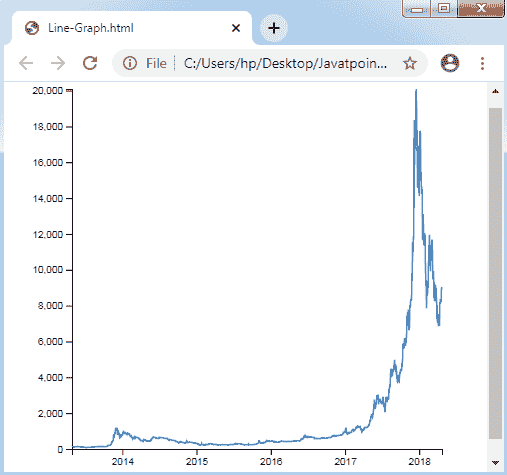

# D3.js 中的图形

> 原文：<https://www.javatpoint.com/graphs-in-d3-js>

一个图形可以定义为**任何 2D 平坦空间**图示为矩形。一个图形有两个坐标 **(x=0 和 y=0)** 落在左下角的坐标空间。一个图形有坐标 **X** ，从左向右生长。然而，坐标 **Y** 在向左的方向上向右生长。

如果我们用 x= 20 和 y= 20 这样的坐标来讨论任何圆的设计，我们从左下方向向右走 20 个单位，然后向上走 20 个单位。

### 支持向量机中的坐标空间

[SVG](https://www.javatpoint.com/svg-tutorial) 中的坐标空间以类似于数学图形的方式实现。但是，除了以下两个基本特征:

*   SCG 的坐标空间包含坐标 x=0，y=0 落在左上角方向..
*   SCG 的坐标空间包含从上到下生长的坐标 Y。

### 支持向量机中的坐标空间图

如果我们讨论关于设计任何圆以及一些坐标，比如 x= 20，y= 20，我们将从左下方向右移动 20 个单位，然后向上移动 20 个单位。它可以表示如下:

```

 var svgContainer = d3
   .select("body")
   .append("svg")
   .attr("width", 200)
   .attr("height", 200);

```

让我们考虑 SVG 的一个元素。我们可以考虑任何 300 单位高、300 单位宽的图形。我们知道坐标 X 和 Y 在左上角。此外，我们知道随着坐标 Y 的增长，它会从图形的顶部向底部移动。我们可以将 SVG 的元素设计如下:

```

 var svgContainer = d3
   .select("body").append("svg")
   .attr("width", 300)
   .attr("height", 300)
   .style("border", "1px solid black");

```

### 图表说明

让我们用下图来说明一个线图:

**线图:**线图可用于随时间的可视化。该图比较了任意两个变量。两个变量都绘制在一个轴上。折线图包含横轴和纵轴。

**示例:**

```

 <!DOCTYPE html>
<meta charset="utf-8">

<!-- Load d3.js -->
<script src="https://d3js.org/d3.v4.js"></script>

<div id="my_dataviz"></div>
<script>

var margin = {top: 10, right: 30, bottom: 30, left: 60},
    width = 460 - margin.left - margin.right,
    height = 400 - margin.top - margin.bottom;

var svg = d3.select("#my_dataviz")
  .append("svg")
    .attr("width", width + margin.left + margin.right)
    .attr("height", height + margin.top + margin.bottom)
  .append("g")
    .attr("transform",
          "translate(" + margin.left + "," + margin.top + ")");

d3.csv("https://raw.githubusercontent.com/holtzy/data_to_viz/master/Example_dataset/3_TwoNumOrdered_comma.csv",

  function(d){
    return { date : d3.timeParse("%Y-%m-%d")(d.date), value : d.value }
  },

  function(data) {

    var x = d3.scaleTime()
      .domain(d3.extent(data, function(d) { return d.date; }))
      .range([ 0, width ]);
    svg.append("g")
      .attr("transform", "translate(0," + height + ")")
      .call(d3.axisBottom(x));

    var y = d3.scaleLinear()
      .domain([0, d3.max(data, function(d) { return +d.value; })])
      .range([ height, 0 ]);
    svg.append("g")
      .call(d3.axisLeft(y));

    svg.append("path")
      .datum(data)
      .attr("fill", "none")
      .attr("stroke", "steelblue")
      .attr("stroke-width", 1.5)
      .attr("d", d3.line()
        .x(function(d) { return x(d.date) })
        .y(function(d) { return y(d.value) })
        )
})
</script>

```

**输出:**



* * *