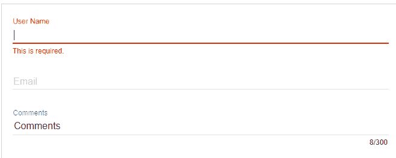

# AngularMaterial 输入

> 原文：<https://www.javatpoint.com/angular-material-inputs>

AngularMaterial 输入容器是一个用于包含任何 **<输入>** 或 **<文本区域>** 元素作为子元素的容器。它还支持使用 **ng-message** 指令进行错误处理，并使用**ng enter/ng ave**事件或 **ngShow / ngHide** 事件制作消息动画。

下表列出了**多维输入容器**的许多属性的参数和描述。

| 因素 | 描述 |
| **md-maxlength** | md-maxlength 的工作原理是显示全文。如果您不想要计数器文本，只需要“普通”验证，可以使用“简单”的 NG-Maxlometer 功能。 |
| 空气标签 | 当标签不存在时使用。如果标签不存在，控制台上会显示一条警告消息。 |
| **占位符** | 占位符是一种在标签不存在的情况下使用的方法。 |
| **MD-no-自动生长** | 当 md-no-auto grow 出现时，textareas 不会自动增长。 |
| **MD-检测-隐藏** | 当 md-detect-hidden 出现时，Textarea 将与隐藏后的大小相同。默认情况下，它会逆转每个反射周期。 |

## <input>和<textarea>属性</textarea>

与普通 [**<一起使用的属性输入>**](https://www.javatpoint.com/html-input-tag) 和 [**<文本区>**](https://www.javatpoint.com/html-textarea) 元素可以与 **< mat-form-field >** 内部的元素一起使用。它有 Angular 指令，如**模型**和**形式控制**。

### 支持的<input>类型

以下输入类型用于匹配输入:

*   电子邮件
*   月
*   数字
*   颜色
*   日期
*   日期时间-本地
*   密码
*   搜索
*   文本
*   ultime
*   时间
*   周
*   日期时间-本地

### 表单域功能

有许多 **<垫形场>** 功能可以与<文本区配合使用>。它们是**错误信息、提示文本、前缀、后缀**和**主题**。

### 占位符

当输入为空，标签< **mat-form-field** >浮动时，显示占位符文本。它用于给用户关于输入的提示。可以通过在 **<输入>** 或 **<文本区>** 元素上设置占位符文本来指定占位符。

## 显示错误信息时更改

<mat-form-field>允许我们将错误消息与 matInput 相关联。当控件无效时，将显示一条错误消息，要么用户已经与元素交互，要么原始表单已经呈现。</mat-form-field>

### 例子

下面的例子显示了 **md-input-container** 指令的使用和输入的使用。

***am_inputs.htm***

```

<html lang = "en">
   <head>
      <link rel = "stylesheet"
         href = "https://ajax.googleapis.com/ajax/libs/angular_material/1.0.0/angular-material.min.css">
      <script src = "https://ajax.googleapis.com/ajax/libs/angularjs/1.4.8/angular.min.js"></script>
      <script src = "https://ajax.googleapis.com/ajax/libs/angularjs/1.4.8/angular-animate.min.js"></script>
      <script src = "https://ajax.googleapis.com/ajax/libs/angularjs/1.4.8/angular-aria.min.js"></script>
      <script src = "https://ajax.googleapis.com/ajax/libs/angularjs/1.4.8/angular-messages.min.js"></script>
      <script src = "https://ajax.googleapis.com/ajax/libs/angular_material/1.0.0/angular-material.min.js"></script>
      <link rel = "stylesheet" href = "https://fonts.googleapis.com/icon?family=Material+Icons">
      <style>
      </style>
      <script language = "javascript">
         angular
            .module('firstApplication', ['ngMaterial'])
            .controller('inputController', inputController);
         function inputController ($scope) {
            $scope.project = {
               comments: 'Comments',    
            };
         }                 
      </script>     	  
   </head>
   <body ng-app = "firstApplication"> 
      <div id = "inputContainer" class = "inputDemo"
         ng-controller = "inputController as ctrl" ng-cloak>
         <md-content layout-padding>
            <form name = "projectForm">
               <md-input-container class = "md-block">
                  <label>User Name</label>
                  <input required name = "userName" ng-model = "project.userName">
                  <div ng-messages = "projectForm.userName.$error">
                     <div ng-message = "required">This is required.</div>
                  </div>
               </md-input-container>
               <md-input-container class = "md-block">
                  <label>Email</label>
                  <input required type = "email" name = "userEmail"
                     ng-model = "project.userEmail"
                     minlength = "10" maxlength = "100" ng-pattern = "/^.+@.+\..+$/" />
                  <div ng-messages = "projectForm.userEmail.$error" role = "alert">
                     <div ng-message-exp = "['required', 'minlength', 'maxlength',
                        'pattern']">
                        Email must be between 10 and 100 characters long and should
                        be a valid email address.
                     </div>
                  </div>
               </md-input-container>
               <md-input-container class = "md-block">
                  <label>Comments</label>
                  <input md-maxlength = "300" required name = "comments"
                     ng-model = "project.comments">
                  <div ng-messages = "projectForm.comments.$error">
                     <div ng-message = "required">This is required.</div>
                     <div ng-message = "md-maxlength">The comments has to be less
                        than 300 characters long.</div>
                  </div>
               </md-input-container>

            </form>
         </md-content>
      </div>
   </body>
</html>

```

[Test it Now](https://www.javatpoint.com/oprweb/test.jsp?filename=angular-material-inputs1)

**输出:**



* * *