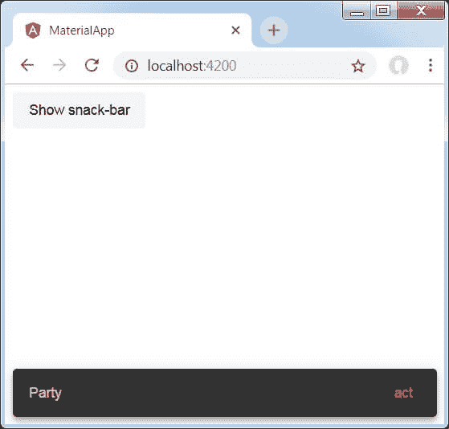

# AngularMaterial 挡杆

> 原文：<https://www.javatpoint.com/angular-material-snackbar>

<matsnackbar>是一个*Angular*指令，用于显示一个通知栏，作为对话框或弹出窗口显示在移动设备上。这是一项显示小吃店通知的服务。</matsnackbar>


### 打开小吃店

小吃店包含一个字符串信息。

```

let snackBarRef = snackBar.open('Message archived');
let snackBarRef = snackBar.open('Message archived', 'Undo');
// Load the component in the snack-bar.
let snackBarRef = snackbar.openFromComponent(MessageArchivedComponent);

```

它用于获取拒绝小吃店的信息。MatSnackBarRef 公开了操作是由简单消息的操作触发的。如果您想注射 MatSnackBarRef，请关闭由 OpenFromComponent 打开的自定义小吃店。

```

snackBarRef.afterDismissed().subscribe(() => {
  console.log('The snack-bar was dismissed');
});

snackBarRef.onAction().subscribe(() => {
  console.log('The snack-bar action was triggered!');
});

snackBarRef.dismiss();

```

小吃店可以手动拒绝，可以通过调用 matsnackbar 上的解雇方法进行调用来打开。

一次只开一家小吃店。如果新的小吃店在之前的消息还在显示的时候就打开了，那么旧的消息会被自动拒绝。

小吃店可以通过一个可选的配置给定一段时间，该配置反对:

```

snackbar.open('Message archived', 'Undo', {
  duration: 3000
});

```

### 与定制小吃店共享数据

您可以在自定义小吃店的帮助下共享数据，该小吃店是通过 **openFromComponent** 方法打开的。

```

snack bar.openFromComponent(MessageArchivedComponent, {
  data: 'some data'
});

```

您必须使用**MAT _ 小吃 _BAR_DATA** 注入令牌来访问组件中的数据:

```

import {Component, Inject} from '@angular/core';
import {MAT_SNACK_BAR_DATA} from '@angular/material/snack-bar';

@Component({
  selector: 'your-snack-bar',
  template: 'passed in {{ data }}',
})
export class MessageArchivedComponent {
  constructor(@Inject(MAT_SNACK_BAR_DATA) public data: string) { }
}

```

### 默认设置全局配置。

如果要覆盖小吃店选项，可以使用**MAT _ 小吃店 _BAR_DEFAULT_OPTIONS** 注射令牌。

```

@NgModule({
  providers: [
    {provide: MAT_SNACK_BAR_DEFAULT_OPTIONS, useValue: {duration: 2500}}
  ]
})

```

### 易接近

小吃店的信息通过 aria-live 区域发布。小吃店并不关注元素。建议该应用程序为用户提供一种替代方式来执行小吃店中任何给定任务的任务。

小吃店可用的动作不应被给予持续时间来容纳希望激活该动作来导航小吃店元素的屏幕阅读器用户。如果用户将他们的注意力集中在小吃店内，那么焦点必须合理地放置在某个地方，这取决于小吃店被拒绝时的应用环境。

永远不要使用“**解雇**”作为小吃店的行动，而是使用通知中没有额外行动的时间段。

### 示例:

**app.module.ts**

```

import { BrowserModule } from '@angular/platform-browser';
import { AppComponent } from './app.component';
import { NgModule } from '@angular/core';

import {BrowserAnimationsModule} from '@angular/platform-browser/animations';
import {FormsModule, ReactiveFormsModule} from '@angular/forms';
import {MatButtonModule,MatSnackBarModule} from '@angular/material'
@NgModule({
   declarations: [
      AppComponent
   ],
   imports: [
      BrowserModule,
      BrowserAnimationsModule,
      MatButtonModule,MatSnackBarModule,
      FormsModule,
      ReactiveFormsModule
   ],
   providers: [],
   bootstrap: [AppComponent]
})
export class AppModule { }

```

**app.component.html**

```

<button mat-button (click)="openSnackBar('Party', 'act')">Show snack-bar</button>

```

**app.component.ts**

```

import {Component, Injectable} from '@angular/core';
import { MatSnackBar } from "@angular/material";
@Component({
   selector: 'app-root',
   templateUrl: 'app.component.html',
   styleUrls: ['app.component.css']
})
export class AppComponent {
   constructor(public snackBar: MatSnackBar) {}
   openSnackBar(message: string, action: string) {
      this.snackBar.open(message, action, {
         duration: 2000,
      });
   } 
}   

```

**输出:**



**说明:**

我们使用 mat-button 创建了一个按钮。点击那个按钮，我们显示小吃店。

* * *