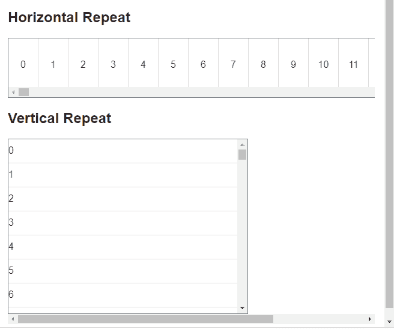
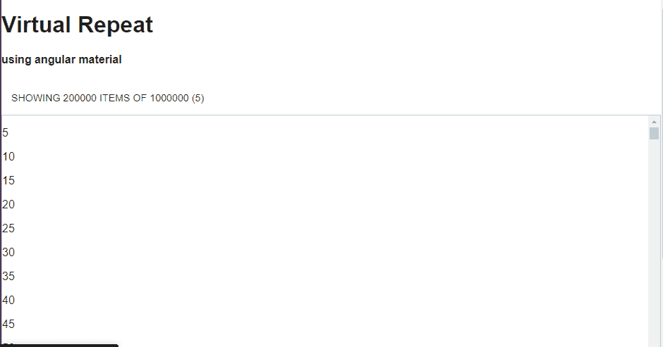

# AngularMaterial-虚拟重复

> 原文：<https://www.javatpoint.com/angular-material-virtual-repeat>

**多维虚拟重复容器**是一个滚动容器叉**多维虚拟重复**组件。

虚拟重复是一个与 ng-repeat 相同的 Angular Material 指令，它呈现 html 元素来填充容器，以便在用户滚动时重用它。

### 属性

下表列出了**MD-虚拟重复容器**的参数和属性描述。

| Sr.No | 参数 | 描述 |
| one | MD-top-索引 | 滚动绑定容器顶部包含$ scope 的项的索引。它设置滚动位置。 |
| Two | 纵向水平 | 它决定容器应该水平滚动。 |
| three | MD-自动收缩 | 当该数量小于其原始大小时，容器将收缩以适应物品的数量。 |
| four | MD-自动收缩-最小值 | md 自动收缩的最小项目数(默认值:0)。 |
| five | MD-项目大小 | 它修改重复元素的高度或宽度。它是可选的。如果缺失，它会尝试从 DOM 中读取大小，但仍然认为复制节点的高度或宽度是相同的。 |
| six | MD-额外名称 | 计算附加名称，该名称可以分配给重复范围内的当前迭代项(md-autocomplete 中需要使用)。 |
| seven | 按需医学博士 | md-on-demand 是一个虚拟重复参数，作为一个获取行而不是数组的对象。该对象可以用两种方法实现下面的接口-
getitematintex-如果还没有加载，则该索引处的项还是零。
getLength -中继器应该是容器大小的数据长度。当计数已知时，这个方法应该返回它。否则，返回更多当前加载的对象以产生无限滚动行为。 |

### 例 1:

下面的例子展示了虚拟重复的使用。

***am _ virtualrepeat . htm***

```

<html lang = "en">
   <head>
      <link rel = "stylesheet"
         href = "https://ajax.googleapis.com/ajax/libs/angular_material/1.0.0/angular-material.min.css">
      <script src = "https://ajax.googleapis.com/ajax/libs/angularjs/1.4.8/angular.min.js"></script>
      <script src = "https://ajax.googleapis.com/ajax/libs/angularjs/1.4.8/angular-animate.min.js"></script>
      <script src = "https://ajax.googleapis.com/ajax/libs/angularjs/1.4.8/angular-aria.min.js"></script>
      <script src = "https://ajax.googleapis.com/ajax/libs/angularjs/1.4.8/angular-messages.min.js"></script>
      <script src = "https://ajax.googleapis.com/ajax/libs/angular_material/1.0.0/angular-material.min.js"></script>
      <link rel = "stylesheet" href = "https://fonts.googleapis.com/icon?family=Material+Icons">

      <style>
         .vrepeatContainer #horizontal-container {
            height: 100px;
            width: 830px; 
         }

         .vrepeatContainer #vertical-container {
            height: 292px;
            width: 400px; 
         }

         .vrepeatContainer .repeated-item-horizontal {
            border-right: 1px solid #ddd;
            box-sizing: border-box;
            display: inline-block;
            height: 84px;
            padding-top: 35px;
            text-align: center;
            width: 50px; 
         }

         .vrepeatContainer .repeated-item-vertical {
            border-bottom: 1px solid #ddd;
            box-sizing: border-box;
            height: 40px;
            padding-top: 10px;
         }

         .vrepeatContainer md-content {
            margin: 16px; 
         }

         .vrepeatContainer md-virtual-repeat-container {
            border: solid 1px grey; 
         }	  
      </style>

      <script language = "javascript">
         angular
            .module('firstApplication', ['ngMaterial'])
            .controller('vrepeatController', vrepeatController);

         function vrepeatController ($scope) { 
            this.items = [];
            for (var i = 0; i < 1000; i++) {
               this.items.push(i);
            }
         }	  
      </script>      
   </head>

   <body ng-app = "firstApplication"> 
      <div class = "vrepeatContainer" ng-controller = "vrepeatController as ctrl"
         ng-cloak>
         <md-content layout = "column">
            <h2>Horizontal Repeat</h2>
            <md-virtual-repeat-container id = "horizontal-container" md-orient-horizontal>
               <div md-virtual-repeat = "item in ctrl.items"
                  class = "repeated-item-horizontal" flex>
                  {{item}}
               </div>
            </md-virtual-repeat-container>

            <h2>Vertical Repeat</h2>
            <md-virtual-repeat-container id = "vertical-container">
               <div md-virtual-repeat = "item in ctrl.items"
                  class = "repeated-item-vertical" flex>
                  {{item}}
               </div>
            </md-virtual-repeat-container>

         </md-content>
      </div>
   </body>
</html>

```

**输出:**



### 例 2:

**app.module.html**

```

<div class="app-wrapper" ng-app="myapp">
  <h1>Virtual Repeat</h1>
  <h4>using angular material</h4>
  <div ui-view></div>

  <!-- TEMPLATES (MUST BE IN APP CONTEXT) -->
  <script type="text/ng-template" id="home.html">
    <md-button ng-click="vm.toggle()">
      showing {{vm.dataset.getLength()}} items
      of {{vm.items.length}}  ({{vm._toggle}})
    </md-button>

    <md-virtual-repeat-container>
      <p md-virtual-repeat="item in vm.dataset" md-on-demand="{{vm.onDemand}}">{{item.value}}</p>
    </md-virtual-repeat-container>
  </script>
  <script type="text/ng-template" id="about.html">
    <h3>About Page</h3>
  </script>
</div>

```

**app.component.ts**

```

(function() {
  var app = angular.module('myapp', ['ngMaterial', 'ui.router']);
  app.config(function($stateProvider, $urlRouterProvider) {

    $urlRouterProvider.otherwise('/home');

    $stateProvider
      .state('home', {
        url: '/home',
        templateUrl: 'home.html',
        controller: [function() {
          var self = this;
          self.items = [];
          for (var i = 1; i <= 1000000; i++) {
            self.items.push({
              value: i
            });
          }
          self.onDemand = true;
          self.dataset = {
            _items: [],
            _refresh: function(data) {
              this._items = data.filter(function(el) {
                return !angular.isDefined(el._excluded) || el._excluded === false;
              })
            },
            getItemAtIndex: function(index) {
              return this._items[index];
            }, //getItemAtIndex
            getLength: function() {
              return this._items.length
            } //getLenth
          }; //dataset

          self.dataset._refresh(self.items);

          self._toggle = 1;
          self.toggle = function() {

            if (!self._toggle) {
              self._toggle = 2;
            } else if (self._toggle < 8) {
              self._toggle += 1;
            } else {
              self._toggle = 1;
            }
            for (var i = 0; i < self.items.length; i++) {
              self.items[i]._excluded = (self.items[i].value % self._toggle !== 0);
            }

            self.dataset._refresh(self.items);
          }
        }],
        controllerAs: 'vm'
      })
      .state('about', {
        url: '/about',
        templateUrl: 'about.html'
      });

  });

}());

```

**app.component.css**

```

md-virtual-repeat-container {
  position: relative;
  display: block;
  width: 100%;
  height: 100vh;
  border: solid 1px #ccc;
  padding: 10px;
}

```

**输出:**



* * *