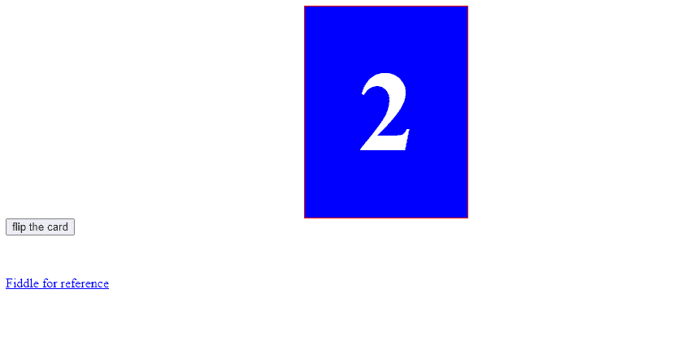

# AngularMaterial 翻转卡

> 原文：<https://www.javatpoint.com/angular-material-flipping-card>

它是 **CSS** 和一张卡片的组合，当你点击右上角的图标按钮时，卡片就会翻转。

您可以使用 angular app，也可以使用 ng new app-name 创建一个新的。我们首先需要一个应用来创建一个组件。

使用以下命令创建一个名为**游戏卡片组件**的新组件。

```

ng generate component game-card
export interface CardData {
    imageId: string;
    state: 'default' | 'flipped' | 'matched';
}

```

该界面由一个代表卡片正面图像标识的图像组成。并表示卡的状态。

请注意状态如何具有多个值。当我们要在代码中为它们赋值时，我们的 IDE 可以通过这种方式声明来给我们一些有用的提示。让开发体验好了很多。

这些状态将对应于 Angular 动画状态。轻敲卡片会让我们从一种状态转换到另一种状态。

### 用图像制作 3D 卡片界面

我们首先需要在房子里定义一个结构 [**HTML**](https://www.javatpoint.com/html-tutorial) 到游戏卡，所有这些都要按照定义来工作，我们的卡有正面和背面。

通过对父级中包含的两侧使用 div。

```

<div class="card" (click)="cardClicked()">
    <div class="face back">
        
    </div>
    <div class="face front">
        
    </div>
</div>

```

div 中有一个 img 元素。我的资产文件夹背面有一个图形存储。

前端使用 Unsplash API 获取数据中指定 id 的图像。

**app.component.html**

```

<!--Rotating card-->
<div class="col-md-4">
  <mdb-flipping-card #cards>
    <!--Front Side-->
    <div class="face front tp-box_side tp-box_front">

      <!-- Image-->
      <div class="card-up">
        
      </div>
      <!--Avatar-->
      <div class="avatar">
        
      </div>
      <!--Content-->
      <div class="card-body">
        <h4>Jonathan Doe</h4>
        <p>Web developer</p>
        <!--Triggering button-->
        <a class="rotate-btn" data-card="card-1" (click)="cards.toggle()">
          <mdb-icon fas icon="redo"></mdb-icon> Click here to rotate</a>
      </div>
    </div>
    <!--/.Front Side-->

    <!--Back Side-->
    <div class="back tp-box_side tp-box_back">

      <!--Content-->
      <h4>About me</h4>
      <hr>
      <p>Lorem ipsum dolor sit amet, consectetur adipisicing elit. Maxime quae, dolores dicta. Blanditiis rem
        amet repellat,
        quaerat?</p>
      <hr>
      <!--Social Icons-->
      <ul class="list-inline">
        <li class="list-inline-item">
          <a class="icons-sm fb-ic">
            <mdb-icon fab icon="facebook-f"></mdb-icon>
          </a>
        </li>
        <li class="list-inline-item">
          <a class="icons-sm tw-ic">
            <mdb-icon fab icon="twitter"></mdb-icon>
          </a>
        </li>
        <li class="list-inline-item">
          <a class="icons-sm gplus-ic">
            <mdb-icon fab icon="google-plus"></mdb-icon>
          </a>
        </li>
        <li class="list-inline-item">
          <a class="icons-sm li-ic">
            <mdb-icon fab icon="linkedin-in"></mdb-icon>
          </a>
        </li>
      </ul>
      <!--Triggering button-->
      <a class="rotate-btn" data-card="card-1" (click)="cards.toggle()">
        <mdb-icon fas icon="undo"></mdb-icon> Click here to rotate back</a>

    </div>
    <!--/.Back Side-->
  </mdb-flipping-card>
</div>
<!--/.Rotating card-->

```

**生成新组件**

```

ng g c grid-car-layout
In the grid-card.layout.module.css
.grid-container {
  margin: 20px;
}
.dashboard-card {
  position: absolute;
  top: 15px;
  left: 15px;
  right: 15px;
  bottom: 15px;
}

.more-button-right {
  position: absolute;
  top: 5px;
  right: 10px;
}

.flippable-card {
  width: 100%;
  height: 100%;
  position: absolute;
  transform-style: preserve-3d;
  transition: transform 1s;
}

.flippable-card mat-card {
  margin: 0;
  display: block;
  position: absolute;
  backface-visibility: hidden;
}

.flippable-card .back {
  background: #fff;
  transform: rotateY( 180deg );
}

.flippable-card.flipped {
  transform: rotateY( 180deg );
}
grid-card.layout.module.ts
  flipped: boolean;

  constructor() { }

  ngOnInit() {
    this.flipped = false;
  }

```

这里，左边的牌是普通的，右边的牌有两面。

```

grid-card.layout.module.html
<div class="grid-container">
  <mat-grid-list cols="2" rowHeight="100px">

    <mat-grid-tile [colspan]="1" [rowspan]="2">
      <mat-card class="dashboard-card">
        <mat-card-header>
          <mat-card-title>

          </mat-card-title>
        </mat-card-header>
        <mat-card-content class="dashboard-card-content">
          <div>
          </div>
        </mat-card-content>
      </mat-card>
    </mat-grid-tile>

    <mat-grid-tile [colspan]="1" [rowspan]="2" >
      <div class='flippable-card' [ngClass]="{'flipped':flipped}" >
    <mat-grid-tile [colspan]="6" [rowspan]="3">
        <div class='flippable-card' [ngClass]="{'flipped':flipped}" >
            <mat-card class="dashboard-card">
              <!-- <mat-card-title><button class="more-button" mat-icon-button (click)='flipped = !flipped'><mat-icon>flip</mat-icon></button></mat-card-title> -->
              <mat-card-title>
                <button class="more-button-right" mat-icon-button (click)='flipped = !flipped'><mat-icon>flip_camera_android</mat-icon></button>
              </mat-card-title>
              <mat-card-content>
                 FRONT SIDE
              </mat-card-content>
            </mat-card>
            <mat-card class='dashboard-card back'>
              <mat-card-title>
                <button class="more-button-right" mat-icon-button (click)='flipped = !flipped'><mat-icon>flip_camera_android</mat-icon></button>
              </mat-card-title>
              <mat-card-content>
                              </mat-card-content>
            </mat-card>
        </div>
      </mat-grid-tile>   
  </mat-grid-list>
</div>

```

### 示例:

**app.component.html**

```

<section class="container">
  <div class="card" onclick="flip()">
    <div class="front">1</div>
    <div class="back">2</div>
  </div>
</section>
<button onclick="flip()">flip the card</button>
<a href="https://jsfiddle.net/james2doyle/qsQun/">Fiddle for reference</a>

```

**app.component.css**

```

.container {
    width: 200px;
    height: 260px;
    position: relative;
    margin: 0 auto;
    border: 1px solid #ccc;
    -webkit-perspective: 800px;
    -moz-perspective: 800px;
    -o-perspective: 800px;
    perspective: 800px;
  border: 1px solid red;
}
.card {
    width: 100%;
    height: 100%;
    position: absolute;
    -webkit-transition: -webkit-transform 1s;
    -moz-transition: -moz-transform 1s;
    -o-transition: -o-transform 1s;
    transition: transform 1s;
    -webkit-transform-style: preserve-3d;
    -moz-transform-style: preserve-3d;
    -o-transform-style: preserve-3d;
    transform-style: preserve-3d;
    -webkit-transform-origin: 50% 50%;
}
.card div {
    display: block;
    height: 100%;
    width: 100%;
    line-height: 260px;
    color: white;
    text-align: center;
    font-weight: bold;
    font-size: 140px;
    position: absolute;
    -webkit-backface-visibility: hidden;
    -moz-backface-visibility: hidden;
    -o-backface-visibility: hidden;
    backface-visibility: hidden;
}
.card .front {
  background: red;
}
.card .back {
    background: blue;
    -webkit-transform: rotateY( 180deg );
    -moz-transform: rotateY( 180deg );
    -o-transform: rotateY( 180deg );
    transform: rotateY( 180deg );
}
.card.flipped {
    -webkit-transform: rotateY( 180deg );
    -moz-transform: rotateY( 180deg );
    -o-transform: rotateY( 180deg );
    transform: rotateY( 180deg );
}

a {display: block;}
button {margin-bottom: 50px;}

```

**app.component.ts**

```

function flip() {
    $('.card').toggleClass('flipped');
}

```

**输出:**



* * *