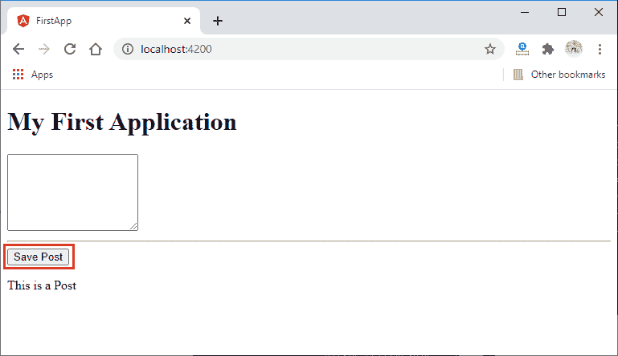
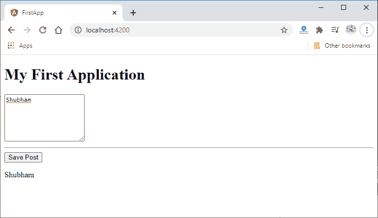

# 创建用户界面并在 MEAN 栈中获取数据

> 原文：<https://www.javatpoint.com/creating-user-interface-fetching-data-in-mean-stack>

在前一节中，我们学习了如何向项目中添加新组件。我们为 html 和 typescript 文件创建了一个单独的文件夹。在本节中，我们将了解事件监听和输出内容。在本节中，我们将在我们的应用程序中使用这两者。我们将一个接一个地了解这两者。

## 事件

我们正在创建一个创建、更新和检索帖子的应用程序。所以，我们需要输入和一个按钮来保存帖子。我们将在帖子创建的模板中添加这两者。我们可以使用普通的文本输入或文本区域，因为我们应该能够在一行中输入更多的文本。

```

<textarea rows="6"></textarea>
<hr>
<button>Save Post</button>

```


现在，要在点击时做一些事情，我们需要添加一个点击监听器。我们将使用名为**事件绑定**的特性来实现这一点。**事件绑定**是一个角度特征，允许我们以声明的方式收听事件。因此，我们将在按钮中创建括号，并以下列方式调用 onAddPost()函数:

```

<button (click)="onAddPost()">Save Post</button>

```

我们将在我们的 PostCreateComponent 类中创建这个函数。在这种方法中，我们将创建一条警报消息，显示**“帖子添加成功”**。

```

export class PostCreateComponent {
    onAddPost(){
      alert("Post is added successfully");
    }
}

```

现在，我们将保存并运行它。


## 输出内容

现在，我们将创建一个字段来显示输出。届时，我们将使用一些虚拟内容。因此，我们将在我们的**后期创建组件**类的 **onAddPost()** 函数中设置虚拟内容，我们需要一个地方来存储这些内容。我们将创建一个变量并传递一个空字符串。我们将以下列方式将该变量覆盖到我们的 **onAddPost()** 函数中:

```

export class PostCreateComponent {
  newPost = ';'
    onAddPost(){
     this.newPost = 'The user\'s post';
    }
}

```

现在，我们将返回到我们的 html 文件，并将输出挂钩直接添加到模板中。我们将通过使用名为**字符串插值**的特性来实现这一点，我们将在双花括号之间使用它。在这些大括号之间，我们将引用存储在我们的后期创建组件中的一些东西。这个东西可以是一个方法，然后我们输出这个方法返回的任何东西，或者它可以是一个属性名，比如**新帖**。

```

<p>{{newPost}}</p>

```

现在，如果我们运行这个，我们将在浏览器上看到虚拟输出内容:


现在，我们将一个字符串传递给我们的 PostCreateComponent 类的 newPost 变量。当我们保存它时，我们将首先看到传入 newPost 变量到输出字段的字符串。当我们点击按钮时，输出字符串将被传递给 onAddPost()函数的字符串覆盖。

```

export class PostCreateComponent {
  newPost = 'This is a Post';
    onAddPost(){
     this.newPost = 'The user\'s post';
    }
}

```




## 获取用户输入

现在，我们将从文本区域获取用户输入。基本上有两种方法可以做到这一点，即本地引用和双向绑定。

### 本地引用

在本地引用中，我们向任何我们想要的 html 元素添加一个标记，一个变量。我们将通过添加一个标签来做到这一点，然后添加我们想要的任何名称。这个标记创建了一个我们可以使用的元素的引用。我们将以下列方式为其编写代码:

**Post-create.component.html**

```

<textarea rows = "6" [value] = "newPost" #postInput></textarea>
<hr>
<button (click)="onAddPost(postInput)">Save Post</button>
<p>{{newPost}}</p>

```

我们还需要在**后创建. component.ts** 文件中做一些更改。我们将把文本区域字段的标记传递给 onAddPost()函数。我们将以下列方式在 PostCreateComponent 类的 onAddPost()函数中进行更改:

```

export class PostCreateComponent {
  newPost = 'This is a Post';
    onAddPost(postInput: HTMLTextAreaElement){
      this.newPost = postInput.value;
    }
}

```

### 双向绑定

Angular 提供了一种称为双向绑定的新功能，可以从用户那里获得输入。不需要手动设置文本区域的值并获取对它的引用。我们两个都处理掉。双向绑定结合了值的设置和读取。它被称为双向绑定，因为它具有双向流。我们将使用一个指令，并听取用户的输入。它发出数据，并将新数据存储在文本区域或输出中。

我们将创建一个新属性，并将其与 ngModel 绑定。为此，我们将在 **app.module.ts** 文件中导入属于@angular/forms 的 FormsModule。

```

import {FormsModule} from '@angular/forms';
imports: [
    BrowserModule,
    AppRoutingModule,
    FormsModule
  ],

```

我们不需要向 onAddPost()函数传递任何标记。

```

 export class PostCreateComponent {
  enteredValue = '';
  newPost = 'This is a Post';
    onAddPost(){
      this.newPost = this.enteredValue;
    }
}

```

我们将移除标记和值，并将属性与 ngModel 绑定。在 textarea 中，我们在方括号中附加了一个模型，并通过以下方式传递了我们在 PostCreateComponent 类中创建的属性:

```

<textarea rows = "6" [(ngModel)] = "enteredValue"></textarea>
<hr>
<button (click)="onAddPost()">Save Post</button>
<p>{{newPost}}</p>

```



在下一节中，我们将把这个丑陋的应用程序变成一个看起来很酷的应用程序。我们将学习角形材料，以及如何安装和使用它们来改进我们的应用。

* * *