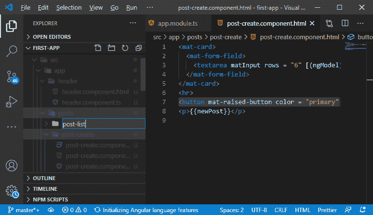
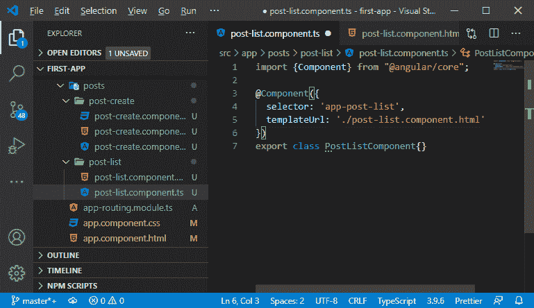
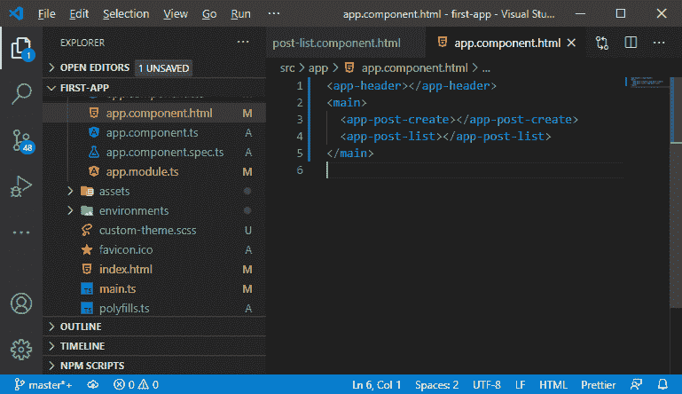
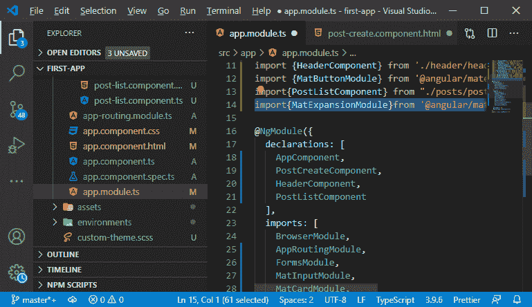
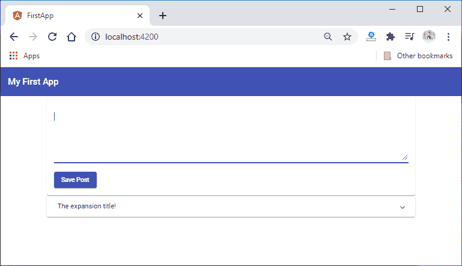
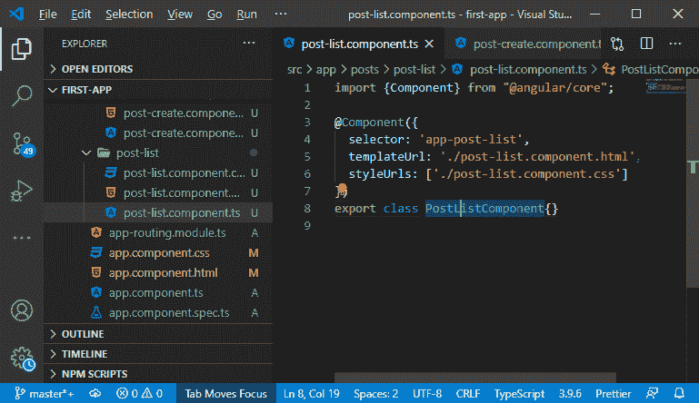
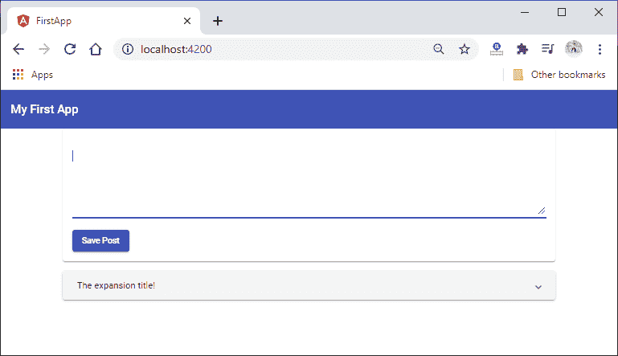

# 使用 MEAN 栈创建扩展面板

> 原文：<https://www.javatpoint.com/creating-an-expansion-panel-using-mean-stack>

在前一节中，我们学习了如何使用 MEAN 栈中的角度材质创建工具栏。我们现在将输出帖子，并将学习如何使用角材质的**扩展**组件创建扩展面板。我们将使用以下步骤在应用程序中创建扩展面板:

1)我们将为它创建另一个新组件，因为输出帖子将与创建帖子分离。因此，在帖子文件夹中，我们将创建一个名为**帖子列表**的新子文件夹。



2)在这个帖子列表子文件夹中，我们将添加一个**帖子列表. component.ts** 文件和**post-list.component.html**


3)我们将创建一个组件。如果你不知道如何创建一个组件，那就通过[https://www . javatpoint . com/add-new-in-component-in-stack](https://www.javatpoint.com/adding-new-component-in-mean-stack)链接。

```

import {Component} from "@angular/core";

@Component({
  selector: 'app-post-list',
  templateUrl: './post-list.component.html'
})
export class PostListComponent{}

```



4)我们知道，我们必须将其包含在**模块. ts** 文件中。我们将在声明数组中添加组件，并通过以下方式将其添加到模块中:

```

import{PostListComponent} from "./posts/post-list/post-list.component"

declarations: [
    AppComponent,
    PostCreateComponent,
    HeaderComponent,
    PostListComponent
  ],

```

5)现在，我们将在我们的**组件文件中使用它。我们将通过以下方式将其添加到**主页面**的**应用程序-后期创建**下方:**

```

<app-header></app-header>
<main>
  <app-post-create></app-post-create>
  <app-post-list></app-post-list>
</main>

```



6)我们的目标是在其中呈现一个帖子列表。因此，我们将返回到我们的后期创建组件，并删除我们之前在应用程序中创建的丑陋段落。


7)我们将使用角度材质的另一个特性，即**扩展面板**，即可折叠或面板，我们可以在其中显示一些内容。所以，我们将回到我们的应用模块，从 angular material 导入一个额外的模块，即 **MatExpansionModule** ，并将其添加到导入数组中。

```

import{MatExpansionModule}from '@angular/material/expansion'
imports: [
    MatExpansionModule
  ],

```



8)我们将在**post-list.component.html**中使用这样的组件，因此，我们将使用以下代码行来创建扩展面板:

```

<mat-expansion-panel>
    <mat-expansion-panel-header>
    The expansion title!
    </mat-expansion-panel-header>
    <p>This ia an example of expansion panel</p>
  </mat-expansion-panel>

```

在上面的代码中，我们使用**<mat-expansion-panel-header></mat-expansion-panel-header>**元素为扩展面板创建了一个标题。但是如果我们保存并运行它，我们将不会在浏览器上看到扩展面板，因为我们需要用 **<垫手风琴>** 包装器包装它。所以，

```

<mat-accordion>
  <mat-expansion-panel>
    <mat-expansion-panel-header>
    The expansion title!
    </mat-expansion-panel-header>
    <p>This ia an example of expansion panel</p>
  </mat-expansion-panel>
</mat-accordion>

```

保存时，我们会在浏览器上看到一个扩展面板，如下所示:


9)这里，扩展面板直接放在卡下面，看起来不是超级好看。所以，我们会限制它的宽度。我们需要限制输入和扩展面板的宽度。所以，我们将限制总的主要内容的宽度。我们将转到**post-create . component . CSS**文件，并从那里删除 **mat-card** 的 [CSS](https://www.javatpoint.com/css-tutorial) 代码。之后，我们将转到 **component.css** 文件，按照以下方式将宽度设置为 80%，边距设置为自动:

```

main{
  margin-top: 16px;
  width: 80%;
  margin: auto;
}

```

当我们保存它时，我们将看到扩展面板的漂亮视图。



10)现在，我们将在后列表组件和后创建组件之间创建一些间距。我们有多种方法来实现这一点，一个简单的方法是在我们的列表后添加一个页边距。为此，我们将创建一个 **post-list.component.css** 文件，并将其导入到我们的 **post-list.component.ts** 文件中。

```

@Component({
  selector: 'app-post-list',
  templateUrl: './post-list.component.html',
  styleUrls: ['./post-list.component.css']
})

```



11)现在，我们将在 **post-list.component.css** 中编写 CSS 代码，我们将使用一个名为 host 的特殊选择器，它以元素本身为目标。我们还需要首先将显示设置为块，因为默认情况下，所有元素都不被视为块级元素。我们将以以下方式编写 CSS 代码:

```

:host{
  Display: block;
  margin-top: 1rem;
}

```

我们将保存它，并看到扩展面板项目中的间距如下所示:



* * *