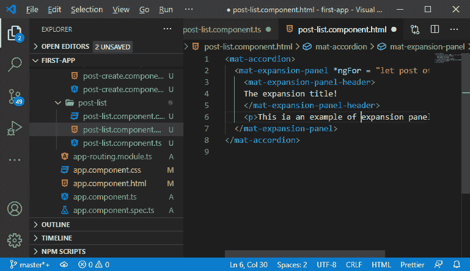
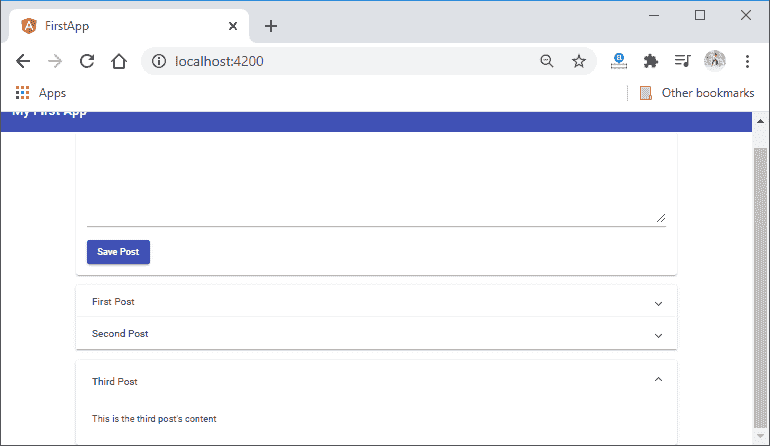
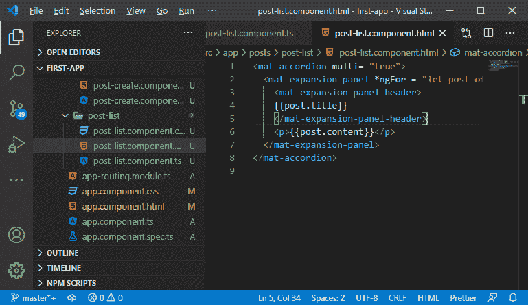
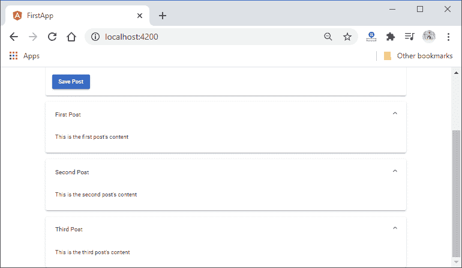
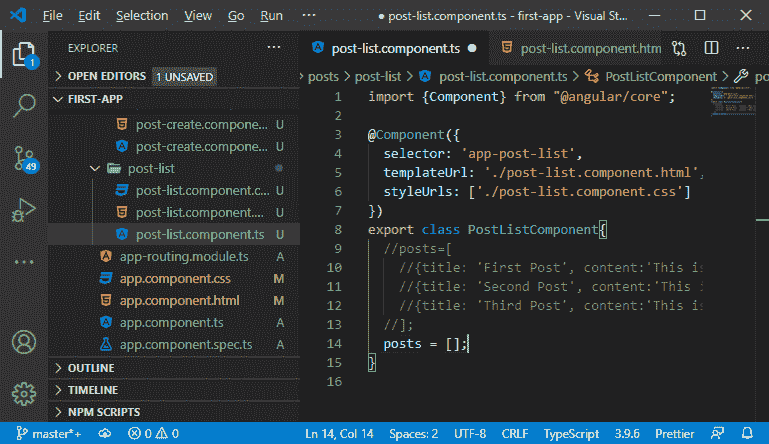
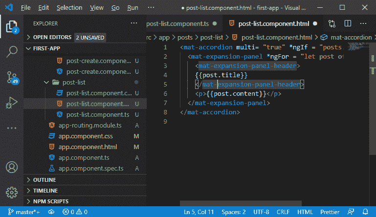
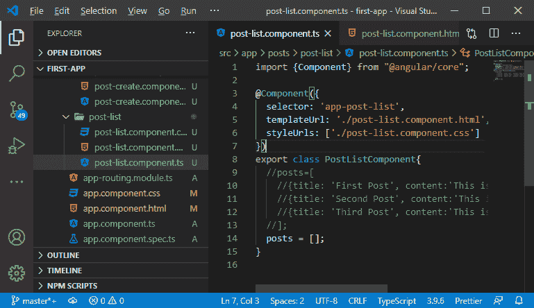
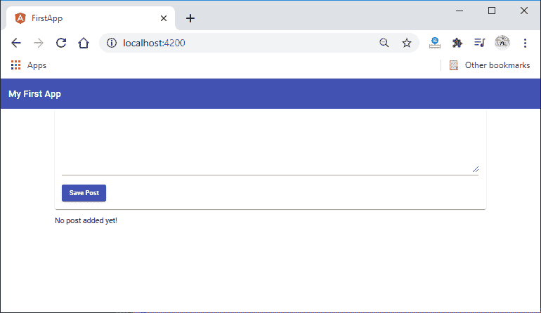
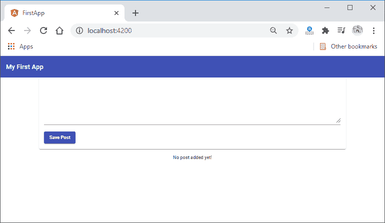

# 在 MEAN 栈中使用结构指令

> 原文：<https://www.javatpoint.com/using-structural-directives-in-mean-stack>

在前一节中，我们学习了如何在应用程序中创建扩展面板。以前，我们只创建了一个扩展面板。如果我们需要从后端、服务器、用户列表或我们模板中的帖子列表输出数据，这并不容易，因为我们不知道有多少元素。因此，在本节中，我们将学习如何使用循环创建多个扩展面板。

以下是在我们的应用程序中用于创建多个扩展面板的步骤:

1)现在，我们将转到我们的应用程序，在那里我们只创建了一个扩展面板，从那里，我们将转到我们的 **post-list.component.ts** 在这个文件中，我们将通过简单地创建一个数组来创建一个帖子列表。在这个数组中，我们有一些 JavaScript 对象，每个帖子都有标题，内容如下:

```

export class PostListComponent{
  posts=[
    {title: 'First Post', content:'This is the first post\'s content'},
    {title: 'Second Post', content:'This is the second post\'s content'},
    {title: 'Third Post', content:'This is the third post\'s content'}  
  ];
}

```


我们将动态循环所有这些帖子，并在我们的模板中输出这些数据。

2)现在，我们将使用一个特殊的指令，即 ***ngFor，**，它本质上是一个辅助工具，允许我们根据需要经常重复该元素。在等号后面的引号之间的**<【mat-expansion-panel】>**中定义了“所需次数的零件”。在这个引号中，我们将使用**让**创建一个变量，并为该变量命名。这个名字由你决定。你可以给这个变量起任何名字。最后，我们将通过以下方式添加我们想要循环通过的数据:

```

<mat-expansion-panel *ngFor = "let post of posts" >

```



3)现在，我们将使用模板中的 **post** 变量。我们将在标题部分设置文章标题，在扩展窗格中设置文章内容，如下所示:

```

<mat-accordion>
  <mat-expansion-panel *ngFor = "let post of posts" >
    <mat-expansion-panel-header>
    {{post.title}}
    </mat-expansion-panel-header>
    <p>{{post.content}}</p>
  </mat-expansion-panel>
</mat-accordion>

```

现在，我们保存它，我们将在屏幕上看到多个扩展面板，如下所示:



4)默认情况下，一次只能打开一个扩展面板。如果我们想要打开多个扩展面板，我们必须通过以下方式将**垫手风琴**的 **multi** 属性设置为 true:

```

<mat-accordion multi= "true">

```




5)如果我们想使用从创建后组件接收到的数据，我们必须去掉伪数据并创建一个空数组。

```

posts = [];

```



6)在 **<垫手风琴>** 中，我们将使用另一个结构指令，即 ***ngIf** 。我们将使用这个结构指令来检查条件。如果条件为真，则仅渲染零件的其余部分。我们将按以下方式设置条件:

```

<mat-accordion multi= "true" *ngIf = "posts.length > 0">

```

这个条件表示，如果**柱**数组的长度大于 0，则只渲染剩余部分。



7)最后，我们将创建一个段落，当**帖子**的长度小于或等于 0 时，该段落将被渲染。 ***ngIf** 结构指令也以下列方式用于本段:

```
<p *ngIf = "posts.length <= 0"> No post added yet! </p>

```




8)我们的结构指令工作正常，但看起来很难看。我们将通过使用一些内置的 CSS 类来改变它。我们将添加 **body-1** 作为类，并使用我们的 **post-list.component.css** 文件以下列方式将其居中:

```

<p class = " info-text mat-body-1" *ngIf = "posts.length <= 0">No post added yet!</p>

```

我们还在 CSS 文件中添加了以下代码:

```

.info-text{
  text-align: center;
}

```

现在，我们保存它，我们将在浏览器上看到如下段落文本:



在下一节中，我们将学习如何创建带有属性和事件绑定的帖子。

* * *