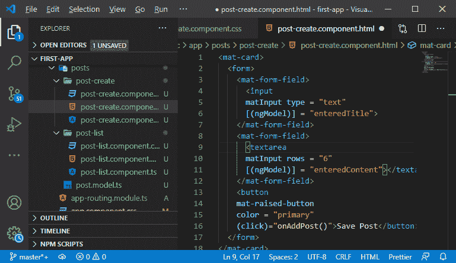
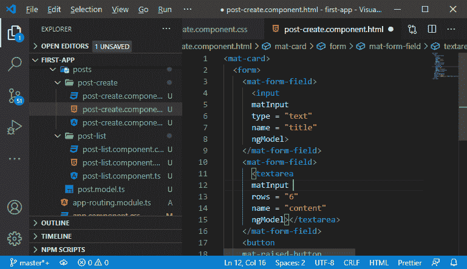
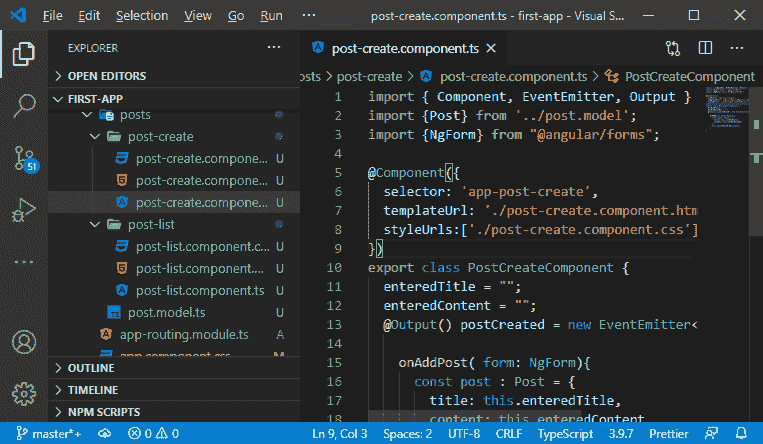
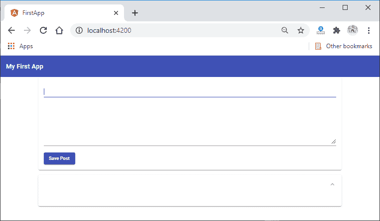
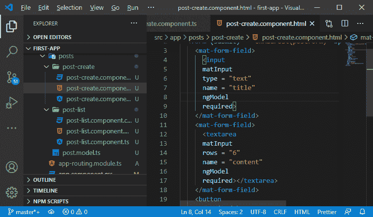
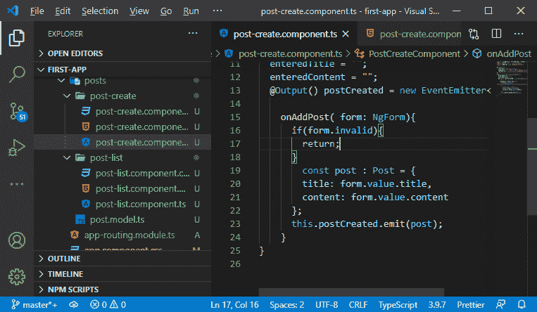
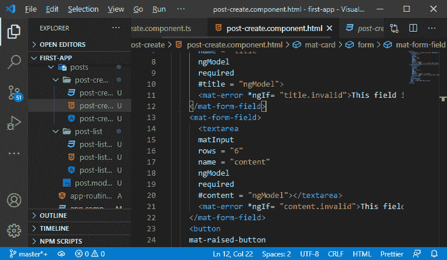
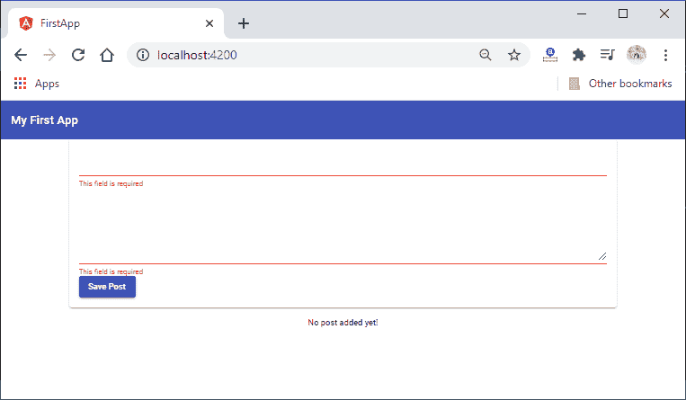

# 在平 MEAN 栈中使用表格

> 原文：<https://www.javatpoint.com/using-forms-in-mean-stack>

在前一节中，我们学习了如何创建模型以及如何在应用程序中使用它。以前，我们使用双向绑定来创建帖子，这不一定是错的，但是有角度使得使用表单非常容易。表单非常有用，我们将以下列方式使用它们:

1)我们将转到我们的**post-create.component.html**文件并添加表单，即普通的 html 元素。我们将 **<垫状场>** 和**按钮**用以下方式包裹起来:

```

<mat-card>
  <form>
    <mat-form-field>
      <input 
      matInput type = "text" 
      [(ngModel)] = "enteredTitle">
    </mat-form-field>
    <mat-form-field>
      <textarea 
      matInput rows = "6" 
      [(ngModel)] = "enteredContent"></textarea>
    </mat-form-field>
    <button 
    mat-raised-button 
    color = "primary" 
    (click)="onAddPost()">Save Post</button>  
  </form>
</mat-card>

```



所以，没有必要使用双向绑定。我们已经包含了表单模块，所以当它检测到**表单**元素时，会自动在场景后面创建一个 JavaScript 对象，代表这个表单。在表单中，我们可以轻松地将输入注册为控件，然后存储这些控件的值。在这里，我们可以轻松地添加验证并提交表单以使用该表单的值。

2)我们通过简单地用**模型**覆盖**【(n model)】= "输入的内容"**和**【(n model)】= "输入的内容"**来摆脱双向绑定。**n model**会将该输入注册为对此的控制。然而，angular 需要知道如何命名这个输入，我们添加 name 属性，并以下面的方式给出我们想要的任何名称:

```

<input 
      matInput 
      type = "text" 
      name = "title"
      ngModel>
<textarea 
      matInput 
      rows = "6"
      name = "content " 
      ngModel>
</textarea>

```



3)现在，当我们点击按钮时，我们不需要手动调用 onAddPost()函数。我们将此按钮设置为**提交**类型，因为我们正在使用表单。类型为 submit 的按钮将提交表单。它将触发一个特殊的事件，即提交我们可以收听的事件，这里我们将以以下方式执行我们的 **onAddPost()** 功能:

```

<form (submit) = "onAddPost()">
<button 
    mat-raised-button 
    color = "primary" 
    type = "submit">Save Post
</button>

```


4)现在，我们需要访问表单内部的值，我们将通过使用本地引用来实现。因此，我们将添加对表单的引用，并以下列方式为其命名:

```

<form (submit) = "onAddPost(postForm)" #postForm = "ngForm" >

```

我们将引用传递给了 **onAddPost()** 函数。 **#postForm** 将为我们提供对 html 元素对象的访问，我们必须将 **ngForm** 指定为它的值。这是一个指令，angular 隐式附加到 form 元素。


5)现在，我们将返回到我们的**后期创建. component . ts****on addpost()**函数将接收实际上是类型**的表单**如下所示:

```

import {NgForm} from "@angular/forms";
onAddPost( form: NgForm)

```

这个 **NgForm** 保存了很多关于表单的信息，比如它是否有效。



6)这个表单让我们可以访问表单的值。我们将通过以下方式从表单中访问标题和内容的值:

```

onAddPost( form: NgForm){
      const post : Post = {
        title: form.value.title,
        content: form.value.content
      };
      this.postCreated.emit(post);
}

```


现在，如果我们保存它并在浏览器上运行它，它也会接受空值，如下所示:



7)因此，我们需要在文本输入和文本区域中添加验证，只需在其中添加所需的验证。通过添加此内容，angular 将自动检测到此内容并更新其表单对象，以反映其是否有效，这将通过以下方式添加:

```

<input matInput type = "text" name = "title" ngModel required>
<textarea matInput rows = "6" name = "content" ngModel required></textarea>

```



我们也检查表格是否有效。如果无效，我们只需在 **post-create.component.ts** 文件中添加 return 语句，方法如下:

```

if(form.invalid){
        return;
}

```



现在，我们保存并运行它。它看起来很像:


8)现在，我们可以通过使用角度材质轻松添加错误信息。我们将使用以下语法来显示错误消息:

```

<mat-error *ngIf="Condition">{{Error Message}}</mat-error>

```

现在，我们在代码中使用这个语法，为此，我们需要访问输入。我们有两种方法来获取输入。

1.我们可以到达我们的**后缀**并调用 **getControl** 函数，在该函数中，我们将输入的名称作为参数传递，如下所示:

```

<mat-error *ngIf= "postForm.getControl('title')">This field is required</mat-error>

```

2.我们可以为该输入添加一个本地引用，并将其设置为**n model**。这将使我们能够访问由该输入管理的数据，然后我们可以使用它来显示如下的错误消息:

```

<input
      matInput
      type = "text"
      name = "title"
      ngModel
      required
      #title= "ngModel">
<mat-error *ngIf= "title.invalid">This field is required</mat-error>

```

我们将对文本区域做同样的事情。



我们保存它并在 ng 服务上运行它。我们将在浏览器上看到如下错误消息:



在下一节中，我们将学习如何从帖子创建组件到帖子列表组件获取帖子。

* * *