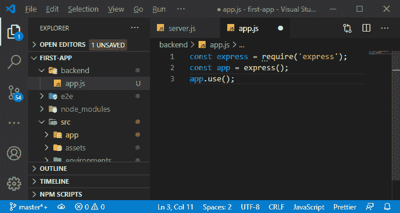
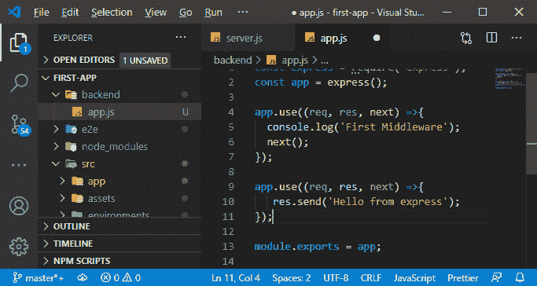
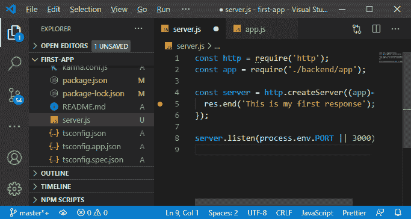
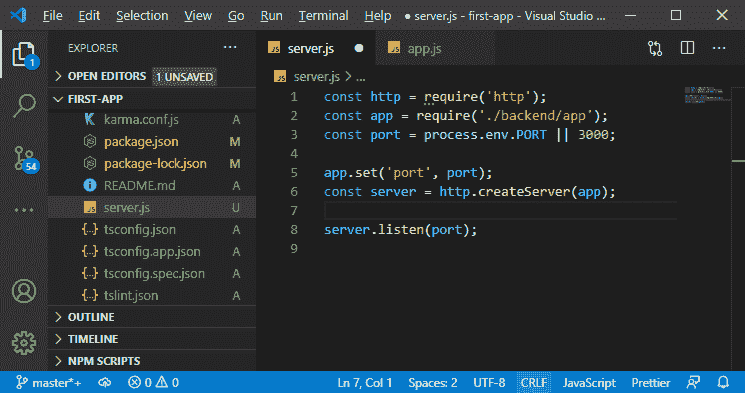
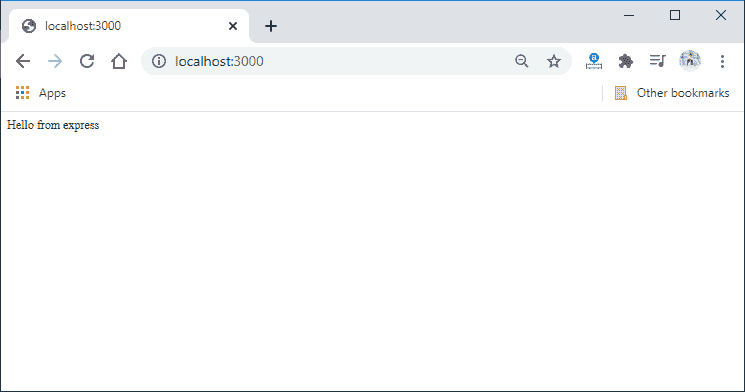

# 在 MEAN 栈中添加快速框架

> 原文：<https://www.javatpoint.com/adding-the-express-framework-in-mean-stack>

在前一节中，我们在应用程序中添加了节点后端。正如讨论的那样，仅仅用 nodejs 编写所有代码是非常麻烦或困难的，为此，我们需要一个 express 框架。在本节中，我们将添加 nodejs 的 express 框架，以使 nodejs 的开发更加容易。以下是用于添加 express framework 的步骤:

1)我们将通过运行以下命令来安装带有 npm 的 express。

```

npm install --save express

```


2)我们现在将在后端文件夹中添加 express 应用程序和属于它的所有文件。在后端文件夹中，我们将创建一个 app.js 文件。


3)这个 app.js 文件将保存 express app，它仍然是 nodejs 服务器端应用程序，以利用这些 express 特性。我们将像导入 server.js 文件中的 **http** 包一样导入快递。

```

const express = require ( 'express' );

```


快递不是带节点的包裹运送，而是我们刚用 npm 安装的包裹。

4)现在，我们将使用 express 和一种使用它的方法来快速添加一条这样的路由，该路由只处理单个路径的请求。我们将通过创建一个快速应用程序来做到这一点。我们将创建一个恒定的应用程序，因为我们不会改变它，然后执行快递包。我们将执行 express 作为一个函数，它将返回给我们一个 express 应用程序。

```

const app = express();

```


现在，我们可以使用这个应用程序。一个快速应用程序只是一个大的中间产品链，我们将其应用于传入的请求。

5)因此，我们将在应用程序中添加一个中间件，然后按照以下方式使用 use 关键字:

```

app.use();

```

use 函数在我们的应用程序和传入的请求上使用了一个新的中间件。



6)中间件函数采用为传入请求执行的函数，该函数采用三个参数，即请求、响应和下一个函数。请求和响应参数与 nodejs 相同，下一个函数用于一个特殊目的。如果我们执行这个函数，那么请求实际上会像这样继续它的旅程:

```

app.use((req, res, next) =>{
  console.log('First Middleware');
  next();
});

app.use((req, res, next) =>{
   res.send('Hello from express');
});

```

在上面的代码中，第一个中间件是无用的。在这个中间件中，下一个函数起着重要的作用，因为它调用下一个中间件，在下一个中间件中，我们将使用 response 的 send 函数来发回响应。

7)然后，我们将把这个非常简单的快速应用程序与我们的服务器连接起来，在那里我们可以听到传入的请求。我们将使用该应用程序作为监听器，因此我们需要导出该应用程序。这里，我们不会使用 export 关键字来导出应用程序。我们将有一个带有 exports 对象的模块对象，我们要在这个 exports 对象中将我们要导出的内容注册为这样的值:

```

module.exports = app;

```



8)现在，我们将它导入到我们的 **server.js** 文件中。我们将添加一个新的常量应用程序，并在所需的函数中传递我们的应用程序路径，如下所示:

```

const app = require('./backend/app');

```


9)现在，我们将使用该应用程序作为传入请求的侦听器。我们将把应用程序传递给我们的 createServer 函数。

```

const server = http.createServer((app)=>{
  res.end('This is my first response');
});

```



10)还有一件事很重要，在将应用程序传递给我们的 createServer 函数之前，我们需要告诉 express 我们在哪个端口上工作。为此，我们需要使用**设置**功能按以下方式设置端口键:

```

const http = require('http');
const app = require('./backend/app');
const port = process.env.PORT || 3000;

app.set('port',port);
const server = http.createServer(app);

server.listen(port);

```



现在，如果我们重新启动我们的节点服务器，我们的浏览器和控制台将如下所示:



在下一节中，我们将通过简单地在其中添加错误处理方法来改进我们的 server.js 文件。


* * *