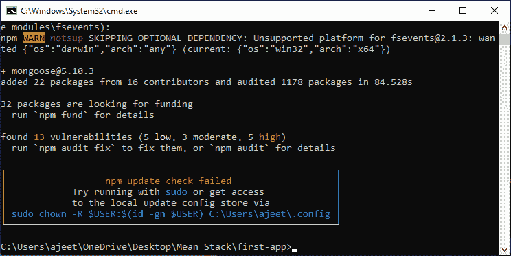
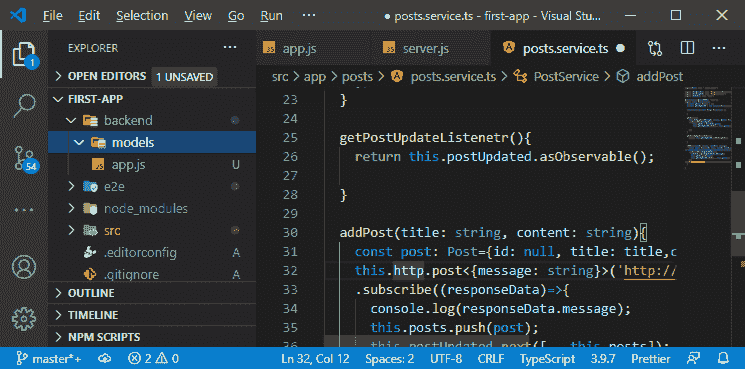
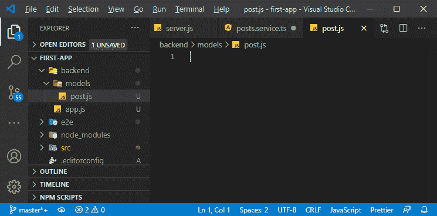
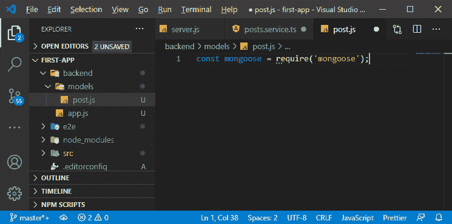
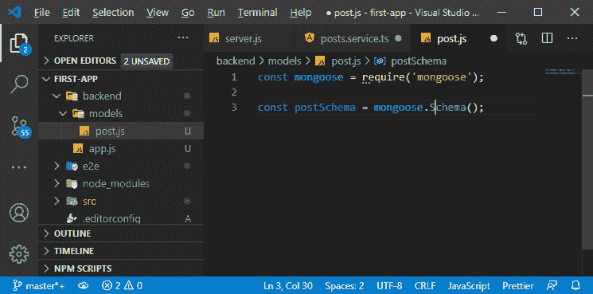
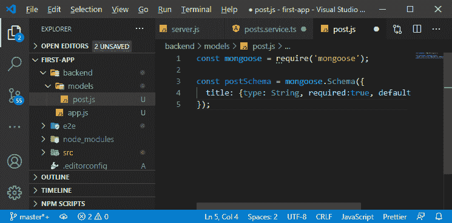
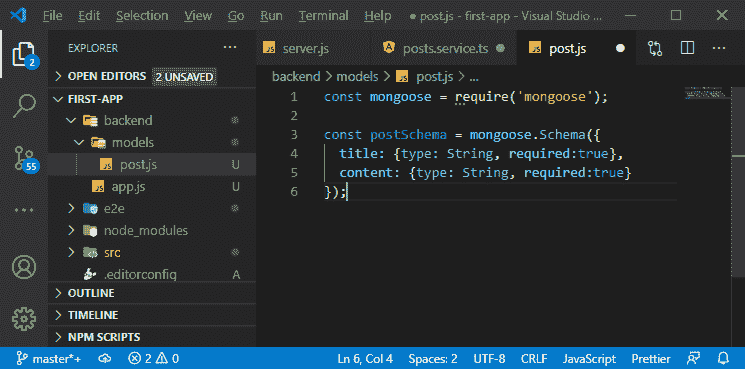
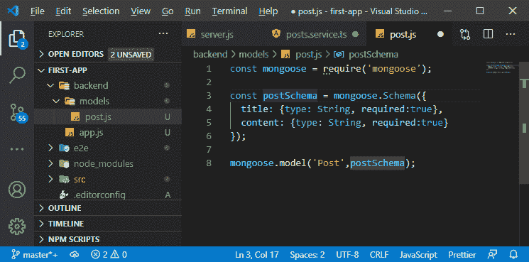
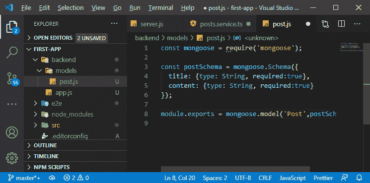

# 在平 MEAN 栈中添加猫鼬

> 原文：<https://www.javatpoint.com/adding-mongoose-in-mean-stack>

在前一节中，我们在云存储上设置了 MongoDB。现在，我们有了一个数据库，我们需要一种方法从我们的 node express 应用程序中连接到该数据库。因此，在本节中，我们将了解连接到数据库的方式。

我们将使用第三方包，即 mongodb 客户端包，实际上，我们可以在这里使用两个包，即 MongoDB 和 mongoose。我们可以通过以下方式使用 npm 安装 mongodb 包:

```

npm install --save mongodb

```

但是，我们将使用猫鼬包。Mongoose 是一个基于官方 MongoDB 驱动程序的第三方包，但是它让访问 [MongoDB](https://www.javatpoint.com/mongodb-tutorial) 变得更加容易和方便。Mongoose 使用 mongodb 并不真正使用的模式，因此我们可以定义我们的数据应该是什么样子，这允许我们方便地存储和获取数据。

如果我们需要非结构化数据，这可能不是我们正在寻找的解决方案。但通常情况下，情况并非如此，因此，Mongoose 是一个很好的工具，甚至可以处理这样的非结构化数据。

我们将使用以下 npm 命令安装猫鼬包:

```

npm install --save Mongoose

```



在下载到我们的项目文件夹后，这个工具将允许我们连接到我们的 MongoDB，并与它交互来存储数据和获取数据。

现在，我们将使用**猫鼬**。我们将使用以下步骤来使用它:

1)在我们的后端，首先，我们需要为此添加模式。我们将转到我们的 **model.ts** 文件，这个模型向我们展示了一个帖子现在的样子。我们不需要自己创建唯一的 id，因为该 ID 将由 Mongoose 自动为我们创建。我们需要专注于在后端创建这些模式，而不是 ID。为此，我们将创建新文件夹**模型**。



2)在 models 文件夹中，我们将创建一个新的 JavaScript 文件，并给它命名为 post。在这个文件中，我们将使用 Mongoose 创建我们的帖子模型。



3)在这个文件中，我们将使用“require”方法以下列方式导入 Mongoose:

```

const mongoose = require('mongoose');

```



4)要创建模式，我们首先需要为我们的数据创建一个蓝图。我们将使用猫鼬包的 **Schema** 方法按照以下方式创建蓝图:

```

const postSchema = mongoose.Schema();

```



5)在模式中，我们将传递一个 javascript 对象。这个对象将保存我们的自定义配置。我们定义了字段以及希望存储在这些字段中的数据类型。我们将以以下方式定义所有这些内容:

```

const postSchema = mongoose.Schema({
  title: {type: String, required:true, default: 'Hello!'}
});

```

在上面的代码中，我们以对象的形式定义了数据的字段和类型。我们定义了标题，它是字符串类型，并添加了元数据，即必需和默认。我们可以在猫鼬官方文档中了解更多。



因此，如果我们试图在没有设置标题属性的情况下创建它，我们将会得到一个错误。

6)我们还将添加另一个字段，即与我们为标题创建的方式相同的内容。在定义了这个之后，我们的模式将被定义。

```

const postSchema = mongoose.Schema({
  title: {type: String, required:true},
  content: {type: String, required:true}
});

```



7)它只是一个蓝图，为了创建数据或者创建模型对象，我们需要把定义变成模型。我们将通过使用猫鼬模型函数来做到这一点。**模型**函数取两个参数，即第一个参数是模型的名称，另一个参数是我们的 schema，我们想用它。我们将以下列方式使用模型函数:

```

mongoose.model('Post',postSchema);

```



8)现在，我们需要导出这个，因为我们将在这个模型文件之外使用这个猫鼬模型。我们将使用**导出**语法以下列方式导出该模型:

```

module.exports = mongoose.model('Post',postSchema);

```



在下一节中，我们将在 app.js 文件中使用这个猫鼬模型。当我们向应用编程接口帖子发送帖子请求时，我们将使用它。

* * *