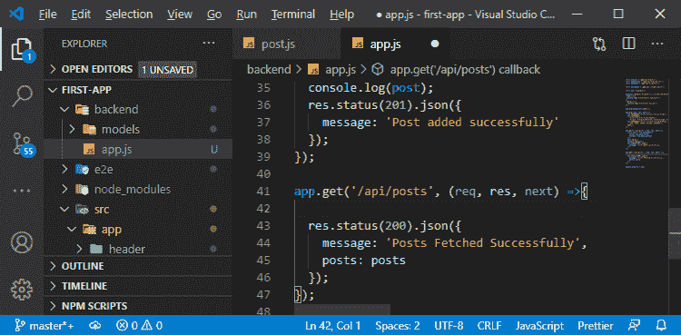
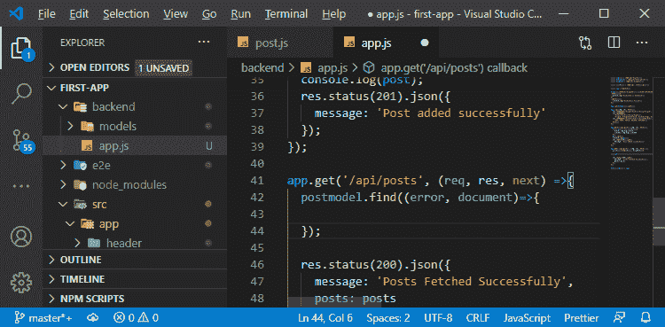
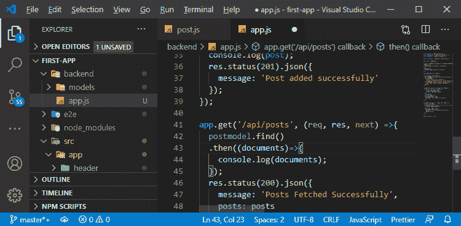
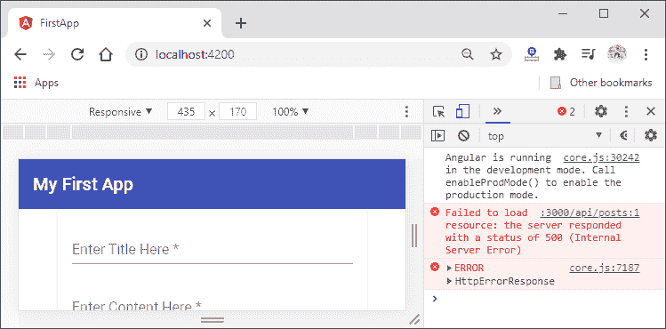
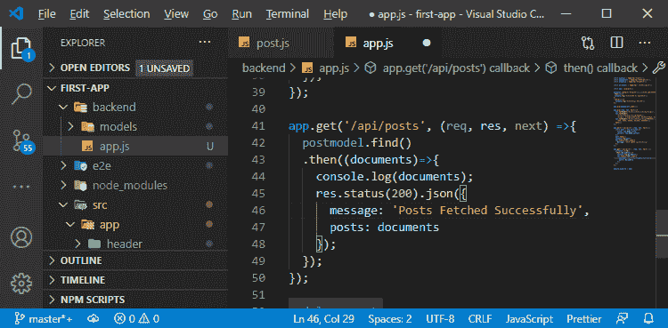
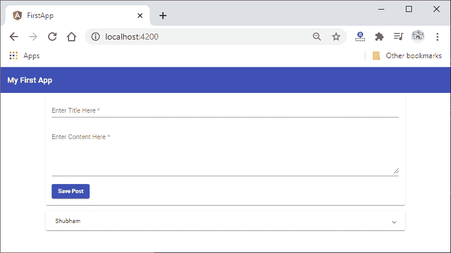
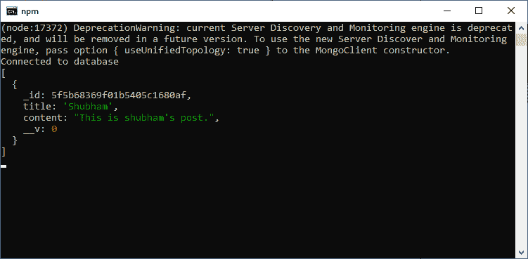

# 从 MEAN 栈中的数据库获取数据

> 原文：<https://www.javatpoint.com/fetching-data-from-the-database-in-mean-stack>

在前一节中，我们学习了如何使用 MongoDB shell 连接到数据库，并看到了从 [MongoDB](https://www.javatpoint.com/mongodb-tutorial) shell 访问数据库的命令。在本节中，我们将学习如何获取存储在数据库中的数据。我们将再次对 app.js 文件进行更改。

我们将执行以下步骤从数据库中获取数据:

1)我们将返回到我们的 app.js 文件，并到达 **get()** 方法，在该方法中，我们将虚拟数据返回给我们的客户端。现在，我们不会在这里返回虚拟数据。我们将返回真实的数据，所以我们将在代码中去掉它。



2)现在，我们将从帖子集合中获取数据。之前，我们在帖子模型的帮助下创建了一个帖子，并在我们的**帖子()**方法中用新的关键字进行了实例化。我们将再次使用 post 模型来获取数据，但这次我们使用它时没有使用关键字。我们将使用猫鼬提供的静态方法，即 find()方法。

这个 find()方法将返回数据库中的所有条目。这个 find()方法也可以被配置成缩小我们得到的结果，但是我们将在那个时候获取所有的结果。该功能将以下列方式使用:

```

postmodel.find();

```


3)有两种方法可以获得结果并加以利用:

a.我们可以传递一个函数，这个函数一旦完成就会被执行。这个函数回调将获得两个参数，即错误和它获取的结果或文档。这将以下列方式结束:

```

postmodel.find((error, document)=>{

});

```



b.我们将使用一个 then 块，而不是回调。这个块将保存我们的结果，所以我们将取回这个块中的所有文档。获取所有文档后，我们将通过以下方式记录这些文档:

```

postmodel.find()
  .then((documents)=>{
    console.log(documents);
  });

```



4)我们还需要添加一个 catch 块来处理这个错误，但是我们稍后会这样做。现在，我们将重新加载我们的角度前端。



我们在这里得到一个错误，因为在响应中，我们使用了 posts 数组，我们之前已经删除了它。

5)现在，我们将用响应中的文档替换 posts 数组，并将这个响应代码放入 then 块中。这很重要，我们必须在这个**然后是**块中执行它，因为获取数据是一个异步任务。因此，完整的 app.get()方法将按照以下方式设计:

```

app.get('/api/posts', (req, res, next) =>{
  postmodel.find()
  .then((documents)=>{
    console.log(documents);
    res.status(200).json({
      message: 'Posts Fetched Successfully',
      posts: documents
    });
  });
});

```



6)我们期望在前端获得一个 ID 字段，但是在后端，它是 name _id。我们将通过在服务器上重命名来修复它。在 **get()** 方法中，我们不会直接给帖子分配文档。我们将以以下方式将 document.map()分配给帖子:

```

posts: documents.map()

```

#### 注意:我们将在后面的代码中使用 map()方法。

现在，我们重新加载我们的角度前端，我们将在扩展面板中看到数据。



我们的文档数据也将在我们的控制台中可见。



在下一节中，我们将学习如何转换 [MEAN Stack](https://www.javatpoint.com/mean-stack) 中的响应数据。

**下载完整项目(从数据库获取数据. zip)**

* * *