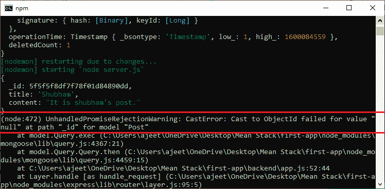
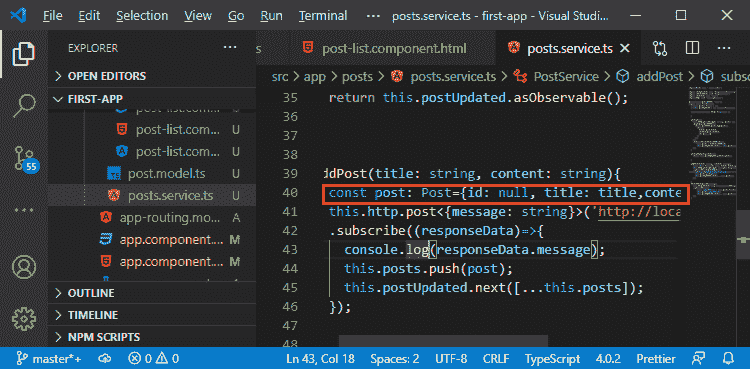
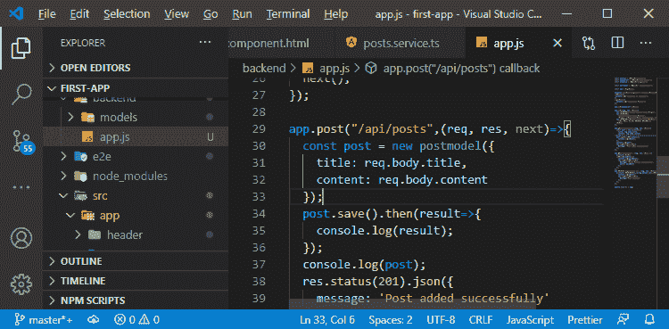
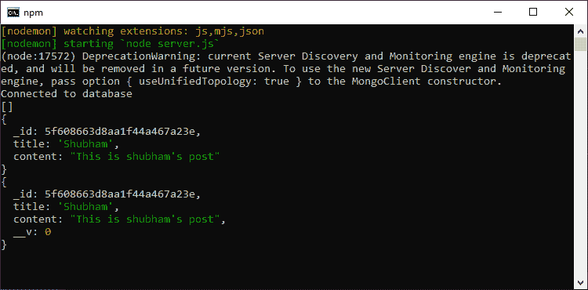
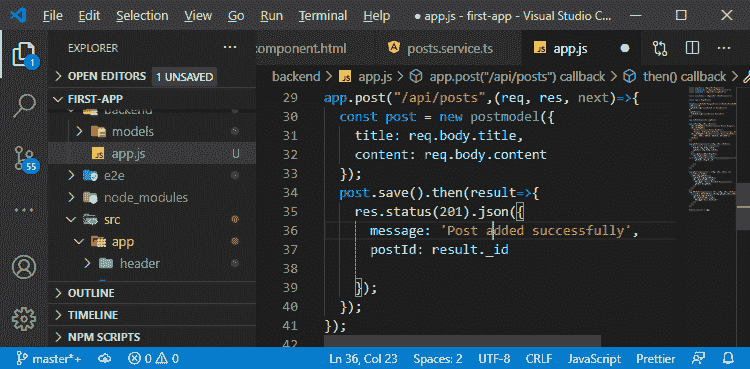
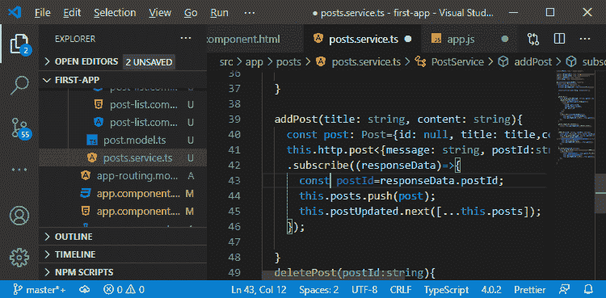
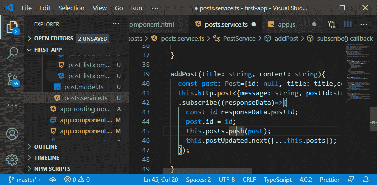
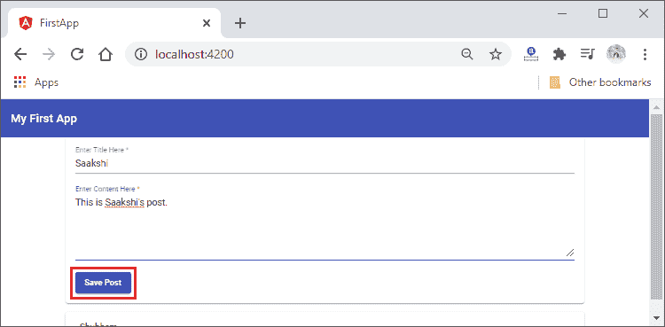
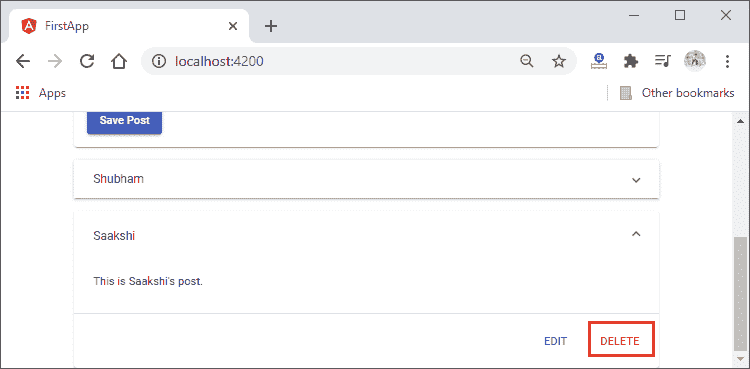
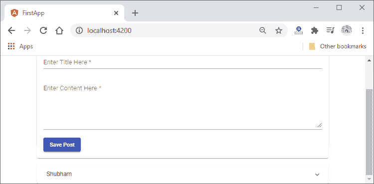

# 添加带有标识的帖子

> 原文：<https://www.javatpoint.com/adding-a-post-with-an-id-in-mean-stack>

在前一节中，我们学习了如何从数据库中删除文档并进行前端实时更新。在本节中，我们将学习如何添加带有 id 的帖子。

如果我们将新帖子添加到数据库中，并且在添加之后，如果我们尝试删除它，它将不会被删除，并向我们显示以下强制转换错误:



出现这种转换错误是因为我们将空值作为一个标识传递给了我们想要删除的帖子。我们在这里没有得到响应，因为我们没有在服务器端应用程序上处理错误案例。为了解决这个问题，我们将使用以下步骤:

1)我们将返回到我们的 **js** 文件，并到达删除路线。这里，在 deleteOne()方法中，我们只处理成功的情况，不处理失败的情况。如果我们转到客户端代码，在那里我们在 the posts.service.ts 文件中添加一个新的帖子，我们创建一个 ID 为 null 的帖子。



我们立即将这个帖子添加到我们的前端应用程序中。现在，我们这样做，一旦我们从服务器得到成功的响应，这意味着这篇文章被保存在数据库中。但是，我们没有使用在服务器上动态生成的标识。我们不会在本地帖子中更新该 id，但我们需要更新它。有两种方法可以解决这个问题:

1.  第一种方法是在**service . ts**文件的 addPost()方法中，每当我们得到成功响应时，我们就调用 getPosts()。它将获取更新后的帖子，并在我们的前端应用程序中更新帖子。
2.  我们可以使用第一种方法，但是第一种方法也是多余的。如果我们添加了帖子，那么我们为什么要获取并更新所有的帖子。因此，我们有另一种方法，我们获取创建的帖子的标识，并在 **service.ts** 文件的 addPost()方法中使用它。

2)现在，为了使用第二种方法，我们将返回到我们的 app.js 文件。在 post 路线中，我们将使用 **save()** 附加**然后**块。在这个然后块中，我们将获得一个结果对象，其中包含关于该保存操作结果的信息。该**然后**块按以下方式编码:

```

post.save().then(result=>{
    console.log(result);
  });

```



现在，我们启动服务器，并使用一个有角度的前端添加一个帖子。如果我们回到我们的控制台，我们会看到添加了 id 的帖子信息。



3)我们现在将使用 then 块中的响应语句，除了我们的成功消息之外，我们还将以以下方式发送 postId 字段:

```

res.status(201).json({
      message: 'Post added successfully',
      postId: result._id

    });

```



4)现在，我们将使用 the posts.service.ts 文件中的 postId。在 subscribe 方法中，我们不关心消息。在 post 服务中，我们需要更新我们的预期返回值，以反映 postId 字段。我们将通过以下方式从响应中获取位置:

```

this.http.post('http://localhost:3000/api/posts',post)
    .subscribe(( responseData)=>{
      const id = responseData.postId;
      this.posts.push(post);
      this.postUpdated.next([...this.posts]);
    });

```



5)现在，我们需要按照以下方式更新我们在 **addPost()** 方法中创建的帖子的 id:

```

post.id = id;

```



现在，我们更新了 id，我们将保存它。我们将添加另一个帖子，现在如果我们尝试删除它，它将被成功删除。





现在，一切正常。在下一节中，我们将开始一个新模块。在本模块中，我们将学习如何增强我们的应用程序。

**下载完整项目(添加一个 id.zip 的帖子)**

* * *