# 更新 MEAN 栈中服务器上的数据

> 原文：<https://www.javatpoint.com/updating-data-on-the-server-in-mean-stack>

在前一节中，我们学习了如何使用 angular app 将数据更新到数据库中。我们的编辑和删除按钮运行良好。在本节中，我们将了解如何立即重新加载我们的页面，因为编辑帖子后，该帖子的 id 显示在[网址](https://www.javatpoint.com/url-full-form)上，这不是一件好事。

我们能够更新帖子，现在不需要使用服务器上的控制台日志。在我们发送 http 请求的 the posts.service.ts 文件的前端，我们也获得了更新前端帖子所需的所有数据。这有点多余，因为我们使用帖子的唯一地方是在根页面。在这个根页面中，我们总是获取一个新的副本，但是我们仍然需要知道如何在获得成功响应后本地更新帖子。我们将使用以下步骤在本地更新服务器上的数据:

1)我们将回到我们的 updatePost()方法，在这里我们创建 http 请求。在 http 请求的订阅中，我们将使用那个版本替换 post 数组中那个帖子的当前版本，而不是使用控制台日志语句。为此，我们将克隆我们的 post 数组，并以如下方式将其存储在常量中:

```

.subscribe(response =>{
      const updatedPosts = [...this.posts];
    });

```

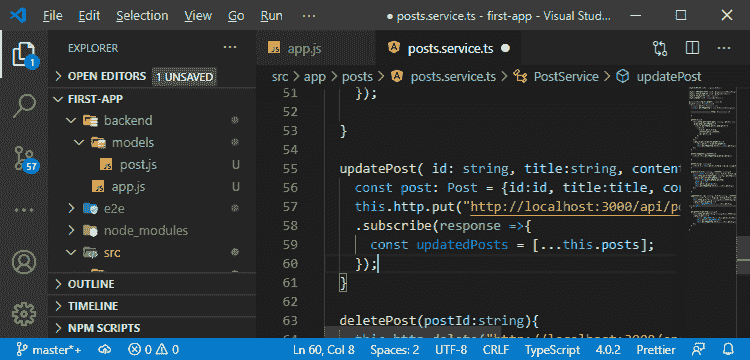

2)这样做之后，我们将根据旧的帖子版本的 ID 来搜索它，因此我们将通过以下方式搜索索引:

```

const oldPostIndex = updatedPosts.findIndex();

```

**findIndex()** 方法接受一个函数，如果我们找到了我们要找的帖子，这个函数将返回 true。因此，在这个函数中，我们将检查我们在那个数组中查找的帖子或帖子的 Id 是否等于 post.id。如果相等，那么我们找到要替换的帖子的索引。

```

const oldPostIndex = updatedPosts.findIndex(p=> p.id===post.id);

```

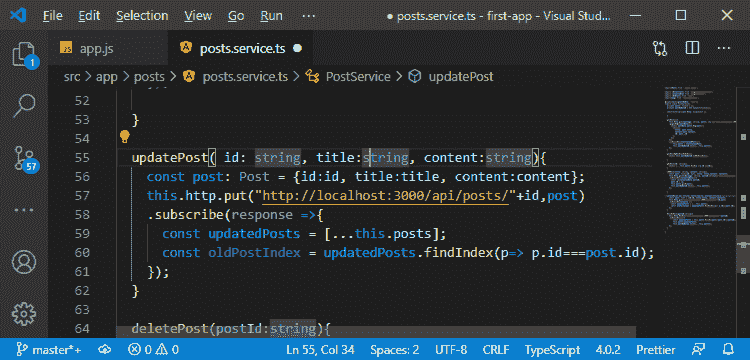

3)现在，我们将以以下方式用新帖子替换该索引的帖子:

```

updatedPosts[oldPostIndex] = post;

```

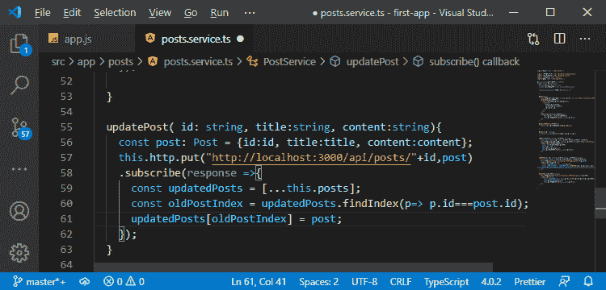

4)现在，我们需要按照以下方式将 updatedPosts 数组的值存储到原始 posts 数组中:

```

this.posts = updatedPosts;

```

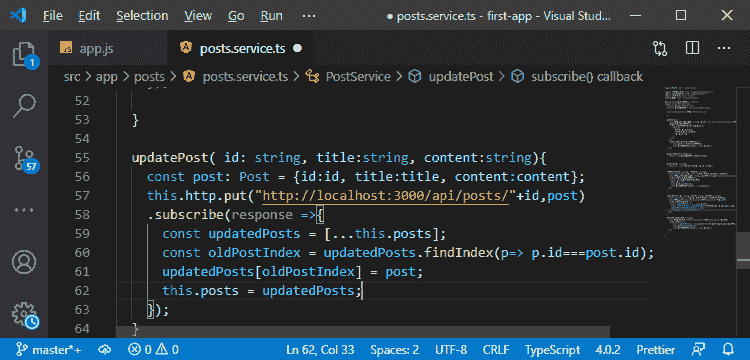

5)现在，我们还需要通过以下方式将此更新告知我们的应用程序:

```

this.postUpdated.next([...this.posts]);

```

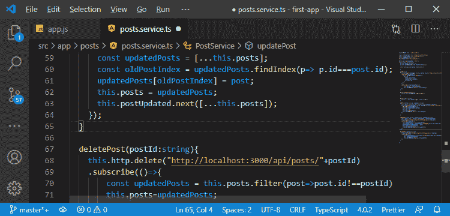

现在，我们还想确保，如果我们在编辑页面上重新加载，我们不会再有空白表单，因为我们无法获取帖子。我们确实失败了，因为如果我们重新加载，我们所有的状态都会丢失，应用程序会重新启动。因此，我们在服务中的帖子数组将是空的，因为我们只使用 getPosts()方法从服务器获取帖子，该方法仅在帖子列表组件中调用，但是如果我们在页面上重新加载，我们还不会访问帖子列表组件。

6)因此，我们还需要从页面上的服务器获取单个帖子数据。我们将通过在 post.service.ts 中回收 getPost()方法来实现这一点，该方法不是从本地的帖子数组中获取帖子，而是从服务器中获取。因此，我们将返回到我们的 **js** 文件，这里我们将添加一个新的路由，它将是一个 get 请求。

```

app.get("/api/posts/:id",(req, res, next)=>{

});

```

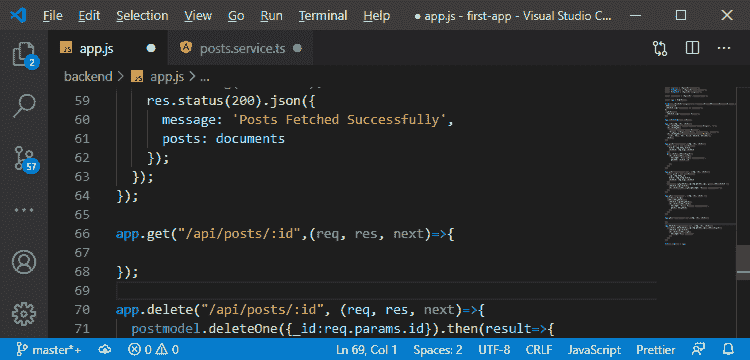

7)这种方法将延伸到我们的数据库，并找到一个在网址中显示 id 的帖子。为此，我们将使用我们的后模型，在那里我们有一个 findById()方法。我们将传递 id 作为参数，mongoose 将查看我们的数据库，并在其中找到一个具有该 id 的元素。

```

postmodel.findById(req.params.id);

```

我们将附加一个**然后**块，在那里我们将得到一个参数。在这个模块中，我们将检查我们的帖子 id 是否存在。如果存在，那么我们返回状态代码为 200 的响应和我们的帖子作为 json 数据，否则我们将以如下方式返回状态代码为 404 的响应和消息**“帖子未找到”**作为 json 数据:

```

postmodel.findById(req.params.id).then(post =>{
    if(post){
      res.status(200).json(post);
    }else{
      res.status(484).json({message: 'Post not Found!'});
    }
  });

```

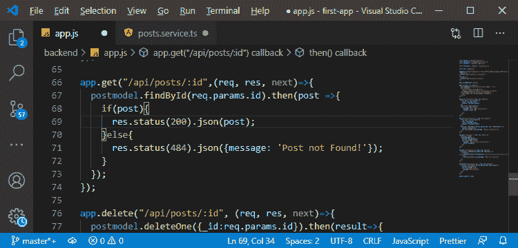

8)现在，我们只需要在 post.service.ts 文件中从客户端调用这个路由。在 getPost()方法中，我们返回了一个 Post。现在，我们将摆脱它，因为它不能再这样做了。这样做的原因是，如果我们在这里进行 http 调用，那么它将是一个异步代码，并且我们不能在 addPost()的订阅内部返回，所以我们需要同步返回。

我们将返回从 angular http 客户端获得的可观察数据，这样我们就可以订阅对该数据感兴趣的组件，而不是在 getPost()方法中使用该返回语句。我们将通过以下方式返回可观测值:

```

return this.http.get("http://localhost:3000/api/posts/"+id);

```

我们还需要显式添加我们通过以下方式获得的数据类型:

```

return this.http.get("http://localhost:3000/api/posts/"+id);

```

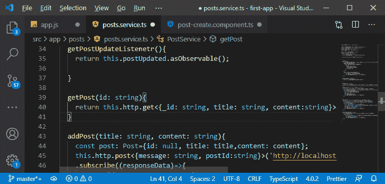

我们将在 post create 组件中订阅这个，而不是在 **getPost()** 中订阅这个。在 ngOnInit 中，我们不会这样分配。

```

this.post = this.postsService.getPost(this.postId);

```

相反，我们将添加一个订阅，我们也不需要取消订阅，因为它是由 angular http 客户端添加的，因此 angular 会处理它。在订阅过程中，我们知道我们最终将获得我们的帖子数据，并通过以下方式为帖子赋值:

```

this.postsService.getPost(this.postId).subscribe(postData=>{
            this.post = {id: postData._id, title:postData.title, content:postData.content}
});

```

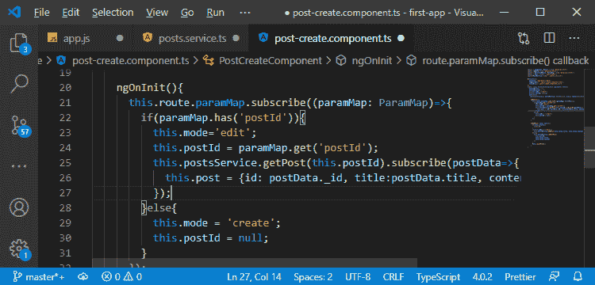

现在，如果我们返回到我们的应用程序，我们将看到以下错误:

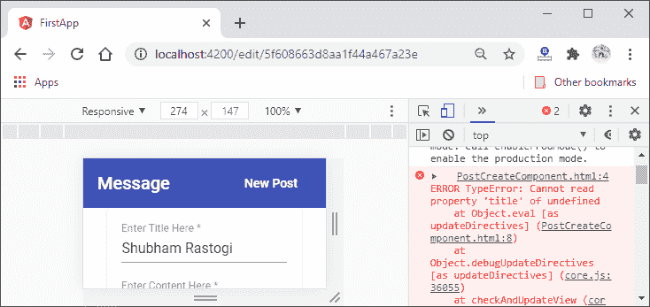

9)我们得到这个错误是因为，最终，我们有了后数据，但不是从一开始就有。这是因为 http 请求需要一些时间来执行。然而，帖子最初是未定义的，我们试图用 ngModel 从 post-create.component.html 文件中读取一个新值。我们将通过使用所谓的埃尔维斯算子来修复它。在模板中，我们将在帖子后添加一个问号，这将用于 angular 在尝试阅读标题和内容之前检查帖子是否存在。如果帖子不存在，它将填充标题和内容，而不填充任何内容。

```

[ngModel] = "post?.title"
[ngModel] = "post?.content"

```

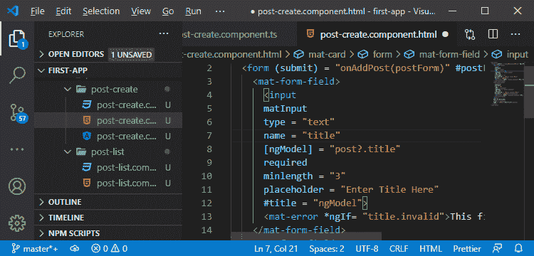

现在，如果我们保存这个并重新加载页面，我们将不会得到一个错误。

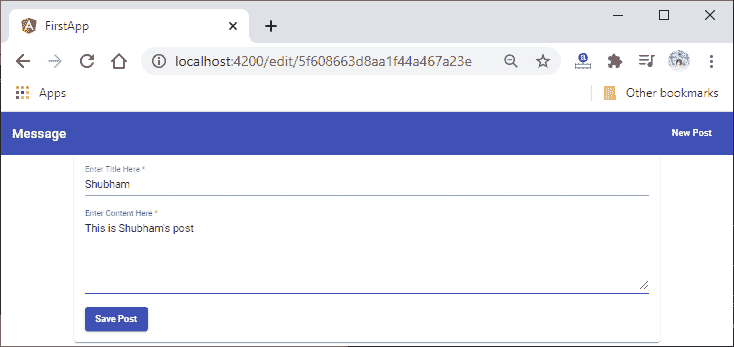

#### 注意:我们在 the posts.service.ts 文件的 updatePost()方法中的更新机制实际上不起作用，在该方法中，我们用 id 替换旧的帖子。它在这里不会做任何事情，因为如果我们从未访问过我们的帖子列表页面，那么我们在那个数组中就不会有任何帖子，所以没有什么需要更新的。

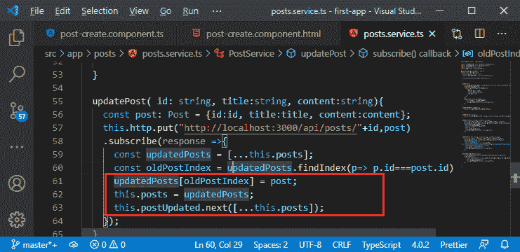

现在一切都很顺利。在下一节中，我们将重新组织后端路由。

* * *