# MEAN 栈中从模板驱动方法到反应方法的转换

> 原文：<https://www.javatpoint.com/converting-form-from-template-driven-approach-to-reactive-approach-in-mean-stack>

在上一节中，我们学习了如何在 angular 应用程序中添加输入文件按钮。我们使用了文件输入和一个有角度的材质按钮。在本节中，我们将使用表单注册输入。为此，我们需要将表单从模板驱动的方法转换为反应式方法。在本节中，我们还将学习如何将表单从模板驱动的方法转换为反应式方法。

在反应式方法中，我们在我们的[TypeScript](https://www.javatpoint.com/typescript-tutorial)代码中定义一切，并告诉 angular 我们定义的控件映射到哪个输入。

我们将使用以下步骤来做到这一点:

1)如果我们想使用反应式方法，我们需要导入反应式表单模块，而不是将表单模块从@angular/ forms 导入我们的 app.module.ts。表单模块解锁了模板驱动方法。我们将像这样将此模块添加到 imports 数组中:

```

import {ReactiveFormsModule} from '@angular/forms';
imports: [
    …
    …
    ReactiveFormsModule,
    …
    …
  ],

```

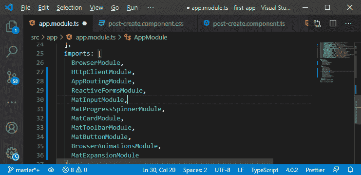

2)我们需要从我们的**后创建组件中禁用 n model。从我们的表单中删除了 ngModel 之后，我们的 [html](https://www.javatpoint.com/html-tutorial) 代码将如下所示:**

```

<form (submit) = "onAddPost()"  *ngIf = "!Loading">
    <mat-form-field>
      <input
      matInput
      type = "text"
      name = "title"
      placeholder = "Enter Title Here">
      <mat-error *ngIf= "title.invalid">This field is required</mat-error>
    </mat-form-field>
<textarea
      matInput
      rows = "6"
      name = "content"9
      placeholder = "Enter Content Here"></textarea>

```

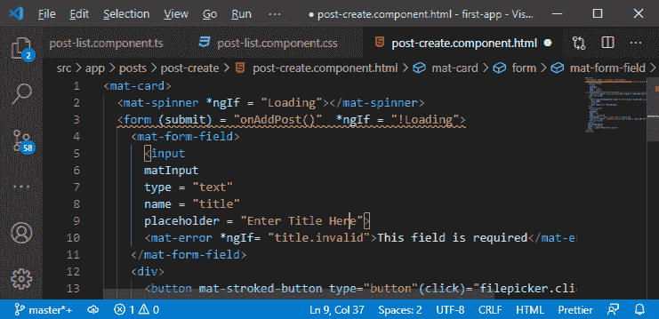

上面，我们还删除了传递给 onAddPost()方法的参数，因为我们不再能够访问模板中的表单。

3)在我们的 typescript 文件中，我们需要更改创建表单的方式。因此，我们将以编程方式在 typescript 文件中创建表单。我们将创建表单并将它存储在“form”属性中，该属性的类型将是 FormGroup。因此，我们需要从@angular/forms 中导入 FormGroup，并移除 **ngForm** 。

```

import {FormGroup} from "@angular/forms";

```

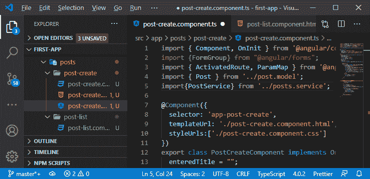

FormGroup 是窗体的顶级对象，它将窗体的所有控件分组。我们也可以在一个窗体中有子组，然后在一个窗体中对控件进行分组，但是整个窗体只是一个大的组，我们将使用它。

4)我们将通过以下方式创建 FormGroup 类型的表单属性:

```

form: FormGroup;

```

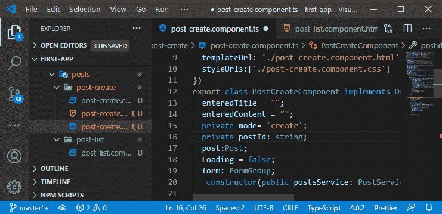

我们得到了表格，但是没有定义。因此，我们需要初始化我们拥有的控件，我们将在 ngOnInit 中这样做。我们将接触到 ngOnInit()，在这个方法的开始，我们将以下面的方式进行初始化:

```

this.form = new FormGroup();

```

所以，我们创建了一个新的 FormGroup 对象，这个对象以一个 [Javascript](https://www.javatpoint.com/javascript-tutorial) 对象作为参数。在这个 javascript 对象中，我们将配置我们的表单。我们可以在这个对象中分配描述我们的控件的键值对。我们将以下列方式添加标题控件:

```

this.form = new FormGroup({
        'title': new FormControl(null, {validators:[Validators.required, Validators.minLength(3)]}) 
      });

```

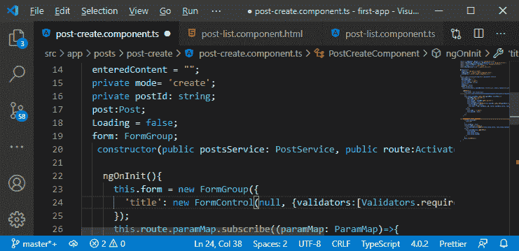

在上面的代码中，FormControl 在表单中创建了一个控件。在 FormControl()方法中，我们传递了几个参数。FormControl 函数中的第一个参数是表单的开始状态。我们传递 null 作为第一个参数，因为我们希望缺省情况下以 null 开始，以获得空输入。

FormControl 中的下一个参数允许我们附加验证器或表单控件选项。这些对象是 javascript 对象，在该对象中，我们定义了异步验证器、同步验证器等。因此，在上面的代码中，我们传递了验证器的 [javascript 对象](https://www.javatpoint.com/javascript-objects)作为第二个参数。

我们将对这样的内容做同样的事情:

```

'content': new FormControl(null, {validators: [Validators.required]})

```

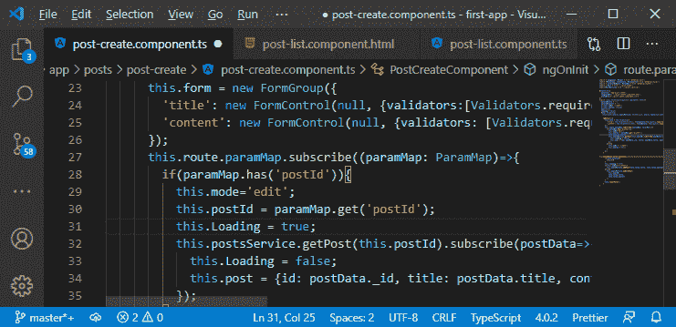

现在，我们得到了和以前基本相同的表单，当然，表单还没有完成。缺少的是与模板的连接，以及在编辑帖子时可以用具体值预填充这些控件的部分。因为我们将起始值设置为空，但只有在创建新帖子时，这才是正确的。

5)我们将返回到我们的订阅设置一个初始值，在那里我们获得了我们的帖子数据。之后，我们将接触到我们的表单并调用 setValue()方法。此方法允许我们重写窗体控件的值。因此，我们将在 **setValue()** 方法中传递一个 javascript 对象，并按照以下方式为每种形式的控件设置一个值:

```

this.form.setValue({
              title: this.post.title,
              content: this.post.content
            });

```

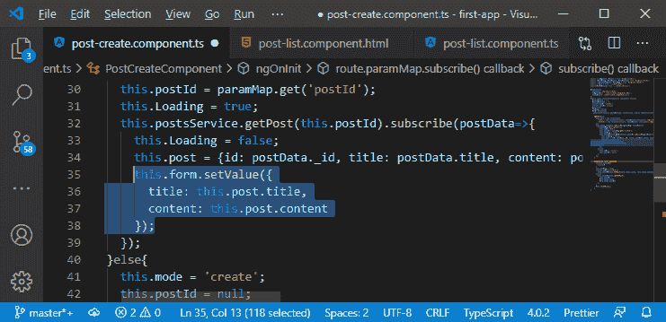

6)现在，我们初始化了这些值，以防收到加载的帖子。当我们保存帖子时，将没有必要获取表单作为参数。相反，我们在类中注册了自己的表单对象作为属性。所以，我们用这个. form 来访问它，对于无效属性使用 **form** ，访问 value 属性，在 updatePost()方法中访问 title 和 content 值。

```

onAddPost()
{
      if( this.form.invalid )
      {
        return;0
      }
      this.Loading = true;
      if( this.mode === "create" )
      {
        this.postsService.addPost( this.form.value.title, this.form.value.content );
      }else{
        this.postsService.updatePost(
          this.postId,
          this.form.value.title,
          this.form.value.content
        );
      }

```

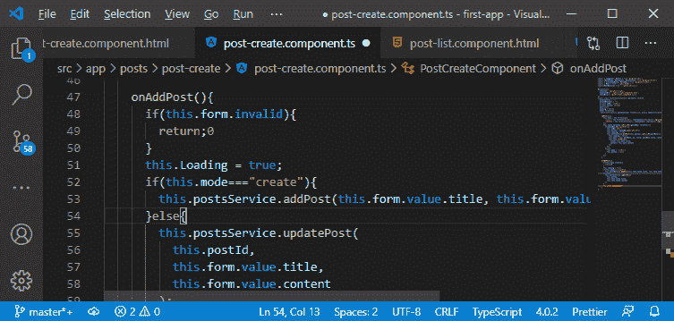

7)现在，为了重置表单，我们将调用 this.form.reset()方法，而不是通过以下方式调用 resetForm()方法:

```

this.form.reset();

```

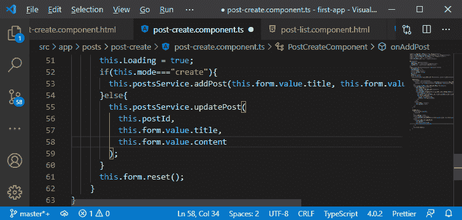

8)现在，我们已经完成了 TypeScript 代码，缺少的是我们将 HTML 代码与 TypeScript 同步的部分。为此，我们将返回到我们的**后期创建. component.ts** 文件，这里我们删除名称，因为 angular 提供了不定义名称的灵活性。因此，我们不依赖于某些东西，而是添加一个特殊的指令。但是，首先，我们向我们的整体表单添加一个指令，即 FormGroup 指令，这个 formGroup 指令采用我们的表单对象。这个表单对象告诉 angular，我们在 typescript 中创建的表单是 HTML 表单。

```

<form [formGroup]= "form" (submit) = "onAddPost()"  *ngIf = "!Loading">

```

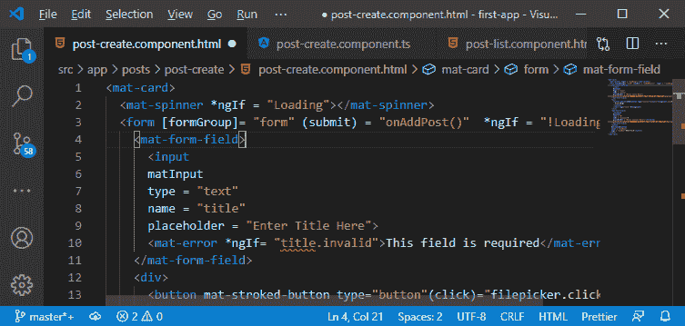

9)现在，在输入端，我们将使用 **formControlName** 指令，该控件的名称与我们在 **post-create.component.ts** 文件中定义的名称相同，如下所示:

```

formControlName = "title"

```

现在，我们在 **< mat-error >** 中得到标题无效错误。所以，我们将会连接这个错误。我们需要通过访问整个表单并使用 get()方法来访问标题表单控件。这个方法让我们可以控制。在此方法中，我们通过以下方式将控件名称作为标题传递:

```

<mat-error *ngIf= "form.get('title').invalid">This field is required</mat-error>

```

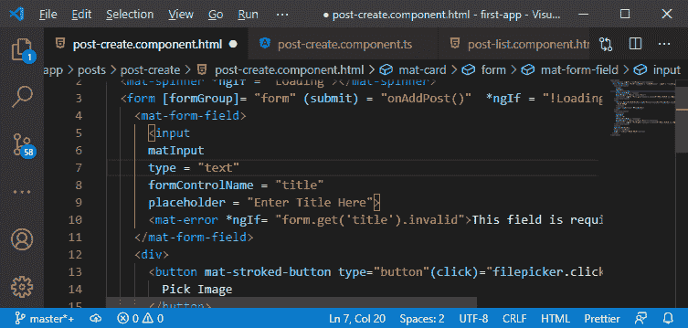

我们将为文本区域做这两件事，如下所示:

```

formControlName = "content"
<mat-error *ngIf= "form.get('content').invalid">This field is required</mat-error>

```

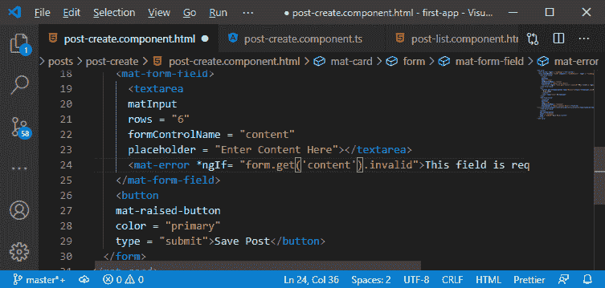

现在，如果我们运行 angular 应用程序，我们将再次拥有一个工作表单。

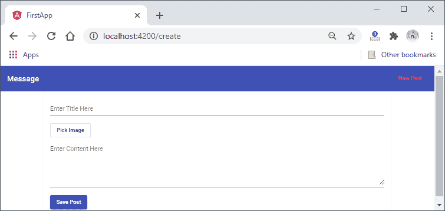

我们成功地将表单从模板驱动的方法转换为反应式方法。在下一节中，我们将添加图像控件来存储图像。

* * *