# 在 MEAN 栈中添加图像控件和预览图像

> 原文：<https://www.javatpoint.com/adding-image-controls-and-preview-image-in-mean-stack>

在前一节中，我们成功地将表单从模板驱动的方法转换为反应式方法。在本节中，我们将添加图像控件，将图像存储在[MEAN 栈](https://www.javatpoint.com/mean-stack)中。

现在，我们希望确保当我们从图像拾取器中选择一个图像时，它应该作为输入或值存储在我们的表单中。之前，我们将按钮连接到图像拾取器。所以，每当一幅图像被选中，我们都需要做些什么。我们将使用以下步骤来做到这一点:

1)我们将处理用户从图像拾取器中选择图像的情况。我们将在图像拾取器上注册更改事件。每当用户更改所选文件时，都会触发更改事件。因此，如果用户从“没有选择文件”更改为“这里有一个文件”，或者如果他此后更改了该文件，我们将以以下方式执行事件或方法:

```

<input type="file" #filepicker (change) = "PickedImage($event)">

```

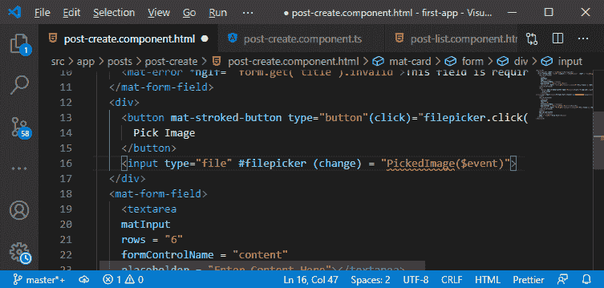

2)我们将转到我们的 typescript 代码并添加这个方法。在这种方法中，我们期望得到类型为**事件**的事件。

```

PickedImage(event: Event){

    }

```

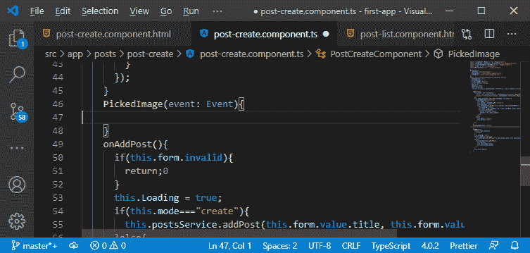

3)现在，我们将提取添加的文件。为此，我们将创建一个新的常量，并通过访问我们单击的事件目标来访问该文件。

```

const file = event.target.files;

```

这一行代码将显示一个错误。问题是 [typescript](https://www.javatpoint.com/typescript-tutorial) 不知道我们的事件目标是一个文件输入，因此不知道这个文件的属性存在。我们将通过转换这个事件目标或者明确告诉 typescript 这将是类型 [HTML](https://www.javatpoint.com/html-tutorial) 输入元素来解决这个问题。

为此，我们将使用括号包装事件目标，然后添加为 HTMLInputElement。这是一个类型转换，它清楚地告诉 typescript，整个表达式将是一个碰巧具有 files 属性的 HTML 输入元素。

```

const file = (event.target as HTMLInputElement).files[0];

```

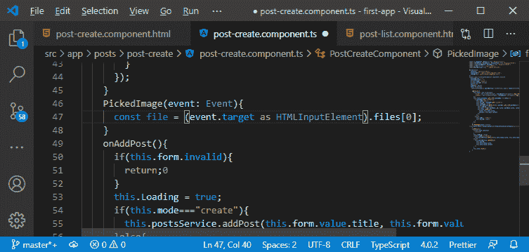

“文件”是一个文件数组，我们只需要选择一个，所以我们使用文件[0]从该数组中获取第一个元素，这是用户选择的文件。

4)现在，我们需要将这个文件存储在表单控件中。我们只有两个控件，即标题和内容。在 ngOnInit 中，我们将创建一个新的“表单控件”，在这个“表单控件”中，我们将初始设置一个空值，如:

```

image: new FormControl(null, {validators:[Validators.required]})

```


我们这里没有做的一件事是，我们不会将图像控件绑定到任何 HTML 元素。我们不会将其与文件选择器输入绑定，因为我们已经隐藏了它，并且我们不想在那里显示任何内容。因此，我们不会将它与 HTML 同步，这就是反应式方法的酷之处。我们不需要同步这个。相反，我们可以只在 typescript 中在幕后完全管理一个值。现在，这是对表单的控制，我们可以使用 typescript 手动控制该值。

5)现在，在 PickedImage()函数中，我们将接触到我们的表单并调用 patchValue()。在 setValue()中，我们将设置表单上所有输入或所有控件的值。patchValue()允许我们以单个控件为目标。我们将向此方法传递一个对象，并传递控件的名称及其值，如下所示:

```

this.form.patchValue({image: file});

```

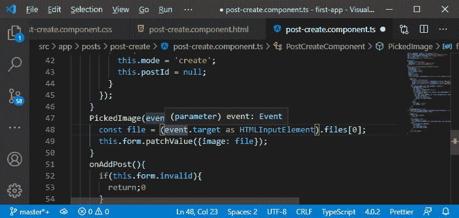

6)我们把手伸向表单，访问我们的图像，并调用**updatevalueandvalidation()**方法。

```

this.form.get('image').updateValueAndValidity();

```

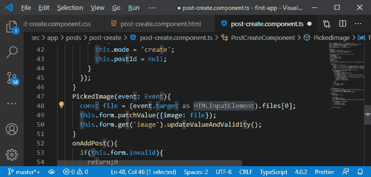

**updatevalueandvalidation()**方法通知 angular 我们更改了该值，它应该重新评估该值，将该值存储在内部，并检查我修补的值是否有效。它将对这个输入运行验证器，即使用户从未直接在那里输入。

7)现在，我们需要向用户预览存储的图像。为了预览我们的图像，我们需要在图像拾取器下面的 HTML 代码中添加一些东西。我们将在这里添加一个 div，并给它一个 CSS 类，名称由您决定。

```

<div class = "image-preview">

    </div>

```

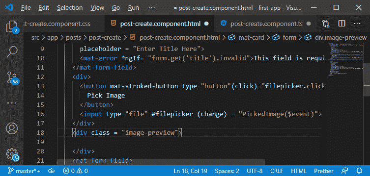

8)在 div 中，我们会添加一个普通的图像元素，我们要通过 **src** 进行绑定。我们还将按照以下方式设置标题。

```


```


9)现在，我们需要在 div 中显示图像。为此，我们需要将文件转换成可以显示的内容。我们将回到我们的 PickedImage()方法，这里我们将把我们的图像转换成所谓的数据 URL，这是一个 [URL](https://www.javatpoint.com/url-full-form) ，可以被正常的图像标签使用。我们将创建一个字符串类型的新属性。之后，我们将使用 [JavaScript](https://www.javatpoint.com/javascript-tutorial) 功能，即文件阅读器。我们将在 PickedImage()方法中创建一个新的常量属性，并存储文件读取器的一个新实例，因为我们必须实例化它或将它存储在该读取器常量中。

```

Pickedimage: string;
const reader = new FileReader();

```

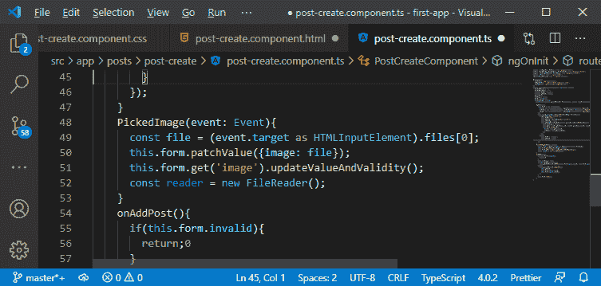

10)现在，我们将使用读取器常量并定义 onload 事件。这个事件将是一个函数，当它完成加载某个资源时被执行。在这个函数中，我们将把读者的结果存储在之前创建的 Pickedimage 属性中。

```

reader.onload = ()=>{
        this.Pickedimage = reader.result as string;
      };

```

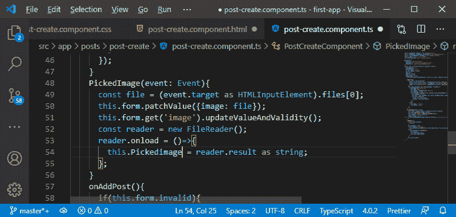

11)除非我们让它做点什么，否则它什么也做不了。因此，我们将调用读取器的 readAsDataURL()方法，并将我们的文件作为如下参数传递:

```

reader.readAsDataURL(file);

```

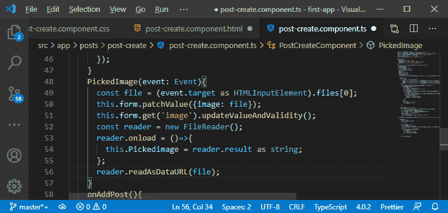

12)现在，我们将返回到我们的 HTML 代码，在 div 中，我们将使用 ***ngIf** 并检查 Pickedimage 是否不等于空字符串，以及图像预览是否不为空，如下所示:

```

<div class = "image-preview" *ngIf = "Pickedimage ! == ''&& Pickedimage">

```

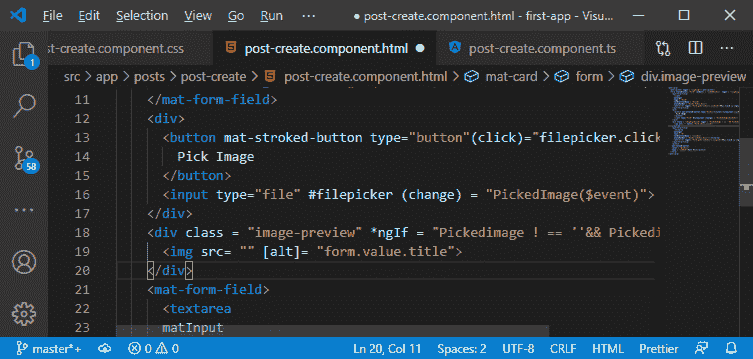

因此，如果 Pickedimage 存在，并且它不等于空字符串，那么 div 将被加载。

13)我们将把图像的 **src** 标签绑定到 Pickedimage，这是我们要显示的图像。

```


```

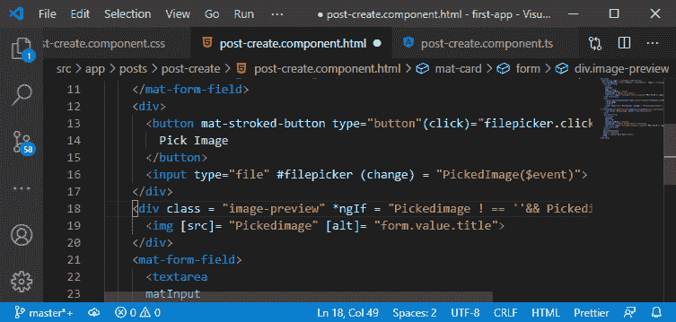

14)它现在看起来很丑，所以我们将返回到我们的 CSS 文件，并使用 CSS 代码来设置图像预览类和图像预览 img 的样式。我们将在 CSS 文件中添加以下代码行:

```

.image-preview{
  height: 5rem;
  margin: 1rem 0;
}

.image-preview img{
  height: 100;
}

```

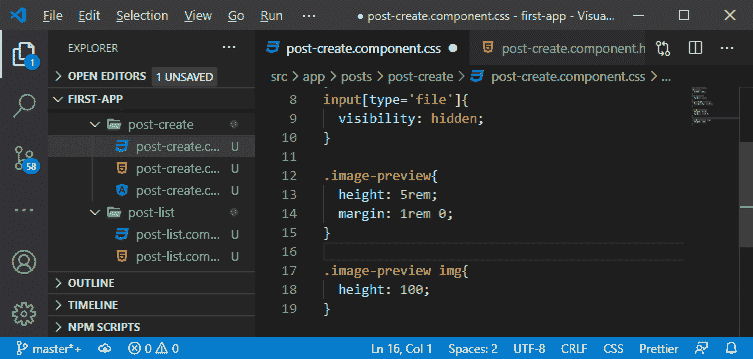

现在，我们保存所有文件，并尝试从图像拾取器中选择一张图片。


现在一切都很好，在下一节中，我们将了解 Mime 类型验证器。

* * *