# MEAN 栈中图像的服务器端上传

> 原文：<https://www.javatpoint.com/server-side-uploading-image-in-mean-stack>

在前一节中，我们成功实现了 mime 类型验证器，并将其用于图像验证。在本节中，我们将实现服务器端文件上传功能。

上传一个文件意味着在服务器上，我们需要从我们的传入请求中提取这样一个文件字节体，而我们不能用 bodyParser 做到这一点。bodyParser 适用于 [JSON](https://www.javatpoint.com/json-tutorial) 或 [URL](https://www.javatpoint.com/url-full-form) 编码数据，但不适用于文件。我们将执行以下步骤来执行服务器端上传:

1)我们需要安装“multer”软件包。这是一个针对 [NodeJS](https://www.javatpoint.com/nodejs-tutorial) 和 [ExpressJS](https://www.javatpoint.com/expressjs-tutorial) 的包，允许我们提取传入的文件。我们将使用 npm 以下列方式安装 multer 包:

```

npm install --save multer

```

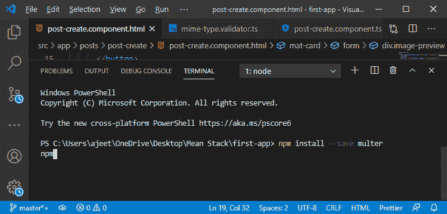

2)安装包后，我们就可以使用了。我们将使用 multer，只需将其附加到某些应该能够接受文件的路由上。首先，我们需要以如下方式导入 post.js 文件中的 multer:

```

const multer = require("multer");

```

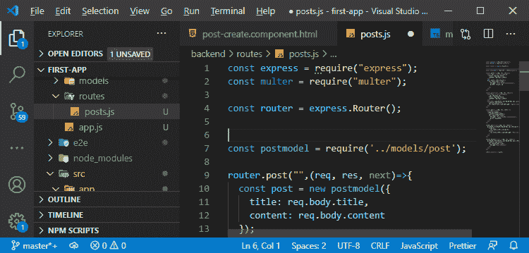

3) Multer 需要一些配置，所以我们将创建一个新的常量，在这个常量中，我们需要定义 Multer 应该将它在传入请求中检测到的文件放在哪里。我们将通过以下方式调用 multer 的 **diskStorage()** 方法来实现:

```

const storage = multer.diskStorage();

```

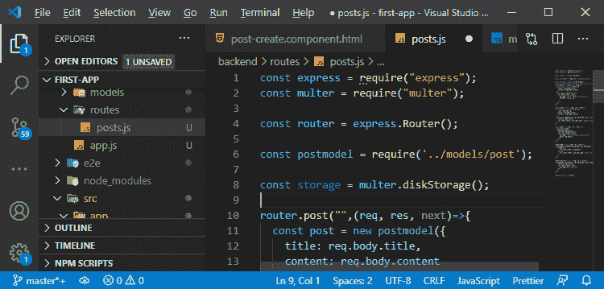

4)我们调用 distStorage()方法进行配置。我们将把一个 [JavaScript 对象](https://www.javatpoint.com/javascript-objects)传递给 diskStorage()方法。

```

const storage = multer.diskStorage({

});

```

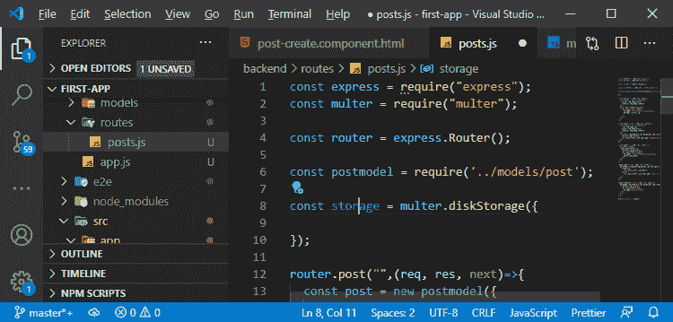

5)在这个对象中，我们设置了两个键，即目标和文件名。目标键是一个函数，每当 multer 试图保存文件时都会执行。这个函数接受一个请求对象，提取的文件和一个回调。

```

const storage = multer.diskStorage({
  destination: (req, file, cb)=>{

  }
}); 

```

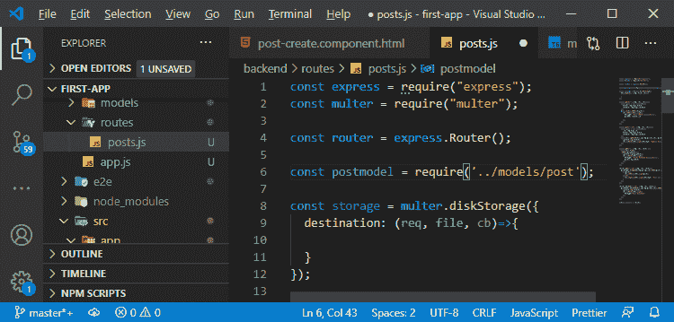

6)我们需要调用那个回调函数，将信息传回到我们应该存储信息的地方。我们将调用回调，对于该回调，我们需要传递两件事或两个参数。第一个参数是我们是否检测到了某个错误，为此，我们传递了 null，第二个参数只是一个字符串，其中包含应该存储它的文件夹的路径。

```

cb(null, "backend/images");

```

我们需要在后端文件夹中创建图像子文件夹。

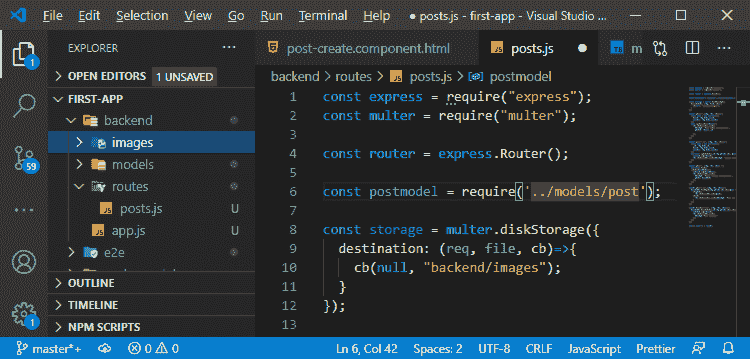

filename 键是另一个函数，我们也在其中获得请求对象、文件和回调。在这个函数中，我们将提取名称。我们将使用文件的 originalname 属性获取名称。我们还需要对此进行一点规范化，为此，我们将把它转换成所有小写字母，然后用空格分割它，并用破折号再次连接它。这样，文件名中的任何空格都将被替换为破折号。

```

filename: (req, file, cb)=>{
    const name = file.originalname.toLowerCase().split(' ').join('_');
}

```

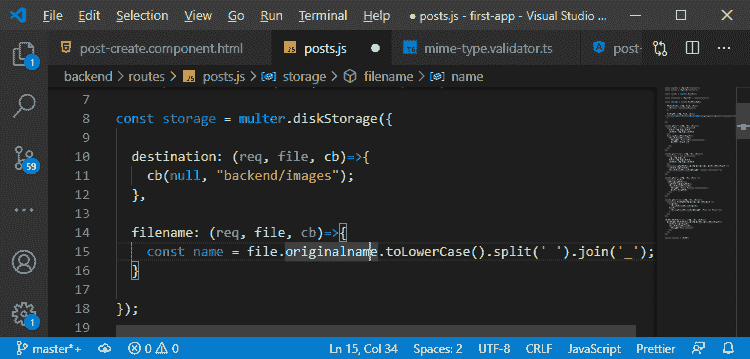

8)有一个问题，就是这样会错过文件扩展名。不过，我们也将提取这个，我们可以精确地得到文件 mime 类型。multer 给了我们哑剧类型。我们将创建一个 helper 常量来映射 mime 类型和我们想要的扩展名。我们需要支持三种类型的文件，即对于 image/png 作为 mime 类型，我们将使用 png 作为扩展名，对于 image.jpeg 作为 mime 类型，我们将使用 jpg 作为扩展名，对于 image/jpg 作为 mime 类型，我们将使用 jpg 作为扩展名的方式如下:

```

const MIME_TYPE_MAP = {
  'image/png': 'png',
  'image/jpeg': 'jpg',
  'image/jpg': 'jpg'
};

```


9)现在，我们将获得扩展名，我们将通过在 filename 函数中创建一个新常数来实现这一点。我们将使用 MIME_TYPE_MAP 常量，并在其中传递“file.mimetype”属性，如下所示:

```

const ext = MIME_TYPE_MAP[file.mimetype];

```

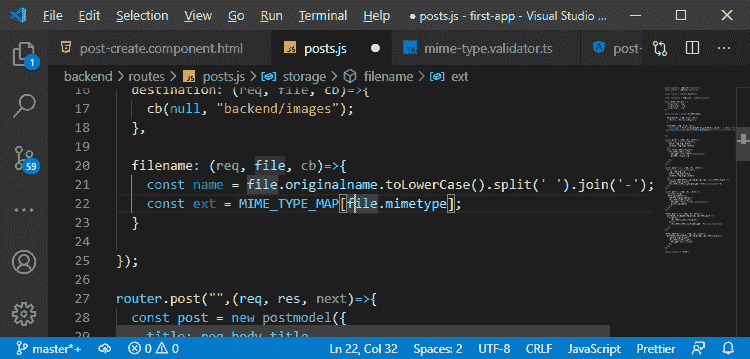

10)之后，我们将调用回调将该信息传递给 multer。我们没有错误；这就是为什么我们传递 null 作为第一个参数，我们将构造我们的名称作为第二个参数，我们将通过以下方式使用名称来构造它:

```

cb(null, name+ '-'+ Date.now()+ '.'+ ext);

```

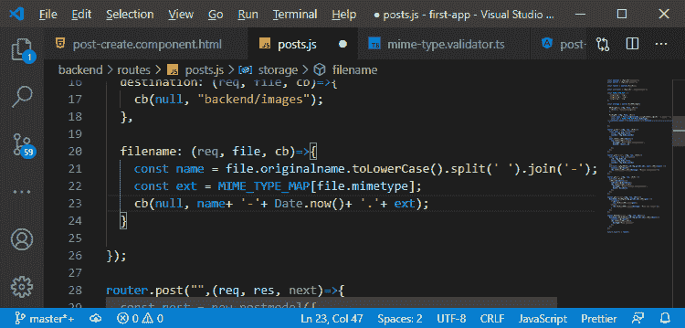

这个回调函数应该根据输入文件名、当前日期和正确的扩展名构造一个唯一的文件名。

11)作为一个额外的安全层，在目的地，如果我们检测到我们没有这些 mime 类型之一，我们必须抛出并返回一个错误。我们将通过创建一个新的常量，即 isValid 来实现这一点，我们将使用 MIME_TYPE_MAP，并在其中传递**file . MIME TYPE**如下所示:

```

const isValid = MIME_TYPE_MAP[file.mimetype];

```

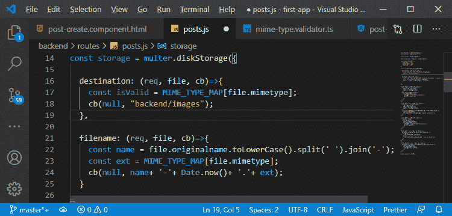

在这里，如果我们得到一个不属于 MIME_TYPE_MAP 的 MIME 类型，MIME_TYPE_MAP[file.mimetype]将不返回任何内容、未定义或空值。

12)因此，我们将使用新的关键字和 error()方法创建一个新的错误。我们将在 Error 函数中传递消息，并检查 isValid 常量。如果它不是 null 或未定义，我们将设置 error 等于 null。否则，我们会留下错误消息。在回调中，我们传递错误而不是 null 作为第一个参数，如:

```

let error = new Error("Invalid Mime Type");
    if(isValid){
      error = null;
    }
    cb(error, "backend/images");

```

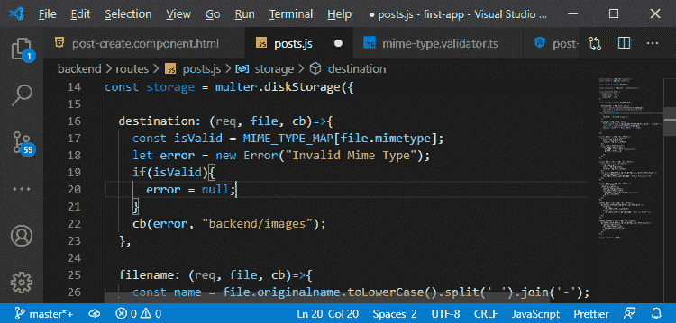

我们在上面配置了 multer。现在，它知道在哪里存储东西以及如何存储它们。

13)现在，是时候使用 multer 了。我们将通过将它作为额外的中间件传递来在 post 路由中使用它。在 post 路由中，我们将首先传递路径，然后传递另一个函数，该函数将在我们的函数运行之前对请求做一些事情。我们希望使用 multer()函数，在该函数中传递我们的配置，即存储，然后我们将在这里调用 single()。并将图像作为字符串传递给函数。使用单个()方法意味着我们需要一个文件。

```

router.post("", multer(storage).single("image"), (req, res, next)=>{

```

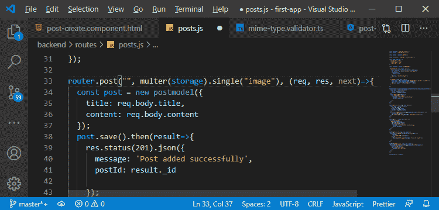

这只是意味着 multer 现在将尝试从传入的请求中提取一个文件，并尝试在请求正文中的 image 属性中找到它。

这是后端设置，为了能够测试它，我们需要在 Angular 代码中添加上传功能。我们将在下一节中这样做。

* * *