# 在平 MEAN 栈中添加分页组件

> 原文：<https://www.javatpoint.com/adding-pagination-components-in-mean-stack>

从这一部分，我们将开始一个新的 MEAN 栈模块。在上一个模块中，我们添加了图像上传，在这个模块中，我们将添加分页组件并在我们的应用程序中使用它们。在本节中，我们将学习如何在 [MEAN Stack](https://www.javatpoint.com/mean-stack) 中添加分页组件。

分页是将网站的内容或网站的一部分内容拆分成独立页面的过程。web 应用程序中的分页通常由代码控制，该代码通常从最新到最早对数据集项目进行排序。

现在，我们将处理分页，这意味着我们需要控制始终显示所有帖子，但我们可以在不同的页面之间切换。因此，在不同的帖子集之间，我们只在第一页显示两个帖子，在第二页显示两个帖子，在第三页显示两个帖子，我们可以在这些页面之间切换，为每个页面加载适当的帖子。

这是一种常见的模式，因为我们不想默认下载所有的帖子，因为如果我们的数据库中有更多的帖子，我们将下载大量的数据，这不仅意味着我们通过网络转换了更多的数据，还意味着我们显示了许多对用户来说可能难以浏览的数据。

我们实现分页的方式将使用户能够灵活地决定用户希望在给定页面上显示多少帖子。为此，我们将使用由[角形](https://www.javatpoint.com/angularjs-tutorial)材料提供的特殊组件。如果我们去角度材料的官方网站，我们会看到分页器，这将是数据表的一部分。分页器如下所示:

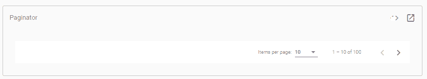

我们将使用以下步骤在我们的应用程序中实现这一点:

1)我们将转到我们的**模块。ts** 文件，通过从**“@ angular/material”**导入 MatPaginatorModule 来解锁它。我们还将像之前添加其他模块一样，将其添加到我们的“导入”阵列中。完成后，这个模块将被解锁，我们可以使用它。

```

import {MatPaginatorModule} from '@angular/material/paginator';
imports: [
    …
    …
    MatPaginatorModule
  ],

```

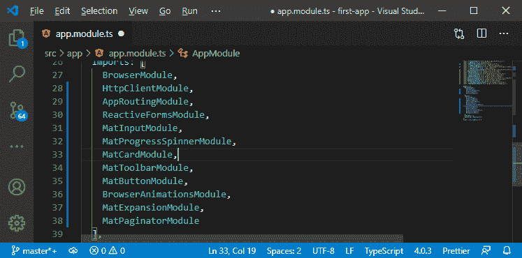

2)现在，我们将返回到我们的后列表组件的 html 文件，在 **< /mat-accordion >** 的下方，我们将添加 **< mat-paginator >** 如下所示:

```

<mat-paginator>

</mat-paginator>

```

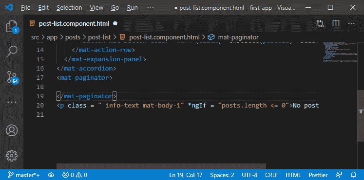

3)这个分页器需要一些配置，因为如果我们像这样添加它，回到我们的 angular app，我们会看到它带有一些默认设置。

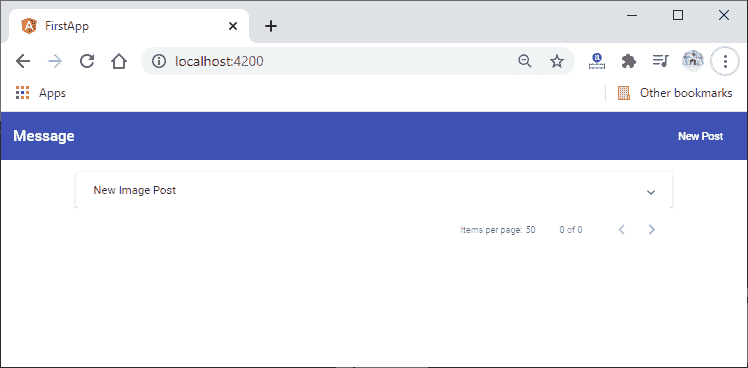

4)我们希望自定义每页获取的页数或项目数，并定义我们当前使用的页面等等。因此，我们将添加一些属性。第一个属性是 length 属性，它只允许我们定义总共有多少个项目，稍后，我们将从后端动态获取这些项目。我们将返回到我们的 post-list.component.ts 文件，这里我们初始化一个属性 totalposts，并将值 ten 设置为默认值。

```

totalposts = 10;

```

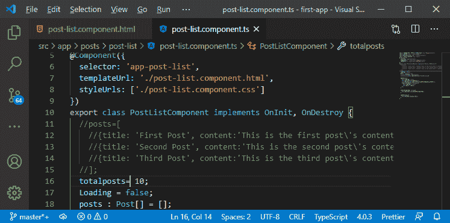

现在，我们将返回到我们的 html 文件，通过将长度包装在方括号中，将长度绑定到 totalposts，如下所示:

```

<mat-paginator [length]= "totalposts">
</mat-paginator>

```

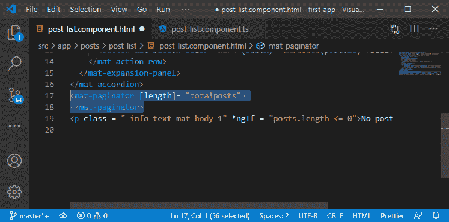

如果我们回到我们的应用程序，我们会看到我们在这里注册了十个帖子。

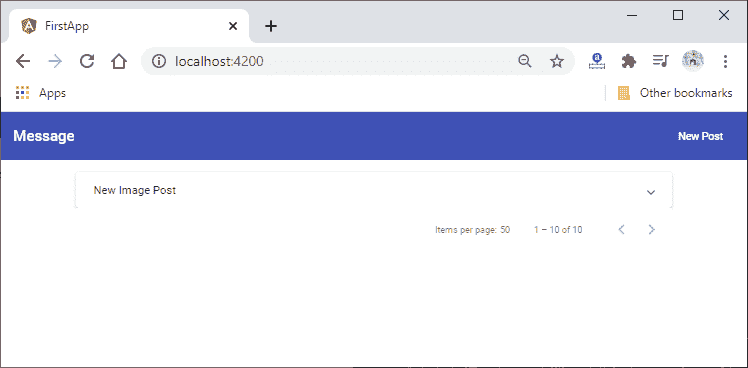

5)我们将通过绑定页面大小属性来设置我们当前所在的页面。页面大小也必须绑定到一个数字，所以我们将添加一个新的公共属性，即 postperpage，默认情况下我们将它设置为 2。

```

postperpage = 2;

```

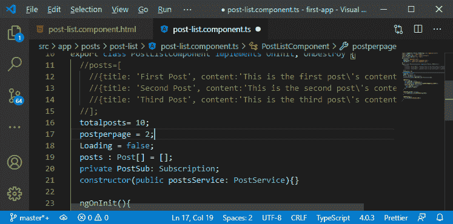

我们现在将页面大小属性绑定到页面后，如下所示:

```

<mat-paginator [length]= "totalposts" [pageSize]= "postperpage">
</mat-paginator>

```

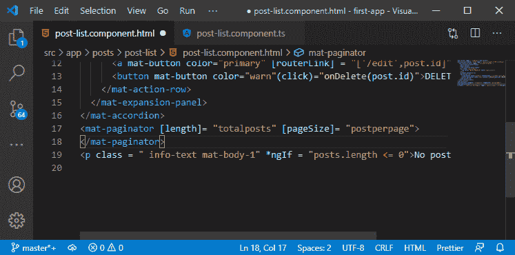

6)我们还希望添加下拉列表，用户可以在其中选择在给定页面上想要查看的项目数量。为此，我们将在 typescript 文件中创建另一个公共属性。我们将其命名为**页面大小选项**。该属性应该是 1、2、5 和 10 等选项的数组。

```

pageSizeOption = [1, 2, 5, 10];

```

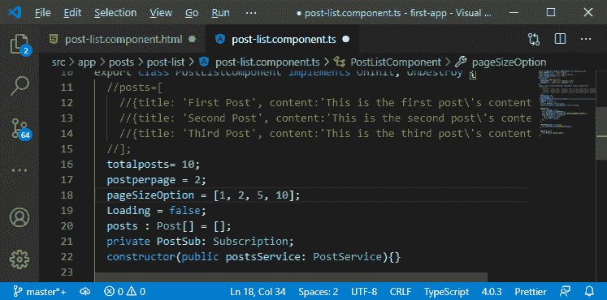

现在，用户可以选择每页 1 到 5 到 10 个项目。我们将它绑定到 mat-paginator 上的另一个属性，即 **pageSizeOption** 如下所示:

```

<mat-paginator [length]= "totalposts" [pageSize]= "postperpage" [pageSizeOptions]= "pageSizeOption">
</mat-paginator>

```

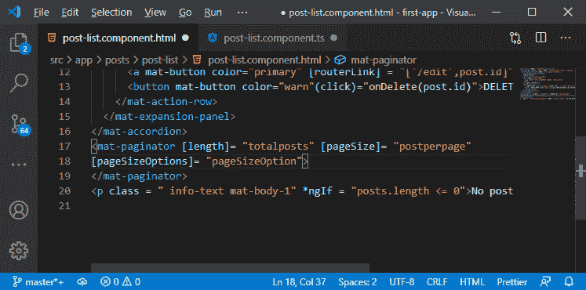

现在，如果我们保存这两个文件并返回到我们的 angular 应用程序，我们将看到我们的虚拟分页器具有所有这三个特性。

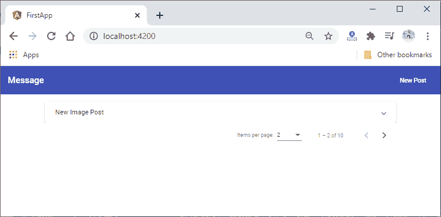

7)现在，如果我们使用它，它没有任何作用。为此，我们需要监听一个事件，每当我们更改每页或当前页面的项目数时，就会发出该事件，该事件就是页面事件。我们将调用方法名 onChangedPage，并将转发@angular/material paginator 给我们的事件对象。我们可以像往常一样使用$event 访问它，每当我们切换页面时，它都会调用 onChangedPage()方法，并且它会给我们一些关于页面事件的信息。

```

<mat-paginator [length]= "totalposts" [pageSize]= "postperpage"
[pageSizeOptions]= "pageSizeOption" (page)= "onChangedPage($event)">
</mat-paginator>

```

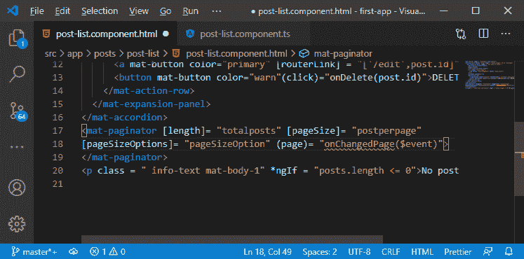

8)现在，我们将转到后列表组件的 typescript 文件，这里我们添加了 onChangedPage()方法。我们知道我们得到了一些页面数据，它们将是 PageEvent 类型的。PageEvent 是需要从@angular/material 导入的类型。

```

import { PageEvent } from '@angular/material';
onChangedPage(pageData: PageEvent){

  }

```

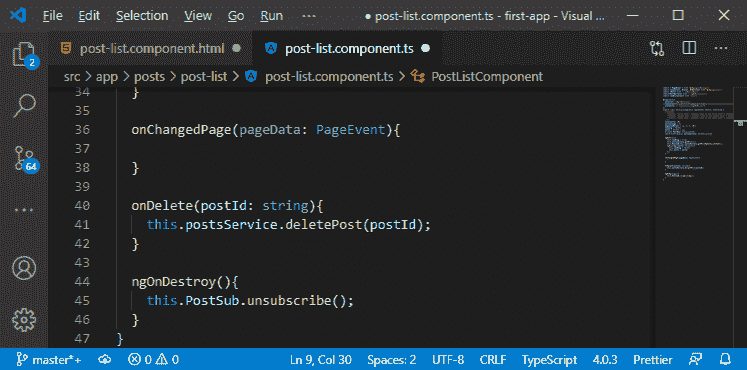

PageEvent 是一个保存当前页面的一些数据的对象。我们登录控制台，看看里面有什么。

```

onChangedPage(pageData: PageEvent){
    console.log(pageData);
  }

```

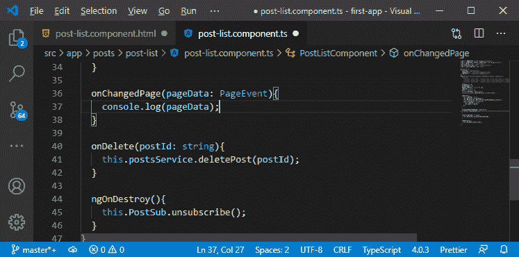

我们将返回到我们的应用程序，如果我们切换页面，我们会得到一个对象，其中包含分页器已知的当前最大项数的信息，我们会得到当前页面索引的信息，我们会得到下拉列表中选择的当前页面大小的信息，我们会得到最后一个页面索引。

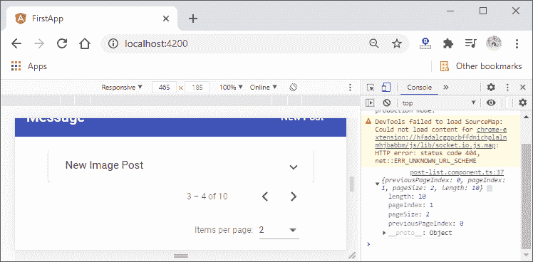

我们现在将使用这些数据来减少我们从后端检索的项目数量。我们必须在后端做一些工作，在此之前，我们将在分页器和手风琴之间添加一些间距，这样我们就可以再次在底部看到阴影。

9)我们将编写 [CSS](https://www.javatpoint.com/css-tutorial) 代码，用于在它们之间添加一些间距。我们将使用**分页器**作为 [CSS 选择器](https://www.javatpoint.com/css-selector)，并将页边距顶部设置为 1 毫米。

```

mat-paginator{
  margin-top: 1rem;
}

```

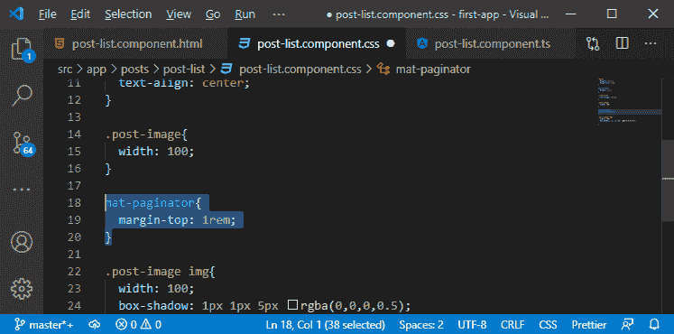

现在，如果我们回到我们的 angular 应用程序，我们将看到 mat-accordinator 和 mat-paginator 之间的间距。


在下一节中，我们将处理后端代码，以减少我们检索的项目数量。

* * *