# 在 MEAN 栈中处理分页后端

> 原文：<https://www.javatpoint.com/working-on-pagination-backend-in-mean-stack>

在前一节中，我们成功地将分页器添加到了前端。我们成功地向分页器添加了几个属性，并添加了页面事件。现在，我们必须在后端做工作，这样我们就可以使用页面数据来缩小我们从后端检索的项目数量。我们将使用以下步骤为分页器编写后端代码:

我们在 posts.js 文件中实现分页，在那里我们创建了一个获取帖子的路径。我们将借助所谓的查询参数来实现这一点。这些是可选的参数或信息，我们可以添加到我们的网址。我们可以在 [URL](https://www.javatpoint.com/url-full-form) 的末尾添加它们，用问号将它们与我们的域和路径分开。

1)我们可以通过访问 request 在我们的 express 应用程序中轻松检索后端的这条信息。我们使用“request.query”，它将保存解析后的查询参数信息。我们将向您展示这是如何工作的。我们简单的控制台记录“request.query”对象，看看里面有什么。

```

console.log(req.query);

```

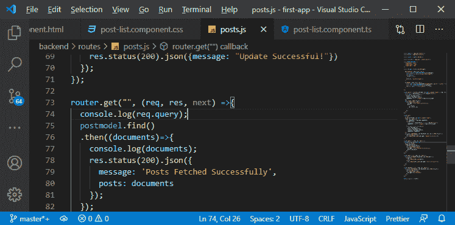

我们将保存文件，后端将重新启动。我们在浏览器上打开一个新的选项卡，输入 http://localhost:3000/API/post，这是我们的 post 路由，然后打上问号。之后，我们添加 pageSize 等于 2 和 page=1，或者添加另一个参数作为等于 good 的东西。查询参数由“&”分隔，因此我们将通过“&”符号分隔页面大小、页面和其他内容，如下所示:

http://localhost:3000/API/post？pagesize = 2 & page = 1 &某物=好

如果我们进入，我们检索所有的帖子，这意味着我们仍然到达那个路线，它像以前一样工作。

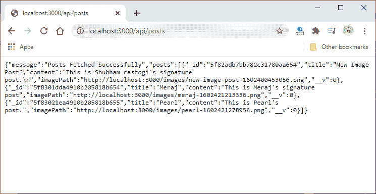

在我们服务器的日志中，我们看到了查询对象。

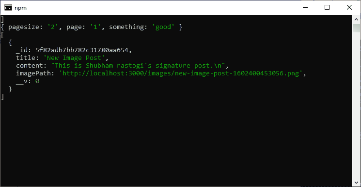

2)这是我们检索到的数据，因为我们发送了一个请求，这些查询参数被添加到了 URL 中。因此，它们被方便地解析为我们，并允许我们使用它们来改变我们的猫鼬查询，以缩小我们获取的帖子数量，这可以非常容易地完成。因此，我们将以下列方式从查询对象中检索数据:

```

const PageSize = req.query.pagesize;
const CureentPage = req.query.currentpage;

```

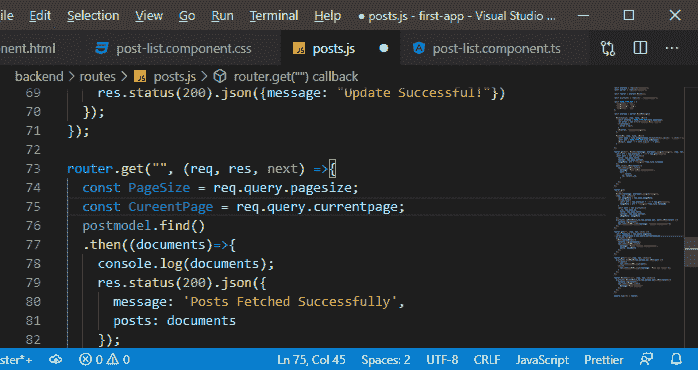

3)现在，我们要调整我们的猫鼬查询，酷的是，如果我们不传递页面大小和当前页面，那么页面大小和当前页面将是未定义的。因此，我们将检查页面大小和当前页面是否未定义。如果它们都包含有效值，将执行“If 块”。

```

if(PageSize && CureentPage){

  }

```

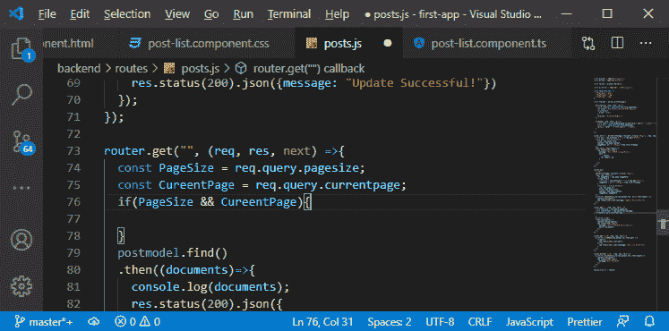

4)现在，我们可以构造两个不同的查询。Post.find 是一个获取所有帖子的工具，然后是一个调整后的工具，为给定的页面获取选定的帖子片段。为此，我们将创建一个新的常量，并将它命名为 postquery，因为 Mongoose 最酷的地方是我们可以通过链接多个查询方法来构造查询，这将缩小我们的查询范围，默认情况下，我们的 postquery 是 Post.find()。使用默认的 postquery 创建常量后，我们将使用 postquery 替换 postmodel.find，如下所示:

```

router.get("", (req, res, next) =>{
  const PageSize = req.query.pagesize;
  const CureentPage = req.query.currentpage;
  const postquery = postmodel.find();
  …
  …
  postquery
  .then((documents)=>{
  …
  …
});

```

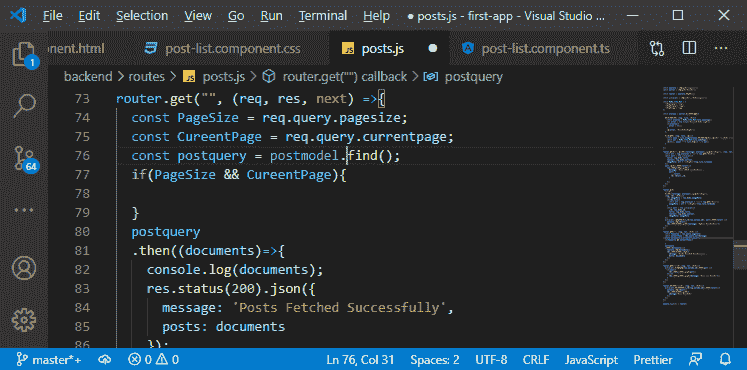

5)现在，如果我们有有效的页面大小和当前页面值，我们需要操作查询，我们将在“if”块中这样做。在“if 块”中，我们将使用 Mongoose 提供的两种有用的方法。第一种是 **skip()** 方法，这意味着我们不会检索所有帖子，而是会跳过前 n 个帖子。因此，我们将添加**“页面大小*[当前页面-1]”**作为参数。

如果我们在第 2 页，页面大小是 10，它将跳过 10(10*2-1=10)篇文章。同样，如果我们在第 3 页，页面大小是 10，那么它将跳过 20 篇(10*3-1 = 10*2 = 20)帖子。

```

if(PageSize && CureentPage){
    postquery.skip(PageSize * (CureentPage-1));
  }

```

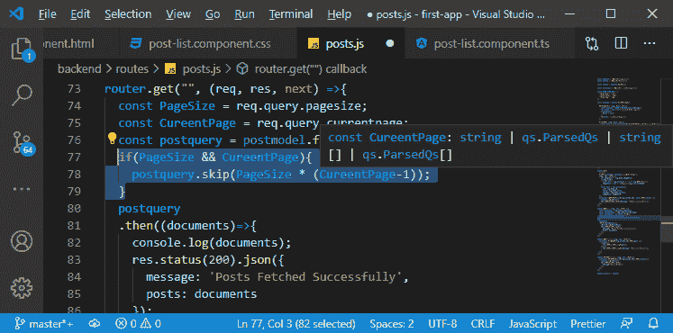

这将跳过前几页。

6)我们还希望缩小我们为当前页面检索的文档数量。我们将通过链接另一个方法来实现，即 limit()方法。这种方法限制了我们返回的文档数量。在这个方法中，我们简单地传递页面大小，因为如果我们每页有十个项目，那么我们需要将查询限制为只返回十个项目。

```

if(PageSize && CureentPage){
    postquery.skip(PageSize * (CureentPage-1))
    .limit(PageSize);
  }

```

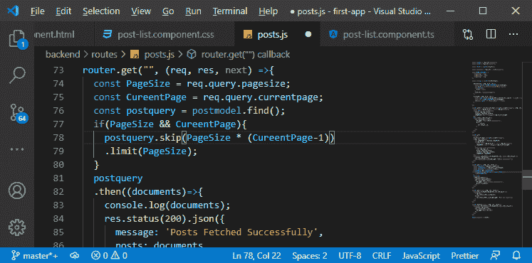

现在，我们得到调整后的后查询并尝试执行它。我们将页面大小设置为 2，当前页面设置为 1。当我们按回车键时，我们将得到以下错误:

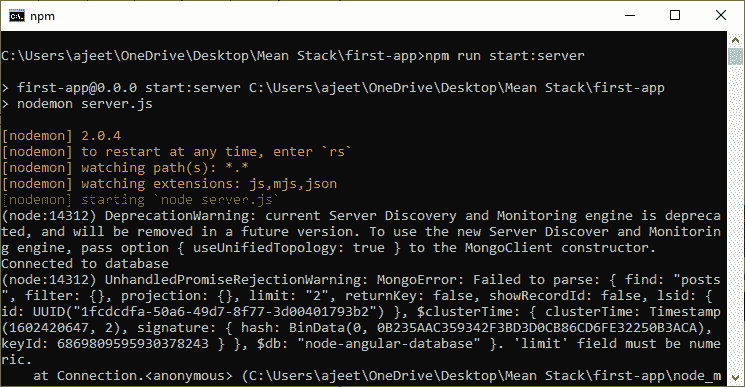

7)出现此错误的原因是我们使用了无效的类型。限制字段应该是数字。默认情况下，如果我们从这些查询参数中提取一些东西，它将总是一个字符串，因为它来自网址。我们需要处理数字。要将这些转换为数字，我们只需在页面大小和当前页面前面添加一个加号，如下所示:

```

const PageSize = +req.query.pagesize;
  const CureentPage = +req.query.currentpage;

```

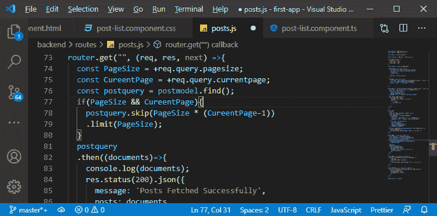

现在，我们保存它，再试一次。

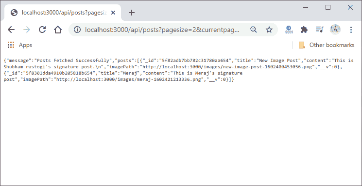

现在，我们的后端代码运行良好，在下一节中，我们将对此进行分析。

* * *