# 添加中间件保护 MEAN 栈中的路由

> 原文：<https://www.javatpoint.com/adding-middleware-to-protect-routes-in-mean-stack>

在我们前面的部分，我们成功地获得了我们的网络令牌。在本节中，我们将把这个网络令牌发送回我们的客户端。我们可以在我们的 Angular 应用程序中收到它。我们将使用该令牌来控制后端的访问，并拒绝任何没有有效令牌的请求。然后，我们希望通过将令牌实际添加到由 [Angular](https://www.javatpoint.com/angularjs-tutorial) 发送到这些受保护端点的请求中，仍然能够到达这些请求。我们将使用以下步骤来做到这一点:

我们开始在服务器上验证令牌。因此，我们检查传入的请求是否附有有效的令牌。我们将为我们的一些路线这样做。但问题是哪些路线应该受到保护？在后端，用于登录和注册的用户相关路由不应受到保护。我们网页的任何用户都应该能够到达这些路线。任何用户都应该能够向这些路由发送请求，因为对注册和登录感兴趣的用户没有经过身份验证。

现在对于帖子，我们有一些应该保护的路由，例如，用于创建新帖子的帖子路由或用于编辑新帖子的放入路由，对于没有经过身份验证的用户，删除路由也应该被禁用。因此，我们必须向这些路由添加一些东西来检查传入的请求是否有有效的令牌。

为此，我们可以使用一种用于图像上传的方法。在这里，我们在路由设置中添加了额外的中间件。构建路由是为了首先查看路径，然后我们使用 **multer** 中间件提取作为传入请求一部分的任何文件。我们可以添加任意多的中间件，我们的想法是添加另一个额外的中间件来检查我们是否被认证。这将是我们自己创建的中间件，为此，我们将使用以下步骤:

1)我们将在后端文件夹中创建一个新文件夹，并将其命名为中间件。在这个文件夹中，我们将创建一个名为 **check-auth.js** 的新 javascript 文件。

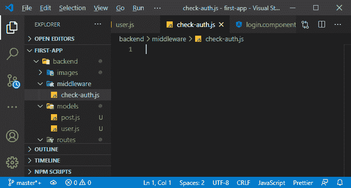

2)在这个文件中，我们将导入我们的 **jwt** 包，导入后，我们将导出该文件中的一些内容，因为我们希望在其他文件中使用该中间件，准确地说是在我的路由文件中。我们将使用**导出**的导出语法，并将其设置为一个函数，因为中间件只是一个接收我们三个众所周知的参数的函数，即请求、响应和响应对象。这将允许我们创建一个响应，然后如果请求被允许继续，我们可以调用它。

```

const jwt = require("jsonwebtoken");

module.exports = (req, res, next)=>{

};

```

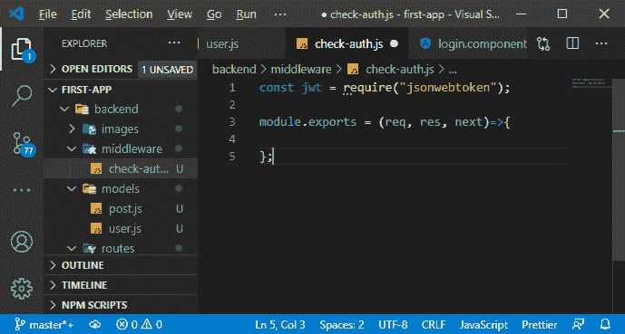

这是 Node/Express 中典型的中间件。它只是对传入的请求执行的一个函数。这也是穆尔特在幕后做的事情。

3)现在，我们正在创建一个在最终函数之前运行的额外函数。在这个中间件中，我们试图从传入的请求中获取令牌，并将其存储在这个常量中。你想从哪里得到代币由你决定。我们可以从网址中请求或解析它作为查询参数。因此，我们可以说我们的令牌存储在我们的查询参数中，这里我们有一个 auth 字段。但是，我们想接受它作为标题。因此，我们将查看传入请求的头，Express 为我们提供了该请求的头对象，在那里我们期望有一个授权头。

现在，理论上我们可以期望任何我们想要的头，但是授权是一个典型的名称，用于将授权信息附加到请求中。

```

const token = req.headers.authorization

```

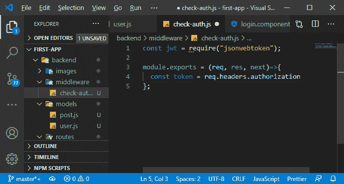

4)现在，我们期望得到我们的令牌，实际上我们通常使用的模式是，我们给使用一个字的报头赋值，即**承载**，然后是令牌，这只是一个指示的约定。嗯，我们基本上在我们的授权中添加了这样一个令牌，因为有一些身份验证替代方案，我们不使用这样的令牌。

不记名关键字完全由你决定，它是可选的，但它经常被选择。我们在其他 API 上也看到了这一点，因此我们也将使用它。因为令牌是字符串的第二部分。我们将在授权头包含的空白上拆分它。

因此，在这个不记名字之后，我们对第二个值感兴趣，我们离开这里，因为我们从零开始索引，第二个有索引 1，因为这将是空白之后的部分，所以我们的令牌。顺便说一下，这只是一个我们可以编辑的惯例。当然，我们不必期待这个不记名的词，这意味着我们不能忽略这个分裂的逻辑。

```

const token = req.headers.authorization.split(" ")[1];

```

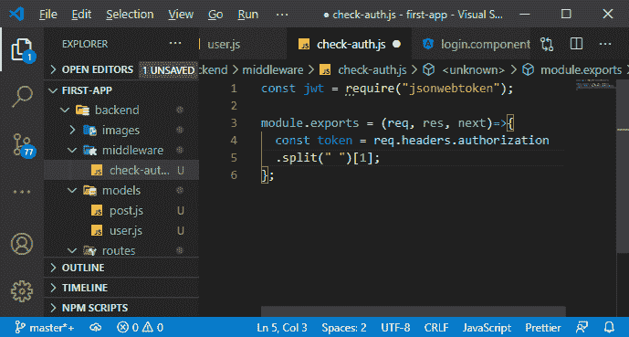

5)现在，这给了我们令牌，我们可以检查这是否未定义，因为如果我们有令牌，它就不应该是未定义的。总的来说，这也可能会失败。如果我们没有得到授权头，调用 split 只会抛出一个错误。因此，我们将把它包装成一个 catch 块，这意味着我们尝试进行拆分，但是它可能会失败，如果失败，我们将捕获错误。如果它失败了，我们也知道我们没有令牌，我们没有被认证。在这种情况下，我们将状态为 401 的响应设置为未验证，然后根据需要发回一些 JSON 数据。

```

try{const token = req.headers.authorization
  .split(" ")[1];
  }catch(error){
    res.status(401).json({message: "Auth Failed"});
  }

```

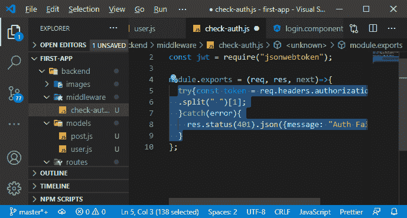

6)现在，我们将验证该令牌，为此，我们将使用 **jwt** 验证方法，如果验证失败，该方法也将抛出错误。因此，这也将包装成一个试捕块。在这个验证方法中，我们将传递从传入请求中解析的令牌。现在为了验证工作，我们需要传递另一条重要的信息，即秘密字符串，我们也使用它来创建令牌。

```

jwt.verify(token, "A_very_long_string_for_our_secret");

```

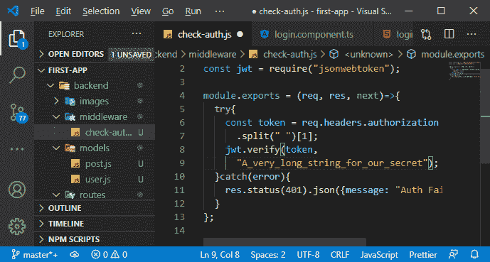

7)如果没有失败，我们希望调用 next()方法，之后，请求将能够继续前进。

```

next();

```

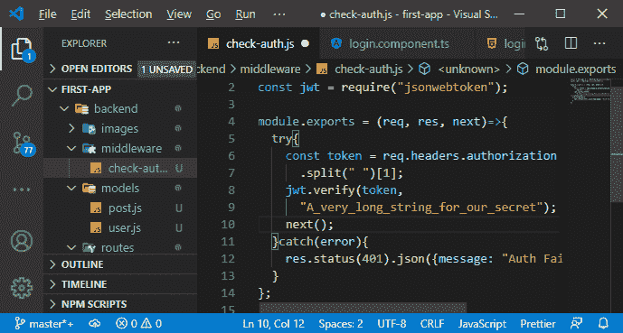

8)要使用该中间件，我们必须将其导入到我们的 posts 路由文件中，因为我们不打算在 user.js 文件中使用该中间件。因此，我们将返回到我们的 posts.js 文件，并添加一个新的导入 checkAuth。

```

const checkAuth = require("../middleware/check-auth");

```

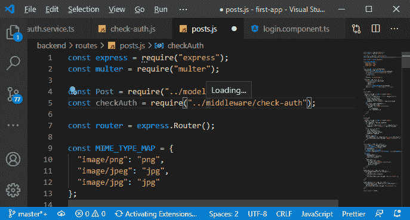

9)现在，我们通过转到我们想要保护的路由来添加中间件，并将其作为额外的参数添加到路径之后，但在我们想要执行的所有其他逻辑之前。因此，例如，为了创建帖子，如果我们没有经过身份验证，我们甚至不想尝试提取上传的图像。因此，我们将在运行 multer 中间件之前运行它。现在，对于 put，在我们尝试获取图像之前，我们在路径之后有相同的逻辑。

#### 注意:我们不执行此功能。我们只需将对我们创建的函数的引用传递给该中间件函数，当请求到达时，Express 将为我们执行它。

```

router.put(
  "/:id",
  checkAuth,
  multer({ storage: storage }).single("image"),
  (req, res, next) => {
         …
         …

```

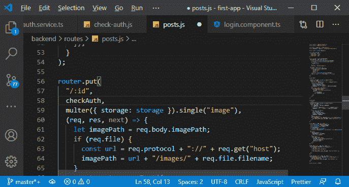

```

router.post(
  "",
  checkAuth,
  multer({ storage: storage }).single("image"),
  (req, res, next) => {
  …
 …

```

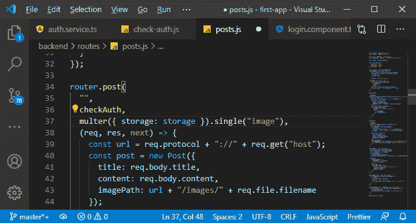

10)我们提到我们希望允许所有帖子和单个帖子的抓取，所以我们没有在那里添加中间件，但是我们会添加它进行删除。

```

router.delete("/:id", checkAuth, (req, res, next) => {
  Post.deleteOne({ _id: req.params.id }).then(result => {
    console.log(result);
    res.status(200).json({ message: "Post deleted!" });
  });
});

```

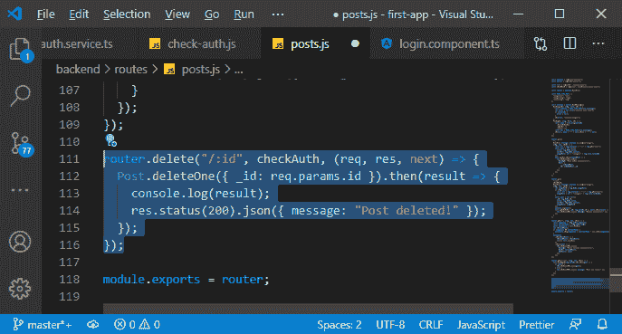

在下一节中，我们将把令牌附加到从前端发送的请求上，并看到我们使它再次工作，然后进行身份验证。

* * *