# 将令牌保存在 MEAN 栈的本地存储中

> 原文：<https://www.javatpoint.com/saving-token-in-the-local-storage-in-mean-stack>

在前一部分中，我们成功地在应用程序中添加了令牌计时器。一个小时后，令牌将过期，我们的帐户将被注销，我们必须再次登录。剩下的部分是将令牌保存在本地存储中，因为如果我们在没有注销的情况下重新加载页面，我们必须再次登录。为了将该令牌存储到本地存储中，我们将使用以下步骤:

1)我们将回到我们的 auth.service.ts 文件，创建一个新的私有方法，即 **saveAuthData** 。我们将它设为私有，因为我们只在这个服务中调用它。

```

private saveAuthData() {

  }

```

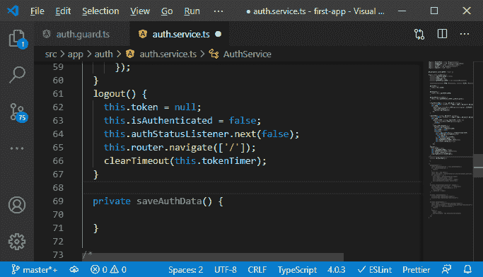

2)在这种方法中，我们期望得到我们想要保存的数据，即 token 和 expirationDate。这个 expirationDate 应该是一个日期，而不是以秒为单位的时间，因为以秒为单位的时间是一个相对的度量，对我们将来回来没有帮助。在那里，我们需要对令牌何时到期有一个清晰的概念。

```

private saveAuthData(token: string, expirationDate: Date) {

}

```

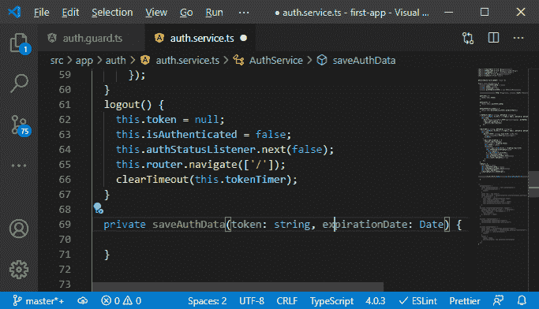

3)现在，所有这些数据都将被序列化并存储在本地存储中。访问本地存储非常容易。我们可以访问一个本地存储 API，然后我们只需要调用 setItem()将值存储在那里。该值将以键值对的形式设置。

```

private saveAuthData(token: string, expirationDate: Date) {
    localStorage.setItem('token', token);
  }

```

我们还想设置到期日期。

```

localStorage.setItem('expiration',expirationDate.toISOString());

```

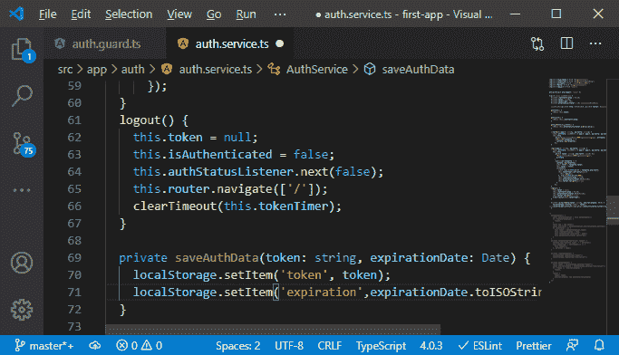

我们将日期转换为 ISOString，这是日期的序列化和标准样式版本，稍后读入数据后，我们可以使用它来重新创建日期。

4)我们还需要添加另一个方法， **clearAuthData** 。在这个方法中，我们将调用 removeItem()方法来移除令牌和过期时间——这个 **clearAuthData()** 方法是在注销()方法中调用来清除本地存储。

```

logout() {
    …
    …
    …
    this.clearAuthData();
    clearTimeout(this.tokenTimer);
  }
private clearAuthData() {
    localStorage.removeItem("token");
    localStorage.removeItem("expiration");
  }

```

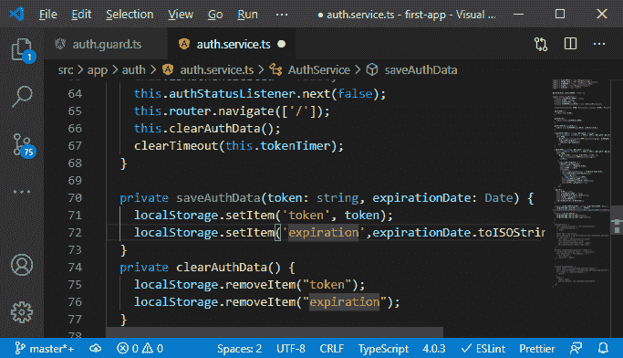

5)现在我们需要调用 **saveAuthData，**这个方法将在 login()方法中调用。为了调用这个方法，我们必须通过创建一个新的常数来创建一个日期，然后我们将信息传递给函数。

```

const now= new Date();
const expirationDate = new Date(now.getTime()+expiresInDuration*1000);
this.saveAuthData(token, expirationDate);

```

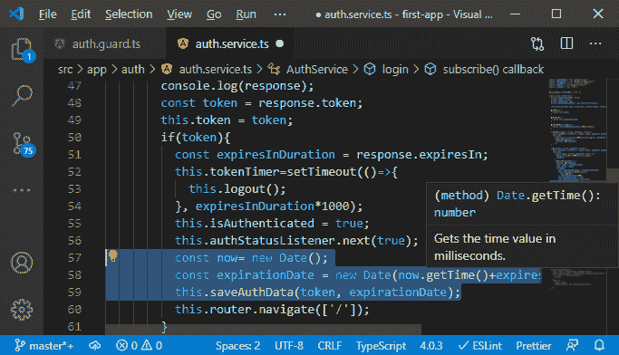

6)现在，每当应用程序启动时，我们将使用该信息来初始化我们的身份验证状态，为此，我们将添加另一种方法，即身份验证用户()，如果我们在本地存储中获得了该用户的信息，我们将尝试自动对其进行身份验证。为此，我们还需要另一个方法 getAuthData()方法。在这个方法中，我们将通过像这样调用 getItem()方法从本地存储中获取令牌和 expirationDate:

```

autoAuthUser() {

  }
  private getAuthData() {
    const token = localStorage.getItem("token");
    const expirationDate = localStorage.getItem("expiration");
  }

```

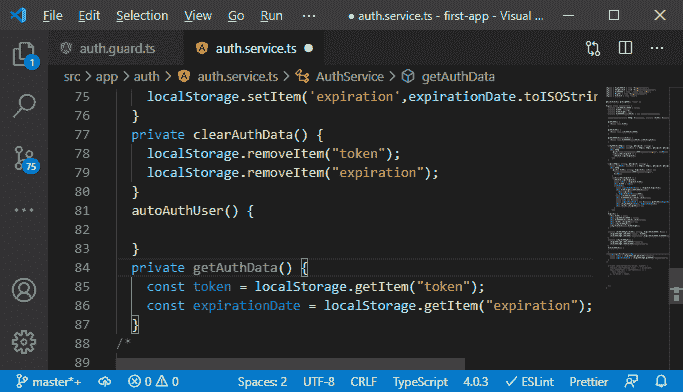

7)现在，我们将检查令牌和过期日期，如果它不存在，我们将不返回任何内容。否则，我们将返回一个 [JavaScript 对象](https://www.javatpoint.com/javascript-objects)，它有我们的标记和过期日期。

```

    if(!token|| !expirationDate){
      return;
    }
    return{
      token: token,
    expirationDate: new Date(expirationDate)
    }

```

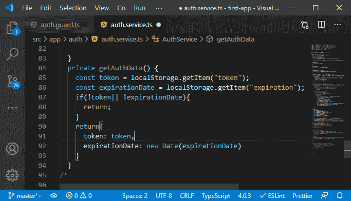

8)将在 **authAuthUser()** 中调用 **getAuthData()** 方法。我们将调用这个方法，并将数据存储到一个新的常量中，即**验证信息**。如果我们没有得到授权信息，我们将什么也不返回。现在，我们将检查令牌是否仍然有效，为此，我们得到了过期日期。我们无法验证它是否是只有服务器才能验证的有效令牌，但至少我们可以从过期角度判断它是否仍然有效。所以，我们会检查到期日是否还在未来。我们将通过创建一个新的日期对象来获得当前的日期时间，然后我们可以通过创建一个新的常数来简单地检查它是否是一个未来，即**是未来，**我们通过将到期日期与当前的日期和时间进行比较来创建一个布尔值。如果过期日期大于当前日期和时间，我们就有了未来的日期。

```

  autoAuthUser() {
    const authInformation = this.getAuthData();
    if (!authInformation) {
      return;
    }
    const now = new Date();
    const isInFuture = authInformation.expirationDate > now;
  }

```

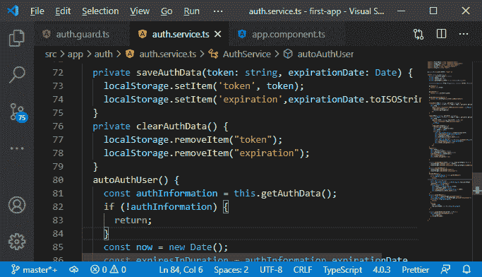

9)现在，我们将检查未来是真是假。如果它是真的，这意味着用户通过了身份验证，我们将这个. token 设置为本地存储中的 token。我们还将 isAuthenticated 设置为 true 并推送该信息，因此我们将设置 authStatusListener，调用 next 并将 true 传递给每个人，因为用户现在已经通过了身份验证。

```

if(isInFuture){
      this.token = authInformation.token;
      this.isAuthenticated = true;
      this.authStatusListener.next(true);
    }

```

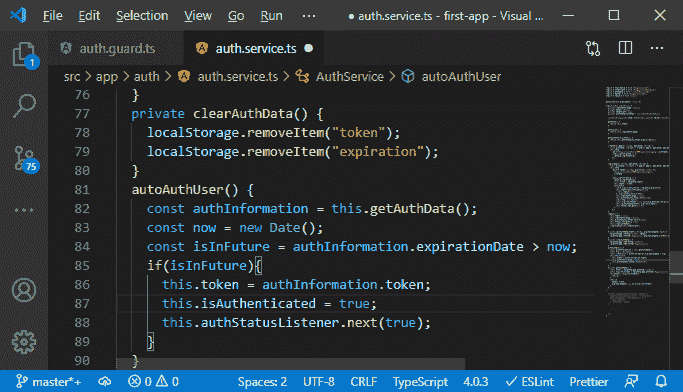

10)现在，我们还需要设置计时器。因此，由于这需要在两个地方完成，我们可能会重构 login()方法中的 tokenTimer 代码，并将其放到一个新的地方。因此，我们将从 subscribe 方法中拉出它，并创建一个新方法，即 setAuthTimer()。在这种方法中，我们获取持续时间并将令牌计时器代码粘贴到这里。

```

private setAuthTimer(duration: number) {
    this.tokenTimer=setTimeout(()=>{
      this.logout();
    }, expiresInDuration*1000);

  }

```

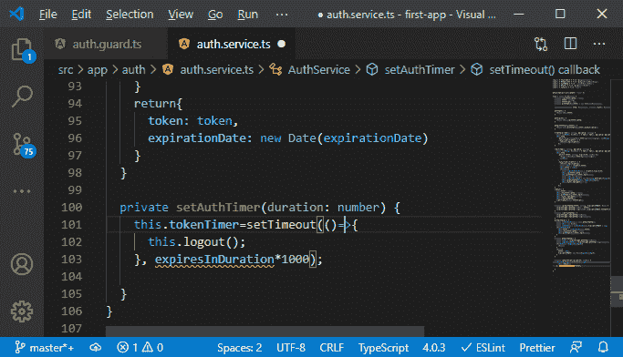

11)到期持续时间现在是持续时间。现在，在 login()方法的 subscribe 方法中，我们将调用这个 setAuthTimer()方法，并在方法中传递 expiresInDuration。

```

.subscribe(response => {
        …
        …
          const expiresInDuration = response.expiresIn;
          this.setAuthTimer(expiresInDuration);
          …
          …
      });
private setAuthTimer(duration: number) {
    this.tokenTimer=setTimeout(()=>{
      this.logout();
    }, duration*1000);

```

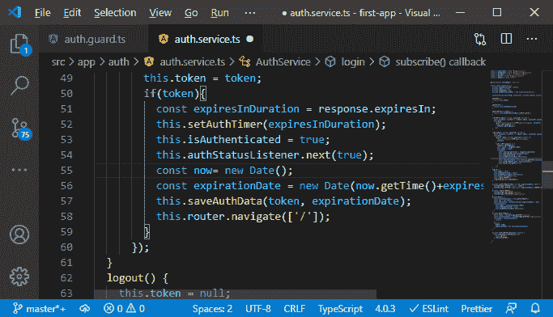

12)我们还需要调用 **autoAuthUser()** 中的 setAuthTimer()方法

```

this.setAuthTimer(expiresInDuration);

```

这一行代码将会得到一个错误，因为我们还没有**expires duration**。因此，我们可以检索差异，而不是检查日期是否在未来。我们将用 expiresInDuration 替换名称 isInFuture。该到期持续时间应该是到期日期-现在。这将抛出一个错误，所以我们现在将使用 expirationDate 和当前日期附加 getTime()方法。

```

const expiresInDuration = authInformation.expirationDate.getTime() - now.getTime();

```

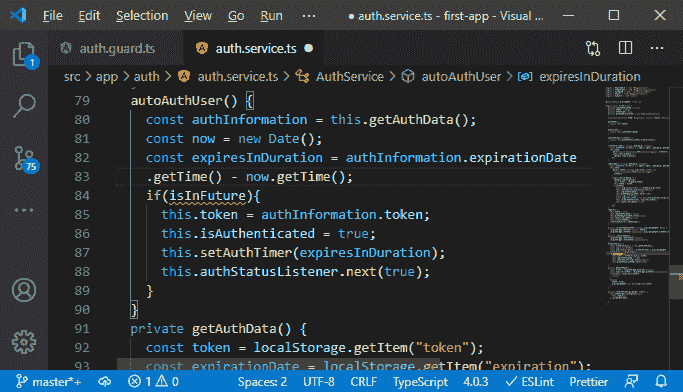

13)现在，我们知道我们正在从时间戳中检测当前时间戳，也许在未来。如果当前时间大于当前时间，这也将是一个导航号。因此，我们将检查 expiresInDuration 是否大于零，因为如果大于零，我们知道日期在未来。如果它小于或等于零，则它是现在或过去的，因此过期时间将是过去的，这意味着它已过期。

```

if(expiresInDuration > 0){

}

```

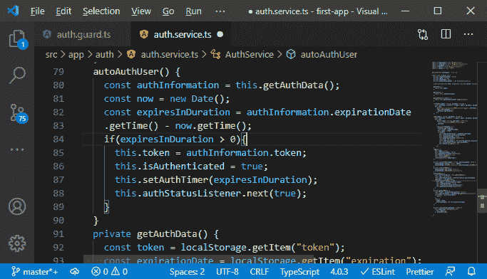

14)我们以毫秒为单位获得 exipresInDuration，但我们的 authTimer 以秒为单位工作。我们将把它除以 1000。

```

this.setAuthTimer(expiresInDuration / 1000);

```

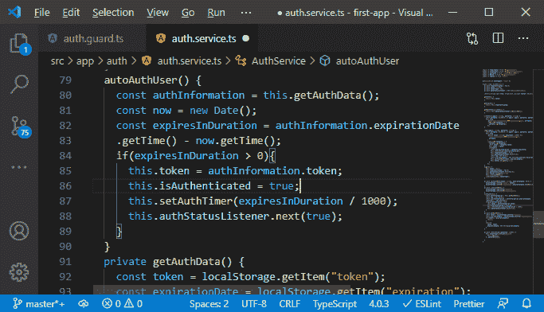

15)现在，一切都很好，剩下的事情就是运行这个方法，运行这个方法的一个很好的地方是在应用程序组件中。在那里，我们知道当我们的应用程序启动时，这个组件首先被加载。因此，我们将实现 OnInt，在 OnInt()方法中，我们希望使用我们的身份验证服务中的一些东西。因此，我们也需要在这里注入我们的身份验证服务。

```

export class AppComponent implements OnInit{
  constructor(private authservice: AuthService){}
  ngOnInit(){

  }
}

```


16)现在，在 ngOnInit()方法中，我们将从服务中调用 autoAuthUser()方法来启动自动身份验证工作流。

```

ngOnInit(){
  this.authservice.autoAuthUser();
}

```

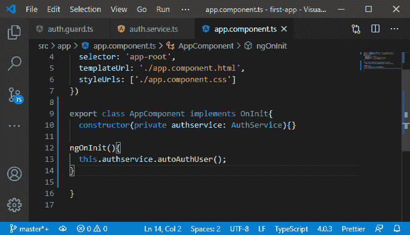

现在，我们保存所有文件，回到我们的 angular 应用程序。我们确实登录了，登录后，我们重新加载页面。

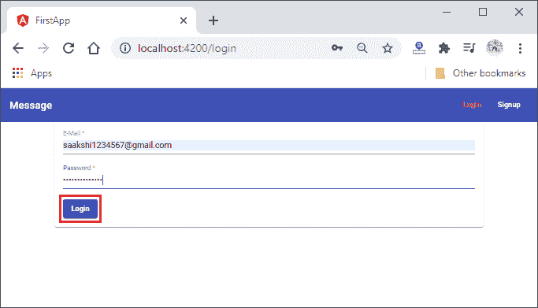
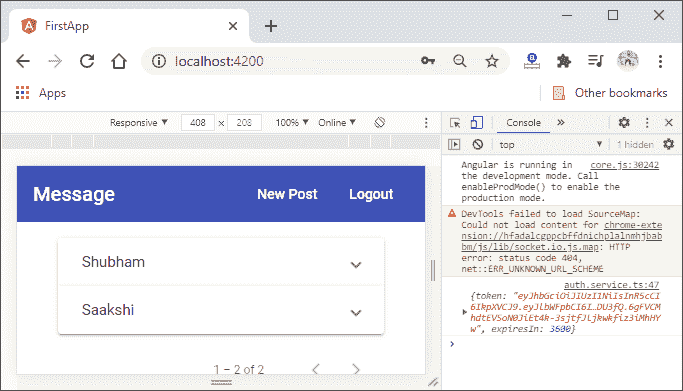

重装后:

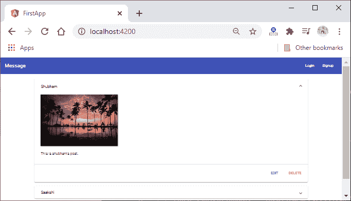

17)工作正常，但问题是我们的标题不知何故没有反映这些更新的信息。重新加载后，我们仍然会看到登录和注册按钮。因此，报头没有获得关于被认证用户的信息。因此，为了解决这个问题，我们将返回到我们的 header.component.ts 文件，除了设置这个侦听器之外，我们还应该将 userIsAuthenticated 设置为 this.authService.getIsAuth()，原因与我们之前在 post list 组件中所做的相同。

```

this.userIsAuthenticated = this.authService.getIsAuth();

```

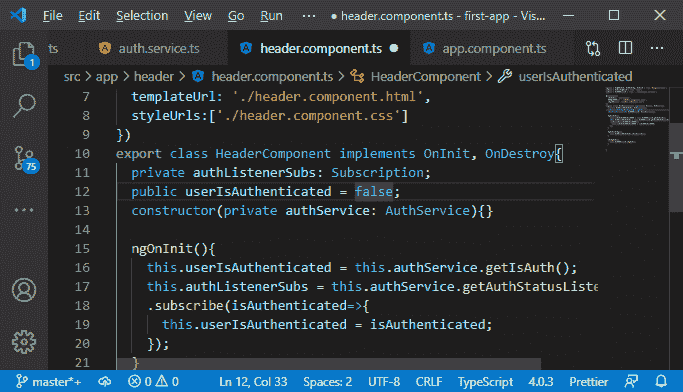

现在，我们将保存文件，我们的应用程序将重新加载。我们将获得一个注销和一个新的发布按钮的标题。

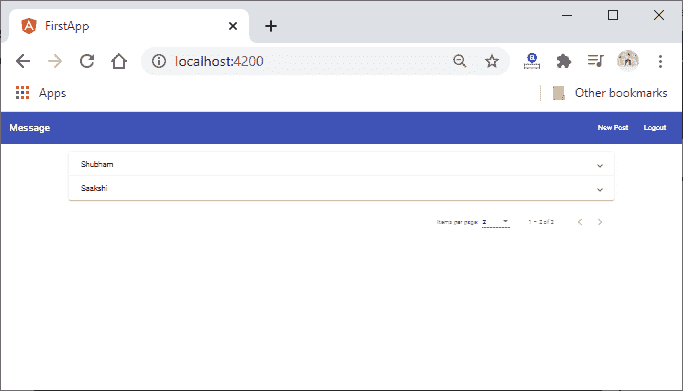

现在，一切都很好，但有一件事缺失了，那就是我们没有将用户连接到我们的帖子上。我们将在新的部分稍后做它。

**下载完整项目(Authentication.zip)**

* * *